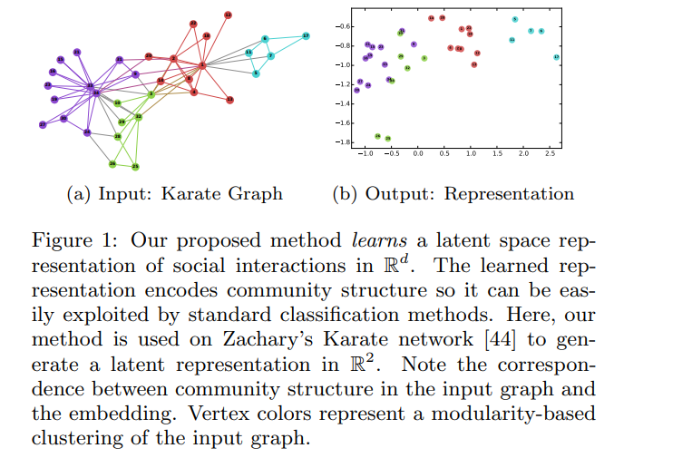

# DeepWalk: Online Learning of Social Representations

[toc]

- https://arxiv.org/pdf/1403.6652.pdf

## ABSTRACT
- 学习图中的节点的语义表示
- 使用到了最近语言模型以及无监督学习的新进展
  
## 1. INTRODUCTION
- 网络表示的稀疏性即是优点也是缺点
  - 稀疏使得算法比较有效
  - 稀疏导致其在统计学习算法中的泛化不足

