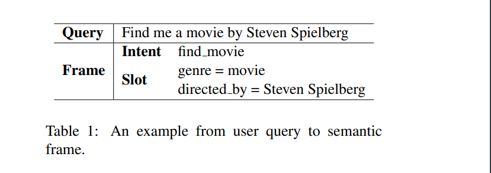
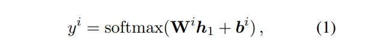
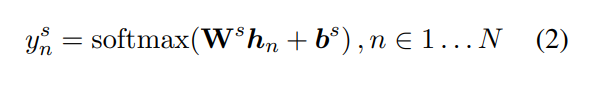
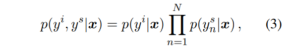
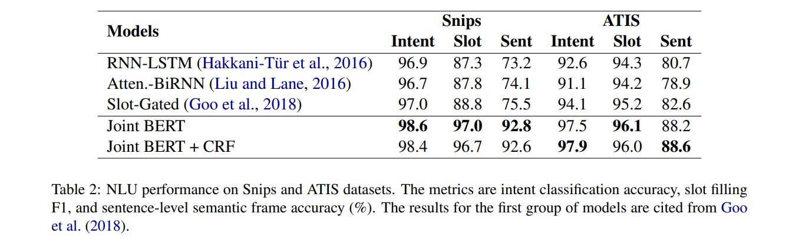
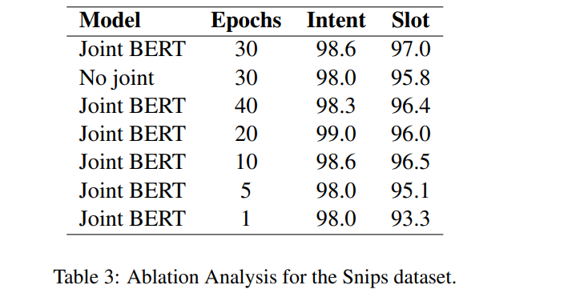
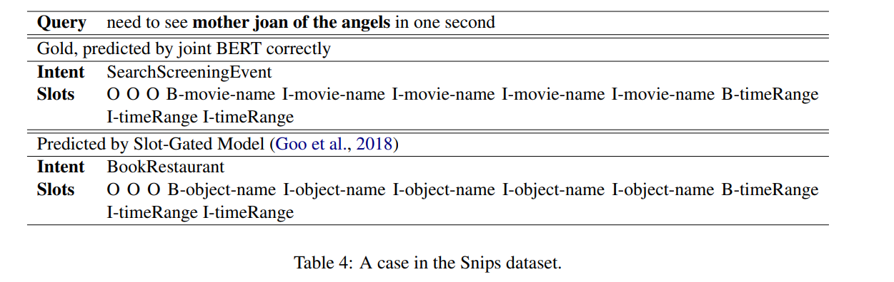

# BERT for Joint Intent Classification and Slot Filling
[toc]
## Abstract
- 意图分类和插槽填充是自然语言理解的两个基本任务

## 1 Introduction

- NLU通常包括意图分类和插槽填充任务，旨在为用户话语做出语义解析。意图分类侧重于预测查询的意图，而插槽填充则提取语义概念
- 针对NLP任务对预训练的模型进行微调，并且与针对特定任务的带标签数据的训练相比，已取得了显著改善
- 贡献
  - 探索BERT预训练模型来解决NLU泛化能力差
  - 基于BERT的联合意图分类和插槽填充模型

## 2 Related work
当前主要是分别建模和联合建模

## 3 Proposed Approach

#### 3.1 BERT
略

#### 3.2 Joint Intent Classification and Slot Filling
- 使用[CLS]输出分量的隐含状态，进行意图预测

- 使用其他的隐藏状态进行ｓｏｆｔｍａｘ，对槽填充进行分类，为了与WordPiece兼容，我们将每个ｔｏｋｅｎ输入wordPicee,并将与第一个子标记相对应的隐含状态作为输入

- 优化目标：最大化条件概率，等价于最小交叉熵

#### 3.3 Conditional Random Field
- CRF结构化预测对槽填充有好处
- 本文研究了增加CRF对结果的影响

## 4 Experiments and Analysis
#### 4.1 Data
- ATIS数据集
- Snips数据集

#### 4.2 Training Details
- BERT-Base uncase
- batch: 128, Adam,  lr: 5e-5, dropout: 0.1

#### 4.3 Results

- from 82.6% to 88.2% (6.8% relative)

#### 4.4 Ablation Analysis and Case Study

- 没有联合学习，准确度都会下降
- １个epoch的微调模型效果已经比较好了
- 例子分析：由于BERT从wiki中进行预训练，因此其能够正确的预测该样本

## 5 Conclusion
- 联合模型优于当个分别建模的模型，证明两个任务之间的关系
- 相比工作比之前有了显著提升
