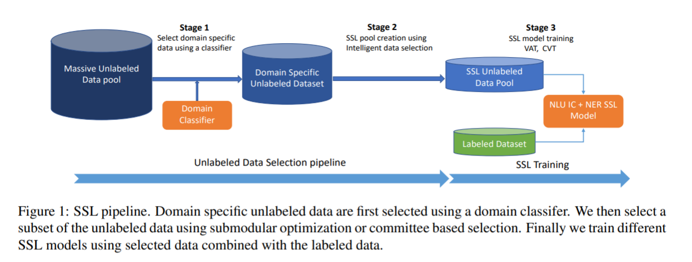
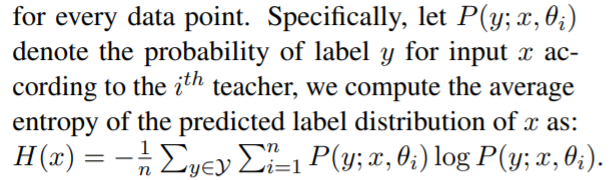
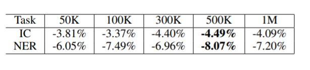
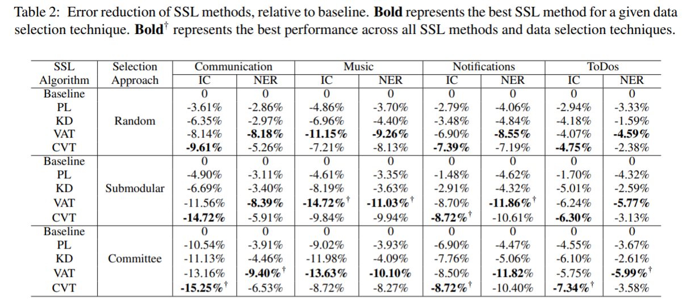
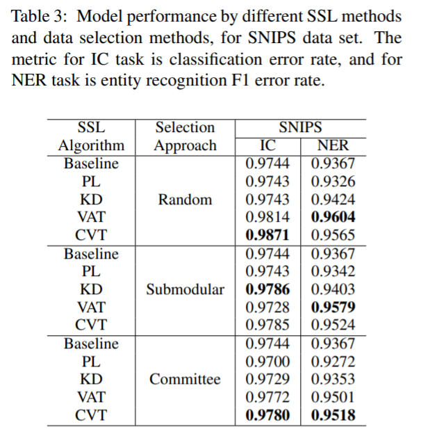

<!-- TOC -->

- [Industry Scale Semi-Supervised Learning for Natural Language Understanding](#industry-scale-semi-supervised-learning-for-natural-language-understanding)
  - [摘要](#摘要)
  - [1 INTRODUCTION](#1-introduction)
  - [2 BACKGROUND](#2-background)
  - [3 METHODS](#3-methods)
    - [3.1DATA SELECTION APPROACHES 数据选择方法](#31data-selection-approaches-数据选择方法)
    - [3.2SEMI-SUPERVISED LEARNING APPROACHES 半监督学习的方法](#32semi-supervised-learning-approaches-半监督学习的方法)
  - [4 DATA SETS 数据集](#4-data-sets-数据集)
  - [5 RESULTS 结果](#5-results-结果)
  - [6 RECOMMENDATIONS 建议](#6-recommendations-建议)

<!-- /TOC -->
# Industry Scale Semi-Supervised Learning for Natural Language Understanding
- https://arxiv.org/abs/2103.15871

## 摘要
- 本文提出了一种基于师生框架的产品/半监督学习管道(SSL) ，该管道利用数以百万计的未标记示例来改进自然语言理解(NLU)任务。我们研究了在生产 SSL 环境中使用未标记数据的两个相关问题: 1)如何从一个巨大的未标记数据池中选择有利于 SSL 培训的样本; 2)选择的数据如何影响不同的最新 SSL 技术的性能。本文结合委员会选择和子模块优化选择( committee-based selection and submodular optimization based selection )两种数据选择方法，对目前应用最广泛的 SSL 技术: 伪标签(Pseudo-Label PL)、知识提取(Knowledge Distillation KD)、虚拟对抗训练(Virtual Adversarial Training VAT)和交叉视图训练(Cross-View Training CVT)进行了比较。我们进一步研究了这些技术在应用于意图分类(intent classification，IC)和命名实体识别(named entity entity recognition，NER)任务时的优点和缺点，并提供了指导方针，明确了这些方法在什么情况下有利于改进大规模的 NLU 系统

## 1 INTRODUCTION 
- NLU 系统通常由意图分类器(IC)和命名实体识别器(NER)组成。它从自动语音识别器获取文本输入，并预测意图和实体。例如，如果一个用户询问“ play lady gaga”，IC 将查询分类为 PlayMusic 的意图，而 NER 将“ lady gaga”分类为 Artist。语音助理的一个重要要求是能够不断添加对新功能的支持，例如，新意图或新实体类型，同时提高对现有实体的识别准确性。拥有高质量的标记数据是实现这一目标的关键。然而，标注是一个昂贵且耗时的过程

- 半监督学习提供了一个利用大量未标记数据的框架。SSL 技术已经被证明可以在不同的机器学习任务中提高深度模型的性能，包括文本分类、机器翻译、图像分类
- 在语音助理中，我们在大规模应用 SSL 技术时面临着额外的挑战，包括
  - (1)我们应该使用多少未标记的数据进行 SSL 处理，以及如何从大量未标记的数据中选择未标记的数据？
  - (2)大多数 SSL 基准测试都假设未标记的数据集和标记的数据集来自同一个分布。这个假设经常被打破，因为标记的训练数据集也包含合成数据，来源众多的数据来表示功能的预期用途，而未标记的数据往往包含大量的域外数据。
  - (3)与广泛使用的 NLU 数据集如 SNIPS Coucke (2018)、 ATIS Price (1990)不同，真实世界的语音辅助数据集要大得多，而且有很多冗余，因为一些查询如 turn on lights 可能比其他查询更频繁。基于这些考虑，不同 SSL 技术在 real-world NLU 应用中的性能仍然存在问题

- 研究了三种数据选择方法来选择未标记的数据，并评估选择的数据对不同 SSL 方法在真实的 NLU 数据集上的性能的影响。本文提出了三个方面的贡献:
  -  (1)设计了一条可以智能选择未标记数据以训练 SSL 模型的生产 SSL 管道
  -  (2)在现实语音辅助环境中对 SSL 技术的四种方法(伪标记、知识提取、交叉视图训练和虚拟对抗训练)进行了实验比较
  -  (3)对于希望在生产环境中使用 SSL 的 NLP 从业者的操作建议

## 2 BACKGROUND 
- 两种广泛使用的 SSL 方法是: 伪标签(PL)和知识提取(KD)。在 PL 中，使用以标记数据为训练对象的教师模型为未标记数据集生成伪标记。以标记和伪标记数据集合为训练基础的学生模型通常比教师模型性能更好
- KD SSL 方法不为未标记的实例分配特定的标签，而是考虑标签空间上的整个分布。在 KD，它是假设所有标签概率分布比起假定一个特定类定义提供了更多的信息
- 虚拟对抗训练(VAT)和交叉视图训练(CVT)在各种任务上都取得了最先进的 SSL 性能，包括文本分类、命名实体识别和依赖性解析
- 基于模型置信度的数据选择是 SSL 数据选择中广泛使用的技术，其中未标记数据是基于分类器的置信度来选择的。由于生产语音助理中存在大量的未标记数据，基于模型置信度的过滤会产生非常大的数据池。为了克服这个问题，我们研究了不同的数据选择算法，这种算法可以进一步减小未标记数据的大小

## 3 METHODS

- 模型体系结构是一个基于 lstm 的 IC 和 NER 任务多任务模型，使用300维 fastText 词嵌入 ，在一个大的语音辅助语料库上进行训练。共享的256维 Bi-LSTM 编码器和两个独立的任务专用 Bi-LSTM 编码器(256维)用于语句编码。一个 softmax 和一个条件随机场(CRF)层分别用于产生 IC 和 NER 的预测

### 3.1DATA SELECTION APPROACHES 数据选择方法
- 提出了一个两阶段的数据选择管道，以创建一个未标记的 SSL 池
- 首先使用分类器的置信度评分从一个非常大的未标记数据池中过滤特定领域的未标记数据，这些未标记数据池可能包含来自多个域的数据
- 对于一个生产系统，第一阶段的过滤可能会产生数以百万计的例子，因此我们进一步使用不同的选择算法过滤数据，以找到一个 SSL 数据池，这有助于有效的 SSL 训练
- 第一阶段的过滤试图从一个大的数据池中找到领域特定的例子，而第二阶段的过滤的目标是找到一个数据子集，这个数据子集可以在 SSL 中带来更好的性能

---
- 对于第一阶段的过滤，我们训练一个二分类器对标记的数据，并使用它来选择域内无标记的数据
- 切换不同的二分类器(线性，CNN，LSTM 等)不会显著改变选择的数据。因此，在这项研究中，我们简单地使用一个单层256维双 lstm。基于我们的初步实验，我们使用0.5的置信度作为数据选择的阈值
- 对于第二阶段的筛选，我们使用模型委员会和子模块优化探索数据选择。虽然本文只探讨了两种数据选择方法，但值得一提的是，任何数据选择算法都可以用于第二阶段的过滤，以进一步优化 SSL 池的大小

- Selection by Submodular Optimization
  - 子模块优化选择: 子模块数据选择用于从给定的数据集中选择一个不同的有代表性的子集。
  - 对于 SSL 数据选择，我们使用了基于特征的子模块选择 Kirchhoff 和 Bilmes (2014) ，其中子模块函数是通过模块函数的非递减凹函数的加权和给出的。对于 SSL 数据选择，我们使用1-4 n-gram 作为特征，使用对数作为凹函数。过滤掉在 d l ∪ d u 中出现次数小于30次的 n-gram 元素。采用贪婪算法对子模函数进行优化。该算法以 d l 为选择数据，从提供最大边际增益的候选池 d u 中选择
- Selection by Committee
  - 委员会选择: 当模型能够对未标记的数据提供准确的预测时，SSL 技术能够很好地工作。但是，如果不是这种情况，SSL 可能会对整个系统产生不利影响，因为模型可能会创建注释不正确的 SSL 数据。
  - 对于给定的输入 x，神经网络提供的点估计被解释为超过标签的概率分布。如果点 x 很容易学习，那么从不同的初始条件训练出来的神经网络将学习到类似的点 x 的概率分布。另一方面，如果 x 很难学，他们的预测很可能不同意或者向低信心的预测靠拢。这个现象已经在几个关于不确定性估计的工作中观察到，Liu 等人(2019a) ; Ashukha 等人(2020)。因此，高不确定性的数据点比低不确定性的数据点更有可能被错误地预测
  - 为了检测模型不可靠的数据点，我们训练一个 n 个教师模型委员会(本文使用 n = 4) ，并计算每个数据点的概率分布平均熵
  - 根据一个被保留的数据集来确定一个熵阈值，该阈值对于错误注释来说具有可接受的错误率(例如，20%)。任何委员会注释的数据，其熵水平高于确定的阈值，被视为“不值得信任”，并过滤掉

### 3.2SEMI-SUPERVISED LEARNING APPROACHES 半监督学习的方法
- 4种半监督学习技巧
- PL
  - 使用一个带标签的数据集 dl，我们首先训练一个“教师”模型 fθ。然后，通过为每个输入实例分配由老师预测的标签 ^ y，从 du 生成一个伪标记数据集。一个新的模型，我们称之为“学生”，然后对伪标记和标记数据集的联合进行训练
- KD
  - 对于给定的输入，教师模型在所有可能的标签上生成一个概率分布。预测的概率分布通常被称为“软标签”。
  - 学生模型在两个目标之间交替训练: 
  - 最小化标记数据的损失
  - 分别为不同的任务定义，最小化学生和老师之间的交叉熵损失，预测未标记数据的“软标签”
    - 意图上的软标签由 IC 的 softmax 层生成
    - 标签序列上的软标签则由每个令牌在 CRF 层之前的 logits 上运行 softmax 生成。
- VAT
  - 高度有效的图像 和文本分类 的任务
  - 给定一个未标记的实例，VAT 会产生一个小的扰动，导致模型预测的标记分布发生最大的变化。在得到对抗性扰动后，目标是最小化原始实例和扰动实例的标记分布之间的 KL 差异
- CVT 
  - CVT 是另一种被证明在文本分类、序列标记和机器翻译方面有效的 SSL 方法。CVT 采用双向 LSTM，利用当前状态的双向输出作为辅助预测，提取当前和邻近 LSTM 神经元的单向输出，并迫使它们预测与辅助预测相同的标记

## 4 DATA SETS 数据集
- Commercial Dataset
  - 选择了四个有代表性的领域(即，用户可以提出要求的类别)从商业上可用的英语语音助理系统。选择的四个类别是: 1)交流: 与呼叫、消息相关的查询; 2)音乐: 与播放音乐相关的查询; 3)通知: 与警报、计时器相关的查询; 4)待办事项: 与任务组织相关的查询
  - NLU 任务是识别意图(IC)和话语中的实体(NER)。对于每个域，我们的数据集包含50k 唯一的训练，50k 唯一的测试话语，以及数亿个未标记数据的话语
  - 首先在每个域中选择500 k 未标记的话语，使用域分类器形成各自的未标记数据池
  - 选择500k 大小是基于一系列基于 KD 的 SSL 实验在音乐领域，与 SSL 数据池大小从50K 到1M 变化。据观察，将 SSL 池大小增加到50万以上会降低 SSL 带来的性能增益
  - 为了评估智能数据选择的效果，在50万个数据中，我们进一步通过不同的数据选择方法选择30万个数据，并将它们作为未标记数据用于 SSL 实验

- SNIPS Dataset
  - 使用 SNIPS Coucke 等人(2018)的数据集作为标记数据，并使用未标记的数据从我们的商业数据集作为 SSL 池数据。与我们的商业数据类似，我们为 SNIPS 上的每个意图训练一个二进制分类器，并使用它为每个意图选择300,000个话语作为未标记的数据池。然后，我们应用数据选择方法对每个意图的2万条语句进行 SSL 实验过滤

## 5 RESULTS 结果
- 评估的 SSL 技术有: PL，KD，VAT，CVT。评价的数据选择方法有: 随机选择(Random)、子模块优化选择(Submodular)和委员会选择(Committee)

- 各种数据选择和 SSL 技术的结果摘要。“基线”是指只用标记数据进行训练的模型。IC 任务的衡量标准是意图分类错误率。NER 任务的度量指标是实体识别 F1错误率。该表显示了相对于基线的相对误差减少

- 数据选择方法的比较: 我们观察到子模块选择和基于委员会的选择在所有领域和 SSL 技术上都优于随机选择。这表明了第二阶段数据过滤的有效性。在通知和 ToDos 领域，子模块选择优于其他方法，在通信和音乐领域，基于委员会的选择优于其他方法。
- SSL 技术的比较: 表2显示 KD 在几乎所有场景中提高了相对于 PL 的性能(ToDos 中的 NER 除外)。这支持了一个假设，即使用教师模型预测的完整分布，而不是仅仅使用预测的标签，允许在训练学生模型时传递额外的信息。此外，虽然 VAT 和 CVT 的表现一直优于 KD 和 PL，但它们的好处是任务相关的。VAT 在所有 NER 实验中显示出更强的优势，而 CVT 在大多数 IC 实验中表现更好。从准确性的角度来看，VAT 更有利于 NER 任务，而 CVT 更有利于分类任务

- 在 SNIPS 上的测试结果与我们在商业数据集上的观察结果一致: VAT 和 CVT 是优越的 SSL 技术。结果表明，对于不同来源、不同分布的标记和未标记数据，VAT 和 CVT 具有良好的通用性。与商业数据集智能数据选择导致更好的性能相反，在 SNIPS 数据集上，我们发现子模块优化或基于委员会的选择并不提供任何超过随机选择的收益。这并不奇怪，因为 SNIPS 标记的数据分布与未标记的 SSL 数据非常不同，这使得数据选择算法容易受到噪声未标记数据选择的影响。例如，子模块优化主要优化数据的多样性，这使得它比随机选择更有可能选择不同的不相关的例子

## 6 RECOMMENDATIONS 建议
- Prefer VAT and CVT SSL techniques over PL and KL
  - 在选择 SSL 技术时，CVT 通常更适合于分类任务，而 VAT 更适合于 NER 任务。一般来说，我们会推荐 VAT，因为它在分类任务中的表现可以与 CVT 相媲美，而且 VAT 在 NER 任务中表现出色，而这通常难以实现性能增益

- Use data selection to select a subset of unlabeled data
  - 引入了一个数据过滤管道，首先将未标记数据池的大小减少到一个可管理的大小。我们的实验表明，子模块和基于委员会的数据选择都可以进一步提高 SSL 性能。我们推荐基于子模块优化的数据选择，因为它的成本较低，而且性能与基于委员会的方法相似
  - 通过对 SNIPS 数据集的实验，我们观察到进一步的数据选择与随机选择相比并没有带来额外的改进。当未标记的数据池与标记的数据分布截然不同时，优化数据选择仍然是一个挑战
