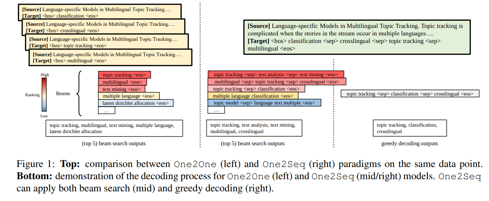

<!-- TOC -->

- [An Empirical Study on Neural Keyphrase Generation](#an-empirical-study-on-neural-keyphrase-generation)
  - [1 INTRODUCTION](#1-introduction)
  - [2 BACKGROUND](#2-background)
  - [3 GENERALIZATION AND LEARNING DYNAMICS](#3-generalization-and-learning-dynamics)
  - [4 DECODING STRATEGIES](#4-decoding-strategies)
  - [5 DOES ORDER MATTER IN](#5-does-order-matter-in)
  - [6 BIG MODEL, BIG DATA?](#6-big-model-big-data)

<!-- /TOC -->
# An Empirical Study on Neural Keyphrase Generation
- https://arxiv.org/abs/2009.10229v2

## 1 INTRODUCTION
- 关键短语是在一篇文章中总结和突出重要信息的短语
- 一个源文本与多个 Keyphrase 相关联，这些 Keyphrase 可能出现在源文本中(例如，子字符串) ，也可能不出现在源文本中
- 关键词生成本质上是一个自然语言生成(NLG)任务
- Seq2Seq 模型是编解码神经网络，其中编码器通过读取源文本形成隐藏的表示，然后解码器根据编码器传递的源文本表示逐字生成目标序列(关键短语)。与非神经网络方法相比，神经网络模型已被证明对这项任务非常有效
- 基于他们的训练范式，大多数关键词生成模型介绍了以前的工作分为两类，即 One2One 和 One2Seq
- 本文通过大量实验对神经元关键词生成进行了全面的实证研究，旨在描述关键词生成模型中的关键因素，定量分析它们对模型性能的影响，并比较各种基线变量。我们希望这项研究可以作为一个实际的指导，以帮助研究人员在架构，方法和超参数选择
- 回答四个主要问题: 
  - 1。使用 One2One 和 One2Seq 的优缺点是什么？
  - 2。不同的解码策略如何影响关键词生成？
  - 3。训练 One2Seq 时，目标关键词的顺序重要吗？
  - 4。更大的模型有用吗？那么更多的培训数据呢？

## 2 BACKGROUND
**Training Paradigms**

- 短语生成(KPG)的任务是生成一组给定源文本 t (一个单词序列)的密钥短语{ p1，... ，pn }。从语义上讲，这些短语总结和突出了包含在 t 中的重要信息，而从句法上讲，每个关键短语可能由多个单词组成。如果 keyphrase 是源文本的子字符串，则定义为 present，否则定义为 absent

---
**Architecture**
- 对于多个目标短语{ p1，... ，pn } ，One2One 一次只使用一个短语，并将其与源文本 t 配对，从而形成 n 个数据点(t，pi) i = 1: n。在训练期间，模型学习从 t 到 p i 的一对多映射，也就是说，同一个源字符串通常有多个对应的目标字符串
- One2Seq 系统将所有地面真实关键词组 pi 连接成一个字符串: P = <bos>p1<sep> · · · <sep>pn<eos> 练一个系统来预测给定 t 的级联序列 p
  - **根据短语在源文本中出现的次数对它们进行排序，并在结尾附加缺少的关键短语**
  - 这种排序被称为 Pres-Abs
- BaseRNN 是一个基于 gru- 的 Seq2Seq 模型(cho14gru) ，具有一个复制机制**copy mechanism**(Gu2016copy)和一个**coverage mechanism**覆盖机制(see17gettothepoint)

---
**Decoding Strategies 解码策略**

- 需要一组多词短语(而不是单个序列)作为模型预测。作为一项有利于高回忆的任务，通常的做法是利用波束搜索(reddy1977年语音)并从所有波束中获取预测。这与其他典型的 NLG 任务中只获取排名最高的波束形成对比。推理过程中预测词组数量的增加，使推理过程中预测词组数量增加。在这项工作中，默认情况下，我们使用 One2One 模式的波束宽度为**200**，而 One2Seq 模式的波束宽度为 **50**

---
**Datasets**
- 数据集科学出版物(KP20k、 Inspec、 Krapivin、 NUS 和 seeval)和新闻文章(DUC)领域的数据集被广泛用于评估关键词生成任务

---
**Evaluation**
- f1@10
- Recall@50(R@50)
- 为每5,000个训练步骤保存模型检查点，并根据 KP20k 验证集上的 f1@10/R@50分数使用最佳检查点报告测试性能

## 3 GENERALIZATION AND LEARNING DYNAMICS

- IN-DISTRIBUTION PERFORMANCE 性能曲线
  - One2One 在当前和缺失的关键词预测上都比 One2Seq 表现得好很多。我们怀疑这个巨大的性能差距可能是由于解码上的差异造成的。具体来说，One2One 模型能够预测大量的独特短语(超过500个，包括超过300个缺失短语)。相比之下，One2Seq 模型的独特预测数量要少得多(大约100个，包括大约50个缺失的短语)
  - 在束搜索的帮助下，One2Seq 模型能够生成大量的短语。然而，事实上，在所有的预测中只有不到5% 的短语是独一无二的
  - 未能回忆出足够数量的唯一短语极大地限制了 One2Seq 模型在缺失短语预测上的性能

- OUT-OF-DISTRIBUTION PERFORMANCE
  - 尽管在 KP20k 上的性能明显较低，但我们注意到，在所有 迁移 的数据集上，One2Seq 的性能都比 One2One 有竞争力，甚至更好，这一优势在 Inspec 和 DUC 上非常明显(p < 0.001)。这表明目标关键短语之间的相互作用和依赖关系可能有助于泛化

  - 由于验证频率的不同，一些关键词生成数据集的测试性能可能存在不可忽视的差距。表1显示，在相同的模型下，给定不同的验证频率，测试性能差距可高达10.5% ー这实际上比不同论文中介绍的系统之间的某些性能增益还要大
    - One2Seq 上的频率之间的总体差距并不显著，而 One2Seq 上的大多数差距是显著的。这进一步强化了我们的观察，One2Seq 产生了更好的泛化性能

- CONVERGENCE SPEED
  - One2One 可能会遭受训练效率低下的问题，因为它将一个数据示例分解为多个对，这大大增加了通过数据集进行训练的数据示例数量。然而，我们从曲线中观察到 One2One 模型与当前关键词生成的收敛速度非常快，在达到平稳之前的 30k 训练步骤内达到最佳表现
  - 如果没有这种数据增强的例子，培训 One2Seq 可能会更有效。然而，令我们惊讶的是，它的性能稳步提高，但缓慢，并且模型直到近 80k 步后才达到最佳状态。较慢的收敛速度可能意味着学习生成多个短语会带来一些潜在的挑战，包括难以表示多个短语的语义，处理目标短语之间的结构性互动，或者学习连接顺序带来的归纳偏差

## 4 DECODING STRATEGIES
**GREEDY DECODING**
- 可以(并且已经)自然地应用于关键词生成(yuan2018 diverssekp) ，特别是在 One2Seq 范式下
- 贪婪译码在计算效率方面具有明显的优势。根据经验，这种解码策略也拥有比多波束解码更高的精度
- 在所有数据集的平均测试分数上，贪婪解码的精度可以比多波束解码中观察到的最高精度分数高出50-60% 。通过波束搜索，召回率显著提高，但是牺牲了模型的精确度

---
**DECODING WITH MULTIPLE BEAMS**
- 一个常见的策略是在解码过程中采用多波束以获得更多的短语。这种选择有时不仅实用，而且事实上是必要的
- 在 One2One 模式下，为了给定的输入产生多个关键词组，多波束是至关重要的
- 关键词生成是一个强烈倾向于更高 recall 的任务。因此，并不完全出乎意料的是，当与束搜索(多波束)的结果相比: 贪婪解码的高精度分数经常被 reacall 的显著缺点所破坏，这反过来导致了 f 分数的大幅度损失
- 根据经验，相对于贪婪解码，束搜索有时可以在当前短语生成中获得超过10% 的相对增益(图3) ，在缺失短语生成中获得更大的性能提升(图4)
- 是否存在一个最佳波束宽度。在图4中，我们显示了使用不同波束宽度时模型的测试性能。在目前使用 One2One (左上角)的关键词生成任务中，波束宽度为8已经提供了一个最佳分数，较大的波束宽度(甚至200)不再显示任何进一步的优势。用 One2Seq (右上)代替训练范式，我们观察到束宽与测试得分之间存在正相关关系ーー束宽越大，测试得分越高。然而，这种改善并不显著 
- 在缺失的关键词生成任务(较低)中，One2One 和 One2Seq 范例似乎都能从较大的光束宽度中获益。测试得分与波束宽度呈显著正相关。我们观察到这一趋势在大多数数据集中是一致的
- 较大的波束宽度在大多数情况下能够提供更好的分数，但是当波束宽度非常大时，性能增益会迅速减小。此外，值得注意的是，更大的光束宽度也带来了更强烈的计算需求，无论是空间还是时间

## 5 DOES ORDER MATTER IN
- One2Seq 训练具有在单个序列中生成不同数量的关键短语的独特能力。这种归纳偏差使模型能够学习关键词之间的依赖关系，并且隐含地估计受源文本影响的目标词的数量

- Ordering Definition

- 贪婪解码, 模型只需在每个步骤中选择概率最高的标记，并在生成最终标记 < eos > 或达到最大目标长度限制(最多40个字)时终止。这意味着模型预测短语仅仅依赖于它从训练数据中学到的固有分布，因此这种表现可以在一定程度上反映模型适合训练分布和理解任务的程度
- 每个模型在所有六个测试数据集上表现出一致的性能，这表明排序策略在 One2Seq 模型的训练中起着关键作用
- 随机排序策略相对于其他排序策略一致地产生较低的 f1@10。这表明，当应用贪婪解码时，关键短语的一致顺序是有益的。与此同时，Pres-Abs 的表现远远优于其他排序策略。一个可能的解释是，按照这个顺序(原文中出现的次数) ，当前的目标短语总是在前一个短语的右边，这可以作为整个 One2Seq 解码过程中注意机制的有效先验
- 不同排序策略之间的一致性可能是由于评价指标 f1@10的局限性。作为现有文献中广泛使用的标准度量，f1@10将模型的预测截断为10个排名最高的关键短语。通过调查，我们发现不同排序策略的预测数量差异很大: Pres-Abs 比其他策略预测的短语更多，这解释了它在贪婪解码中的性能优势。但是随着波束宽度的增加，所有的模型都可以预测10个以上的短语。在这种情况下，f1@10更多的是由预测排名贡献的，而不是数量
- 在束搜索中，排序策略之间的性能差距逐渐缩小(当束宽为10/25/50时，Pres-Abs 与长度之差为0.2/0.1/0.01)。Pres-Abs 的优势也清楚地表现在缺少关键词预测
- 阿尔法排序令人惊讶地产生令人满意的分数和训练稳定性。我们手动检查测试集中的输出序列，我们注意到该模型实际上能够在预测的关键词短语中保留字母顺序，这暗示 Seq2Seq 模型可能能够学习简单的形态依赖，即使没有访问任何字符级表示

## 6 BIG MODEL, BIG DATA?

- 随着 MAGKP (橙条)训练数据的增加，BaseRNN 和 Transformer 的性能都有了一定程度的提高，而 BigRNN 的性能实际上有所下降。对于当前和缺失的关键词生成都可以观察到这一点。与我们在当前环境下的观测结果一致，数据增强略微提高了 BaseRNN 和 Transformer 的性能，并对 BigRNN 产生了负面影响
- 在相同的参数数量下，使用 One2One 风格训练的 RNN 模型总体上产生更好的性能: 这对缺失关键词生成来说尤其如此。与此同时，一个更大的基于 rnn 的模型可以帮助 One2One 范例，但是它不能提高 One2Seq 的性能，即使训练了更多的训练数据。然而，与 One2Seq 相比，使用 One2Seq 的 Transformer 能够更好地利用更大的数据集，并产生具有竞争力甚至更好的测试性能。