# Semi-Supervised Learning for Neural Keyphrase Generation

[toc]

URL: https://arxiv.org/pdf/1808.06773v2.pdf
简介：使用非监督学习或自我学习将未标注数据进行词语提取，然后和标注数据一起进行训练；另外还检验了一个多任务学习框架用以标题和短语的生成
## 1 Introduction
抽取式算法不能生成不在文章中出现的关键短语
Meng et al. (2017)基于seq2seq以及拷贝机制可以生成不在文章出现过的关键短语
Seq2Seq模型依赖大量标注数据，一般新领域中不存在
非标注语料可以提供语言学特征、叙述结构，比如说关键短语的上下文信息、关键短语更多可能为名词或主要动词；还可以减缓过拟合问题，增强在新数据上的性能

## 2 Related Work
Keyphrase Extraction and Generation
: 常规2步，生成与排序

Neural Semi-supervised Learning
: 翻译领域发现使用非标注单语数据可以提高性能

## 3 Neural Keyphrase Generation Model
Keyphrase Sequence Formulation
: 

Seq2Seq Attentional Model
: 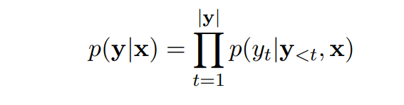
 编码器：bi-directional LSTM 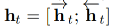
 decoder: st = fLSTMd(yt−1, st−1),
 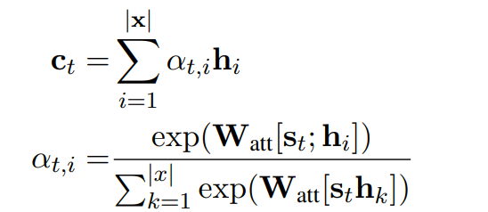
 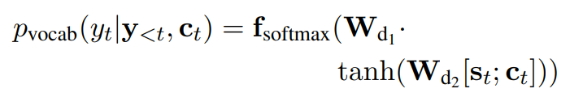

 Pointer-generator Network
 : 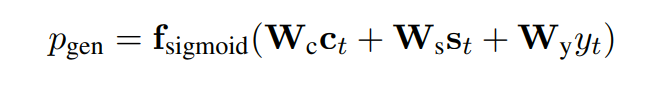
 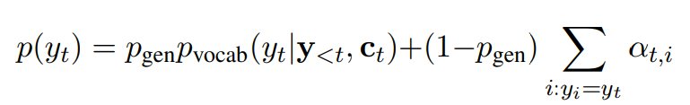
 如果yt不在字典中，则第一项为0，如果yt不在文章中，则第二项为0

Supervised Learning
:  loss function: 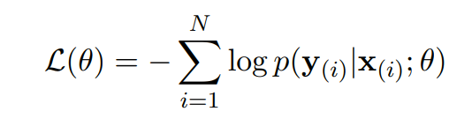

Keyphrase Inference and Ranking Strategy
: Beam search
beam size of 50, and R as 50. 
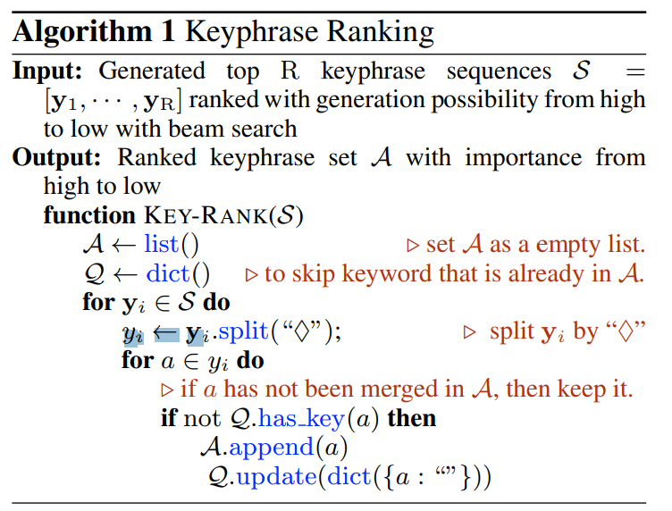
说明：通过beam search获得前50的生成序列，将序列按照概率大小进行排序后分别针对每句中的keyphrase依次加入结果中，直到得到个数50

## 4 Semi-Supervised Learning for Keyphrase Generation

### 4.1 Synthetic Keyphrase Construction
添加基于语法的短语有两个作用
- 在训练阶段，编码器接触了更多的文档
- 解码器也能从关键短语的上下文信息收益（理解：基于语法的关键词短语部分也是正确的，因此解码器能分辨出关键短语及其正文）

#### Unsupervised Learning Methods
使用 TF-IDF and TextRank， K设置为5
步骤
- 两种方法分别产生前K个备选
- 然后先tf-idf然后textRank，按照顺序去重并选择K个

#### Self-learning Algorithm
先通过基础数据生成一个基线模型，然后将该模型进行生成，beam size选择为10，最后选择top 1 beam

#### Training Procedure
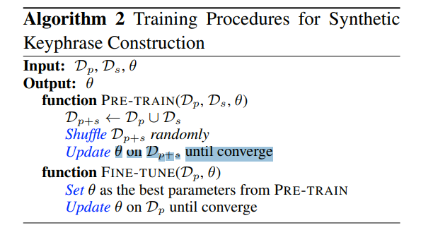

### 4.2 Multi-task Learning with Auxiliary Task
同一个编码器，auxiliary task： 标题生成
loss function： 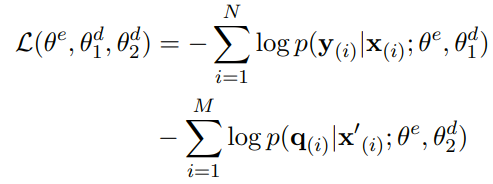
训练方法：先在auxiliary task训练1epoch，然后在main task上训练T epoch, T设置为3，按照这个训练训练多次直到main task的模型聚合

## 5 Experiments
### 5.1 Datasets
训练： dataset from Meng et al. (2017)
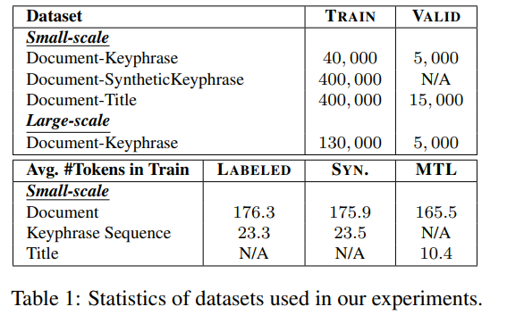
测试：在以下数据集上进行
INSPEC (Hulth, 2003), NUS(Nguyen and Kan, 2007), KRAPIVIN (Krapivin et al., 2009), SEMEVAL-2010 (Kim et al., 2010) and KP20K (Meng et al., 2017)

### 5.2 Experimental Settings
- tokenized by NLTK (Bird and Loper, 2004) and lowercased, then the numbers are replaced with <digit>
- max length：  source text as 200, 40 for target text
- Encoder and decoder vocabulary size of 50K
- word embedding size is set to 128，随机初始化，训练中学习
-  hidden vector is 512. Dropout rate is set as 0.3
- Maximal gradient normalization is 2
- Adagrad (Duchi et al., 2011) is learning rate of 0.15 and the initial accumulator rate is 0.1
- batch size
    - synthetic data
        -  batch size of 64 for model pre-training， 32 for model fine-tuning.
        - For both training stages, after 8 epochs, learning rate be decreased with a rate of 0.5
    - multi-task learning
        - batch size is set to 32
        - learning rate is reduced to half after 20 training epochs
- baseline seq2seq model
    - batch size as 32 and decrease learning rate after 8 epochs
-  self-learning
    - beam size is set to 10 to generate target sequences for unlabeled data and the top one is retained

### 5.3 Comparisons with Baselines
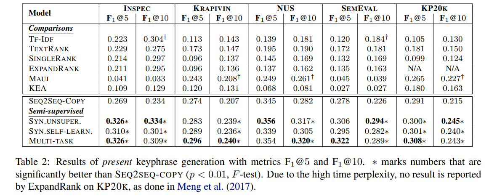
generating keyphrases beyond input article vocabulary，本身指标很低
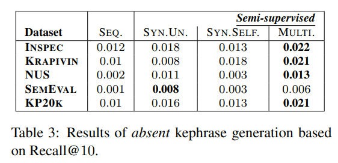

多任务学习更好的原因：另外的任务未影响到解码器
-  synthetic keyphrases potentially introduce noisy annotations
- multi-task learning setting focuses on learning from gold-standard keyphrases

### 5.4 Effect of Synthetic Keyphrase Quality
- self-learning algorithm
    - 使用基础模型beam size为3
    - 使用基础+非标注自学习模型beam size为10,取top 1
- unsupervised learning
    - top@1 然后 union
    - top@10 然后 union

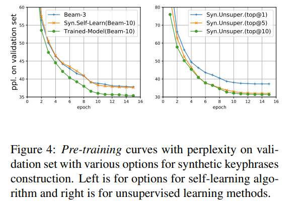
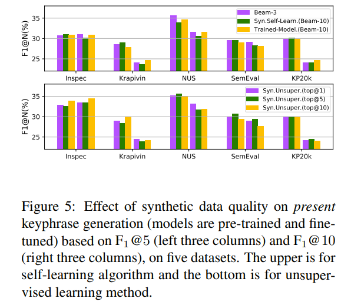
- synthetic keyphrases of better quality, results by “Trained-model” consistently produce better performance

### 5.5 Effect of Amount of Unlabeled Data
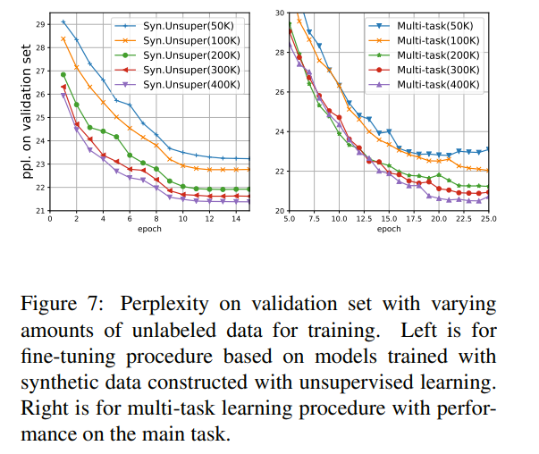

 additional unlabeled data can provide with more evidence on linguistic or context features and thus make the model, especially the encoder, have better generalizability

### 5.6 A Pilot Study for Cross-Domain Test
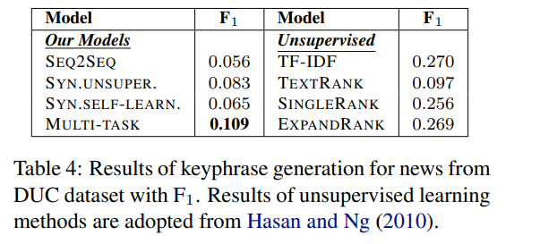
- though trained on scientific papers, our models still have the ability to generate, learned some universal features between the two domains
- semi-supervised learning by leveraging unlabeled data improves the generation performances

### 5.7 Training on Large-scale Labeled Data
-  larger labeled dataset with 130K pairs, along with the 400K unlabeled data
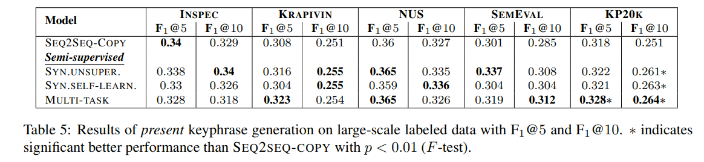
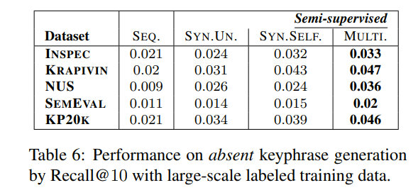