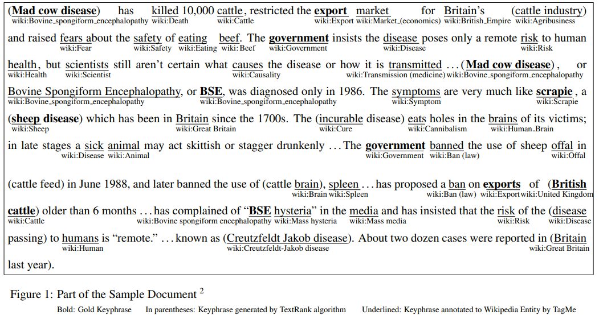
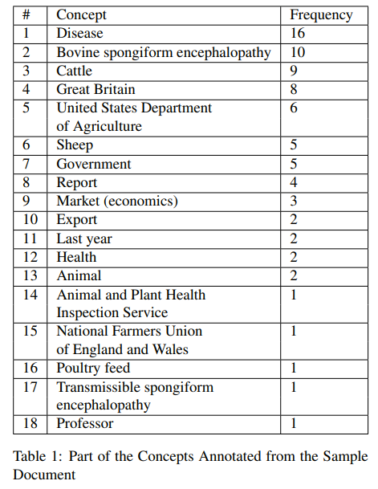
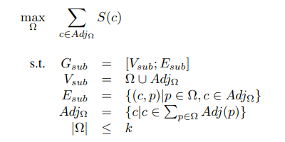
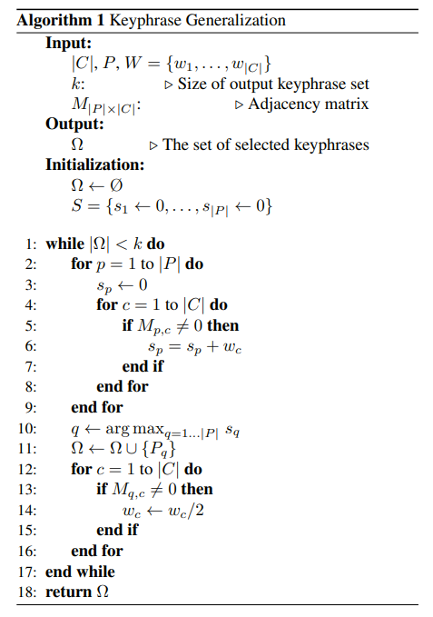
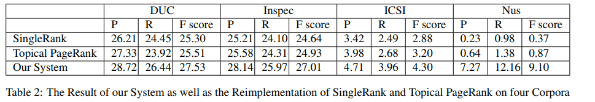

# WikiRank:Improving Keyphrase Extraction Based on Background Knowledge
[toc]

URL: http://www.lrec-conf.org/proceedings/lrec2018/pdf/871.pdf

## 1. Introduction
- the automatic selection of important and topical phrases from the body of a document
- 文章本身不能提供足够的信息来完成关键短语提取的任务
- Topical PageRank的问题
    - 使用LDA来进行分类，然后根据分类下计算keyphrase的得分
    - LDA只能将词分到主题下，并不知道是什么主题
- WikiRank
    - 使用知识库里面的主题信息来提高
    - 建模为优化问题，同样可以使用修剪方法来降低复杂度

## 2. Existing Error Illustration with Example

- Overgeneration errors
    - 很多非监督方法是以短语中词语分数合并或者最大分数进行处理，会导致过于泛化
    - 例子： 
        - Cattle 出现次数很多
        - British cattle 对
        - cattle industry, cattle feed, and cattle brain 错误
- Redundancy errors
    - 语义相同的短语
    - bovine spongiform encephalopathy and bse
- Infrequency errors
    - 只出现过一次或者两次的短语难以被识别为关键短语
    - export and scrapie

Document from DUC-2001 Dataset AP900322-0200 Government Boosts Spending to Combat Cattle Plague

## 3. Proposed Model
(1) Construct the semantic graph including concepts and candidate keyphrases; 
(2) (optional) Prune the graph with heuristic to filter out candidates which are likely to be erroneously produced; 
(3) Generate the best set of keyphrases as output.

### 3.1. Graph Construction
#### 3.1.1. Automatic Concept Annotation
TAGME 是一个主题标注器，将词语链接到Wikipedia page。

#### 3.1.2. Lexical Unit Selection
过滤掉不必要的词语
采用启发式方法，使用stanford词性标注器来选择名称组合，zero or more adjectives followed by one or more nouns
$$(JJ) ∗ (NN|NNS|NNP|NNP S)+$$

#### 3.1.3. Graph building
构建一个图，其中C为概念的集合，而P为候选短语的集合
如果根据TAGME，短语p包含概念c，则两者之间有一条边e相连

### 3.2. WikiRank
#### 3.2.1. Optimization Problem
好的短语： 1） 应该与文章主题相关； 2） 应该能对文章的主题有好的覆盖
由于概念是通过主题找出来的，因此可以转换为对于概念的覆盖：1) 覆盖重要的概念 2）覆盖越多越好

wc表示概念的权重，可以使用其在文章出现的频率表示，该计算公式用来计算表示第一次将概念加入图中分数最高，后面再添加分数依次降低，在该情况下增加覆盖会导致分数增加

keyphrase set Ω，
Vsub is the union of the candidate keyphrase set Ω, and the set AdjΩ of concepts that nodes in Ω connect to

#### 3.2.2. Algorithm

注意：每次将C连入图中后将其权重进行降低，后续就不需要考虑其是否已经被选入在图中

### 3.3. Approximation Approach with Pre-pruning
可以使用启发式方法来进行候选短语节点的预剪枝，来优化算法的计算复杂度

1. 将与概念无相连的候选短语节点去掉
2. 将只与一个一次概念相连的候选短语节点去掉
3. 如果一个概念与大于m个候选短语节点相连，删除如下节点：1） 不与其他概念相连；2）排序中低于其他m个候选（m常定为3,4）

## 4. Experiments and Results

