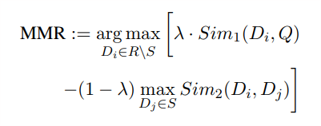
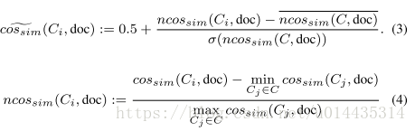
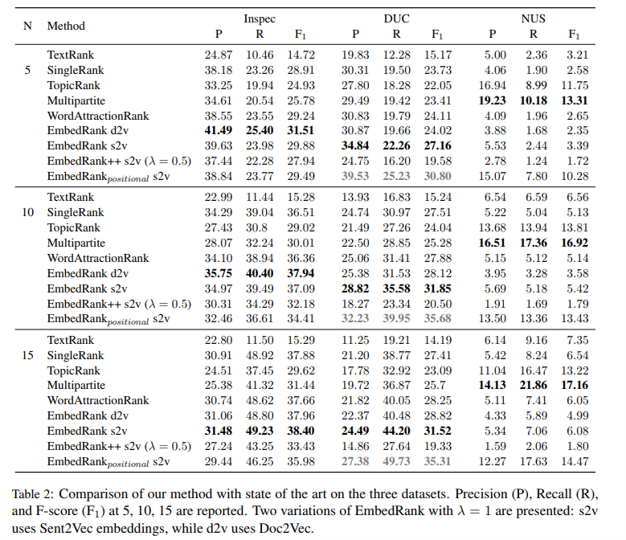

# 2018 Simple Unsupervised Keyphrase Extraction using Sentence Embeddings

[toc]

https://www.aclweb.org/anthology/K18-1022.pdf

## 1. a small set of phrases that best describe a given free text document
  - EmbedRank
  - embedding-based maximal marginal relevance
  - 解决问题
    - 快速
    - 词与词之间相似小
  - 监督学习提取的问题
    - 需要大量的数据集
    - 对于领域外的文章效果不好
  - 非监督方法限制
    - 数据集内的统计信息,如idf
    - 本文档内信息
    - 优点: 与领域无关\无训练集
  - EmbedRank
    - 使用文本表示学习, 将文档或一定长度的词语序列生成向量特征
    - informativeness: 短语与全文的距离
    - diversity: 短语与短语之间的距离
## 2. 前置工作
  - 非监督学习
    - 首先基于图的方法进行词语的打分
    - 然后根据词的打分获得短语的打分
      - 可能有错误, over-generation, 导致信息覆盖不全(变成短语后覆盖变小), 或破坏多样性(取了多个相似的短语)
    - 多样性
      - MMR, IA-Select, MaxSum Diversification
      - KeyCluster
        - 每类别中选择一个模范词语
        - 在该类别中选择短语时至少包含一个模范词语
        - 聚类过程保证了结果的多样性
      - TopicRank
        - 候选短语先聚类,按照类簇构造一个图
          - 聚类使用的是短语的共享词语比例
        - 18年使用multipartite graph structure进行优化
  - 表征
    - 词表征解决词语相似问题以及纬度高的问题
    - 句子表征
      - SkipThought
      - Paragraph Vector
      - Sent2Vec
        - 比前两者快
        - 可直接使用标准的相似性计算方法
## 3. EmbedRank
  - 基于POS序列获取短语备选
    - 只保留零个或多个形容词加一个或多个名词的组合的短语
  - 将短语或全文进行句子向量编码
    - 短语与全文的向量语义相关性作为短语的信息覆盖
    - 句子去噪声
      - 只保留形容词和名词  
    - 比较
      - English Wikipedia corpus
      - Sent2vec: dim 700
      - Doc2vec: dim 300
    - 假设: 与全文向量越近,信息度越好
  - 排序进行选择
    - 问题是抽取出的关键短语有很多冗余，这就需要在informativeness和diversity之间做一个权衡
## 4. EmbedRank++: Increasing Keyphrase Diversity with MMR
  - 如果用以可视化,则冗余会影响用户的体验
  - Maximal Marginal Relevance (MMR)
  -  
    $\lambda$ 为1表示标准相似性排序,为0表示最大多样性
  - 
  - ncos是将相似性转换为0 ~ x之间; 
## 5. Experiments and results
   - 样例
   
   - 数据集
     - Inspec, DUC 2001, NUS
   - 结果
     
   - Keyphrase Diversity and Human Preference
     -  fixed λ to 0.5
## 6. Discussion
   - F值疑问
## 7. 其他资源
- [代码实现 https://github.com/swisscom/ai-research-keyphrase-extraction](https://github.com/swisscom/ai-research-keyphrase-extraction)
- [https://github.com/epfml/sent2vec ](https://github.com/epfml/sent2vec)
- [https://github.com/jhlau/doc2vec ](https://github.com/jhlau/doc2vec)
- https://blog.csdn.net/u014435314/article/details/81223340
- https://graph-tool.skewed.de
- https://github.com/boudinfl/pke