# A Review of Keyphrase Extraction

[toc]

https://arxiv.org/pdf/1905.05044.pdf

## 1. 介绍
- Unsupervised methods
    - domain independent
    - do not need labeled training data
- Supervised methods
    - powerful modeling capabilities
    - higher accuracy
- 用法
    - 语义检索
        - 完全替代全文检索
        - 文档检索 + 关键词组附加效果
    - 问句扩展
    - 文档聚类与分类
    - 指导文档摘要
    - 学术出版中： 任务、技术、趋势等
- Hasan and Ng (2014)
    - 错误评价： 可替代词语，算错误
    - 冗余错误
    - 稀少错误： 出现次数较少的短语不容易检测出来
    - 基于包含频繁词语的词语有可能过于泛化输出： 可能部分短语是不合适的
- (Hasan and Ng, 2010)
    - 应该在多个数据集上评测
    - tfidf是个不错的基线系统
## 2. 非监督方法
- 步骤
    1. Selection of the candidate lexical units based on some heuristics. Examples of such heuristics are the exclusion of stopwords and the selection of words that belong to a specific part-of-speech (POS).
    2. Ranking of the candidate lexical units.
    3. Formation of the keyphrases by selecting words from the top-ranked ones or by selecting a phrase with a high rank score or whose parts have a high score.

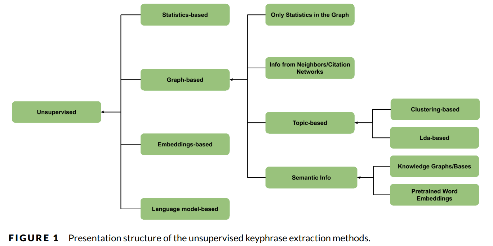
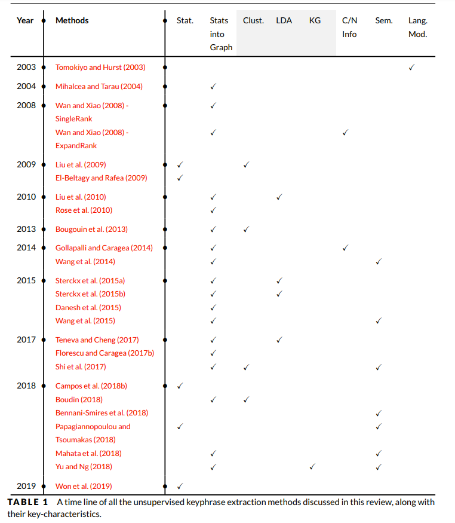

### 2.1 Statistics-based Methods
#### tf-idf: $tf*\log_2\frac{N}{1+|d\in D:phrase\in d|}$
#### 变种 mean × Tf
- logarithm of the phrase frequency, 饱和高频率词语
- mean × Tf， mean of the words’ scores which constitute the phrase
#### KP-Miner (El-Beltagy and Rafea, 2009)
- 基于标点以及停止词划分候选 candidates those that are not be separated by punctuation marks/stopwords
- least allowable seen frequency (lasf) factor
- cutoff constant (CutOff) that is defined in terms of a number of words after which a phrase appears for the first time
- the system ranks the candidate phrases taking into account the Tf and Idf scores as well as the term position and a boosting factor for compound terms over the single terms
#### KeyCluster (Liu et al., 2009)
- 去停止词，选择被选词组
- co-occurrence-based or Wikipedia-based 计算语义相关度，进行聚类
- 基于单个类别进行词组选择

#### YAKE (Campos et al., 2018b)
- 使用上下文信息以及词语覆盖范围
- 分离term，并计算特征， 越小越重要
    - Casing (Wcase that reflects the casing aspect of a word)
    - Word Positional (WPosition that values more those words occurring at the beginning of a document)
    - Word Frequency (WFreq)
    - Word Relatedness to Context(WRel that computes the number of different terms that occur to the left/right side of the candidate word)
    - Word DifSentence (WDifSentence quantifies how often a candidate word appears within different sentences)
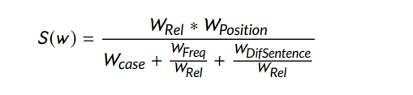
- 1, 2 and 3-gram candidate keywords, 越小越有意义
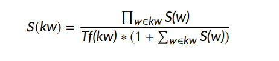

#### Won et al. (2019)
- 使用简单文本特征达到可匹敌STOA
- 步骤
    - 使用形态句法模板候选短语
    - 计算特征
        - Term Frequency, i.e., the sum of each word frequency of the candidate phrase
        - Inverse Document Frequency (Idf)
        - Relative First Occurrence, i.e., the cumulative probability of the type $(1 − a)^k$ where a ∈ [0, 1] measures the position of the first occurrence and k the candidate frequency
        - Length, i.e., a simple rule that scores 1 for unigrams and 2 for the remaining size
        - 结果进行求积
    - 短语个数
        - n = 2.5 × log10(doc size)， 实验而来

### 2.2 Graph-based Ranking Methods
- 目的：将候选短语作为节点，有关系的节点进行连接，利用基于图的排序算法来排序节点
    - pagerank
    - positional function
    - HITS
    - 基于通用图优化算法
- textrank
    - 首先进行分词并进行词性标注
    - 通过语法进行筛选合并的文本单元，然后将其加入图中作为节点存在
    - 基于M的窗口长度来统计各节点之间的同现，表示为边
    - 图：无方向，无权重
    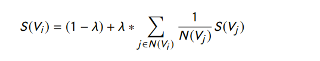
- SingleRank
    - 在pagerank的基础上添加 权重 信息
    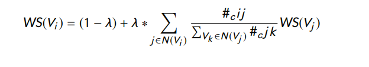
- RAKE (Rapid Automatic Keyword Extraction)
    - 使用入参（停止词、短语分隔符、词语分隔符）将句子拆分成短语
    - 计算词语-词语共现，分数（词频或者词的度或者词的度与频率的比值），短语的分数是单个词分数的和
    - 能够处理中间有内部停止词的短语，方法：检测在同一篇文章中，临近词语对出现过两次以上
- SGRank
    - 使用统计，位置、词共现
    - 方法
        - 抽取所有可能的 n-gram
        - 去掉含有打印符号以及非名词、副词、动词之外其他的词性的候选，之后分别统计他们的条件频率
        - 基于修改后的tfidf进行排序
        - 针对排序在前面的通过启发式特征重排：第一次出现的位置、长度等
        - 针对上一步的处理放到图中进行最终的重排
- PositionRank
    - 使用统计，位置、词共现
    - 基于词语-词语共现以及位置来查找最频繁词语
    - 将词语的所有出现位置合并成一个 biased weighted PageRank
 
 #### 2.2.1 Incorporating Information from Similar Documents Citation Networks
 - 相关的文档有共同的影响力来帮助抽取词组
- ExpandRank
    - 方法
        - 每篇文档被表示为一个tf-idf向量
        - 针对目标文档d_0，寻找k个最近邻文档
        - 基于k+1篇文档，将候选词构建一个图，基于共现窗口M构建边
        
        - 后续过程同 single rank
- CiteTextRank
    - 通过引用上下文来构建引用网络来合并信息
    - 方法
        - 目标文档：d，引用网络：C，cited context：引用d的文档，citing context：d引用的文档，global context：d的正文
        - 构建一个图：在d的所有上下文中基于M窗口构建词节点
        - 权重：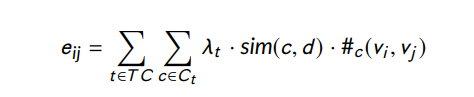
            - TC d的上下文 (global, citing, cited)
            - sim(c, d ) is the cosine TfIdf vectors of any context c of d and d 
            - #c (vi, vj) is the number of co-occurrences of vi, vj in context c
            - Ct is the set of contexts of type t ∈ TC
            - λt is the weight for contexts of type t
        - 使用pageRank进行排序

#### 2.2.2 | Topic-based Methods
- topic-based methods try to extract keyphrases that are representative for a text document in terms of the topics it covers

- Clustering-based Methods
    - TopicRank
        - 首先对候选短语进行预处理
        - 然后使用层次聚类算法将候选短语分别聚类到单独的topic
        - 构建一个topic-图，每个边的权重为topic下候选词语在文章出现的位置的度量
        - 使用textRank，Top-N topic每个topic下选择最先出现的备选短语
    - MultipartiteRank (MR) 
        -  introduces an in-between step where edge weights are adjusted to capture position information giving bias towards keyphrase candidates occurring earlier in the document

- LDA-based Methods
    - Topical PageRank (TPR) 2010
        - 基于词词共现以及词性筛选（名词、形容词）构建一个词语图
        - 基于每个topic，计算一次Biased PageRank 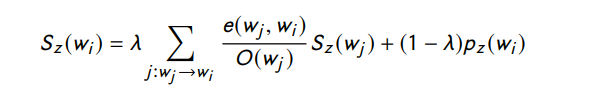
            -  pz (wi) is equal to pr(z |w) which is the probability of topic z given word w
            - e(wj,wi) is the weight of link e(wj,wi), and O(wj) is the out-degree of vertex wj
        -  candidate phrase,等于其下每个词的分数和 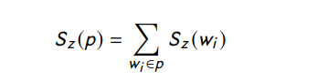
        - 最终的短语分数 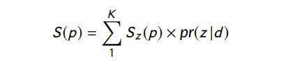
    - Single Topical PageRank (Single TPR) 2015
        - 避免多次计算pageRank导致的大量开销
        - 某个词的k个主题的和被concept of topical importance W (wi)替换
        - cosine similarity (W (wi)) is calculated between the vector of word-topic probabilities and the document-topic probabilities  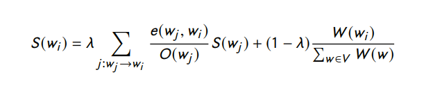
    - 在不同的主题下，词语的重要性是不一样的
    - Salience Rank 2017
        - word salience Sα (w), which is a linear combination of the topic specificity and corpus specificity of a word (the last can be calculated counting word frequencies in a specific corpus)
        - 直觉来说，topic specificity measures how much a word is shared across topics， the less the word is shared across topics, the higher its topic specificity  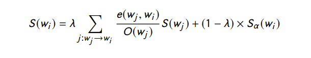
    - LDA-BASED new direction 2014
        - 大多数该方法以词建模，而人类往往以词组
        - 第一步先进行词组挖掘， phrase mining technique to extract frequent significant phrases and segment the text at the same time
        - 第二步，建立简单模型来限制组成短语的词共现同样的语义topic
        
#### 2.2.3 | Graph-based Methods with Semantics
**Semantics from Knowledge Graphs/Bases**
- 方法弱点
    - topic方法在于topic通用和不明确
    - 共现方法有信息丢失问题，如果两个词语相关而不位于窗口内
    - 统计方法则有信息过载的问题，文中单词的真正含义则可能受到计算统计信息的其他文本信息的影响
- Shi et al. (2017)
    - 名词和命名实体（(keyterms）被提取出来基于语义相似度进行聚类
    - 每个类别中的概念（(keyterms）被连接到DBpedia，keyterms的关系可以通过其在知识库中h-hop keyterm子图中的不超过h长度的路径来表示
    - Personalized PageRank (PPR) 进行计算排序
    - candidate phrase：其中的keyterm的分数以及候选的频率以及第一次出现的位置
- Yu and Ng (2018) proposeWikiRank

---
**Semantics from Pretrained Word Embeddings**
- 需要更多的背景知识而不只是知识库中的语义相关信息（只能判断两者是相关的）
- Wang et al. (2014)
    -  使用分布式词语表征作为背景知识
    - 方法
        - 基于词语-词语共现窗口构建图
        - 边的权重由两部分组成 word attraction score
            - attraction force： 词向量的欧式距离以及词频
            - dice coefficient： 两个词共现的概率      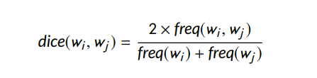
        - 使用pageRank
-  Wang et al. (2015) 
    - 基于上例，使用Personalized weighted PageRank
    - strength of relation of a pair of words is calculated as the product of the semantic relatedness and local co-occurrence co-efficient 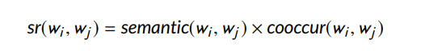
    $smantic(w_i, w_j) = \frac{1}{1-cosine(w_i, w_j)}$
    - 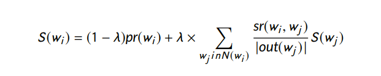  $$pr(wi)=\frac{freq(w_i)}{N}$$
    - 没有使用领域的词向量，因此进行领域词向量训练可以提高性能

- Mahata et al. (2018): Key2Vec
    - 使用领域词向量对关键短语进行表征
    - theme-weighted PageRank algorithm
    - Fasttext来训练多词组词向量
    - 基于词语共现来构建图

### 2.3 | Keyphrase Extraction based on Embeddings
[EmbedRank (Bennani-Smires et al., 2018)](keyphrase_2018_simple_unsupervisd_keyphrase_embedding.md)

---
**Papagiannopoulou and Tsoumakas (2018) : Reference Vector Algorithm (RVA),**
- 本地词语表征，在限制条件下从单篇文章计算而来，local word embeddings/semantics (in particular GloVe vectors), i.e., embeddings trained from the single document under consideration
- the mean (reference) vector: 计算整个标题和摘要的词语的向量，代表整个正文的向量表征
- 将从标题或摘要中提取出来的短语计算其向量表征，其与文章引用向量的余弦相似度

### 2.4 | Language Model-based Methods
Keyphrase extraction with N-gram language models  2003
- 基于目标文档以及背景文档集合分别构建两个语言模型（unigram and n-gram language）
- 使用KL散度来衡量两个语言模型之间的差别 Kullback-Leibler divergence
- phraseness：divergence between the unigram and n-gram language models on the foreground corpus
- informativenessis:  divergence between the n-gram language models on the foreground and the background corpus
- phraseness + informativeness 作为单个候选短语的最终分数

## 3 | SUPERV ISED METHODS
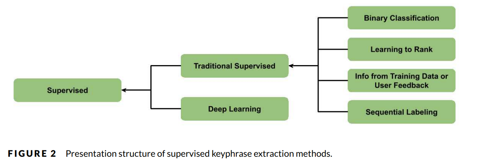

### 3.1 | Traditional Supervised Methods
#### Keyphrase Extraction as Binary Classification Task
- KEA (Witten et al., 1999)
    - 计算tfidf以及第一次出现的位置等
    - Naive Bayes

- Hulth (2003) 
    - 计算4种特征
        - the within-document frequency
        - the collection frequency
        - the relative position of the first occurrence
        - part-of-speech (POS) tag sequence
    - rule induction system with bagging

- Nguyen and Kan (2007)
    - extension of KEA 
    - 特征
        - position information (a section occurrence vector, i.e., a vector of frequency features for 14 generic section headers) 
        - additional morphological/linguistic characteristics (POS tag sequence, suffix sequence and acronym status) of the keyphrases
    -  Naive Bayes

- Medelyan et al. (2009)： Maui

#### Sequential Labeling
- Conditional Random Fields (CRFs) by Gollapalli et al. (2017)

