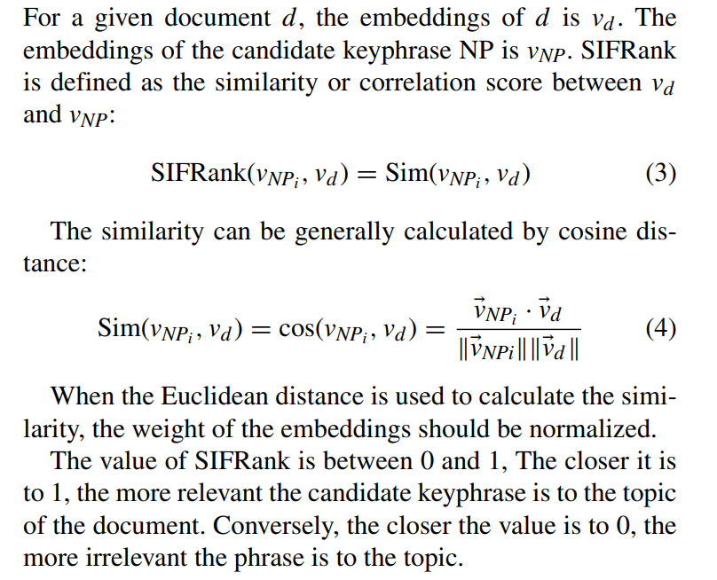
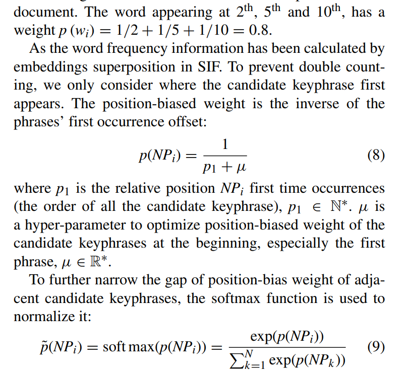
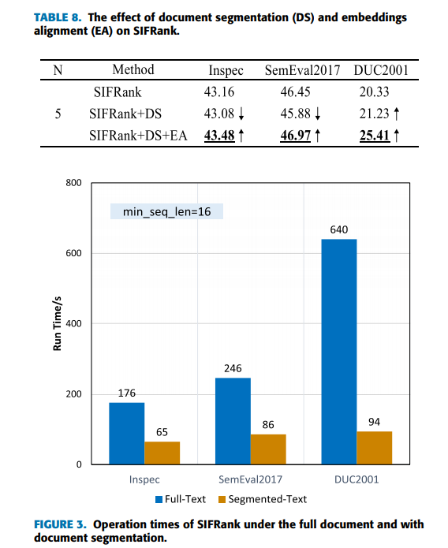

<!-- TOC -->

- [SIFRank: A New Baseline for Unsupervised Keyphrase Extraction Based on Pre-Trained Language Model](#sifrank-a-new-baseline-for-unsupervised-keyphrase-extraction-based-on-pre-trained-language-model)
  - [Abstract](#abstract)
  - [Introduction](#introduction)
  - [Related Work](#related-work)
  - [Model Overview](#model-overview)
  - [SIFRank and SIFRank+](#sifrank-and-sifrank)
  - [Evaluation](#evaluation)

<!-- /TOC -->

# SIFRank: A New Baseline for Unsupervised Keyphrase Extraction Based on Pre-Trained Language Model
- https://ieeexplore.ieee.org/document/8954611

## Abstract
- 传统的关键词抽取模型难以容纳大量的外部知识信息，但随着预训练语言模型的兴起，为解决这一问题提供了一种新的思路。基于上述背景，我们提出了一种新的基线无监督的基于预训练语言模型的关键词提取称为 SIFRank。SIFRank 将句子嵌入模型 SIF 和自回归预训练语言模型 ELMo 相结合，在短文关键词抽取方面具有最好的性能。我们加快了 SIFRank，同时通过文档分割和上下文词嵌入对齐来保持其准确性。对于长文档，通过位置偏重权值将 SIFRank 升级为 SIFRank + ，极大地提高了 SIFRank 在长文档上的性能。与其他基线模型相比，我们的模型在三个广泛使用的数据集上达到了最先进的水平

## Introduction
- 关键词抽取主要分为有监督和无监督两大类。监督方法对特定的领域任务有较好的效果，但对语料库进行注释需要大量的工作，训练后的模型可能会过度匹配，在其他数据集上不能很好地工作。传统的无监督方法主要分为基于统计的模型和基于图的模型。统计模型通常使用不同的信息特征，如词频、 n 元特征、位置和文档语法，但这种信息很难反映文档中词与词之间的复杂关系。基于图的模型把人类语言看作一个复杂的网络[2] ，使用图来模拟文档中单词或短语之间的关系。最典型的模型是 TextRank，后面的模型用不同的算法或外部信息对 TextRank [3]进行优化
- 虽然基于图的模型是有效的，但是通过引入外部知识或附加特征可以更好地提高关键词抽取的效果。使用预先训练好的语言模型是提供大量外部知识的途径之一。根据 Papagiannopoulou 和 Tsoumaka 的评论文章[4] ，这被归纳为基于嵌入的模型。随着预训练语言模型的兴起，ELMo [5]、 Bert [6]、 XLNet [7]等深层神经网络模型很好地解决了自然语言处理中的许多监督任务。这个单词的特点不再是像 Word2Vec 那样的静态单词嵌入，而是像 ELMo 那样的动态、实时和上下文单词嵌入。在大规模的未标记语料库上预先训练语言模型，并根据不同的语境动态调整文本表示。基于上述优点，在关键词抽取中使用预训练语言模型可以将统计模型和基于图的模型的优点结合起来
- 句子嵌入是句子或文档的表现形式。获取句子嵌入的方法有很多种，这些方法可以很好地应用于不同的下游监控任务，因为它们有注意力模型。注意力模型可以在有监督的情况下训练嵌入权重。然而，在无监督的关键词提取任务中，词嵌入、句子嵌入和文档主题之间的关系需要一个合适的模型来解释。
- 有时仅仅使用原始句子嵌入来提取关键词组是不够的。以词包句子嵌入模型为例，该模型不包含文档中词或短语的位置信息。然而，众所周知，位置信息在关键词提取中起着重要的作用，特别是对于长文档

---
主要贡献
- 引入句子嵌入模型 SIF [8]来解释句子嵌入和文档主题之间的关系。然后结合自回归预训练语言模型 ELMo 和 SIF 计算短语嵌入和文档嵌入。余弦距离是用来计算候选短语和主题之间的距离。我们的模型叫做 SIFRank
- SIFRank 动态、实时地计算文本表示，并使用领域数据信息进行优化。SIFRank 在两个短文档数据集(Inspec 和 DUC2001)上实现了最先进的效果。此外，我们的模型比之前的 SOTA 模型更具鲁棒性
- 提出了一种称为文档分割的方法，以加快计算长文档中的词嵌入过程。然而，由于文档被分割成更小的部分，关键词提取的效果将会降低。以同一个词在不同位置和上下文中的上下文嵌入平均值作为嵌入锚点，用嵌入锚点代替上下文词嵌入来计算结果，模型的性能得到明显的反弹
- 为了提高模型对长文档数据集的关键词提取能力，提出了位置偏重权值的方法。我们使用短语的第一次出现偏移位置的倒数作为位置偏移的权重。然后利用软极大值使位置偏重量均匀平滑。通过在 SIFRank 中增加位置偏重权重，该模型在长文档数据集 DUC2001上的性能得到了显著提高，而在短文档数据集上的性能没有受到太大影响。该模型被称为 SIFRank + ，并在 DUC2001数据集上实现了最新的结果

## Related Work

## Model Overview
- 通过句子嵌入模型 SIF 合理地解释了词汇嵌入、句子嵌入和文档主题之间的关系

---
**A. Overall Structure**
主要步骤如下:
- 文档分词，词性的序列
- 利用正则表达式编写模式 NP-chunker，根据词性标记从序列中提取名词短语。从文档中提取的 np 是候选关键词短语。
- 将 Token 序列放入预先训练的语言模型中，提取每个 Token 的表示。在这种情况下，表示可以是具有不同特征的多层次词嵌入
- 通过句子嵌入模型，将 NPs 和文档的嵌入转化为 NP 嵌入和文档嵌入。在这一点上，他们有相同数量的层和尺寸
- 计算 NP 嵌入和文档嵌入之间的余弦距离。我们认为这种距离是候选关键词和文档主题之间的相似性。在大多数类似的候选关键词中选择 Top-N 作为最后的关键词。这也是候选关键短语排名的最重要因素

---
**B. Sentence Embedding Model SIF**
- 本文选用句子嵌入模型 SIF [8]来获得 NPs 和文档的嵌入。这不仅是因为它适用于大多数预先训练的语言模型，而且因为该模型所得到的句子嵌入能够很好地反映文档的主题
- 根据 SIF，对于文档 d ∈ d，句子的生成是一个动态的随机游动过程。第 k 个单词 w k 是在步骤 k 生成的。假设文档的主题在这个过程中没有太大的变化。也就是说，所有单词的生成都是由一个主题 c d ∈ r 决定的。因此，对于一个给定的句子，句子嵌入是决定整个文档的主题嵌入的最大似然估计。因此，计算候选关键词短语嵌入和文档嵌入之间的距离就是计算候选关键词短语和文档主题之间的相似度

**基于主题生成一句话的概率**

---
**C. Pre-Trained Language Model EMLO**
- 由 ELMo [5]生成的词嵌入有3个层次，分别用 L0、 L1和 L2表示，每个层次有1024个维度。0是 Char Encode 层。令牌的静态嵌入由这个卷积神经网络层生成。L1和 L2是由 biLM (biLSTM)生成的上下文词嵌入。根据 Peters 等人论文中的描述，l 1更好地捕捉语法信息，l 2更好地捕捉上下文相关的语义信息。这三个层的嵌入可以加权，然后输入到不同的下游任务中

## SIFRank and SIFRank+
**A. SIFRank**

---
**B. Model Domain Adaptation**
- 对于不同领域的文本，单词的概率分布可能不同。在某些特定领域，通常很少见的单词可能很常见
- 为了使该模型更好地适应不同领域的任务，在句子嵌入计算过程中改变了词的权重函数。这个权重是通用语料库和领域语料库的权重和
- 在大规模语料库维基百科上计算权重 com (w) ，并在任务的领域语料库上计算权重 dom (w)

---
**C. Document Segmentation and Embeddings Alignment**
- 同一个词在不同的上下文或不同的位置有不同的词根嵌入。因此，单词嵌入被定义为 v s j w p i，其中 w i 代表单词，s j 是单词所在的句子，p 是单词在句子中的位置

- Document Segmentation
  - 当将整个文档放入 ELMo 时，将花费很长时间来计算嵌入。当文档被分割成若干部分为一批时。它们可以独立地并行计算
  - 设 MSL 为最小序列长度。将文档分割成不短于 MSL 的实例。这意味着每个实例由几个完整的句子组成，每个实例的长度刚好大于或等于 MSL。文档分割(DS)的详细信息显示在算法1中。

- Embeddings Alignment
  - 但是随着文档的分割，模型失去了文档的完整上下文。该模型的性能将受到影响。因此，我们使用称为嵌入对齐(EA)的方法来维护模型性能
  - 一个单词的嵌入锚点是不同句子和位置中所有上下文嵌入的平均值。在计算分段文档中的所有上下文嵌入之后，使用嵌入锚来替换所有嵌入，以对齐文档中的嵌入

---
**Position-Biased Weight for Long Documents**
- 对于大多数较长的文档，作者倾向于写文档的主题，这意味着最重要的关键词往往出现在文档的开头
- 由于 SIFRank 是一种词袋模型关键词抽取，因此有必要考虑位置信息在长文档关键词抽取中的重要性(特别是那些有多个段落的关键词抽取)

- 对于长文档，SIFRank 将被改变为(10)所示的形式，我们称之为 SIFRank +

## Evaluation
**Datasets**
- 并非所有的黄金关键词短语都出现在原始文本中，并非所有关键词短语都能被识别为候选关键词短语。因此，理论上不可能实现100% 的关键词提取

---
**Compare With Other Baselines**
- 将该模型与三种无监督的关键词抽取方法: 统计模型、基于图的模型和基于嵌入的模型进行了比较。统计模型是 TFIDF 和 YAKE1[29]。基于图的模型2是 TextRank [3] ，SingleRank [10] ，TopicRank [11] ，PositionRank [13]和 multilitret [12]。基于嵌入的模型是 RVA [24]和 embeddrank [25]
- 对于 TFIDF，n-gram 窗口长度设置为3。YAKE 的窗口大小为1，重复数据删除阈值为0.9，n-gram 长度为3。TextRank 和 SingleRank 的窗口大小分别为2和10。最小聚类相似度阈值设置为0.74。PositionRank 的窗口大小为10。控制多部图权重调整强度的超参数设置为1.1。在每个文档上分别生成 RVA 的词嵌入，在全文(不仅是标题和摘要)上计算引用向量，维数为100。3使用了基于维基百科语料库的 DBOW 的 Doc2Vec 模型

- 表3的结果表明，在短文档数据集 Inspec 和 semval2017中，基于嵌入的模型比基于图的模型具有明显的优势。但对于长文档数据集 DUC2001，PositionRank 比简单的基于嵌入的模型工作得更好。我们的模型 SIFRank 在短文档 Inspec 和 semval2017上有最先进的结果。我们的模型 SIFRank + 与位置偏重权重得到最先进的结果，在长文件数据集 DUC2001

- **Transformer 结构在提取字表示方面弱于非监督任务的 LSTM。Transformer 可能更适合监督任务微调类型的任务**

---
**Compare With Other Pre-Trained Language Models**

- 我们使用 XLNet 的第一层，它显示了最好的性能。XLNet 还有两个版本 XLNet-base 和 XLNet-large，区别在于它们都使用 Transformer-XL [31]而不是 Transformer

- 实验结果表明，对于大多数预训练模型的词汇嵌入，维数越高，关键词提取的效果越好

- 从 AE 语言模型中提取的词根嵌入在短的 Inspec 数据集上工作得很好，而在长的文档数据集 DUC2001上工作得很差。我们还尝试利用数据集语料库对 BERT 和 RoBERTa 进行增量预训练，但是并没有给模型带来稳定的改进

- AR 语言模型 XLNet 在像 GLUE 和 SQuAD 这样的监督数据集上与 BERT 和 RoBERTa 的性能差别不大(RoBERTa 甚至比 XLNet 的性能更好) ，但 XLNet 在关键词提取任务上大大提高了性能。我们认为这是因为 AE 模型在预训练过程中使用了[ MASK ]这样的人工符号，从而导致了预训练-精确度的差异。同时，本文提出的关键词抽取算法是一个无监督模型，对这种差异非常敏感
- 尽管 XLNet 使用 Transformer-XL，它可以比 RNNs 和 Transformer 更好地学习长期依赖关系，但与 ELMo 和 GloVe 相比，它在长文档数据集 DUC2001上仍然表现不佳。因此，我们推断，隐藏层越深，在我们的任务中提取单词表示的能力就越差(可能单词表示越复杂，但这不适合我们的任务)

---
**Ablation Experiment**
- 嵌入式模型在计算句子嵌入时去除了无关词，仅保留名词和形容词，提高了模型的效果。但是当它去掉这个部分时，性能会大大降低。由于提取的关键短语个数(n)与三个评价指标(p、 r、 f)呈正相关，为节省论文篇幅，我们选取其中一个(p)作为评价指标，下表相同

---
**Parameter Sensitive Experiment**
- 在这三个数据集上验证了超参数 λ 对区域自适应方法的关键词提取精度的影响。提取的关键短语数 n 为5
- Inspec、 seeval2017和 DUC2001的最佳 λ 值分别为0.5、0.6和1.0。结果表明，适当的 λ 值可以在一定程度上提高该算法的性能。然而，由于 DUC2001数据集的特殊性，该数据集的领域词频统计不利于提高性能

---
**Performance of Document Segmentation and Embeddings Alignment**
- 在没有文档分段的情况下，ELMo 计算单词嵌入所花费的时间随着文档长度的增加而迅速增加。使用文档分割，并将 MSL 设置为16可以大大加快模型的速度
- 通过上下文词嵌入(ELMo L1和 L2层)降低了提取关键短语的精度。因此，通过嵌入对齐的方法，可以恢复模型的性能。如表8所示，分别是全文计算结果下的 SIFRank、文档分割(DS)后的结果以及文档分割和嵌入对齐(EA)后的结果

--- 
**Case Study**
- 文本中带粗斜体和下划线的短语是带注释的关键词组。不同的颜色表示候选关键词的相关性得分的两个模型。右边的热图条显示了候选关键词的相关分布
- SIFRank 计算得到的候选关键词之间的相关性具有良好的区分度，可以很好地区分出不相关的候选关键词。相反，由 embeddrank 计算出的不同候选关键词之间的相关性得分差异不明显

