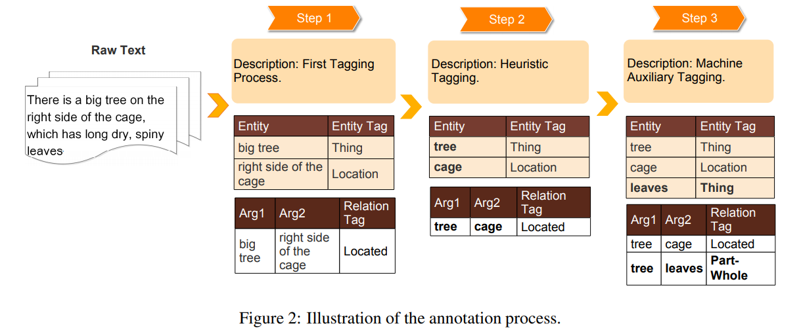
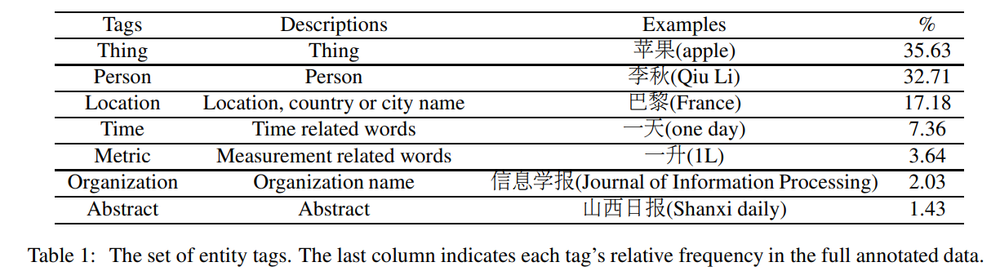
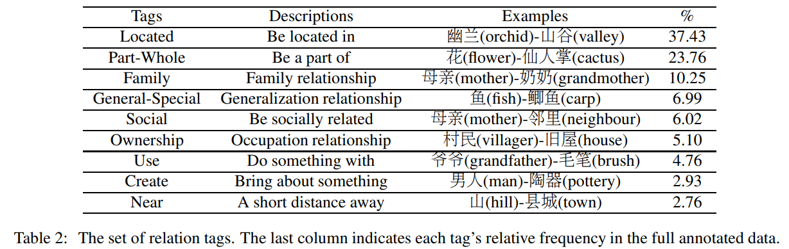
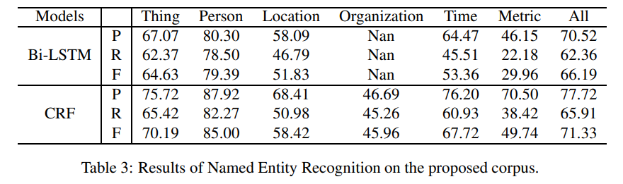

<!-- TOC -->

- [A Discourse-Level Named Entity Recognition and Relation Extraction Dataset for Chinese Literature Text](#a-discourse-level-named-entity-recognition-and-relation-extraction-dataset-for-chinese-literature-text)
  - [摘要](#摘要)
  - [引言](#引言)
  - [相关工作](#相关工作)
  - [数据收集](#数据收集)
  - [数据属性](#数据属性)
  - [注释格式](#注释格式)

<!-- /TOC -->
# A Discourse-Level Named Entity Recognition and Relation Extraction Dataset for Chinese Literature Text

## 摘要

- 本文从数百篇中国文学论文中构建了一个语篇层面的数据集来完成这一任务
- 提出了两种解决数据不一致问题的标注方法，即启发式标注方法和机器辅助标注方法
- 介绍了几个广泛使用的模型来进行实验。实验结果不仅表明了所提出数据集的有效性，而且为进一步的研究提供了基线

## 引言
- 本文从数百篇中国文学论文中建立了 NER 和 RE 数据集。不同于以往的句子层次数据集，我们建立了一个语篇层次的数据集，来自同一段落的句子提供了额外的上下文信息
- 主要的困难在于如何处理大量的模糊情况，以确保数据的一致性
  - “ Hamlett”是一个人的名字，但指的是一只兔子。一些注释者用“ Person”标签标记它，另一些注释者用“ Thing”标签标记它
- 本文提出了两种解决这一问题的方法。一方面，我们定义了几个通用的消歧规则来处理最常见的情况。另一方面，由于这些启发式规则过于通用，无法处理所有的歧义案例，我们还引入了一种机器辅助标注方法，该方法利用从语料子集中学习的标注标准来预测剩余数据上的标注。注释者只关心预测的标签与金标签不同的情况，这大大减少了注释者的工作量
- 手工注释了726篇文章，29,096个句子和超过100,000个字符，这是在300个人工小时内完成的，5个人和3个月

## 相关工作

## 数据收集
- 将标注过程分为三个步骤
  - Step 1: First Tagging Process
    - 尝试基于定义的实体和关系标记对原始文章进行注释。在标注过程中，我们发现了数据不一致的问题
  - Step 2: Heuristic Tagging Based on Generic disambiguating Rules
    - 基于通用消歧规则的启发式标注。我们设计了几个通用的消歧规则来保证注释指南的一致性。例如，删除所有形容词，在标记实体时只标记“实体标题”(例如，将“穿红衣服的女孩”更改为“女孩”)。在这个阶段，我们重新注释所有的文章，并且基于启发式规则修正所有不一致的实体和关系
  - Step 3: Machine Auxiliary Tagging
    - 机器辅助标签。尽管启发式标注过程显著地提高了数据集的质量，但是基于有限的启发式规则来处理所有不一致的情况是非常困难的。因此，本文提出了一种机器辅助标注方法。其核心思想是训练一个模型来学习语料集子集上的注释准则，并在其余数据上生成预测标记。预测的标签被用来与金标签进行比较，以发现不一致的实体和关系，这在很大程度上减少了注释者的工作。具体来说，我们将语料库分为10个部分，并基于在语料库其余部分上训练的模型对语料库的每个部分进行预测。本文采用的模型是一个简单的二元特征模板的 CRF

## 数据属性
- 在已有的 NER 和 RE 数据集的基础上，定义了7个实体标签和9个关系标签，但增加了一些中文文献文本特有的类别

- 增加了三个新的实体标签，专门用于理解文献文本，包括“物品”，“时间”和“度量”。“物”是捕捉文章主要描述的对象，如“花”、“树”等。“时间”是用来捕捉故事的时间线，如“一天”、“一个月”等等。“公制”是用来捕捉与计量相关的单词，如“1L”、“1mm”等
- 关系标签，我们设定了9个不同的类别，包括「位置」、「近」、「部分-整体」、「家庭」、「社会」、「创造」、「使用」、「拥有权」、「一般-特别」。为了建立文学作品中人与人之间的关系，我们使用了“社会”标签，这在其他语料库中是不常见的

## 注释格式
- 每个实体都由“ t”标记标识，该标记接受多个属性
  - Id: 标识文档中实体的唯一编号。它从0开始，每当在同一文档中标识一个新实体时，它就递增
  - 类型: 其中一个实体标记
  - 开始索引: 一个实体的开始索引。从0开始，每个字符递增
  - 结束索引: 一个实体的结束索引。它从0开始，每个字符递增
  - 值: 引用到可识别对象的单词

- 每个关系都由“ r”标签标识，它可以有几个属性
  - Id: 标识文档内部关系的唯一编号。它从0开始，每当在同一个文档中标识一个新关系时，它就递增
  - Arg1和 Arg2: 与关系相关联的两个实体
  - 类型: 关系标记之一

##　实验

