<!-- TOC -->

- [A Frustratingly Easy Approach for Entity and Relation Extraction](#a-frustratingly-easy-approach-for-entity-and-relation-extraction)
  - [ABSTRACT](#abstract)
  - [INTRODUCTION](#introduction)
  - [RELATED WORK](#related-work)
    - [Structured prediction 结构化预测](#structured-prediction-结构化预测)
    - [Multi-task learning多任务学习](#multi-task-learning多任务学习)
  - [METHOD](#method)
    - [EFFICIENT BATCH COMPUTATIONS 高效的批量计算](#efficient-batch-computations-高效的批量计算)
  - [EXPERIMENTS 实验](#experiments-实验)
  - [ANALYSIS 分析](#analysis-分析)
  - [EFFECT OF CROSS-SENTENCE CONTEXT 跨句语境效应研究](#effect-of-cross-sentence-context-跨句语境效应研究)

<!-- /TOC -->
# A Frustratingly Easy Approach for Entity and Relation Extraction
- https://github.com/princeton-nlp/PURE
- https://arxiv.org/abs/2010.12812v2
- 一种简单得令人沮丧的实体和关系抽取方法

## ABSTRACT
提出了一种简单的实体和关系抽取的流水线方法，并建立了新的标准基准测试程序(ACE04，ACE05和 SciERC) ，在相同的预训练编码器的情况下，相对于以前的联合模型 F1，获得了1.7%-2.8% 的绝对改进。我们的方法基本上建立在两个独立的编码器之上，仅仅使用实体模型来构造关系模型的输入。通过一系列仔细的研究，我们验证了学习实体和关系的不同语境表征、在关系模型中尽早融合实体信息以及合并全局语境的重要性。最后，我们还提出了一个有效的近似方法，该方法只需要在推理时通过实体和关系编码器一次，实现了8-16 × 的加速比，准确性略有降低

## INTRODUCTION

- 长期以来，人们一直相信联合模型能够更好地捕捉实体和关系之间的交互，并帮助缓解错误传播问题
- 将实体模型和关系模型称为实体模型和关系模型，这两种模型是独立训练的，关系模型只依赖实体模型提供输入特征。我们的实体模型建立在跨度级表示上，而我们的关系模型建立在特定于给定一对跨度的上下文表示上。尽管简单，我们发现这种流水线方法是非常有效的: 使用相同的预先训练的编码器，我们的模型在三个标准基准上优于所有以前的联合模型
- 观察到
  - (1)实体和关系模型的上下文表征本质上捕获了不同的信息，因此共享它们的表征会损害性能; 
  - (2)在关系模型的输入层融合实体信息(边界和类型)至关重要; 
  - (3)利用跨句子信息在这两个任务中都是有用的

- 需要为每对实体运行一次关系模型。为了解决这个问题，我们提出了一种新颖而有效的方案，在推理时对不同组实体对的计算进行近似和批处理。这个近似值可以达到8-16 × 的加速比，精度只有轻微的下降(例如，1.0% 的 F1比 ACE05下降) ，这使得我们的模型在实际应用中快速而准确。我们的最后一个系统叫做 PURE

## RELATED WORK
### Structured prediction 结构化预测
- 结构化预测方法将这两个任务放在一个统一的框架中，尽管它可以以不同的方式表述
- newcitekatiyar2017going 和 newcitezheng2017joint 采用基于序列标记的方法，newcitesun2019joint 和 newcitefu2019graph2019提出了基于图的方法来联合预测实体和关系类型，newcitrel 2019实体将任务转化为多轮问题回答问题。所有的这些方法都需要处理一个全局最佳化问题，并在推理时进行联合解码，使用波束搜索或强化学习

### Multi-task learning多任务学习
- 该模型族实质上构建了两个独立的实体识别模型和关系抽取模型，并通过参数共享对它们进行了优化
- Newcitemiwa2016end 提出了一种用于实体预测的序列标签模型和一种基于树的 LSTM 模型进行关系抽取的方法。这两个模型共享一个用于上下文化的单词表示的 LSTM 层，并且他们发现共享参数可以提高两个模型的性能(略微)。除了将关系分类模型化为多标签头选择问题，这些方法仍然执行流水线解码: 首先提取实体，然后在预测实体上应用关系模型

## METHOD
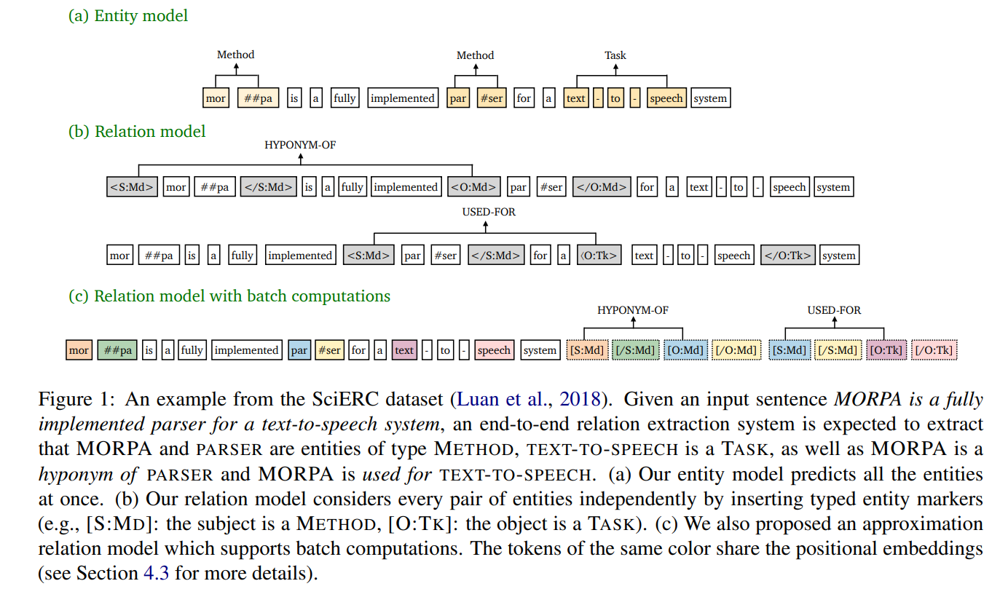

**Named entity recognition命名实体识别**
设 e 表示一组预定义的实体类型。命名实体识别任务是，对于每个 span s i ∈ s，预测一个实体类型 y e (si)∈ e 或 y e (si) = ε 代表 span s i 不是一个实体。任务的输出是 y e = {(si，e) : si ∈ s，e ∈ e }

**Relation extraction**
设 r 表示一组预定义的关系类型。任务是，对于每一对跨 s i ∈ s，sj ∈ s，预测一个关系型 y r (si，sj)∈ r，或者它们之间没有关系: y r (si，sj) = ε。任务的输出是 y r = {(si，sj，r) : si，sj ∈ s，r ∈ r }

---
- 方法由一个实体模型和一个关系模型组成。实体模型首先获取输入句子，并预测每个跨度的实体类型(或 ε)。然后我们在关系模型中独立处理每一对候选实体，通过插入额外的标记来突出主题、对象及其类型
- 首先使用一个预先训练的语言模型(例如，BERT)来获得每个输入标记 x t 的语境化表示。给定一个跨度 si ∈ s，跨度表示 h e (si)定义为:
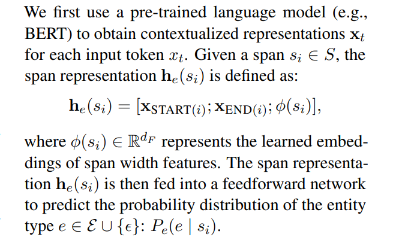

- 关系模型的目的是以一对跨度 s i，s j (一个主语和一个客体)为输入，预测一种关系类型或 ε。以往的方法是使用广度表示法 h e (s i) ，h e (s j)来预测 s i 和 s j 之间的关系。我们假设这些表示只捕获每个独立实体周围的上下文信息，并且可能无法捕获跨度对之间的依赖关系。我们还认为，在不同跨度对之间共享上下文表示可能是次优的
  - 关系模型独立处理每一对跨，并在输入层插入类型标记，以突出主题和对象及其类型。具体地说，给定一个输入句 x 和一对主宾跨度 s i，s j，其中 s i，s j 分别有一类 ei，e j ∈ e ∪{ ε }
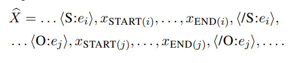
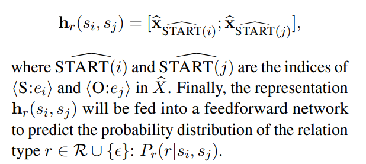

- Cross-sentence context跨句上下文
  - 跨句信息可以用来帮助预测实体类型和关系，特别是代词提及
  - Newciteluan2019general，wadden2019entity 采用了一种传播机制来整合跨句子上下文。Newcitewadden2019实体还增加了一个三句上下文窗口，可以提高性能。我们还评估了在我们的方法中利用跨句上下文的重要性。因为我们期望预先训练好的语言模型能够捕捉长程依赖关系，所以我们简单地通过将句子扩展到一个固定窗口大小为 w 的实体和关系模型来合并跨句子上下文。具体来说，给定一个带有 n 个单词的输入句子，我们分别从左上下文和右上下文增加(w-n)/2个单词的输入

- Training & inference训练和推理
  - 对于实体模型和关系模型，我们使用特定任务损失对两种预训练语言模型进行了微调。我们对两个模型都使用了交叉熵损失

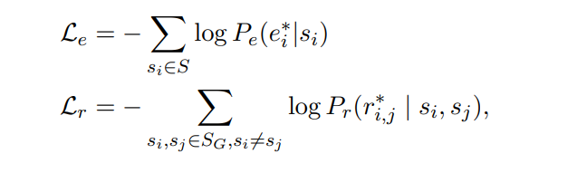

- 不同于 DYGIE + + luan2019general; wadden2019entity 在以下几个方面: (1)我们使用单独的编码器对实体和关系模型，没有任何多任务学习。预测的实体类型直接用于构造关系模型的输入。(2)关系模型中的语境表征通过使用文本标记针对每一对跨度。(3)我们只在输入中加入跨句子的信息，而没有使用任何图形传播层和波束搜索。(4)他们还在框架中加入了共同引用和事件预测

### EFFICIENT BATCH COMPUTATIONS 高效的批量计算
- 缺点是，我们需要为每对实体运行一次关系模型。为了解决这个问题，我们提出了一种新颖有效的关系模型替代方案。关键问题是，我们希望重用同一句子中不同跨度对的计算。这在我们的原始模型中是不可能的，因为我们必须为每一对跨单独插入实体标记。为此，我们提出了一个近似模型，对原有的关系模型做了两个主要的改变
- 不直接在原句中插入实体标记，而是将标记的位置嵌入与相应跨度的开始和结束标记绑定在一起
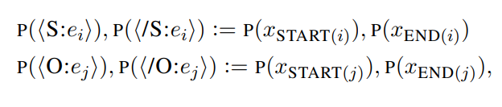
- 其次，我们给注意力层增加了一个约束。我们强制文本标记只关注文本标记，而不关注标记标记，而实体标记标记可以关注所有文本标记和与同一个 span 对关联的所有4个标记标记。这两个修改允许我们重用所有文本标记的计算，因为文本标记的表示独立于实体标记。因此，我们可以在关系模型的一次运行中批处理来自同一句子的多对跨度。在实践中，我们将所有标记添加到句子末尾，以形成批处理一组跨度对的输入(图1(c))。这会导致推理时间的大幅加速和性能的小幅下降(第4.3节)

## EXPERIMENTS 实验
- 数据集
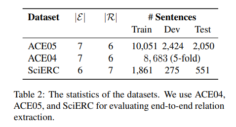
- 评估指标
  - 遵循标准的评价方法，以微量 F1测量作为评价指标。在命名实体识别中，如果预测实体的跨度边界和预测实体类型都是正确的，则认为预测实体是正确的
  - 对于关系抽取，我们采用了两个评价指标: (1)边界评价(Rel) : 如果两个跨度的边界是正确的，预测的关系类型是正确的，那么一个预测的关系被认为是正确的预测; (2)严格评价(Rel +) : 除了边界评价需要什么之外，预测的实体类型也必须是正确的

- 使用上下文窗口大小 w = 300作为实体模型，w = 100作为默认设置中的关系模型，使用跨句子上下文窗口大小 w = 100作为 ALBERT 实体模型，以减少 GPU 的内存使用

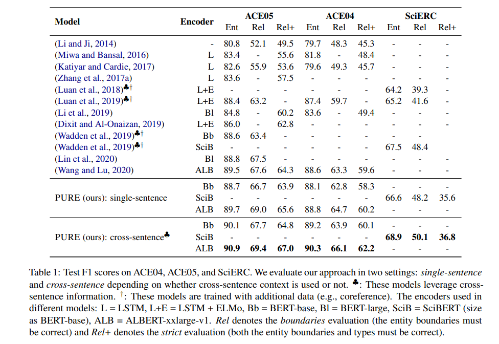

- 近似模型显著地提高了推理过程的效率。注意，我们只在推理时使用这种批处理计算技巧，因为我们观察到使用批处理计算的训练会导致稍微(并且一致)更差的结果。我们假设这是由于批量增加的影响
- 在训练期间，我们仍然修改了位置嵌入和注意力掩码(尽管没有批处理实例)。例如，在单句设置下，我们得到了 ACE05的11.9 × 加速和 SciERC 的8.7 × 加速。通过重复使用大量的计算，我们可以在不到10秒的时间内在一个 GPU 上对 ACE05测试集(2k 个句子)进行预测
- 另一方面，在单句情况下，这种近似只导致性能的小幅度下降，相关的 F1测度在 ACE05和 SciERC 上分别下降了1.0% 和1.2% 。考虑到该近似模型的准确性和有效性，我们期望它在实际应用中能够非常有效

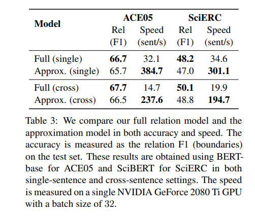

## ANALYSIS 分析
- 不同的输入表示方式会产生明显的差异，使用标记的变体明显优于标准的文本表示方式，这表明了学习不同跨度的不同表示方式的重要性。与文本相比，输入标记显著提高了 F1得分 + 5.0% 和 + 7.4% 的绝对值
- 实体类型在提高关系性能方面很有用，而且实体信息的早期融合特别有效(TypedMarkers vs MarkersEType 和 MarkersELoss)。我们还发现 MarkersEType 的性能甚至比 MarkersEloss 更好，这表明直接使用实体类型作为特征要比使用它们通过辅助损失提供训练信号要好
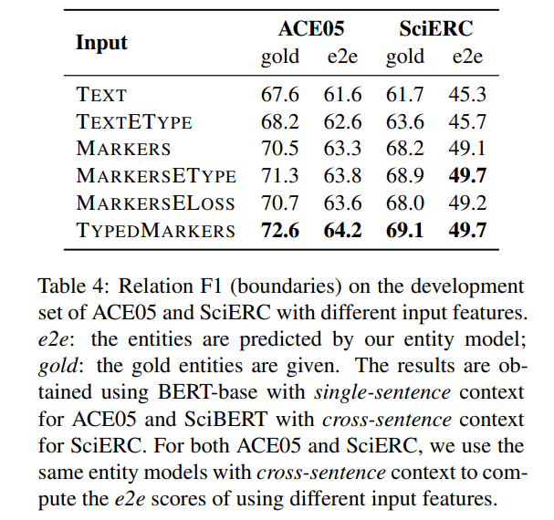

- 联合模型的一个主要论点是，为两个任务之间的相互作用建模可以相互促进
  - 旨在验证在我们的方法中是否存在这种情况。我们首先研究了共享两个编码器是否能够提高性能。我们通过联合优化 l e + l r 来共同训练实体和关系模型(表5)。我们发现，简单地共享编码器损害了实体和关系 F1
  - 还探讨了关系信息是否能够提高实体绩效。为此，我们在实体模型中增加了一个辅助损失，它连接了两个跨度表示以及它们的元素乘法(见第5.1节中的文本变量) ，并预测了两个跨度之间的关系类型(r ∈ r 或 ε)。通过这种辅助关系损失的联合训练，我们观察到在 ACE05开发集上，平均实体 F1在5次运行中有微不足道的改进(< 0.1%)
  - (1)实体信息在预测关系中显然是重要的(5.1节)。然而，我们并没有发现通过共享参数(80.8→81.8 F1)来改进我们的实体模型的关系信息，实际上1010 newcitemiwa2016年底观察到实体 F1略有改进。Newcitewadden2019实体观察到，它们的关系传播层对 SciERC 上的实体 F1略有改善，但对 ACE05的性能有损害。(2)简单地分享编码器并不能为我们的方法带来好处。

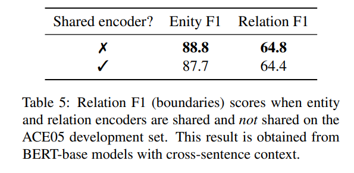

- 减少错误传播
  - 流水线训练的一个缺点是错误传播问题。在我们的最终模型中，我们使用黄金实体(及其类型)来训练推理过程中的关系模型和预测实体，这可能导致训练和测试之间的差异
  - 在培训期间使用预测实体(而不是黄金实体)是否可以缓解这个问题
  - 考虑在训练和测试阶段对关系模型使用更多的跨度对。主要原因是在当前的管道方法中，如果在推理过程中实体模型漏掉了一个黄金实体，那么关系模型将无法预测与该实体相关的任何关系
    - 由实体模型得分的最大跨度。我们探讨了几种不同的编码策略，为关系模型的最高得分跨度: (1)类型标记: 相同于我们的主要模型; (2)非类型标记: 在这种情况下，关系模型不知道一个跨度是一个实体或非类型; (3)未训练的标记与辅助实体损失(e ∈ e 或 ε)
  - 这些变化都没有带来显著的改进，使用非类型化标记尤其糟糕，因为关系模型很难确定一个 span 是否是一个实体
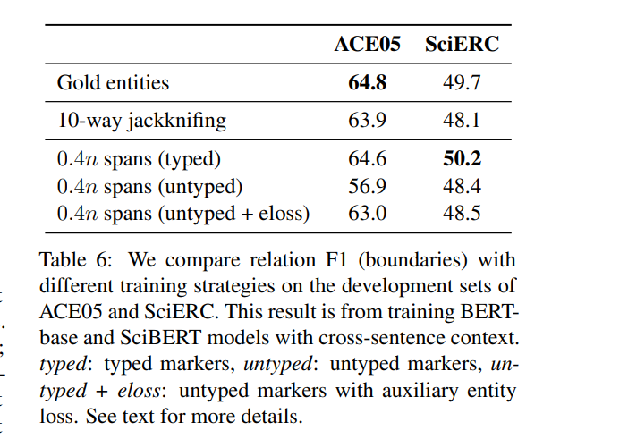

## EFFECT OF CROSS-SENTENCE CONTEXT 跨句语境效应研究
探讨了不同语境大小 w 的影响。我们发现，使用跨句语境可以明显地改善实体和关系 F1。然而，我们发现关系性能从 w = 100到 w = 300并没有进一步提高。在最终的模型中，我们对实体模型使用 w = 300，对关系模型使用 w = 100

