# More Data, More Relations, More Context and More Openness: A Review and Outlook for Relation Extraction

[toc]

- https://arxiv.org/abs/2004.03186

### ABSTRACT
回顾了现有的关系抽取方法，分析了当今我们面临的主要挑战，并展示了朝着更强大的关系抽取的发展方向

### 1 INTRODUCTION
- 关系事实以三元组格式组织世界知识。这些结构化的事实充当人类知识的重要角色，并在文本中显式或隐式隐藏
  - (Apple Inc., founded by, Steve Jobs)
- 在识别文本中的实体提及（mentions 例如美国和纽约）之后，RE的主要目标是对关系进行分类（例如包含）
- 方法
  - 统计方法
    - 模式挖掘
    - 基于特征的方法
    - 图模型
  - 神经模型

- 大多数方法仍在简化的环境中工作
    - 一个句子中到预先定义的关系
    - 复杂场景
      - 收集高质量的人类注释既昂贵又耗时
      - 许多长尾关系无法提供大量的训练示例
      - 大多数事实由包含多个句子的较长上下文表示
      - 很难使用预定义的集合来覆盖那些与开放式增长有关的关系

- 更好的RE能力的可行方法
  - 利用更多数据
  - 进行更有效的学习
  - 处理更复杂的上下文
  - 面向更多开放域

### 2 BACKGROUND AND EXISTING WORK
- 信息提取（IE）旨在从非结构化文本中提取结构信息
- 完整的关系提取系统包括：一个命名实体识别器，用于从文本中识别命名实体（例如，人，组织，位置）；一个实体链接器，用于将实体链接到现有知识图（KG，在使用关系提取进行知识图完成时是必需的） ，以及用于根据给定上下文确定实体之间关系的关系分类器
- 识别关系是最关键和最困难的任务，因为它需要模型来很好地理解上下文的语义

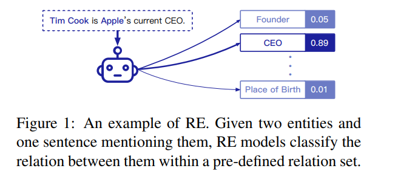

#### 2.1 PATTERN EXTRACTION MODELS
- 使用句子分析工具来识别文本中的句法元素，然后根据这些元素自动构建模式规则
- 自动构建的模式可能会出错，因此上述大多数方法都需要由专家进行进一步检查，这是基于模式的模型的主要局限性

#### 2.2 STATISTICAL RELATION EXTRACTION MODELS
- 基于特征的方法
  - 为实体对及其对应的上下文设计词汇，句法和语义特征，然后将这些特征输入到关系分类器中
    - 基于SVM核的方法
    - 其他一些统计方法，着重于提取和推断隐藏在文本中的潜在信息
    - 有向无环图的形式联合抽象实体，文本和关系之间的依赖关系，然后使用推理模型来识别正确的关系
    - 嵌入模型: 将文本编码为低维语义空间, 文本嵌入中提取关系

#### 2.3 NEURAL RELATION EXTRACTION MODELS
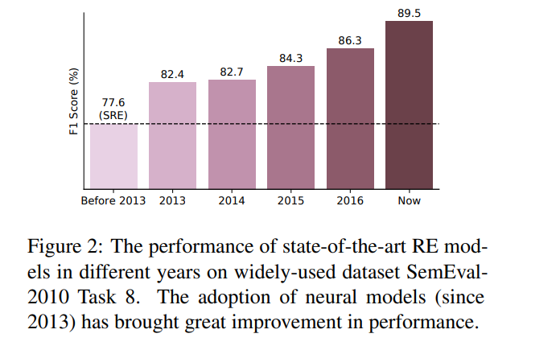
- NRE的研究主要集中在设计和利用各种网络体系结构来捕获文本内的关系语义
- NRE主要利用单词嵌入和位置嵌入代替输入的手工特征
  - 除了单词嵌入和位置嵌入，还有其他将语法信息集成到NRE模型中的工作
  

### 3“MORE” DIRECTIONS FOR RE
- 这些模型中的大多数都利用大量的人类标注，并且仅旨在提取单个句子中的预定义关系

#### 3.1 UTILIZING MORE DATA
- 使用远程监管（DS）假设通过将现有KG与纯文本对齐来自动标记数据
    - DS提供了一种利用更多数据的可行方法，但是这种自动标记机制不可避免地会伴随着错误的标记问题

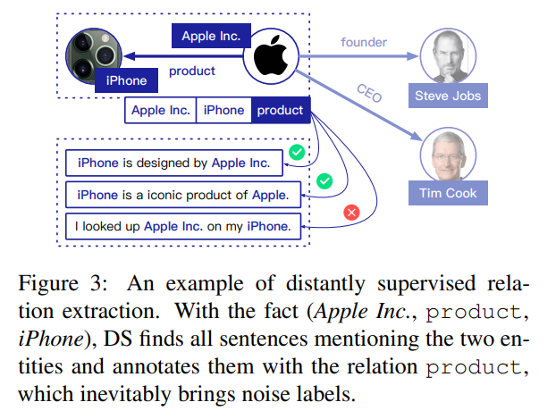

- 减轻噪声问题的现有方法
  - 采用多实例学习，即将具有相同实体对的句子组合在一起，然后从中选择信息量大的实例
  - 将额外的上下文信息用于去噪DS数据的方法
    - 将KG作为外部信息来指导实例选择
    - 采用多语言语料库来实现信息的一致性和互补性
  - 利用复杂的机制和训练策略来增强远程监督的NRE模型
    - 构建混合框架
    - 软标签方案

- 研究人员已经达成共识，利用更多数据是建立更强大的RE模型的潜在途径
  - 现有的DS方法着重于对自动标记的实例进行去噪
    - 为了获得更好的覆盖范围和更少的噪声，探索更好的DS方案来自动标记数据也很有价值
  - 面向RE的匹配和主动学习可以进行无监督或半监督学习，以利用大规模未标记数据以及KG的知识并在循环中引入人类专家

- 构造Wiki-Distant
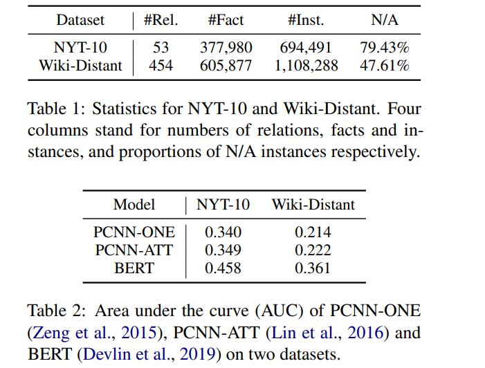

#### 3.2 PERFORMING MORE EFFICIENT LEARNING
- 现实世界中的关系分布是长尾的：只有公共关系才能获得足够的训练实例，大多数关系具有非常有限的关系事实和相应的句子
- 建立了一个大规模的Few-shot关系提取数据集（FewRel）
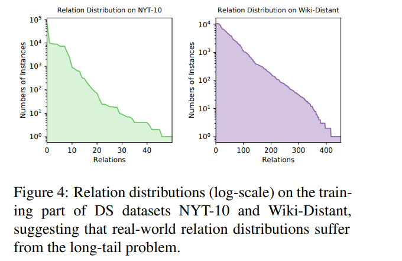
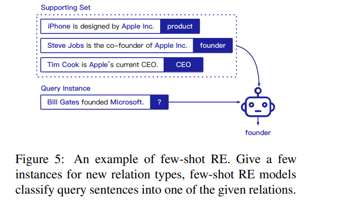

- Few-shot
  - 总体思想是训练实例的良好表示或从现有的大规模数据中学习快速适应的方法，然后转移到新任务上
  - 1. 度量学习通过将现有数据与训练示例进行比较来学习现有数据的语义度量并将查询分类
  - 2. 元学习，也称为“学习学习”，旨在通过在元训练数据上获得的经验来掌握参数初始化和优化的方式

- 两个值得进一步研究的问题
    - Few-shot domain adaptation研究了few shot模型如何跨域转移
    - Few-shot none-of-the-above detection : 检测不属于任何采样N关系的查询实例
      - 大多数句子与我们感兴趣的关系无关。由于难以形成非以上关系（NOTA）的关系，传统的One-shot模型无法很好地处理此问题
    - 评估协议可能会高估我们在Few-shot的RE上取得的进展
      - 关系的数量通常很少（5或10），并且很有可能对N个不同的关系进行采样，从而简化为非常简单的分类任务

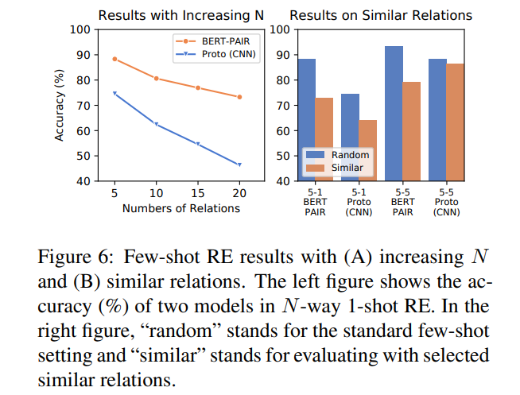
- 评估了N增加时的One-shot模型，而关联数越大，性能急剧下降, 考虑到实际案例中包含的关系更多，这表明现有模型仍远远没有应用
- 代替随机采样N个关系，我们手动选择5个语义相似的关系，并评估它们的Few-shot RE模型
- 表明现有的少量模型可能过度适合关系之间的简单文本提示，而不是真正理解上下文的语义

#### 3.3 HANDLING MORE COMPLICATED CONTEXT
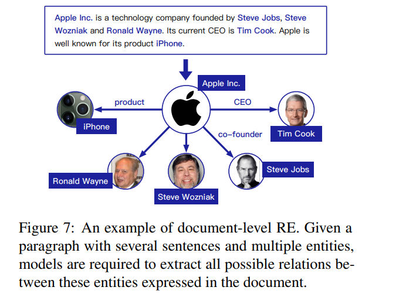
- 许多表现出复杂的跨句关系的实体

- 已经提出了一些建议来提取多个句子之间的关系
  - 语法方法: 依赖于从各种句法结构中提取的文本特征（例如，共指注释，依存关系分析树和语篇关系）来连接文档中的句子
  - 构建了句子间实体图，该图可以利用实体之间的多跳路径来推断正确的关系
  - 图结构神经网络来建模跨句依赖关系以进行关系提取，从而引入记忆和推理能力

- 已经提出了一些文档级的RE数据集
  - quirk2017distant
  - peng2017nary
  - yao2019docred

- 值得进一步研究的方向
  - 从复杂的上下文中提取关系是一项艰巨的任务，需要阅读，记忆和推理才能发现多个句子中的相关事实
  - 还需要探索更多形式的上下文，例如跨文档提取关系事实，或基于异构数据理解关系信息
  - 利用搜索引擎获取外部信息，自动搜索和分析RE的上下文，可以帮助RE模型更广泛地识别关系事实

#### 3.4 ORIENTING MORE OPEN DOMAINS
- 处理开放关系方面已经进行了一些探索：
  - 开放信息提取（Open IE）
  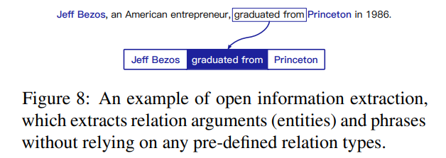
  - 关系发现: 旨在从无监督的数据中发现看不见的关系类型
  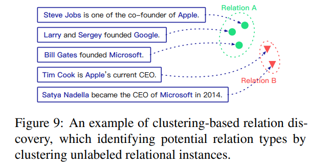
    - 使用生成模型，并将这些关系视为潜在变量
    - 聚类任务

- 未解决的研究问题
  - 在Open IE中规范化关系短语和参数对于下游任务至关重要
  - 未解决不适用（N / A）关系
    - 通常假定该句子始终表示两个实体之间的关系

### 4 OTHER CHALLENGES

#### 4.1 LEARNING FROM TEXT OR NAMES
- 实体名称及其上下文均提供了有用的分类信息
  - 实体名称提供了类型信息，并有助于缩小可能的关系范围
  - 在训练过程中，也可以形成实体嵌入来帮助进行关系分类
  - 通常可以从实体对周围的文本语义中提取关系
  - 在某些情况下，只能通过对上下文进行推理来隐式推断关系

- 设计了三种不同的设置
  - 名称和文本均作为输入
  - 实体名称被特殊令牌替换
  - 仅提供两个实体的名称

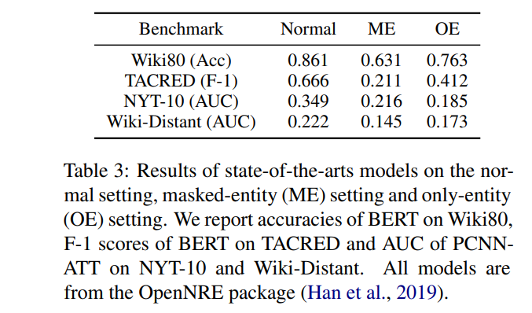
- 与正常设置相比，模型的ME和OE设置均遭受巨大的性能下降
- 仅使用实体名称会优于仅使用带有被屏蔽实体的文本
  - 实体名称和文本都为RE提供了关键信息
  - 对于现有的最新模型和基准，实体名称的贡献更大
- 与人类的直觉相反：我们主要根据文本描述对给定实体之间的关系进行分类，而模型则从其名称中学习更多

#### 4.2 RE DATASETS TOWARDS SPECIAL INTERESTS
- 很多数据集可以使RE研究受益

### 5 CONCLUSION
- 略
