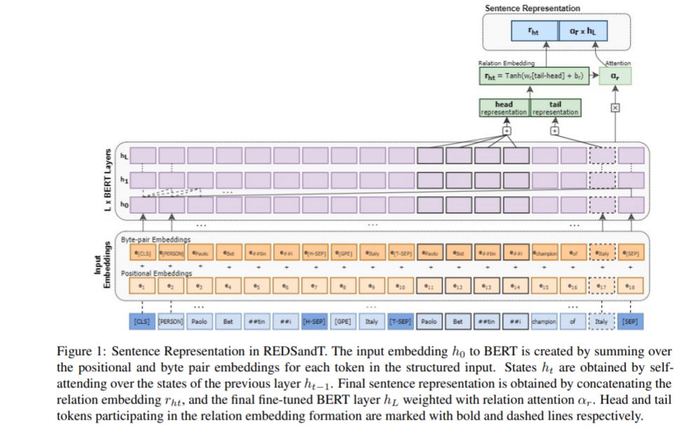

<!-- TOC -->

- [Improving Distantly-Supervised Relation Extraction through BERT-based Label & Instance Embeddings](#improving-distantly-supervised-relation-extraction-through-bert-based-label--instance-embeddings)
  - [摘要](#摘要)
  - [引言](#引言)
  - [REDSANDT](#redsandt)
    - [句子编码器](#句子编码器)
      - [Input Representation](#input-representation)
      - [Input Embeddings](#input-embeddings)
      - [Sentence Representation](#sentence-representation)

<!-- /TOC -->
# Improving Distantly-Supervised Relation Extraction through BERT-based Label & Instance Embeddings
- 基于 bert 标记和实例嵌入的远监督关系抽取
- https://arxiv.org/pdf/2102.01156.pdf

## 摘要
- 远监督关系抽取(RE)是一种有效的大规模语料库关系抽取方法，但存在标签噪声。现有的方法试图通过多实例学习和提供额外的信息来缓解噪声，但主要是识别最常见的关系，而忽略了长尾关系

## 引言
- 关系抽取(Relation Extraction，RE)是在自然文本中检测实体对之间的语义关系的一种方法，在自然语言处理(natural language processing，NLP)中有着广泛的应用，包括问题回答和知识库(knowledge-base，KB)
- 为了自动构建面向 RE 的数据集，Mintz 等人(2009)建议使用来自知识库的远程监控(DS) ，假设如果两个实体在知识库中表现出一种关系，那么所有提到这些实体的句子都表达了这种关系
- 为了缓解错误的标签问题，Riedel 等人(2010- 年)放松了这一假设，使其不能适用于所有情况，并与 Hoffmann 等人(2011年) ; Surdeanu 等人(2012年)提出了基于多实例的学习。在这种设置下，分类从实例级转移到袋级，使用一个包含包含特定实体对的所有实例的袋级。

- 过对上述方法的研究，我们得出了以下结果。首先，在文献中使用的所有模型中，使用经过训练的基于 transformer 的语言模型(LM)可以帮助识别更广泛的关系集，即使这样做会耗费时间和计算资源; 其次，标签与实体之间的关系可以包含有价值的信息，但很少用于外部知识。基于这些观察结果，我们开发了一种新的基于 transformer 的模型，它能够在较少的复杂性有效地捕获实例并标记嵌入，从而驱动 RE 识别更广泛的关系集。

## REDSANDT
- 给定一包句子{ s 1，s 2，... s n }关注一个特定的实体对，REDSandT 生成一个关于可能关系集的概率分布。REDSandT 利用 BERT 预先训练的 LM 通过传递预先训练的常识知识来捕捉句子的语义和句法特征。我们扩展了 BERT 模型来处理多实例学习，并对模型进行了微调，以便对给定相关句子的实体对之间的关系进行分类

### 句子编码器
- 给定一个句子 x 和一个实体对 < h,t >，REDSandT 通过串联关系和实例嵌入构造一个句子的分布式表示。整个句子编码如图1所示，以下部分以自底向上的方式检查了句子编码器部分。

- [cls] h [h-sep] t [t-sep] sentence [sep]

#### Input Representation
- 关系抽取需要一个结构化的输入，它能够充分捕获实体对与其周围文本之间的潜在关系。我们的输入表示将每个句子编码为一系列标记
  - 首先是头部实体类型和令牌，然后是分隔符[ H-SEP ] ，接着是尾部实体类型，令牌后面跟着分隔符[ T-SEP ] ，最后是句子 STP 路径的令牌序列。整个输入分别以特殊的分隔符[ CLS ]和[ SEP ]开始和结束。在 BERT 中，[ CLS ]通常充当代表下游任务(如 RE)的整个序列的合用令牌

- Sub-tree parse of input sentence
- Entity Type special tokens

#### Input Embeddings
- Byte-pair tokens encoding
  - 特别使用来自预先训练模型(30,000令牌)的标记器，我们用20个任务特定的令牌(例如，[ H-SEP ] ，[ T-SEP ]和18个实体类型令牌)扩展它
- Positional encoding

#### Sentence Representation

