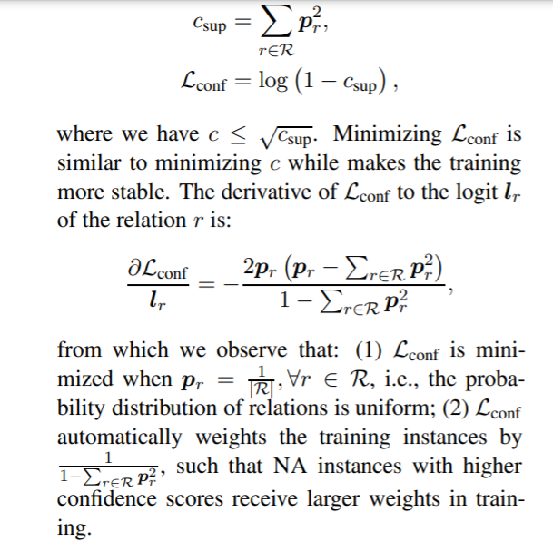

<!-- TOC -->

- [An Improved Baseline for Sentence-level Relation Extraction](#an-improved-baseline-for-sentence-level-relation-extraction)
  - [ABSTRACT](#abstract)
  - [1 INTRODUCTION 引言](#1-introduction-引言)
  - [2 MODEL FOR RELATION EXTRACTION 关系抽取模型](#2-model-for-relation-extraction-关系抽取模型)
    - [2.1 PROBLEM DEFINITION 问题定义](#21-problem-definition-问题定义)
    - [2.2 MODEL ARCHITECTURE 模型架构](#22-model-architecture-模型架构)
    - [2.3 ENTITY REPRESENTATION 实体表示](#23-entity-representation-实体表示)
    - [2.4 INFERENCE ON UNSEEN ENTITIES 关于不可见实体的推断](#24-inference-on-unseen-entities-关于不可见实体的推断)
  - [3 CONFIDENCE-BASED CLASSIFICATION 基于可信度的分类](#3-confidence-based-classification-基于可信度的分类)
  - [4 EXPERIMENTS 实验](#4-experiments-实验)
    - [4.1 DATASETS 数据集](#41-datasets-数据集)
    - [4.2 EXPERIMENTAL SETTINGS 实验设置](#42-experimental-settings-实验设置)
    - [4.3 RESULTS 结果](#43-results-结果)

<!-- /TOC -->
# An Improved Baseline for Sentence-level Relation Extraction
- https://arxiv.org/abs/2102.01373

## ABSTRACT
- 回顾了两个未被深入研究的 RE 模型，即实体表示和 NA 实例预测。我们改进的基线模型，结合实体表示与类型标记和增强 NA 实例检测的基于可信度的分类，在 TACRED 上实现了75.0% 的 f1，明显优于以前的 SOTA 方法

## 1 INTRODUCTION 引言
- 在本文中，我们重新审视了现有的方法，并定位了前面工作中被忽略的两个方面。首先，关系实例包含实体信息的几个方面，包括实体名称、跨度和类型，而现有方法并不能在输入中捕获所有这些信息。此外，由于预定义本体的不可避免的局限性，部分关系实例自然不满足本体中任何已知关系，被标记为 NA。这样的 Na 实例在实践中可能具有不同的语义，而现有的方法通常将它们建模为单个 NA 类，并试图将它们分组到同一个集群中。为此，我们针对上述问题提出了一个改进的句子级 RE 基线，并结合了相应的技术
- 我们介绍了类型化实体标记 Zhong 和 Chen (2020) ，它比现有的实体表示技术有望提高性能。此外，我们使用基于置信度的分类方法对 NA 实例进行建模。我们让模型输出一个关系是否存在的置信度得分，并且在得分低于阈值时返回 NA，而不是将它们分组到同一个聚类中
- 我们改进的基准线在 TACRED 数据集上达到了75.0% 的 f 1，超过了 SOTA 2.3% 。我们还证明了基于置信度的分类对于 SemEval-2010任务8数据集 hendrickson 等(2019)是有效的

## 2 MODEL FOR RELATION EXTRACTION 关系抽取模型

### 2.1 PROBLEM DEFINITION 问题定义
- 给定一个句子 x 和一个实体对(es，eo) ，句子级 RE 的任务是从 R ∪{ NA }预测 e s 和 e o 之间的关系，其中 R 是一组预定义的利益关系集，e s，e o 分别被认为是主体和客体实体。不表达 R 关系的实体对被标记为 NA

### 2.2 MODEL ARCHITECTURE 模型架构
- 给定输入句子 x，我们首先在第2.3节中使用技术标记实体跨度和实体类型，然后将处理后的句子输入预先训练的语言模型以获得上下文嵌入。最后，我们在语言模型的最后一层，也就是 h subj 和 h obj，取主体和对象实体的第一个隐藏状态作为分类器的输入

### 2.3 ENTITY REPRESENTATION 实体表示
- 对于句子级别的 RE，提供了实体的范围和类型，并且需要在输入中表示
- Zhong 和 Chen (2020年)表明，这两种类型的信息提高了 RE 分类器的性能
- 以下几种表征方法
  - Entity mask: 特殊的[ SUBJ-NER ]或[ OBJ-NER ]标记来替换原句中的主语或宾语实体
  - Entity marker: 引入了特殊的标记[ E1] ，[/E1] ，[ E2] ，[/E2]来表示实体跨度，并将句子修改为“[ E1] subj [/E1] ... [ E2] obj [/E2]”
  - Entity marker (punct) : 实体标记的变体，通过修改原句“@subj@... # obj #”来标记实体的跨度
  - Typed entity marker:  “⟨S:NER⟩ subj ⟨/S:NER⟩ … ⟨O:NER⟩ obj ⟨/O:NER⟩”, where NER is the corresponding entity type
  - Typed entity marker (punct) : 分别用“@”和“ #”附上主体和客体实体。我们还使用普通文本来表示主语和宾语实体类型，这些文本在实体跨度前加上前缀，用“ *”表示主语，用“∧”表示宾语。修改后的句子是“@* subj-ner * subj@... # ∧ obj-ner ∧ obj #”

- 这些表示技术在输入中嵌入不同数量的实体信息。类型化实体标记(original and punct)表示所有实体信息，包括实体名称、实体跨度和实体类型，而实体标记(original and punct)和实体掩码分别忽略实体类型和实体名称

- (1)类型化实体标记(原始标记和终结标记)的表现明显优于其他标记。特别是，RoBERTa 模型使用类型化实体标记(punct)获得了74.5% 的 f1评分，明显高于 SOTA 的72.7% Yamada 等人(2020)。结果表明，所有类型的实体信息都有助于 RE 任务的完成。
- (2)引入特殊令牌会降低 RoBERTa 的模型性能。实体标记的性能比实体标记差0.7% ，实体标记的性能比实体标记差3.5% ，实体掩码的性能比实体标记差60.9% 

### 2.4 INFERENCE ON UNSEEN ENTITIES 关于不可见实体的推断
- 以前的一些工作 Zhang 等人(2018)声称，实体名称可能泄露关系类型的表面线索，导致启发式破解基准测试。实验结果表明，神经元 RE 分类器只需输入主客体实体，而不需要原句，就可以获得较高的评价结果。他们还建议，RE 分类器训练没有实体 MASK 可能不泛化到看不见的实体。然而，由于 RE 数据集中提供的实体类型通常是粗粒度的，使用实体掩码可能会导致实体信息的丢失。使用实体 MASK 也与现有的注入实体知识到 RE 分类器方法矛盾。如果 RE 分类器不考虑实体名称，则外部知识库不能对其进行改进。

- 为了评估我们的 RE 分类器是否可以泛化到看不见的实体，我们提出了一个过滤的评估设置。具体来说，我们从训练集中删除了所有包含实体的测试实例，从而得到了一个经过过滤的测试集，该测试集包含4,599个实例，这些实例只包含在训练期间没有看到的实体
- 尽管如此，类型化实体标记始终优于实体掩码，这表明，RE 分类器可以学习实体名称，并泛化到看不见的实体。我们的发现与 Peng 等人(2020)的结论是一致的，这表明实体的提及可以比实体类型提供更多的信息，从而改进 RE 分类器

## 3 CONFIDENCE-BASED CLASSIFICATION 基于可信度的分类
- NA 实例没有标记任何来自 r 的关系，在实践中通常构成了数据的很大一部分。在 TACRED 数据集中，78.7% 的实例被标记为 NA
- 前人的方法 Zhang et al. (2017) ; Baldini Soares et al. (2019)通常使用分类器中的一个附加类来对 NA 实例建模，并预测当 p (r = NA) > p (r = r ′) ，r ′∈ r 时，关系为 NA。在训练过程中，将 NA 实例的表示形式推广到类似于 Wna。然而，由于 NA 对应于一个具有无限数量的多种语义，它可能不是由一个类来建模的

---
- 基于置信度分类的 NA 实例识别方法，其中，如果关系成立，分类器输出足够高的置信度分值，如果分值低于阈值，则返回 NA
- 分类器需要识别和拒绝来自未见类的实例。具体来说，我们的分类器取一个句子 x，计算类概率 $p ∈ R ^ {| R |}$ ，并返回置信得分 $c = max_{r\in R} P_r$，这是关系的最大概率。在推理中，一个实例被预测为 NA，如果 c < θ，其中 θ 是根据开发集调整的置信阈值

- 为了确保我们的方法正确地发挥作用，我们有两个期望
  - (1) NA 实例应该有较低的自信分数，
  - (2) 其他实例应该有较高的自信分数。后者的期望已经被交叉熵损失所满足。对于前者，由于最大概率对应的关系可能不断变化，直接最小化置信度会导致非效率优化。因此，我们建议最小化 NA 实例的置信度替代值

## 4 EXPERIMENTS 实验
### 4.1 DATASETS 数据集
- TACRED 和 SemEval 2010 Task 8

### 4.2 EXPERIMENTAL SETTINGS 实验设置
- 超参数遵循 Baldini Soares 等人(2019年)。具体来说，我们的模型是使用 Adam Kingma 和 Ba (2015)使用3 e-5的学习率进行优化的，对前6% 的步骤进行线性热身 Goyal 等人(2017) ，然后线性衰减到0。我们使用的批量大小为64。我们对 TACRED 模型进行了5个epoch的微调，对 seeval 模型进行了10个epoch的微调

### 4.3 RESULTS 结果

- 类型化实体标记和基于可信度的分类缩写为 TEB 和 CBC
  - CBC 在所有数据集上持续提高 f1 0.3-0.6%

