# Generalization through Memorization: Nearest Neighbor Language Models
[toc]

- https://arxiv.org/abs/1911.00172
- facebook

### ABSTRACT
- 预训练语言模型中直接集成KNN
- ppl有2.9的提升到15.79

### 1 INTRODUCTION
- LM解决两个问题
    - 将前文映射为固定长度的表示
    - 通过该表示来预测下一个词语
- 模型假设来与表示学习问题可以比预测问题更容易解决
    - 两个句子后面预测的词语分布应该一样，就算不知道分布也能了解这一点约束
        -  Dickens is the author of ； Dickens wrote
- 证明在简单的KNN框架中使用前文表示能够在第一个问题上更好

### 2 NEAREST NEIGHBOR LANGUAGE MODELING
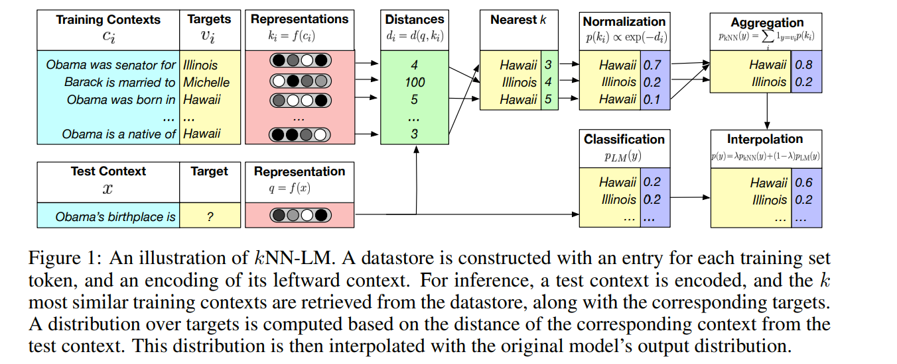
语言模型是预测 $$p(w_t|(w_1, ... w_{t-1}))$$

Datastore
: 使用KV保存上文向量与下一个词的对应关系(有可能相同上文对应不同词？？)

Inference
: 实验中使用 squared L2 distance，相似性函数为RBF kernel
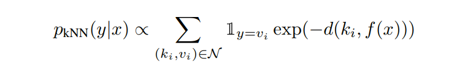
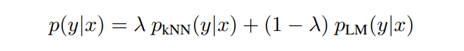

Implementation
: 向量检索使用 FAISS
实验中发现 L2 distance比inner product distance性能更好

Related Cache Models
:  (Grave et al., 2017c; Merity et al., 2017) 使用过类似方法来进行词语的复制

### 3 EXPERIMENTAL SETUP
Data
: WIKITEXT-103, 250K word-level vocabulary,  103M tokens of Wikipedia

Model Architecture
: decoder-only Transformers (Vaswani et al., 2017)

Evaluation
: perplexity (exponentiated negative log-likelihood) on held out data

kNN-LM
:  1024-dimensional representations fed to the feedforward network in the final layer of the Transformer LM

Computational Cost
: 遍历语料，以及Faiss相关的操作

### 4 EXPERIMENTS
#### 4.1 USING THE TRAINING DATA AS THE DATASTORE
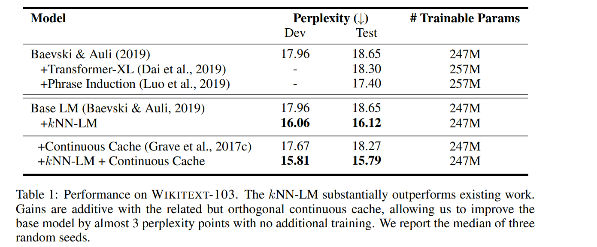
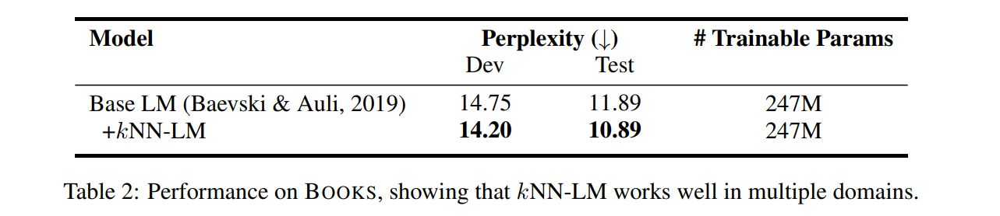

#### 4.2 MORE DATA WITHOUT TRAINING
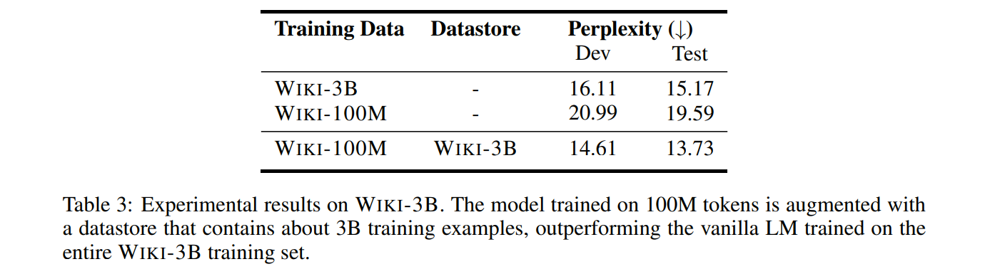
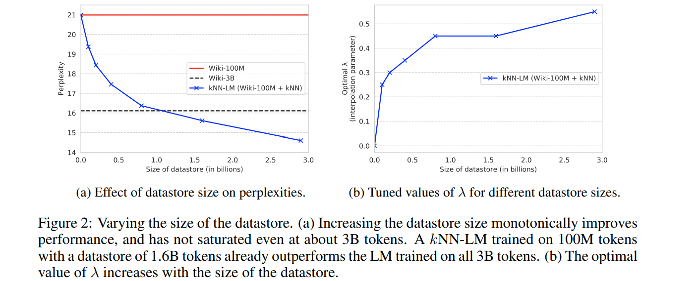

#### 4.3 DOMAIN ADAPTATION
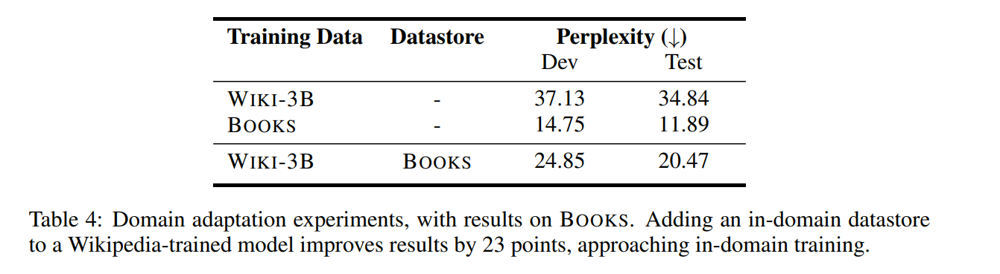

### 5 TUNING NEAREST NEIGHBOR SEARCH
Key Function
: 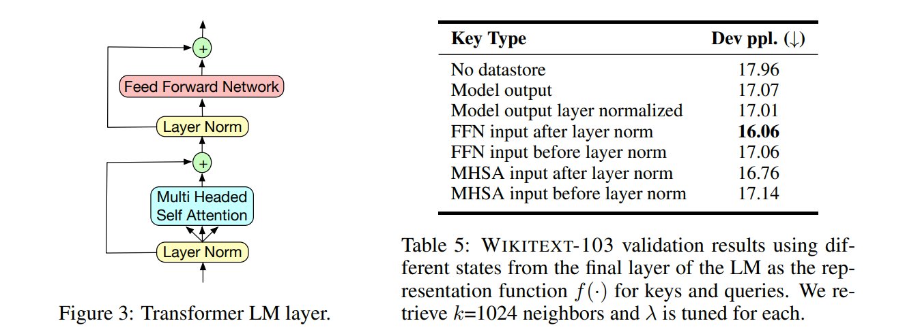
向量不同选择点与结果的关系

Number of Neighbors per Query  &  Interpolation Parameter
: 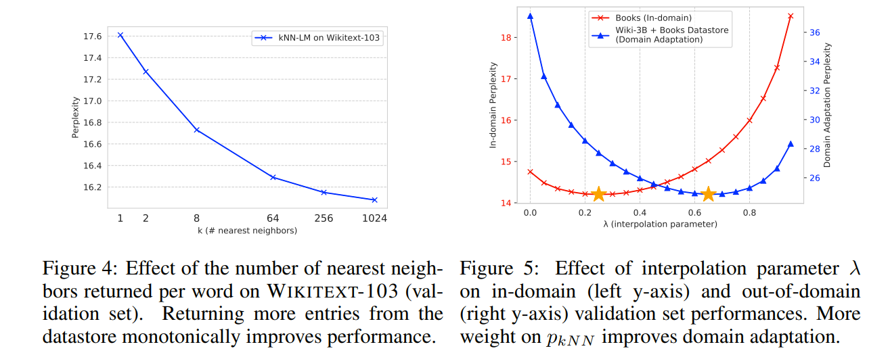
(k = 8)
λ = 0.65:  domain adaptation
λ = 0.25： WIKITEXT-103

### 6 ANALYSIS
Qualitative Analysis
: 样例分析
factual knowledge, names, and near-duplicate sentences from the training set
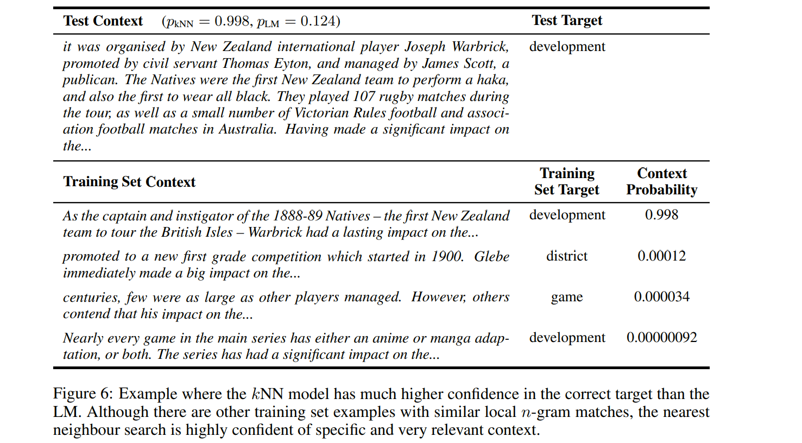

Simple vs Neural Representation
: n-grams也有类似knn-lm的效果，是否可以进行替换呢
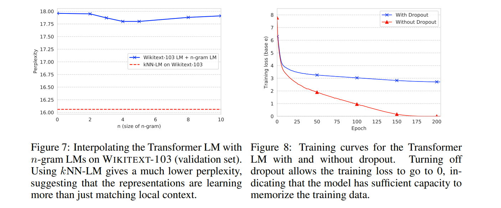

Implicit vs Explicit Memory
: Tranform有足够的能力去记忆整个训练集
如果使用一个正常的LM以及一个过拟合完全记忆的LM进行测试，其只有0.1的提升，说明knn-LM在记忆的时候也有提高泛化性
总结
: - Tranform-LM能很好地学习表示上文并显式用以相似度计算
: - 当Transform-LM用以记忆整个训练集时其表示的泛化性不足
: - knn-lm允许使用有效的相似性计算函数来记忆训练集

### 7 RELATED WORK
略

### 8 CONCLUSION AND FUTURE WORK
略
