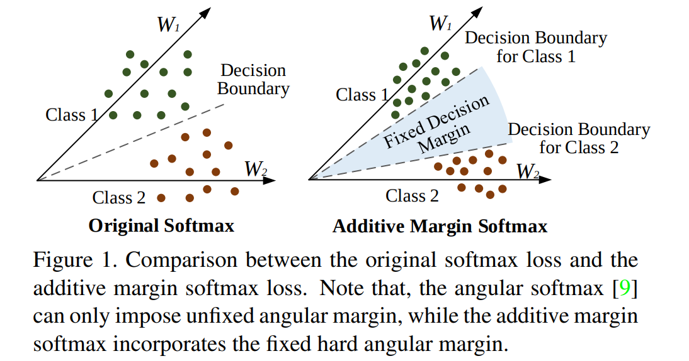
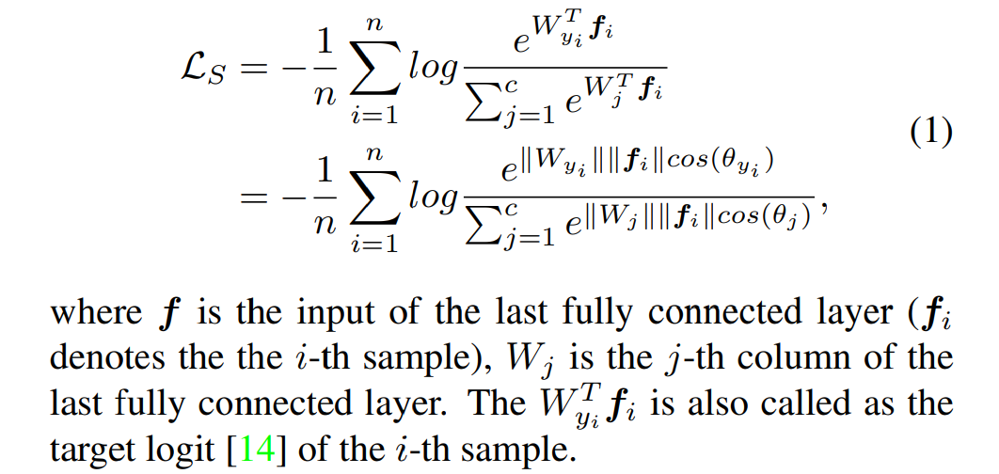
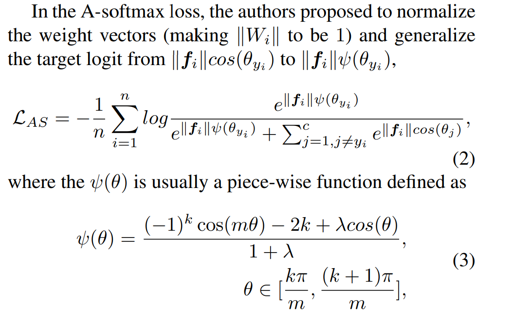
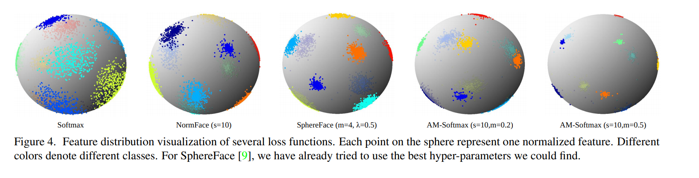
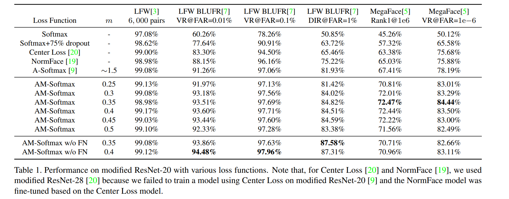
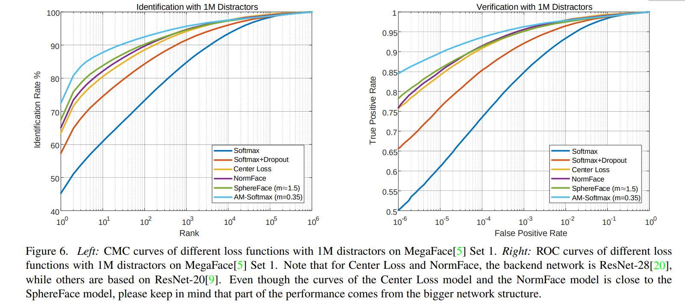

# AMSoftmax: Additive Margin Softmax for Face Verification
[toc]

- https://arxiv.org/pdf/1801.05599.pdf

### Abstract
- 提出概念简单且几何上可解释的目标函数AM-Softmax，用于深度人脸验证
- 人脸验证可以看作度量学习问题，因此学习较大间隔的人脸特征，其类内差异小，类间差异大，对于获得良好的性能有重要意义
- 特征归一化的优点

### 1. Introduction
- 大多人脸验证模型均是建立在深卷积神经网络的基础上，并由分类损失函数、度量学习损失函数或两者共同监督
- contrastive loss或triplet loss等度量学习损失函数通常需要精心设计样本挖掘策略，而最终的性能对这些策略非常敏感，因此越来越多的研究者将注意力转移到基于改进的分类损失函数来构建人脸验证模型

- SoftMax loss通常擅长优化类间差异（分离不同的类），但不擅长减少类内差异（使同一类的特性紧凑）。为了解决这一问题，提出了许多新的损失函数来最小化类内差异，如A-softmax
- AM-softmax将角度间隔引入到softmax loss中。我们通过cosθ−m制定了一个额外的间隔，它比A-softmax简单，并且产生更好的性能。m乘以目标角$θ_{y_i}$ ，所以这种类型的边界以乘法的方式合并。由于间隔是从cosθ减去的一个标量，称之为损失函数加性间隔SoftMax（AM-SoftMax）

### 2. Preliminaries
##### Softmax
Softmax为矩阵中真实类的单列与最后层的输入之间的点积

##### A-Softmax

- 提出了归一化权重向量（使||W_i||==1），并将目标的逻辑推理从$cos(θ_{y_i})改为ψ(θyi)$
-  m通常是一个大于1的整数，而λ是一个超参数，用于控制推动分类边界的难易程度
-  训练过程中，将λ从1000退火到一个较小的值，使每个类别的角度间隔变得越来越紧凑。在他们的实验中，他们将λ的最小值设为5，m=4，这近似等于m=1.5

### 3. Additive Margin Softmax
##### 3.1. Definition
$$ψ(θ) = cosθ − m$$
- 定义更加简单和直观。在实现过程中，将特征和权重归一化后的输入实际上是x=cosθyi ，所以在正向传播中，只需要计算 x - m
- 不需要计算反向传播的梯度，因为Ψ′(x)=1。与SphereFace相比，它更容易实现
- 由于使用cosine作为相似度，因此将特征归一化和权重归一化同时应用到内积层以构建一个cosine层。然后使用超参数s缩放余弦值

- 假设Wi 和f的范数如果没有指定，则归一化为1。在[19]中作者建议通过反向传播来学习缩放因子s。然而，在将间隔引入损失函数后，我们发现如果让我们学习的话，S不会增加而且网络收敛很慢，因此我们将S定为一个足够大的值，例如30，以加速和稳定优化。
- 将特征和权重归一化，不将缩放参数作为超参数进行训练，将其设为固定值比如30

##### 3.2. Discussion

- AM-Softmax 方案在超球面上有清晰的几何解释
- 经过归一化后，特征在一个圆上，传统的Softmax loss 的决策边界表示为向量P0。在这种情况下，在决策边界处有WT1P0=WT2P0
- AM-softmax，边界变成一个边缘区域而不是一个向量, 新边界P1 处，我们得到$W_1^TP_1-m=W_2^TP1$,  $m=cos(θ_{{W_1}, P_1}) - cos(\theta_{{W_1,P_2}}) $，这是类别1边缘区域两侧的余弦分数的差
 
 - 修正的SoftMax loss函数是优化余弦相似性，而不是角度。使用传统的SoftMax损失，这可能不是问题，因为决策边界在这两种形式中是相同的（cosθ1=cosθ2⇒θ1=θ2）。然而，当试图推动边界时，将面临一个问题，即这两个相似度（距离）具有不同的密度。当角接近0或π时，余弦值更密集。如果想优化角度，在得到内积$W^Tf$f的值之后，可能需要进行arccos运算。它的计算成本可能更高
 - 一般来说，角度间隔在概念上比余弦间隔好，但考虑到计算成本，余弦间隔更具吸引力，因为它可以用较好的计算成本的实现相同的目标

- 应该何时添加特征归一化？
- 取决于图像质量, 特征范数与图像质量高度相关,  因此，经过归一化后，与具有较大范数的特征相比，具有较小范数的特征将获得更大的梯度。通过反向传播，网络将更多地关注低质量的人脸图像，这些图像通常具有较小的范数。其效果与硬样品采样非常相似。特征归一化的优点也在中出现过。综上所述，特征归一化最适用于图像质量很低的任务

- 可视化的3D特征很好地表明，AM-SoftMax可以在不调整过多超参数的情况下为特征带来较大的间隔属性

### 4. Experiment
##### 4.1. Implementation Details

##### 4.2. Dataset Overlap Removal
- 删除了训练数据集（CASIA-Webface）和测试数据集（LFW and MegaFace）之间的重叠的身份图像

##### 4.3. Effect of Hyper-parameter m

- 特征归一化在Megaface等低质量图像上表现得更好，使用原始特征归一化在LFW等高质量图像上表现得更好

### 5. Conclusion and Future Work
略
