# Simple and Effective Text Matching with Richer Alignment Features
[toc]

- https://arxiv.org/pdf/1908.00300.pdf

### Abstract
- 快速，高性能
- 保持三个用于序列间对齐的关键特性:原始点对齐特性、先前对齐特性和上下文特性，同时简化所有剩余组件
- 模型性能与最先进的模型相当，并且使用的参数更少，除此之外，在推理速度方面与类似模型的相比，至少要快6倍

### 1 Introduction
- 输入两个文本，输出类别或者标量
- NLI：自然语言推理，PI：paraphrase identification，AS：answer selection
- 关键点：语义对齐与比较
- 如何更好的利用利用对齐层
    - 会使用大量外部语法特征或者手工设计特征作为附加输入到对齐层中
    - 使用更加复杂的对齐机制
    - 在对齐结果上建立大量的后处理过程
- 使用多层对齐效果更好
    - 残差能够使得更好的反向传播
- RE2
    - 质疑各种层是否必须
    - 3个关键组件
        - previous aligned features (Residual vectors)
        - original point-wise features (Embedding vectors)
        - contextual features (Encoded vectors)
    - 参数少，运行快速

### 2 Our Approach

左右对称结构处理两段文本，参数除了后面的预测层外全部共享，孪生网络结构
- 结构之间采用 augmented residual connections
- 结构内部
    - 编码层： 对输入进行上下文编码
    - 对齐层：编码层的输入输出进行链接与另外一个序列进行对齐与交互
    - 融合层：融合上层的输入与输出
- 最后再将单个序列映射成固定长度的向量
- 使用交叉熵作为分类的损失函数
- 具体技术
    - embedding： word，没有char以及语法特征
    - encodeing：CNN
    - pooling：max-over-time

#### 2.1 Augmented Residual Connections
- 增强剩余连接的情况下，对齐和融合层的输入分为三个部分，即原始的点方向特征(嵌入向量)、先前对齐特征(残差向量)和后编码层上下文特征(编码向量)。这三个部分在文本匹配过程中都起到了互补的作用
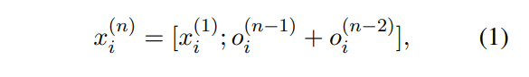

#### 2.2 Alignment Layer
- 将来自两个序列的特性作为输入，并计算对齐后的表示形式作为输出
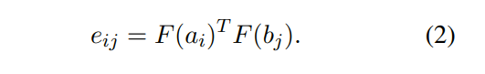
F为identity function或者单层FFN，作为超参数进行选择

- 计算当前位置与另一序列的所有位置加权加和
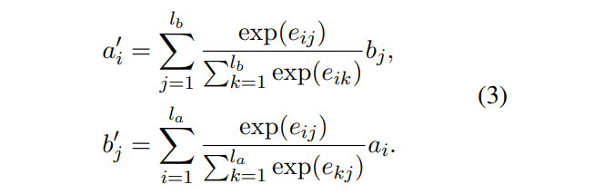

#### 2.3 Fusion Layer
- 融合层比较三个透视图中的局部表示和对齐表示，然后将它们融合在一起

G1, G2, G3, G都是单层FFN
减法强调了两句话的不同，而乘法强调了两句话相同的地方

#### 2.4 Prediction Layer
- 前面几层把两句话的特征以及交互信息都准备好了。最后的预测层采用了多层的前向网络，但是在经过前向网络之前，还对两句话的向量做了一些操作
    - 针对NLI任务
    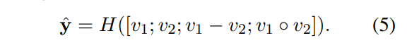
    - PI任务
    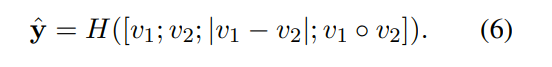
    - 向量的拼接
    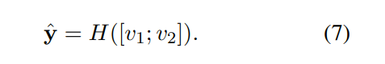

### 3 Experiments
#### 3.1 Datasets
- SNLI
- SciTail
- Quora Question Pairs
- WikiQA

#### 3.2 Implementation Details
略

#### 3.3 Results on Natural Language Inference
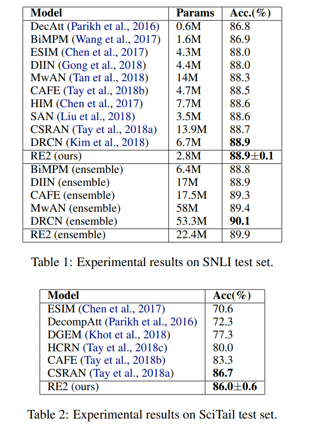

#### 3.4 Results on Paraphrase Identification
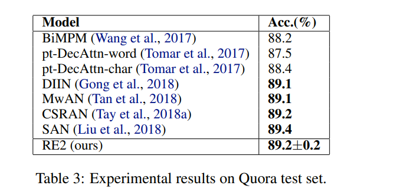

#### 3.5 Results on Answer Selection
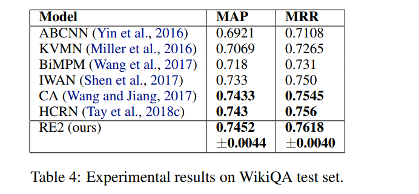

#### 3.6 Inference Time
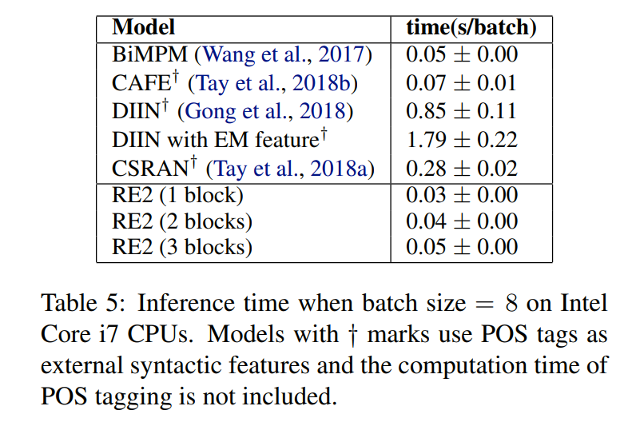

#### 3.7 Analysis
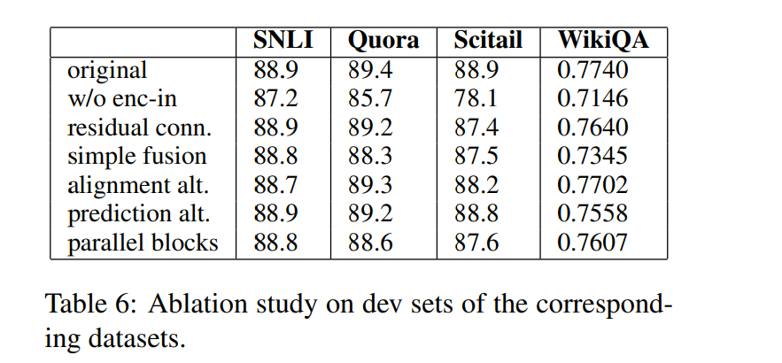
1. 没有encoder input
2. x_i(n) = o_i^(n−1) +o_i^(n−2)
3. a_i = G_1([a_i; a_i`])
4.
5.
6. 平行处理

Case study
: 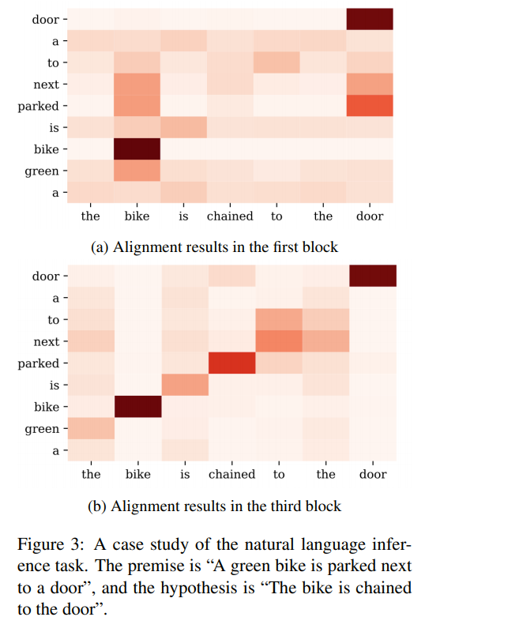

### 4 Related Work
略

### 5 Conclusion 
略
