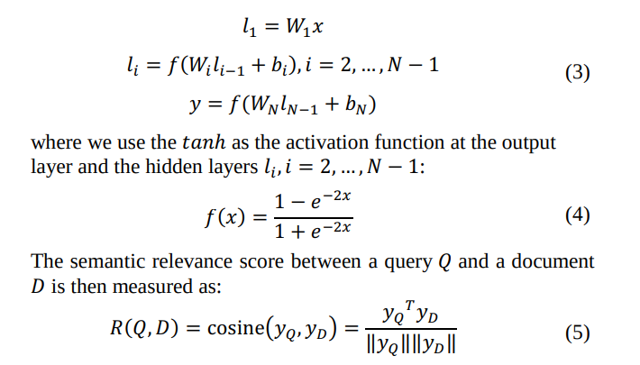
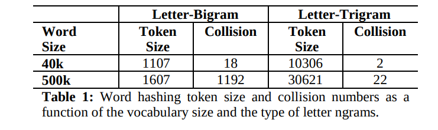
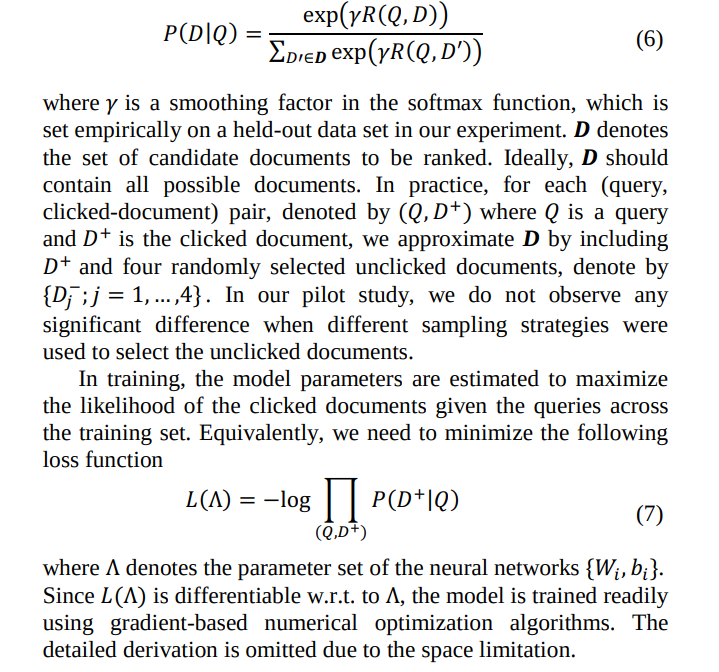
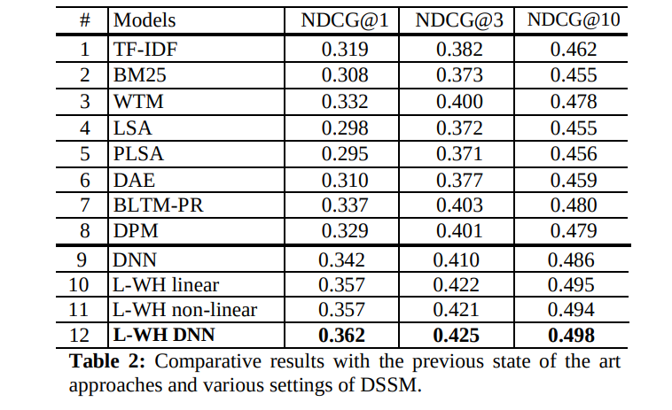

# Learning Deep Structured Semantic Models for Web Search using Clickthrough Data
[toc]

- http://cslt.riit.tsinghua.edu.cn/mediawiki/images/4/45/2013_-_Learning_Deep_Structured_Semantic_Models_for_Web_Search_using_Clickthrough_Data_-_Report.pdf

## ABSTRACT
- 隐含语义模型，如LSA经常使用在语义上匹配问句到其相关文档，而在这些方面通过基于关键词进行文本检索容易失败
- 本模型使用点击数据来最大化基于一个查询下的文档点击最大似然
- 使用word hash来应对大词表

## 1. INTRODUCTION 
- 搜索点击使用关键词在文档和查询中进行匹配会遇到不同词汇表达以及语言模式的影响
- LDA、LSA等语义匹配方法使用无监督训练，在网络查询匹配的情况下，效果不会特别好
- 搜索点击数据建立查询与文档之间的差异的桥梁
- 本模型
  - 将问句和文档映射到语义空间中作为向量表示
  - 计算两者的余弦相似度

## 2. RELATED WORK
- Latent Semantic Models and the Use of Clickthrough Data
- Deep Learning

## 3. DEEP STRUCTURED SEMANTIC MODELS FOR WEB SEARCH
### 3.1 DNN for Computing Semantic Features

### 3.2 Word Hashing
- 减少BOW向量的维度
- good -》#good#-》#go, goo, ood, od#
- 问题：不同的词语可能有同样subword表示
- 形态学相似的词语往往映射到相似的n-gram
- 解决OOV的问题
- 可以实现为一个线性转换问题

### 3.3 Learning the DSSM

### 3.4 Implementation Details
- 层预训练
- SGD

## 4. EXPERIMENTS

