# Convolutional Neural Network Architectures for Matching Natural Language Sentences
[toc]
https://arxiv.org/pdf/1503.03244.pdf
## 1 Introduction
- Match匹配是衡量相关性或者相似性，例如翻译、对话等
- 句子具有复杂的结构，序列以及层次化，对理解是本质的问题
- 成功的匹配算法需要捕捉到其中的句子结构以及句子之间交互的复杂模式

## 2 Convolutional Sentence Model
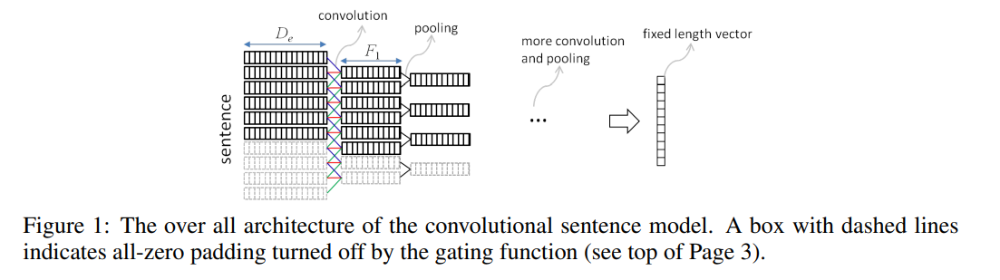

### 2.1 Some Analysis on the Convolutional Architecture
- 下图示意性地说明了卷积结构的作用，作者认为卷积的作用是从句子中提取出局部的语义组合信息，而多张Feature Map则是从多种角度进行提取，也就是保证提取的语义组合的多样性；而池化的作用是对多种语义组合进行选择，过滤掉一些置信度低的组合（可能这样的组合语义上并无意义）
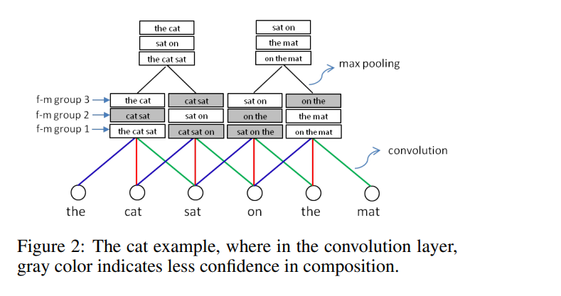

## 3 Convolutional Matching Models
### 3.1 Architecture-I (ARC-I)
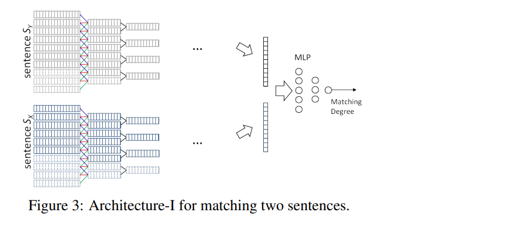
- 简单来说，首先分别单独地对两个句子进行建模（使用上文中的句子模型），从而得到两个相同且固定长度的向量，向量表示句子经过建模后抽象得来的特征信息；然后，将这两个向量作为一个多层感知机(MLP)的输入，最后计算匹配的分数
- 这个模型比较简单，但是有一个较大的缺点：两个句子在建模过程中是完全独立的，没有任何交互行为，一直到最后生成抽象的向量表示后才有交互行为（一起作为下一个模型的输入），这样做使得句子在抽象建模的过程中会丧失很多语义细节，同时过早地失去了句子间语义交互计算的机会。因此，推出了第二种模型结构

### 3.2 Architecture-II (ARC-II)

- 这种结构提前了两个句子间的交互行为
- 第一层卷积层
    首先从Sentence x中任取一个向量xa，再从Sentence y中将每一个向量和xa进行卷积操作
    同理以上操作，将两个句子中所有的向量两两组合，构成2D向量
    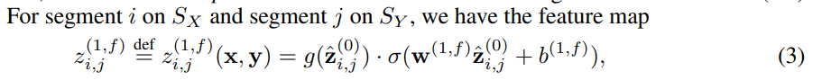
    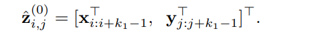
    g是作为mask使用的，前面为0当前也为0

- 第一层卷积层后的Max-Pooling层Layer-2，然后进行2×2的Max-pooling
    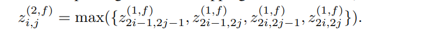

- 后续的卷积层, 均是传统的二维卷积操作

- 二维卷积结果后的Pooling层
与第一层卷积层后的简单Max-Pooling方式不同，后续的卷积层的Pooling是一种动态Pooling方法

### 3.3 Some Analysis on ARC-II
Order Preservation
: 不管是CNN还是POOL都保留了词序信息

Model Generality
: 更具一般性，实际上结构I是结构II的一种特殊情况（取消指定的权值参数）
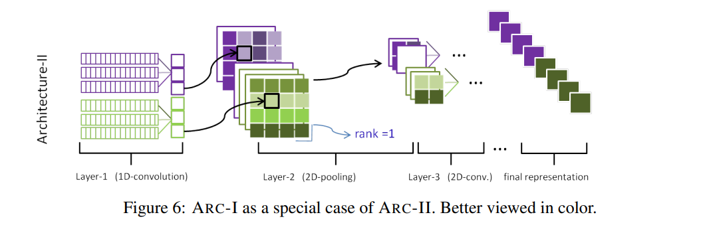

## 4 Training
- 使用ranking-based loss
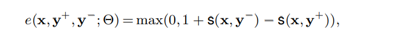

## 5 Experiments
一共做了三个实验，分别是(1)句子自动填充任务(上下文)，(2)推文与评论的匹配，以及(3)同义句识别；
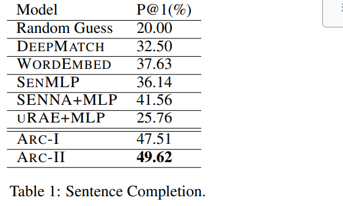
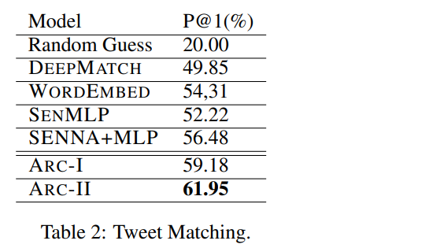
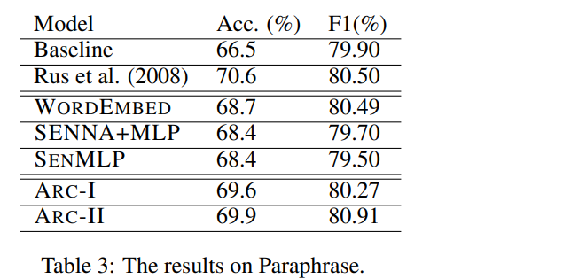
