# A Decomposable Attention Model for Natural Language Inference
[toc]

### Abstract
- 略

### 1 Introduction
- 我们换一个思路，NLI可以通过简单地将本地文本结构进行对齐然后再将信息进行汇总合并

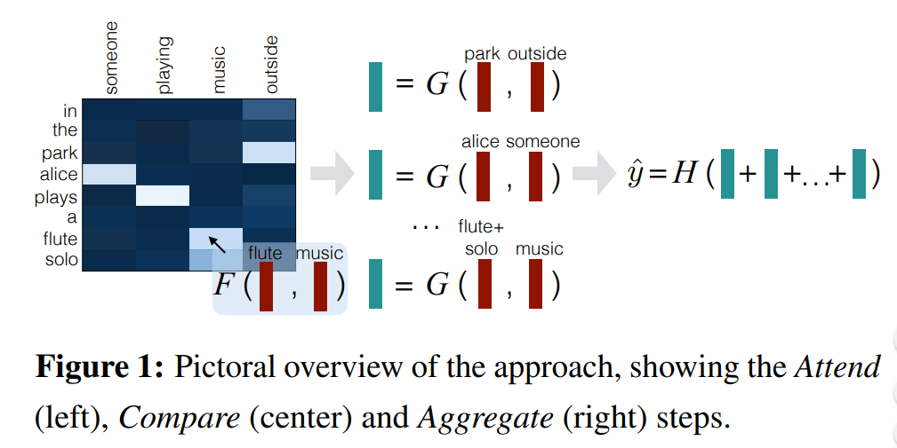

### 2 Related Work
- 略

### 3 Approach
- a = (a1, . . . , ala) and b = (b1, . . . , blb), d维
- 模型由如下几层构成
    - Input representation
    - Attend： soft-align
    - Compare： 
    - Aggregate

#### 3.1 Attend
- 首先计算a和b中的每个词之间的attention weights
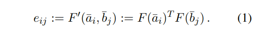
F可以设置为FFN，使用ReLU进行激活

- attention权重如下
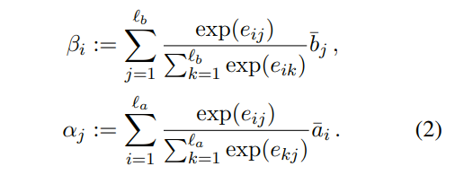

#### 3.2 Compare
- 该模块的功能主要是对加权后的一个句子与另一个原始句子进行比较,  G也是一个前馈神经网络
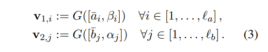

#### 3.3 Aggregate
- 上一步得到两个比较向量的集合,分别求和
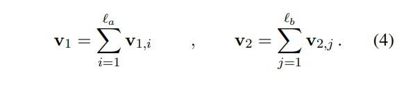

- 将两个向量concatenate后使用前馈神经网络进行分类, 损失函数利用交叉熵损失函数
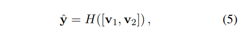

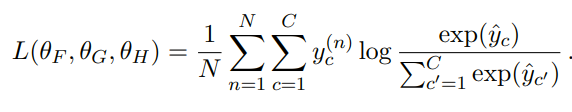

#### 3.4 Intra-Sentence Attention (Optional)
- 上面的模型使用词向量作为输入, 除此之外, 还可以在每个句子中使用句子内的attention方式来加强输入词语的语义信息
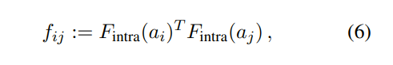
这里$F_{intra}$ 也是一个前馈神经网络
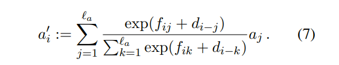
这里的d_{i-j} 表示当前词i与句子中的其他词j之间的距离偏差，所有距离大于10的词共享一个距离偏差（distance-sensitive bias），这样每一个时刻的输入就变为原始输入跟self-attention后的值的拼接所得到的向量a¯i:=[ai,a′i],b¯j:=[bj,b′j]

### 4 Computational Complexity
- 略

### 5 Experiments
embedding_size: 300(freeze)
embedding之后加一个projection变成200
所有参数随机高斯初始化(mean 0, standard deviation 0.01)
dropout: 0.2(除了最后输出, 其他所有的全连接之前都加)
learning rate: 0.05(vanilla) 0.025(intro-attention)
optimizer: Adagrad
前馈网络都是两层(hidden size=200)

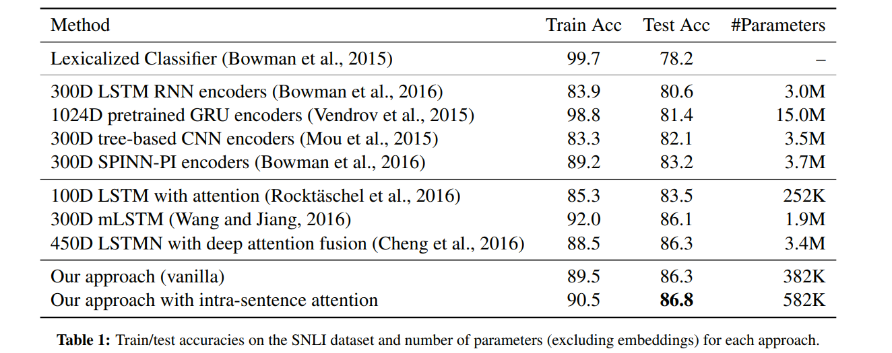
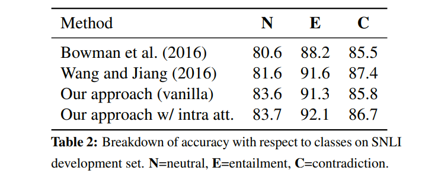
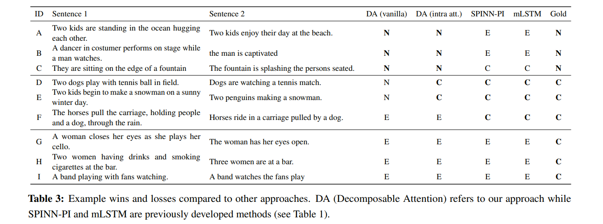

### 6 Conclusion
- 略
