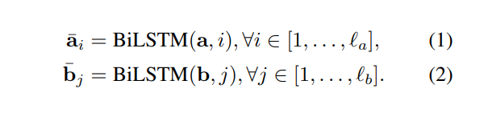
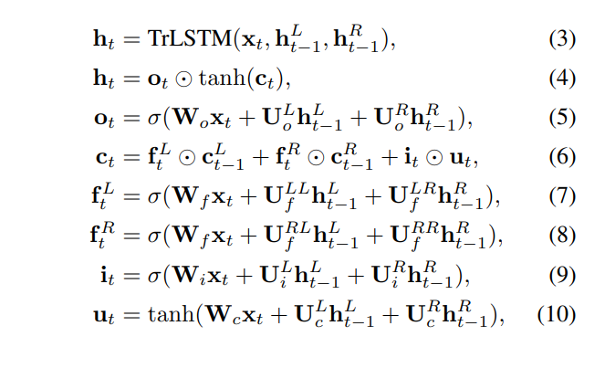
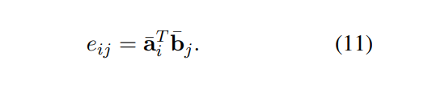
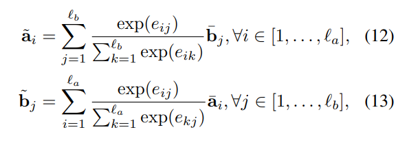
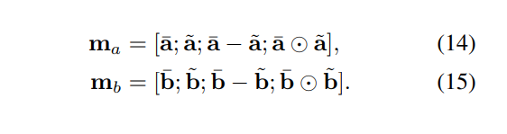
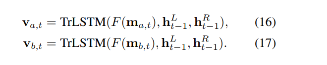
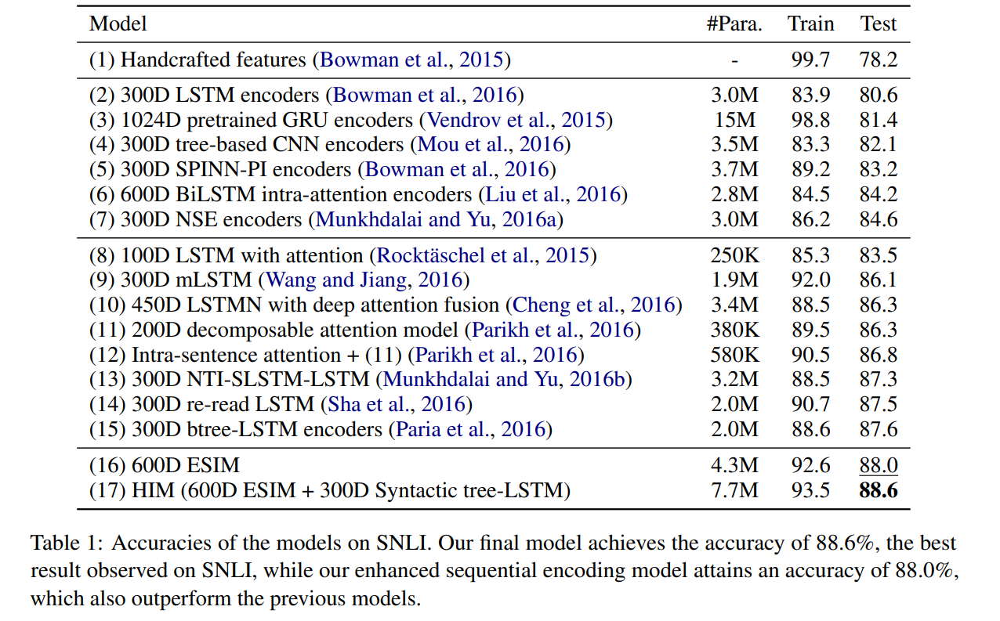
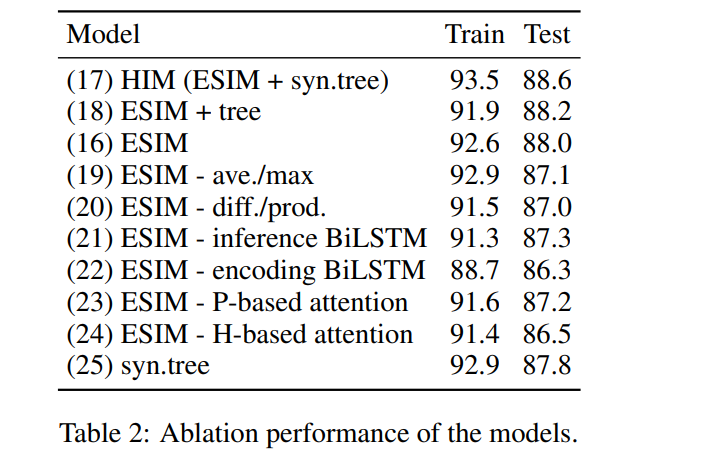

# Enhanced LSTM for Natural Language Inference
[toc]

- https://arxiv.org/abs/1609.06038

## Abstract
- 在本地推断 local inference 和推断组合 inference composition两部分都使用RNN结构达到STOA

## 1 Introduction
- 在很多任务中，语法和语义是很紧急关联，natural language inference可能牵涉到两者

## 2 Related Work
- 注意力机制使得神经网络可以关注到句子的特定部分
- 略

## 3 Hybrid Neural Inference Models
三个组件
- input encoding
- local inference modeling
- inference composition

### 3.1 Input Encoding
- 使用BiLSTM对输入序列（前提和假设）进行编码

- 还可以使用Tree-LSTM 进行编码

### 3.2 Local Inference Modeling
Locality of inference
:  局部推理需要引入一些硬的或者软的形式对齐
使用注意力机制来软对齐前提与假设之间的词语
计算相似矩阵

Local inference collected over sequences
: 基于相似性矩阵计算注意力并基于注意力计算每个词语的软对齐词语

Enhancement of local inference information
: 基于生成的表示向量以及软对齐向量，我们进行进一步的增强，计算差值以及点点乘积

这种操作可以看着两个向量元素之间的高阶的相关性
基于此，我们后面还是用了FFN以及其他操作，相比此处操作并没有提高性能

### 3.3 Inference Composition
The composition layer 
: 使用BiLSTM层来对上层的输入分别进行信息的组合
为了控制复杂性，可以使用一个单层RELU的前馈神经网络对输入进行降维

Pooling
: 使用Pool层将变长的序列输入变成固定长度向量，以输入到最终的分类器中
考虑到意思与序列的长度相关以及不够强壮，隐藏我们这里考虑使用同时使用平均与最大pooling

Overall inference models
: 模型称为 Enhanced Sequential Inference Model (ESIM)
性能比其他模型都好
我们也在里面部分加入tree LSTM

## 4 Experimental Setup

## 5 Results

