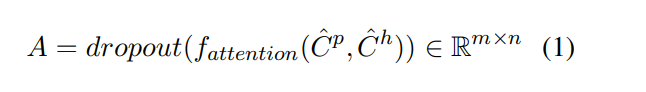
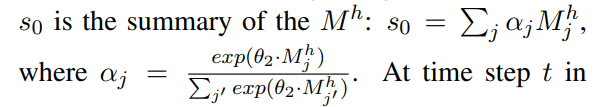
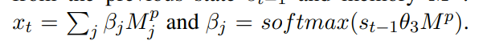
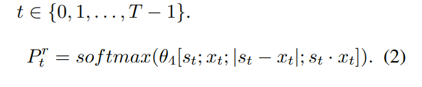
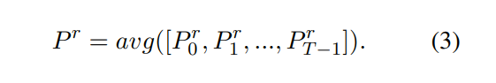
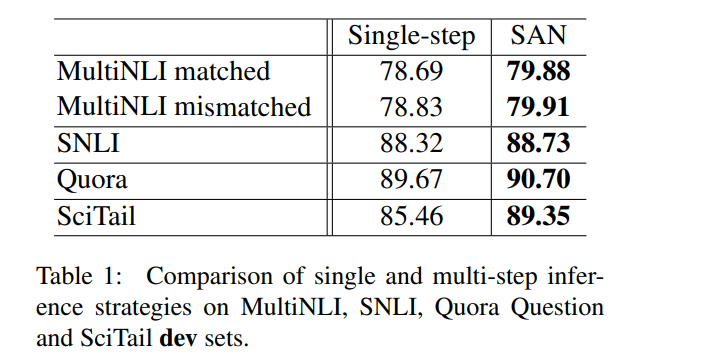
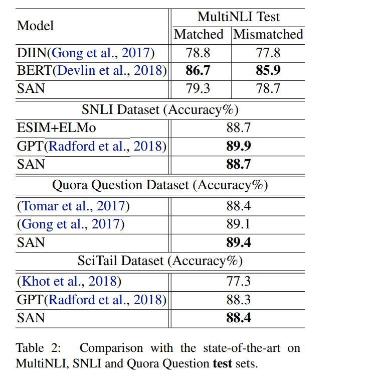
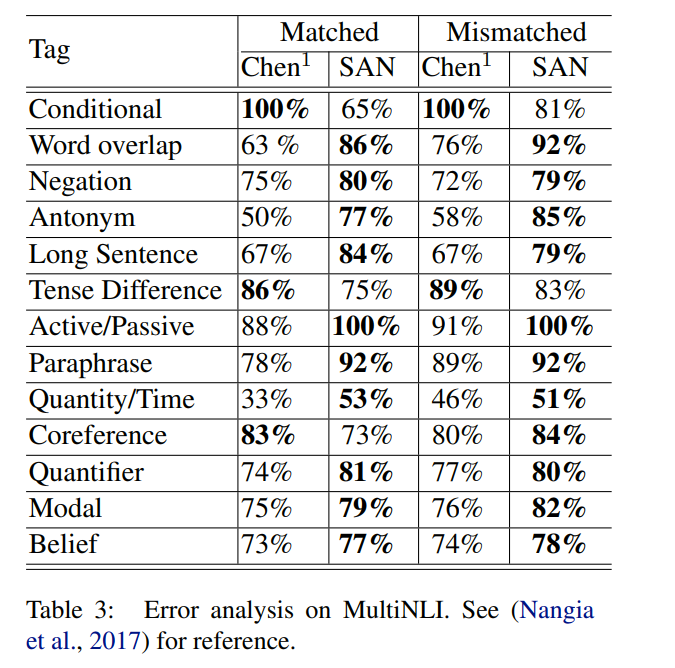

# Stochastic Answer Networks for Natural Language Inference

[toc]

### Abstract
- 提出一种随即回答网络(stochastic answer network)来解决NLI问题
- 和之前的模型根据输入直接预测结果不同, 该模型维护一个状态并迭代地改进其预测
- 与单步推理相比, 这种多步推理方法可以对更复杂的推理任务进行建模

### 1 Motivation
- premise: “If you need this book, it is probably too late unless you are about to take an SAT or GRE.”, and hypothesis: “It’s never too late, unless you’re about to take a test.”需要理解GRE是test，答案是矛盾
- 模型维护一个状态并迭代地改进其预测

### 2 Multi-step inference with SAN

- 模型从多步MRC而来
    - 由于长度较短，简化了底层以及自注意力层
    - 修改输出为标签，之前为span

网络结构
- Lexicon Encoding Layer
    将词向量和字向量做拼接, 这样可以比较好的解决OOV问题,  之后将拼接向量输入到两个分开的两层Position-wise前馈网络得到最终的lexicon embedding, $E^p, E^h$, d维

- Contextual Encoding Layer
    两层的BiLSTM， 因为双向lstm输出是单向的2倍, 作者在每层LSTM加了maxout层来对BiLSTM进行压缩，然后, 对两层LSTM的输出做一个拼接, 得到P和H的表示， $C^p, C^h$, 2d维

- Memory Layer
    利用了注意力机制. 首先, 也是先进行向量点乘，用来计算两边词语之间的相似度. 之后, 作者并没有对点乘结果进行softmax而是加了一层映射
    
    A是注意力矩阵，Droupout用来平滑
    $$\hat C^p = ReLU(W_3C^p), h一样$$
    然后
    $$U^p = [C^p; C^hA]; U^h=[C^h; C^pA`]; A'=A^T$$ 
    最后
    $$M^p = BiLSTM([U^p;C^p]); M^h=BiLSTM([U^h;C^h])$$

- Answer module
answer module计算T个时间步的关系标签. 在最开始, 初始化状态s0

之后对于各个时间步的状态st
$$s_t = GRU(s_{t-1}, x_t)$$

​
计算每个时间步的匹配结果$P^r_t$

之后, 对各个时间步结果进行平均

为了提高鲁棒性, 在训练期间使用stochastic prediction dropout

### 3 Experiments
#### 3.1 Dataset
略

#### 3.2 Implementation details
分词: spaCy
word embedding: GloVe 300D
character encoding: 利用CNN训练, embedding size设为20. windows设为1,3,5 hidden size设为50, 100, 150
word embedding和character embedding拼接, 最终的lexicon embedding就是600维.
LSTM hidden size: 128
注意力层的projection size: 256
dropout: 0.2
batch size: 32
optimizer: Adamax
learning rate: 0.002

#### 3.3 Results

### 4 Conclusion
略
