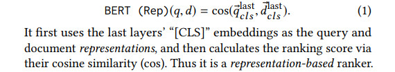
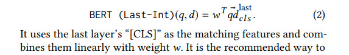
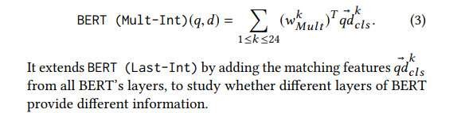
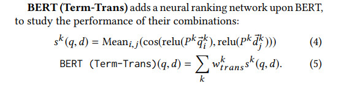
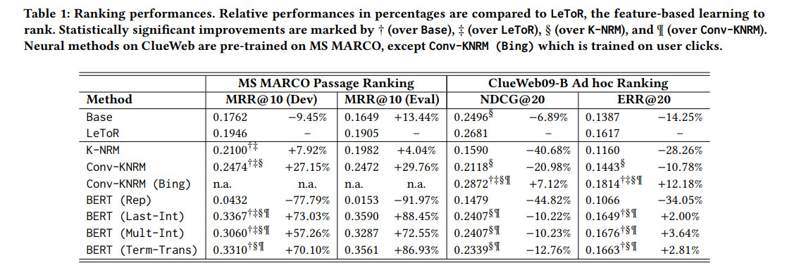
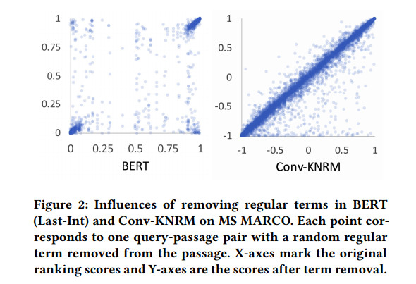
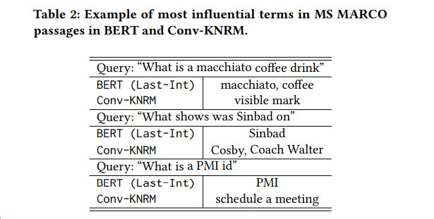

# Understanding the Behaviors of BERT in Ranking
[toc]
- [1904.07531](https://arxiv.org/pdf/1904.07531.pdf)

## ABSTRACT
- 本文研究了BERT在排序任务中的性能和行为

## 1 INTRODUCTION
- 神经信息检索（Neu-IR）研究已经开发出几种有效的方法来提高排名准确性
- 在MS MARCO上，微调的BERT明显优于以前的最新Neu-IR模型，其有效性主要来自其强大的跨问题-段落交互作用
- 在TREC排序中，基于BERT的排序（甚至在MS MARCO排序标签上进行了预训练）的性能要比基于特征的学习进行排序和在Bing日志中对用户点击进行预训练的Neu-IR模型要差
- BERT使用其深层的Transformer体系结构通过其注意力机制在文本序列上更广泛地传播信息，而基于交互的神经排序对术语对的操作更为独立。进一步的研究表明，BERT更加关注与查询直接匹配的文档术语。它与以前的周围基于上下文的seq2seq模型的语义匹配行为相似，但是与从用户点击中学到的相关性神经排名排序

## 2 BERT BASED RANKERS
### 2.1 Notable Properties of BERT
- BERT简单介绍

### 2.2 Ranking with BERT
- BERT（Rep）

- BERT（Last-Int）

- BERT（Mult-Int）

- BERT（Term-Trans）

## 3 EXPERIMENTAL METHODOLOGIES
- TREC标签不足以微调BERT, 首先在MS MARCO上对所有神经方法进行预训练，然后在ClueWeb上对其进行微调
- 评估指标
  - MS MARCO使用MRR @ 10 作为官方评估
  - ClueWeb使用NDCG @ 20 和ERR @ 20
- 训练
  - 除Term-Trans以外，所有BERT等级均使用Adam优化器和3e-6的学习率进行训练，Term-Trans则以0.002的学习率训练投影层

## 4 EVALUATIONS AND ANALYSES

### 4.1 Overall Performances

- 所有基于交互的BERT 排名将以前最先进的Conv-KNRM提高了30％-50％
- BERT（Rep）将BERT分别应用于查询和文档，并丢弃这些交叉序列交互，其性能接近随机。BERT是基于交互的匹配模型，不建议将其用作表示模型
- 尽管已经在大型语料库上进行了预训练，然后在MARCO排名标签上进行了预训练，但是BERT模型都没有在LeueR上明显优于ClueWeb
- Conv-KNRM（Bing）是相同的Conv-KNRM模型，但已在Bing用户点击次数上进行了预训练，在ClueWeb上表现最佳
- 结果表明，MARCO段落排名因其问答重点而更接近seq2seq任务，而BERT的基于上下文语境的预训练在此环境中表现出色。相比之下，TREC任务需要除上下文以外的其他信号：与基于上下文的信号相比，对用户点击的预训练更为有效

### 4.2 Learned Attentions

- 将候选段落中的术语分为三组：标记（“ [CLS]”和“ [SEP]”），停用词和常规词
  - 标记受到最多的关注。删除这些标记会使MRR降低15％， BERT使用它们来区分两个文本序
  - 停用词与非停用词一样受到关注，删除它们对MRR性能没有影响。BERT知道这些停用词没有用，并在它们上浪费了多余的注意力
  - 随着网络的不断深入，较少的令牌获得了其他大多数令牌的关注：注意力在整个序列上分布得更多，并且嵌入被上下文化

### 4.3 Learned Term Matches
- 通过比较带有和不带有该词的文档的排名得分来研究一个词的影响。对于每个查询通道对，我们随机删除一个非停用词，使用BERT（Last-Int）或Conv-KNRM计算排名得分，并将其与原始排名得分一起绘制在图 

    - BERT 分配了更多的极端排名分数：大多数对在BERT中获得接近1或0的排名分数，而在Conv-KNRM中的排名分数分布更均匀
    - 每个文档中都有一些术语可以确定BERT的大多数排名得分；删除它们会显着改变排名得分-从1下降到接近0，而删除BERT中的大多数术语并没有多大关系-大多数得分都集中在角落, 表明BERT从大规模预训练中得到了很好的训练
    - 术语在Conv-KNRM中的贡献更大；删除单项通常会改变Conv-KNRM的排名得分在某种程度上，由图2中对角线附近的较宽频带显示  ，但没有BERT中的明显

- 手动检查了BERT（Last-Int）和Conv-KNRM中最有影响力的术语。

  - 精确匹配项在BERT（Last-Int）中起着重要作用；发现BERT中的许多有影响力的术语是出现在问题或近似短语中的那些术语
  - Conv-KNRM倾向于与搜索查询松散相关的字词  
  - BERT对周围上下文的预训练偏向于在语义上更接近的文本序列对。与Neu-IR研究中的先前观察结果一致，即这种周围环境训练模型在关键字查询的TREC样式临时文档排名中不那么有效  （K-NRM）

## 5 CONCLUSIONS AND FUTURE DIRECTION
- 本文研究了BERT在MS MARCO段落排名和TREC Web Track临时排名任务中的表现和行为。实验表明，BERT是基于交互的seq2seq模型，可以有效地匹配文本序列。基于BERT的排名在MS MARCO段落排名任务上表现出色，该任务专注于回答问题，但在TREC临时文档排名上却表现不佳。这些结果表明，MS MARCO的质量检查重点更加接近seq2seq匹配任务，在这些任务中，BERT的基于周围上下文的预训练非常适合，而在TREC临时文档排名任务中，用户点击比BERT的周围是更好的预训练信号上下文。
- 我们的分析表明，BERT是一个强大的匹配模型，在整个上下文中具有全球分布的关注点。它还为查询文档对分配极端匹配分数；大多数对的得分都为1或0，这表明通过对大型语料库进行预训练可以很好地对其进行调整。同时，在对周围环境进行了预训练之后，BERT更喜欢语义上接近的文本对。该观察结果可以解释BERT在TREC式临时排名上缺乏有效性，该排名被认为更喜欢来自用户点击的预训练而不是周围环境。
- 我们的结果表明，需要对用户点击信号进行更深入的网络培训。将来，研究在基于相关性的标签上进行训练时，与两个较浅的神经排名相比，更深层次的模型（与BERT一样大）的行为将变得有趣。