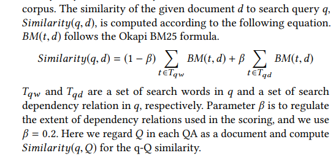
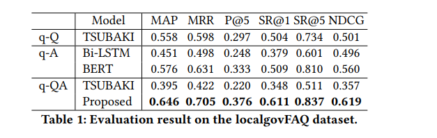
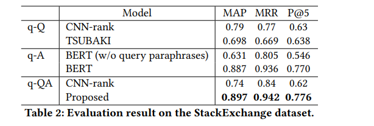
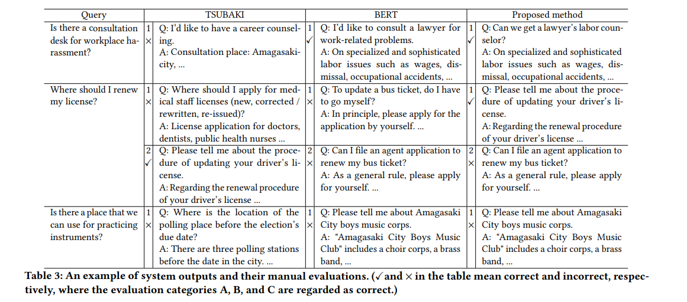
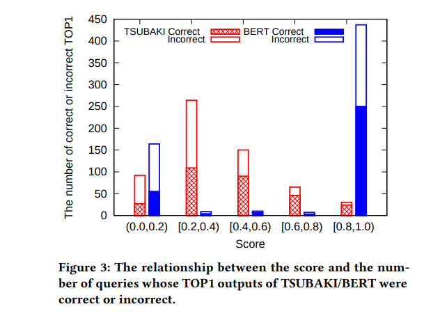

# FAQ Retrieval using Query-Question Similarity and BERT-Based Query-Answer Relevance

[toc]

## ABSTRACT
- 除了传统的问问匹配外，本文还使用了基于bERT的问答相关性匹配

## 1 INTRODUCTION
- 使用QQ标注数据进行匹配，需要花费巨大进行数据的标注
- 直接使用QA对来进行QA相关性的学习，但是不常使用，因为FAQ的数据量太少以至于不能很好的学习

由于模型中使用了QA相关性匹配，因此如果Qq从词法上相差太大，也能进行匹配

## 2 PROPOSED METHOD
#### 2.1 Task Description
QA对 {(Q1,A1), (Q2,A2), ...,(QM ,AM )}
T1,T2, ...,TN为QA数据集，T_t为目标集

#### 2.2 q-Q similarity by TSUBAKI

#### 2.3 q-A relevance by BERT
随机选择负样本
Relevance(Q,A) = 1 
 Relevance(Q,A¯)  = 0

#### 2.4 Combining TSUBAKI and BERT
- 取10个BERT返回的最大相关性的答案
- 对于TSUBAKI score
  - 如果大于α，则直接按照该分数排序
  - 否则则采用合并分数排序 tsubaki + bert
  - 由于TSUBAKI利于长文本，因此需要对长度进行惩罚，除以
  
  k1 = 4, k2 = 2,  α = 0.3

## 3 EXPERIMENTS AND EVALUATION
- StackExchange
  - 719 QA pairs
  - 1,250 Q total

#### 3.1 LocalgovFAQ Evaluation Set Construction
- 网站含有1,786 QA pairs
- 收集990 queries
  - 通过上面的计算返回最高的5个答案
    - 人工进行评判
A Contain correct information.
B Contain relevant information.
C The topic is same as a query, but do not contain relevant information.
D Contain only irrelevant information.

#### 3.2 Experimental Settings
- LSTM以及BERT负样本数目使用24

#### 3.3 Evaluation Results and Discussion

BERT的结果说明相似问句对效果的提升非常明显

两个模型的输出的Top1的值分布以及其是否为正确答案
- TSUBAKI分数高，正确的概率大
- 而BERT高分区间则正确与否没有太大联系
- 说明：两者是使用的不同特征进行判断的

## 4 CONCLUSION
- 略
