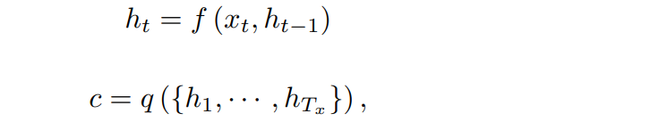
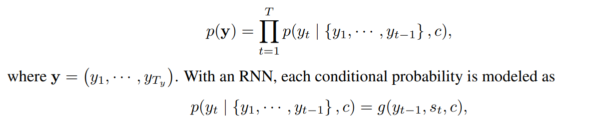
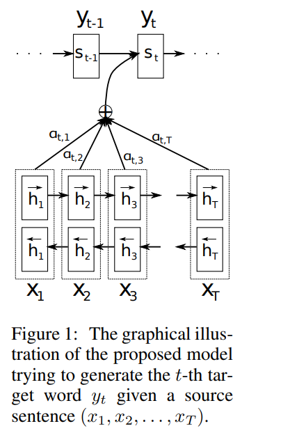
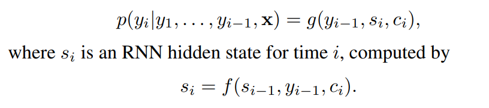
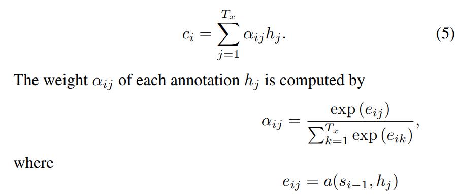
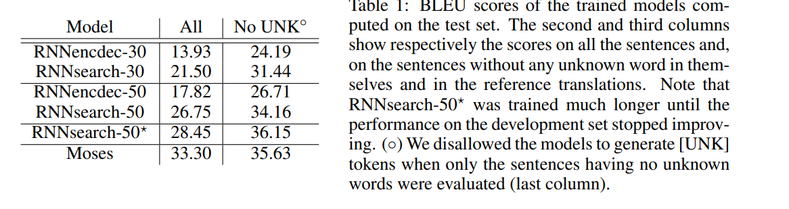
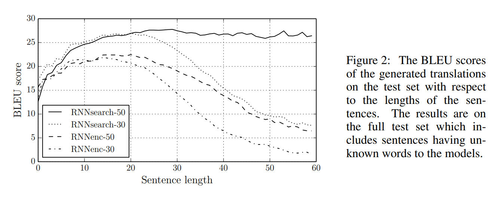
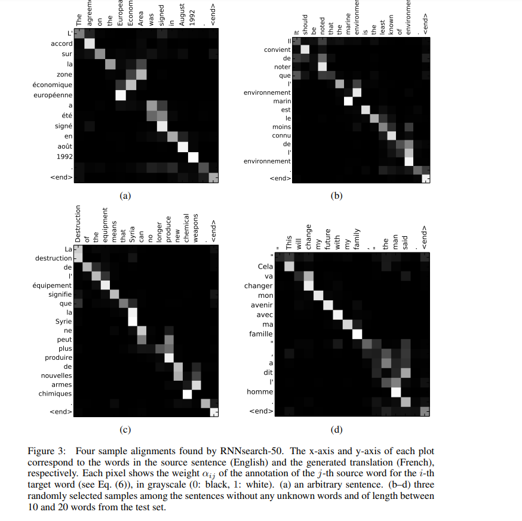

# Neural Machine Translation by Jointly Learning to Align and Translate
[toc]

- https://arxiv.org/abs/1409.0473

##  ABSTRACT
- 翻译通常属于编码器-解码器（encoder-decoder）和解码器将一个目标序列编码为固定长度的向量，解码器从这些向量中生成译文
- 在本文中，我们推测定长向量的使用是一个提高基本的编码器-解码器框架性能的瓶颈，并提出了允许模型（软）搜索原句中与预测目标词相关的部分，不必将这些部分显示分割。通过这种新的方法，我们可以达到与现有的最先进的基于短语的英法翻译系统相当的翻译效果。此外，定性实验发现模型的（软）对齐方式和我们的直觉是一致的

##  1 INTRODUCTION
- 神经机器翻译的目标是建立并训练一个可以读取一个句子并输出正确的翻译的单一的、大型的的神经网络
- 很多提出的神经机器翻译都属于encoder-decoder，每种语言有一个编码器和解码器，或者是将某个特定语言的编码器应用在某个句子上，并比较它们的输出。一个解码神经网络读取和编码一个原序列为一个定长的向量。解码器输出编码向量的翻译。整个encoder-decoder系统，是由一个语言对的编码器和解码器组成的，它可以被整合训练来提高给定源句被正确翻译的概率
- 这种encoder-decoder方法有一个潜在的问题是，神经网络需要将源句所有的必要信息压缩成定长的向量。这可能使神经网络难以处理长句子，尤其是那些比训练语料库中更长的句子。Cho（2014）发现，随着输入句子长度的增加，基本的encoder-decoder的性能会迅速下降
- 为了解决这一问题，我们引入了一种对encoder-decoder模型的拓展。每当生成的模型在翻译中生成一个单词的时候，它会（软）搜索源句中最相关信息集中的位置。然后，该模型根据与源句位置相关的上下文向量和之前产生的所有目标词来预测目标词
- 这些方法与基本的encoder-decoder最大的区别是它不试图将整个输入序列编码成一个定长的向量。相反，它将输入序列编码成向量，然后当解码翻译的时候自适应地选择向量的子集。这使得神经翻译模型避免把源句的所有信息，不管它的长度，压扁成一个定长的向量。我们发现这可以让模型更好的处理长句子
- 在论文中，我们证明了提出地对齐和翻译联合学习的方法比基本的encoder-decoder模型在翻译性能上有显著提升。这样的提升句子越长，效果越明显，但任何长度的句子都能看到（改进）。在英法翻译任务上，提出的方法在单一的模型下实现了翻译性能相当或接近传统的基于短语的翻译系统。除此之外，数量分析揭示了提出的模型找到了一种语言学上可信的/源句和对应的目标句之间的（软）排列

## 2 BACKGROUND: NEURAL MACHINE TRANSLATION
- 翻译等价于找到给定的源句x时最大的条件概率y对应的目标句y
$$argmax_y P(y|x)$$
在神经机器翻译中，我们使用并行训练语料库来拟合参数化模型，以最大化句子对的条件概率。一旦翻译模型学到了条件分布，给定源句对应的翻译可以通过搜索能最大化条件概率的句子得到

- Sutskever（2014）报道了基于使用了LSTM单元的RNN神经机器翻译在英法翻译任务上已经相当于最先进性能的传统基于短语的机器翻译系统。例如，对现有的翻译系统增加神经组件，以对短语表中的短语对进行评分或对候选翻译进行重新排序，已经超过了以前最先进的性能水平

### 2.1 RNN ENCODER–DECODER
- encoder将向量x的序列x=($x_{1},x_{2}...x_{T_{x}}$)转换成向量c，最常见的使用RNN的方法是

$h_{t} 是 t 时刻的隐藏状态，c是由隐藏状态产生的向量，f 和 s 是一些非线性函数。例如，Sutskever（2014）曾使用一个LSTM作为 f 和q({h_{1},...,h_{T_{x}}}) = h_{T}$

- 解码器通常被训练给定文本向量c和所有之前预测过的单词 ${ y_{1},...,y_{t-1} } $，预测下一个单词 $y_{t}$。换句话说，解码器通过分解将联合概率为有序的条件来定义在翻译y上的概率

g是非线性的，可能是多层的函数，它的输出是y_{t}的概率，s_{t}是RNN的隐层状态。需要注意的是，还可以使用其他架构，类似RNN和去卷积神经网络的混合

## 3 LEARNING TO ALIGN AND TRANSLAT

新的框架由一个双向的RNN作为编码器（3.2）和一个在解码翻译时対源句模拟搜索的解码器组成（3.1）

### 3.1 DECODER: GENERAL DESCRIPTIO
- 定义了条件概率

这里的概率是有一个对每个目标词 y_{i} 不同的上下文向量 c_{i} 决定的

- 上下文向量 c_{i} 是通过计算所有注释的加权和

这里 e_{ij} = a(s_{i-1},h_{j}) 是对齐模型，它可以评估 位置 j 附近的输入和位置 i 的输出的匹配程度。得分基于RNN隐层状态 s_{i-1} 和 输入序列的第 j 个注释 h_{j} 来判断的

- 我们把对齐模型 a 参数为一个前馈神经网络，该神经网络与系统中的其他组件联合训练。注意，与传统的机器翻译不同，对齐不被认为是一个潜在的向量。相反，对齐模型直接计算软对齐，从而可以使代价函数的梯度反向传播。该梯度可用于联合训练对齐模型和整个翻译模型
- 可以理解这种将所有注释的加权和作为计算一种预期注释的方法，这里的期望基于可能的对齐。$\alpha_{ij}$是目标词 y_i  是由源词 x_j 对齐，或者翻译过来的概率。那么，第 i 个上下文向量 c_i  是所有具有概率 $\alpha_{ij}$ 的注释中的期望注释。
- $\alpha_{ij}$概率 ，或者其相关的能量$e_{ij}$，反映了注释 $h_j$ 的在决定下一个状态 s_{i-1}和生成 y_i  时，过去的隐藏状态的  s_{i-1} 重要程度。直观的来说，在解码阶段实现了一种注意力机制解码决定源句的关注部分。通过让解码器具有注意力机制，我们减轻了变发起必须要将源句中所有信息编码成一个定长向量的负担。用这种新方法，信息可以在注释序列中扩散，相应的解码器可以选择性的检索这些注释
  
### 3.2 ENCODER: BIDIRECTIONAL RNN FOR ANNOTATING SEQUENCES
- 使用双向RNN编码前后的信息

## 4 EXPERIMENT SETTINGS

### 4.1 DATASET
略

### 4.2 MODELS
- 训练了两种模型。一种是Cho2014年提出的RNN  Encoder-Decoder（RNNencdec），另一个本文提出的模型，我们称之为RNNsearch。每个模型训练两次：先用长度为30个单词的句子训练（RNNencdec-30，RNNsearch-30），然后用长度为50的句子训练（RNNencdec-50，RNNsearch-50）
- RNNencdec的编码器和解码器有1000个隐层单元。RNNsearch的编码器由前向和后向RNN组成，每个RNN有1000个隐层单元。在这两种情况下，我们都采用了有带有single maxout的隐层组成的多层网络来计算每个目标词的条件概率
- 使用小批量的随机梯度下降算法。每次SGD更新的方向是通过对80个句子的小批量样本计算得来的。我们对每个模型进行了大概5天的训练
- Beam search 搜索近似条件概率最大的翻译

## 5 RESULTS

### 5.1 QUANTITATIVE RESULTS
- 当只考虑由已知词组成的句子时，RNNsearch的性能和传统的基于短语的翻译系统（Moses）一样好。这是一个很重大的成就，因为考虑到Moses使用的是一个单独的语料库，而不是我们在训练RNNsearch和RNNencdec时使用的平行语料库
- 提出方法的一个动机就是在基本的encoder-decoder中定长上下文向量的使用。我们推测这样的限制使得基本的encoder-decoder方法在长句子上表现不佳。实验进一步证明了提出的模型相较于基本的encoder-decoder模型的优势（在处理长句子方面）

### 5.2 QUALITATIVE ANALYSIS

#### 5.2.1 ALIGNMENT

- 提出的方法提供了一种直观的方法来检查生成的译文中的词和源句中的词之间的对齐（软对齐）。矩阵的每一行都暗示了与译文相关的权重。由此我们可以看出，在生成目标词时，源句中的哪些位置被认为更重要。

- 从图3的排列中，我们可以看出英语和法语之间的单词对齐基本上是单调的。我们在每个矩阵的对角线上都能看到很重的权重。然而，我们也观察到一些非平凡的，非单调的对齐。形容词和名词在英语和法语中的顺序是不同的从图3中我们可以看出模型能正确的翻译单词。RNNsearch可以跳过两个单词，正确对齐对应单词，然后每次回头看一个词，将整个词完整地呈现出来。

- 从图3（d）能看出软对齐相较于硬对齐的力量。不像硬对齐处理翻译那么生硬，可以自然的考虑前后文进行对应；另一个好处是能自然的处理不同长度的源和目标短语，而不用以一种反直觉的方式把一些词映射成（NULL）

#### 5.2.2 LONG SENTENCES
- RNNsearch可以在翻译长句方面比传统模型（RNNencdec）要好得多。这可能是因为RNNsearch不需要讲一个长句子完美的编码到一个固定长度的向量中，而只精确的编码输入句子中某个特定单词的周围

## 6 RELATED WORK
### 6.1 LEARNING TO ALIGN
略

### 6.2 NEURAL NETWORKS FOR MACHINE TRANSLATION
略

## 7 CONCLUSION
略
