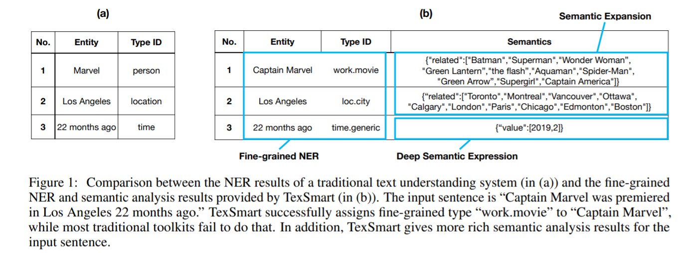
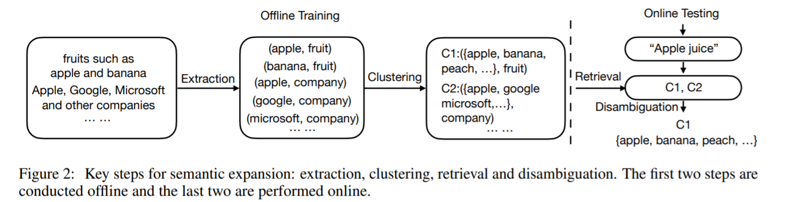
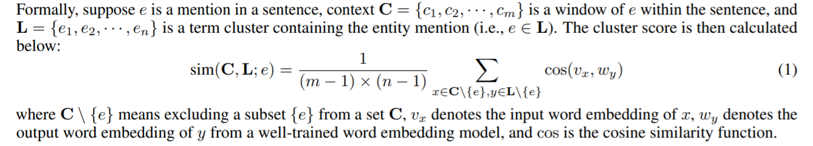

<!-- TOC -->

- [TexSmart: A Text Understanding System for Fine-Grained NER and Enhanced Semantic Analysis](#texsmart-a-text-understanding-system-for-fine-grained-ner-and-enhanced-semantic-analysis)
  - [ABSTRACT](#abstract)
  - [1 INTRODUCTION 引言](#1-introduction-引言)
  - [2 SYSTEM MODULES 系统单元](#2-system-modules-系统单元)

<!-- /TOC -->
# TexSmart: A Text Understanding System for Fine-Grained NER and Enhanced Semantic Analysis
- https://arxiv.org/abs/2012.15639
- https://texsmart.qq.com/en

## ABSTRACT
- TexSmart 的 NER 函数支持超过1,000个实体类型，而大多数其他公共工具通常支持几个到(最多)几十个实体类型。其次，TexSmart 引入了新的语义分析功能，如语义扩展和深层语义表示，这些功能在以前的大多数系统中都是不存在的。第三，为了满足不同学术和工业应用的需求，TexSmart 针对一个函数实现了一系列算法(从非常快的算法到相对较慢但更精确的算法)。采用无监督或弱监督的算法尤其受到重视，其目的是方便地更新我们的模型，以包含人工注释工作量较少的新数据

## 1 INTRODUCTION 引言

- TexSmart 的细粒度 NER 功能支持超过1000个实体类型，而以前的大多数文本理解系统通常支持几个到(最多)几十个粗粒度实体类型(其中最流行的类型是人、位置和组织)。大规模的细粒度实体类型可望为下游的 NLP 应用程序提供更丰富的语义信息。图1显示了以前系统的 NER 结果与 TexSmart 的细粒度 NER 结果之间的比较。结果显示，TexSmart 可以识别更多的实体类型(例如 work.movie)和更细粒度的类型(例如，loc.city 相对于一般的位置类型)。TexSmart 能够识别的实体类型(及其重要的子类型)包括人、地点、组织、产品、品牌、创造性工作、时间、数值、生物、食物、药物、疾病、学科、语言、天体、器官、事件、活动、颜色等

- 其次，TexSmart 提供了两个高级语义分析功能: 语义扩展和一些实体类型的深层语义表示。这两个功能在以前的大多数公共文本理解系统中是不可用的。语义扩展指的是输入句子中实体的相关实体列表(如图1所示)。它提供了关于实体语义的更多信息。语义扩展也有利于上层应用程序，比如 web 搜索(例如，用于查询建议)和推荐系统。对于时间和数量实体，除了从句子中识别它们，TexSmart 还尝试将它们解析为深层表示(如图1所示)。这种深度表示对于某些 NLP 应用程序是必不可少的。例如，当聊天机器人处理查询“请预订后天下午4点飞往伦敦的机票”时，它需要知道“后天下午4点”表示的确切时间

- 第三，为了满足不同学术和工业应用的需求，TexSmart 针对一个任务(如词性标注和 NER)实现了一系列算法。一方面，算法非常快，但不一定是最好的准确度。另一方面是那些相对缓慢，但提供最先进的表现在准确性方面。不同的应用程序场景可能对效率和准确性有不同的要求。不幸的是，单个算法往往很难甚至不可能同时在速度和准确性上达到最佳。通过为一个任务实现多个算法，我们有更多的机会更好地满足更多应用程序的需求

## 2 SYSTEM MODULES 系统单元
- Semantic Expansion 语义扩展
  - 给定一个句子中的一个实体，语义扩展模块建议一个与给定实体相关的实体列表
  - 语义扩展将附加信息附加到实体提及中，上层应用程序可以利用这些信息更好地理解实体和源语句。扩展结果的可能应用包括网络搜索(例如，用于查询建议)和推荐系统
  - 语义扩展任务首次在[ han2020case ]中引入，并用神经网络方法进行处理。然而，这种方法并不像某些工业应用所期望的那样有效。因此，我们在 TexSmart 中提出了一种轻量级的替代方法来完成这项任务

  - 这种方法包括两个离线步骤和两个在线步骤，如图2所示。在离线过程中，首先将 Hearst 模式应用到大规模文本语料库中，获得 is-a 映射(或称为下位元到上位元映射)[ Hearst 1992 automatic，zhang2011 nonlinear ]。然后利用一种聚类算法从所有的下位元中建立一个词汇聚类集合，使一个下位元属于多个簇。每个术语集群由一个或多个上位词(或称为类型名称)标记。该聚类算法采用词嵌入、分布相似度和基于模式的聚类方法[ mikolov2013 distributed，song2018 directional，shi2010 corpus ]相结合的方法计算词汇相似度得分
  - 在联机测试期间，首先通过引用集群集合来检索包含提到的目标实体的集群。一般来说，可能存在包含目标实体提及的多个(模糊)簇，因此有必要通过消歧来选择最佳簇。一旦选择了最好的集群，它的成员(或实例)就可以作为扩展结果返回
  - 如何计算给出一个实体提及的集群的分数。我们选择计算得分，作为集群中一个术语和实体提及上下文中一个术语之间的平均相似度得分。形式上，假设 e 是句子中的一个提及，上下文 c = { c1，c2，something，c m }是句子中的一个 e 窗口，l = { e1，e2，something，en }是一个包含实体提及(即 e ∈ l)的术语簇。然后计算聚类分数如下:

  - 虽然在离线时间聚集下位词需要相当长的时间，因为有数百万个下位词，但这个过程可以离线进行一次。在线步骤可以非常有效地执行

---
- Fine-Grained NER 细粒度 NER
  - TexSmart 中的细粒度 NER 模块不依赖于任何知识库，因此可以很容易地扩展到没有知识库的其他语言
  - 为了在 TexSmart 建立细粒度的 NER，我们需要定义一个实体类型的本体。TexSmart 本体是以半自动的方式构建的，基于图2中的术语集群。请注意，每个术语集群被一个或多个上位词标记为集群的类型名称
  - 首先对术语集群进行一个简单的统计，以获得一个流行类型名称的列表(例如，那些具有许多相应术语集群的类型)。然后，我们从一个流行的类型名称手动创建一个或多个正式类型，并将类型名称添加到正式类型的名称列表中。例如，正式类型“ work.movie”是从类型名“ movie”手动构建的，单词“ movie”被添加到名称列表“ work.movie”中
  - 另一个例子是，正式类型“ language.human _ lang”和“ language.programming”是由类型名“ language”手工构建的，并且在这两个正式类型的名称列表中都添加了单词“ language”。除了名称列表之外，还为每个正式类型分配了一个示例实例列表。可以从与正式类型名称对应的集群中手动选择实例。为了减少手工操作，每个类型的示例实例列表通常都很短。形式类型之间的超类型/子类型关系也是手动指定的。因此，我们获得了一个包含约1000个正式类型的类型层次结构，每个类型都有一个标准 id (例如 work.movie)、一个名称列表(例如“ movie”和“ film”)和一个示例实例的简短列表
  - https://ai.tencent.com/ailab/nlp/TexSmart/en/download.html

---
- Unsupervised method无监督方法
  - 无监督的细粒度 NER 方法分为两个步骤。首先，运行语义扩展算法(参照前面的小节)以获得提及实体的最佳集群。其次，从集群中派生实体类型
  - 对于在第一步中获得的最佳集群，它包含作为实例的术语列表，并且还用上位词列表(或类型名称)进行标记。集群的最终实体类型 id 由类型评分算法确定。候选类型是 TexSmart 本体中的那些类型，它们的名称列表至少包含集群的一个上位词。请注意，TexSmart 本体中的每个实体类型都分配了一个名称列表和一个示例实例列表。因此，可以根据实体类型和聚类的信息计算候选实体类型的得分
  - 这种无监督的方法有一个主要缺点: 它不能识别未知实体的提及(例如，实体提及的不在我们的术语集群中)

---
- Hybrid method 混合法
  - 提出了一种细粒度 NER 的混合方法。它的核心思想是将无监督方法的结果和粗粒度 NER 模型的结果结合起来。我们使用现成的训练数据集(例如，Ontonotes dataset [ weischedel2013ontonotes ])以监督的方式训练粗粒度的 NER 模型。给定有监督和无监督的结果，组合策略如下: 如果细粒度类型与粗粒度类型兼容，则返回细粒度类型; 否则选择粗粒度类型。如果一个是另一个的子类型，则两种类型是兼容的
  - 假设在句子“ ... apple juice...”中提到“ apple”的实体由无监督方法确定为“ food.fruit”，由监督模型确定为“ food.generic”。根据上述策略，这种混合方法返回“ food.fruit”。然而，如果无监督方法返回“org.company”，则混合方法将返回“ food.generic”，因为有监督方法返回的两种类型与无监督方法不兼容

---
- Deep Semantic Representation 深层语义表征
  - 对于一个句子中的一个时间或数量实体，TexSmart 可以分析其潜在的结构化表征，从而进一步推导出其精确的语义意义
  - TexSmart 为“22个月前”提供的深层语义表示是一个结构化字符串，其精确日期为 JSON 格式: {“ value”: [2019,2]}。深层语义表示对于面向任务的聊天机器人等应用程序非常重要，因为这些应用程序需要一些实体的精确含义。到目前为止，大多数公共文本理解工具都没有提供这样的功能。因此，使用这些工具的应用程序必须自己实现深层语义表示
  - 一些 NLP 工具包使用正则表达式或有监督的序列标签方法来识别时间和数量实体。然而，这些方法很难得到结构化的或者深层次的实体语义信息。为了克服这个问题，在 TexSmart 中使用上下文无关文法(CFG)对时间和数量实体进行解析，这种方法比正则表达式更具有表达能力。它的主要思想类似于[ shi2015自动] ，可以这样描述: 首先，CFG 语法规则是根据特定实体类型的自然语言表达式手工编写的。其次，使用 Earley 算法[ earley1970高效]解析一段文本，获得实体的语义树。最后，从语义树中推导出实体的深层语义表示。

---
- Word Segmentation 分词
  - TexSmart 提供了两个粒度级别的分词结果: 词级(或基本级别)和短语级别
  - 在 TexSmart 中实现了一种无监督的英汉分词算法。基于两个原因，我们选择了无监督的方法而不是有监督的方法。首先，它至少快了10倍。其次，它的准确性对大多数应用来说已经足够好了

---
- Part-of-Speech Tagging 词性标注
- 实现了三种词性标注模型: 基于对数线性模型、基于条件随机域模型和基于深层神经网络模型
- log_linear，crf 和 dnn
