# Rethinking Generalization of Neural Models: A Named Entity Recognition Case Study

[toc]

## Abstract
- 当前的模型是否具有很强的泛化能力或者还有很多限制？

## 1 Introduction
- 网络结构和优化过程都会影响到泛化行为，而且和具体的任务以及数据都有关
- 如下问题
  - 模型是具有真正泛化能力还是浅层模板匹配？
  - 数据集的什么因素能够分辨模型的泛化性？
  - 实体的类型关系如何影响模型的学习的难度？
    - 如果E1和E2有交集则，大量E1的错误都是被分辨为E2
- 观测现象
  - 性能严重由测试的实体在训练集中以相同标签出现的程度
  - 使我们能通过一些指标来检测热内的标注错误，发现改正标注错误，能够提升性能
  - 两个指标来刻画数据偏差，跨数据集的实验线上NER不仅受实体是否在训练集中出现，同时也受其测试上下文是否在训练集中出现的影响
  - 多提供训练集不一定能提高性能，针对目标的增加更合适
  - 实体类别之间的关系影响模型学习的难度，可能会导致一些用正常学习方法难以解决的样例

## 2 Related Work
- Neural Network-based Models for NER
- Analyzing Generalization Ability of Neural Networks

## 3 Task, Methods, and Datasets
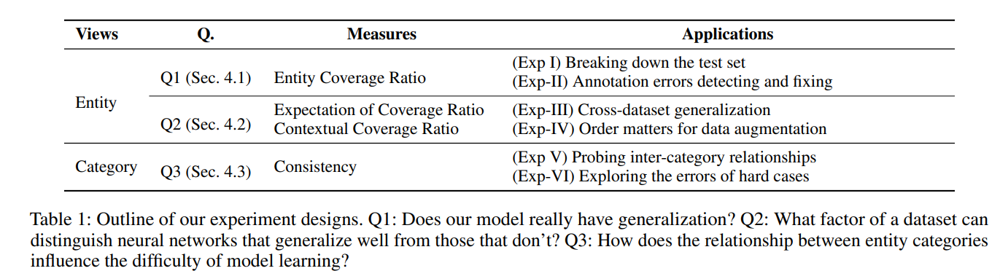

### 3.1 Task Description
- P(Y |X) = P(yt|X, y1, · · · , yt−1)
- Why do We Choose the NER Task?
  - 包含更多类别标签
  - 不同的类别包含大量的训练集
  
### 3.2 Neural Network-based Methods for NER
- 三个方面
  - character-, word-, and sentencelevel encoders and decoders
  - 所有模型使用LSTM作为句子编码，CRF作为解码

- CnoneWrandlstmCrf
- CcnnWglovelstmMLP

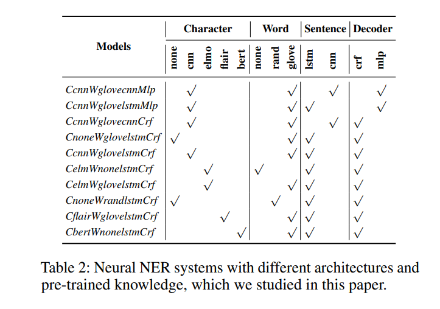

### 3.3 NER Datasets for Evaluation
- CoNLL2003 NER dataset
- WNUT16 dataset
- OntoNotes 5.0 dataset

## 4 Experiment and Analysis
### 4.1 Diagnosing Generalization with Entity Coverage Ratio
- 使用整体的F1不能分析一个系统的强项和弱点
- 聚焦到影响网络泛化能力的部分
- entity coverage ratio (ECR)  实体覆盖率

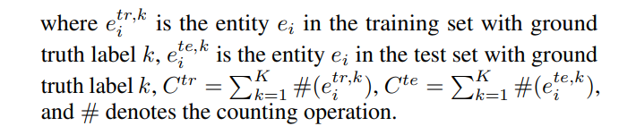

#### Exp-I: Breaking Down the Test Set
- 测试集中高性能的往往出现在训练集，相反成立
- 不管使用哪种预训练模型，未见的实体都会有大的提升
- ELMO和FLAIR在未见实体上都有提升，对于可见实体未显示大的增益
- 相比Rand，CNN显示在未见实体上更好性能
- C不等于0是最难的部分，紧跟着C=0的部分，在训练集中被标注为另一类的标本比训练集中未见的标本更难
- 基于字的和基于词的预训练嵌入是互补，合并两者能够提高性能

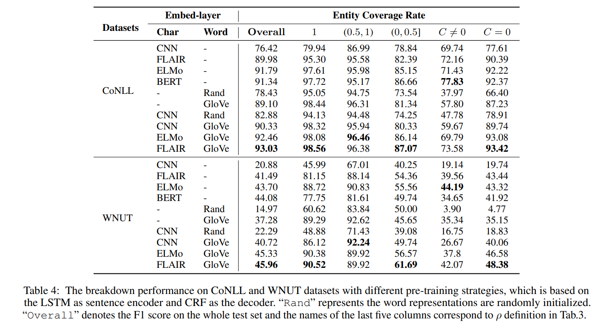

#### Exp-II: Annotation Errors Detecting and Fixing
Detecting Errors
:  ρ = 0, C != 0
ρ ∈ (0, 0.5]

Fixing Errors
: 虽然之前有发现标注错误，但是纠正错误能反应系统的实际泛化能力，使我们能识别系统真正的弱点

Evaluation on Revised CoNLL (ReCoNLL)
: 修改65句test，14句训练集

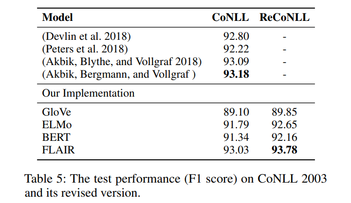

### 4.2 Measuring Dataset Bias
数据集的什么因素能够分辨网络的泛化能力

Expectation of Entity Coverage Ratio (EECR)
: 
所有测试集中的实体在训练集中出现的期望

Contextual Coverage Ratio (CCR)
: 训练集和测试集中同类实体的上下文相似度

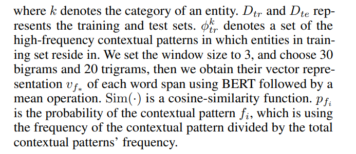

#### Exp-III: Cross-dataset Generalization
Data Construction: PLONER
: 数据集  entities (PERSON, LOCATION, ORGANIZATION) from different domains

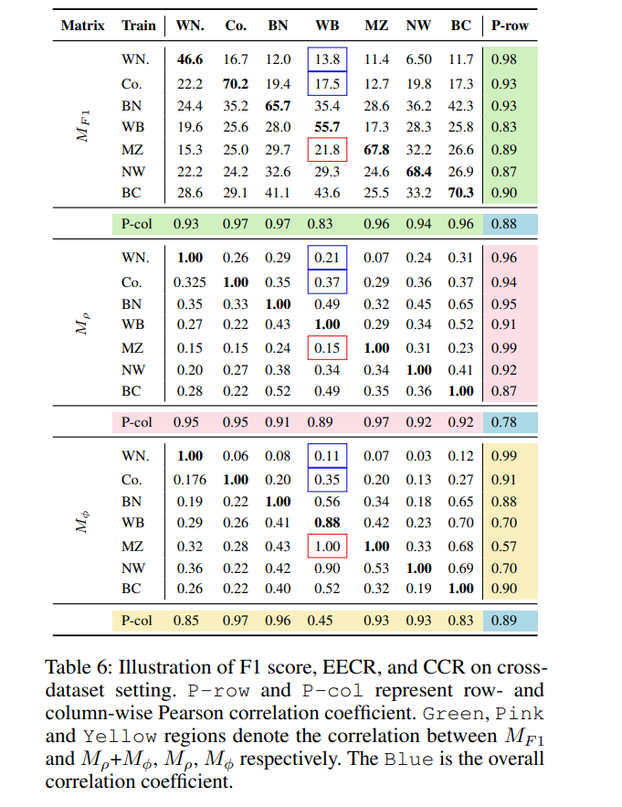
- 不同领域下的模型泛化能力较差
- 另外Mρ 和 Mφ也是对角线最高，expectation of coverage ratio (Mρ), contextual coverage ratio (Mφ) correlate closely with F1-score Mρ
- 基于ρ and φ进行跨领域的训练集的选择
- 高EECR也可能低F1，CCR也同样影响

#### Exp-IV: Order Matters for Data Augmentation
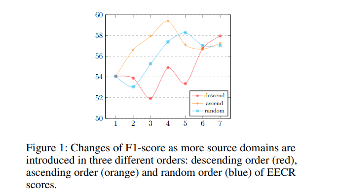
根据不同的添加方式将训练集按照EECR分数加入到训练集中
注意添加训练集并不一定能提高系统的性能

### 4.3 Diagnosing Generalization with Consistency
- 类别之间的关系如何影响模型学习的难度

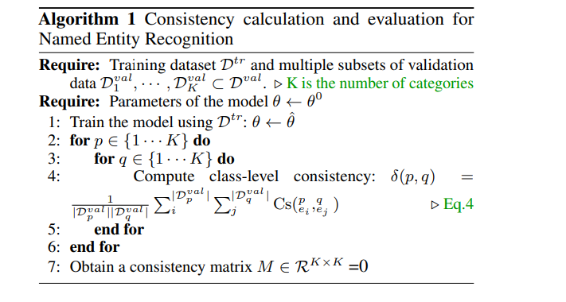
- 使用模型对测试样例更新的梯度行为来刻画模型的泛化能力
- 针对样本的相似度用其梯度的余弦相似度来刻画其一致性，该方法最早是在图像分类中被发现

Consistency Evaluation for NER
: 
通过测试样本的梯度相似性来统计两个类别的相似性

#### Exp-V: Probing Inter-category Relationships via Consistency
- 对角线上是同类实体中的实体，其值比较高，可以理解为针对其中一个实体的更新特征同样可以使用到同类的另外的实体上面
- 非对角线上更大的值显示两类共享更多的共同属性
  - Percent category and Ordinal category shared a common property of “digit”
  - Sibling Categories
- 如何值为负数，则表示更新某一类会导致另外的类别的loss增加
  - Overlapping Categories
  - 常表现为同样的实体具有不同的类别，如去纽约大学（地名）、纽约大学足球队（组织名）
- 相似为0，则表示两者无共同实体也不具有公共的性质
  - Orthogonal Categories

#### Exp-VI: Exploring the Errors of Hard Cases
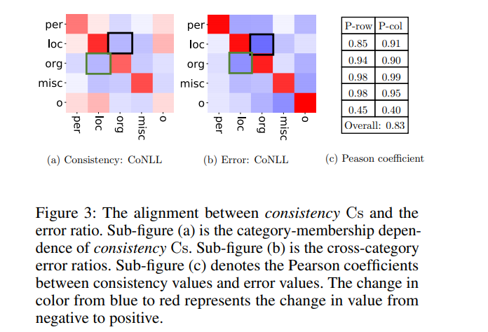
- 如果两个类别含有较低的一致性，则比较难于区分两种类别，往往将其中一种预测为另外一种

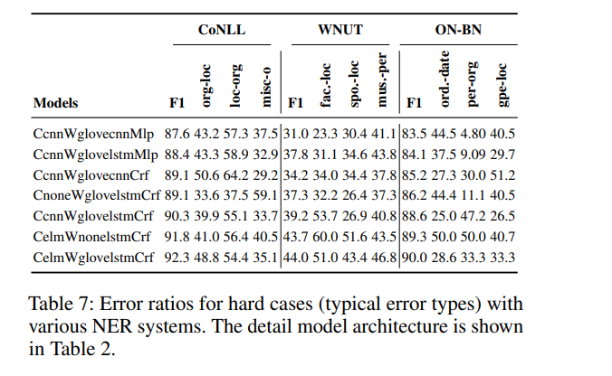
- 结构改变以及基于知识的预训练提升看上去是有限制的
- 解决该问题，更多上下文知识以及先验语言知识是需要的

## 5 Acknowledgments
- 略

