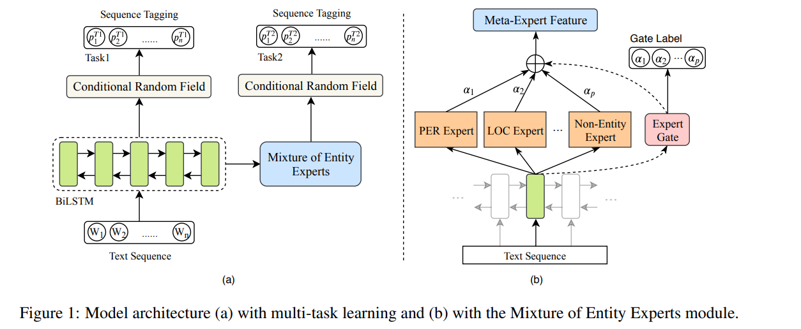
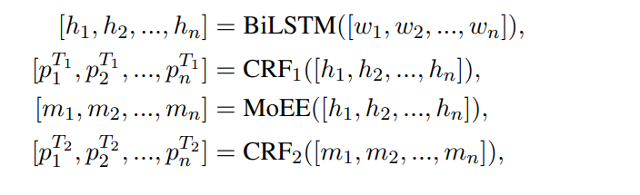
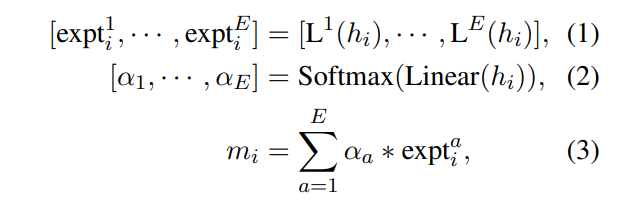
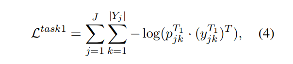
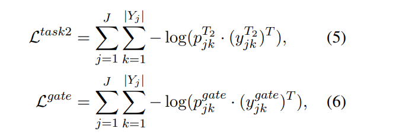
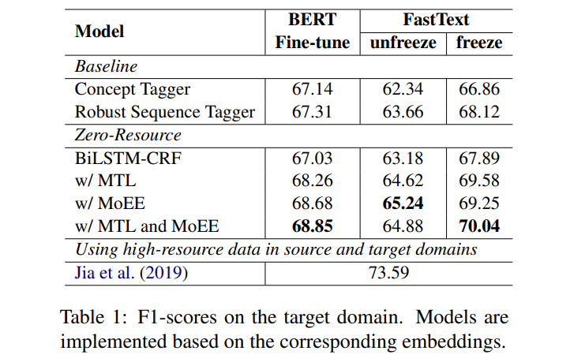
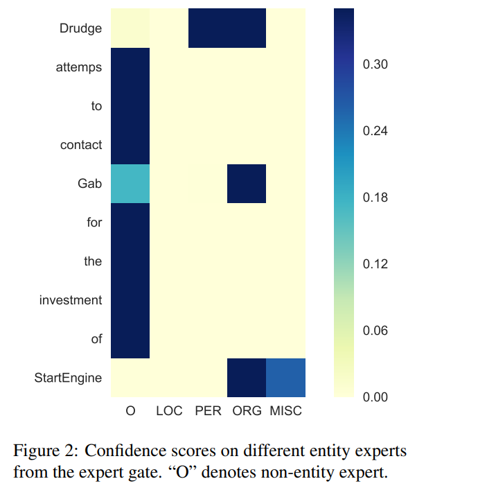

# Zero-Resource Cross-Domain Named Entity Recognition

[toc]

## Abstract
- 当前跨领域模型需要目标领域的大量未标注数据或者标注的训练数据，收集语料昂贵且耗时
- 首先添加Multi-Task Learning (MTL)来学习一个新目标函数用来判断是否为实体
- 使用Mixture of Entity Experts (MoEE)来提高目标领域适配的性能

## 1 Introduction
- 在低训练集上表现出性能下降，方法是在高资源上进行训练采用跨领域的方法
- 之前的方法都是考虑源领域和目标领域都有标注数据的情况
- 论文(Crossdomain ner using cross-domain language modeling)则要求有另外的未标注的源以及目标数据集
- 举例： Arafat subsequently cancelled a meeting between Israeli and PLO officials
  - Arafat 可以为人名也可以为机构名，这样会导致混淆以及在0语料适配上更加困难
- 直觉上可以从不同的专家那里获取意见，因此引入MoEE

## 2 Related Work
- 当前的方法都涉及到源目标标注数据
  - 2017 Transfer learning for sequence tagging with hierarchical recurrent networks 在源以及目标领域联合训练，共享参数
  - 2018  Neural adaptation layers for cross-domain named entity recognition 在模型添加新的适配层
  - 2018  Label-aware double transfer learning for cross-specialty medical named entity recognition 引入 label-aware feature representations 
  - 2019  Crossdomain ner using cross-domain language modeling 源领域以及目标的非标注数据都需要来训练一个语言模型

## 3 Methodology

### 3.1 Multi-Task Learning
- 我们使用一个任务来判断一个单词是否是实体，见图中的Task1，训练集中非标注实体为单一类别，其他归为一个类别，也即是二分类
- 原始的NER，如图中的task2，预测实际的类别

 CRF1 and CRF2 分别表示 Task1 and Task2 的CRF 层

### 3.2 Mixture of Entity Experts
- 由于不同的实体类别容易混淆，因此在实体预测时容易过拟合且降低泛化能力
-  MoEE合并多个专家给出的表示形成最终预测
-  注意：我们考虑非实体作为一个特殊的实体类别
- expert gate 由线性层+softmax组成，我们使用task2的进行监督训练

    - 首先通过hi的线性以及softmax生成一个E维的权重
    - 然后hi会经过E个线性变换产生E维的expt

### 3.3 Optimization
针对task1，task2以及gate 损失函数都使用交叉熵

## 4 Experiments

### 4.1 Dataset
- CoNLL-2003 English NER    15.0K/3.5K/3.7K
- target domain:  2K sentences from SciTech News
- PER (person), LOC (location), ORG (organization), and MISC (miscellaneous)

### 4.2 Experimental Setup
- FastText word embeddings /  pre-trained model BERT
  - 都能解决OOV问题
  - FastText word embeddings
  - BPE encoding

### 4.3 Results & Discussion

其中jia是使用语言模型进行训练那个
结果有提升
unfreezed结果没有固定嵌入层的更好可能是因为微调导致对源领域过拟合了，BERT也是如此

- 非实体专家能给非实体大量的的权重
- 而Drudge，人名以及机构名专家都能给高信心

## 5 Conclusion
略
