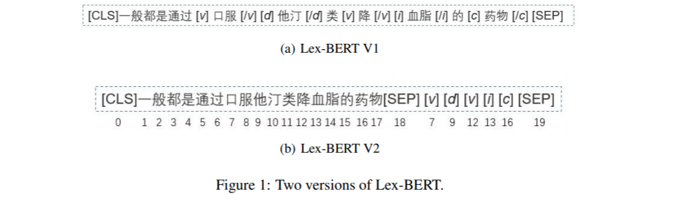
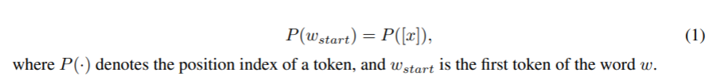
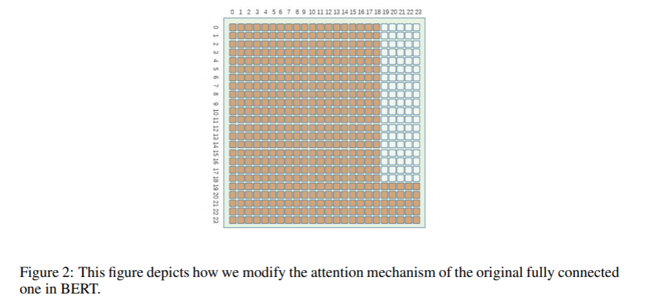
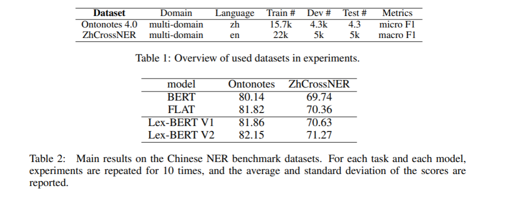
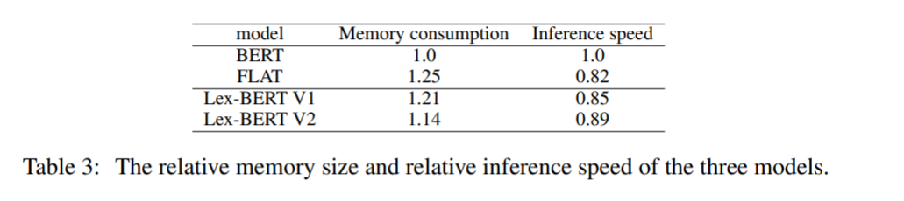

<!-- TOC -->

- [Lex-BERT: Enhancing BERT based NER with lexicons](#lex-bert-enhancing-bert-based-ner-with-lexicons)
  - [ABSTRACT](#abstract)
  - [1 INTRODUCTION 引言](#1-introduction-引言)
  - [2 METHOD 方法](#2-method-方法)
    - [2.1 LEX-BERT V1](#21-lex-bert-v1)
    - [2.2 LEX-BERT V2](#22-lex-bert-v2)
  - [3 EXPERIMENTS 实验](#3-experiments-实验)

<!-- /TOC -->
# Lex-BERT: Enhancing BERT based NER with lexicons 
- Lex-BERT: 用词典增强基于 BERT 的 NER
- https://arxiv.org/abs/2101.00396

## ABSTRACT
- 将词典信息自然地整合到中文 BERT 中，实现命名实体识别任务。我们使用特殊的标记来识别句子中的词的边界，修改后的句子将直接由 BERT 进行编码，而不是使用 FLAT 中的词的嵌入和新设计的转换层。我们的模型没有引入任何新的参数，而且比 FLAT 更有效。此外，我们不要求词典集合附带任何单词嵌入。在 MSRA 和 ZhCrossNER 上的实验结果表明，该模型的性能优于 FLAT 和其他基线

## 1 INTRODUCTION 引言
- 加入词汇信息可以显著提高下游任务的表现(li-etal-2020-flat)。然而，如果没有引入额外的结构，就没有工作可以在 BERT 中包含单词信息。在我们的工作中，我们提出了词法 BERT (lex-BERT) ，一种利用基于 BERT 的 NER 模型中词汇的更方便的方法
- 比 FLAT 有三个优点。首先，我们不要求单词信息带有嵌入单词模型。其次，FLAT 不能合并单词类型信息。但是，在许多域内场景中，所收集的单词具有实体类型信息，可以通过我们的方法合并这些信息。第三，我们的方法在内存消耗和推理速度方面更有效

## 2 METHOD 方法
### 2.1 LEX-BERT V1
- 在单词的左边和右边插入特殊的标记来标识一个句子中单词的跨度。这些特殊标记不仅可以标记单词的起始和结束位置，还可以向句子提供实体类型信息
- 插入的标记携带两种类型的信息。首先，如果我们的字典带有实体类型信息，我们可以通过标记将其插入到句子中。这里 v 是与医学有关的动词的缩写，d 代表药物，i 代表检查指数，c 代表医学概念术语。其次，它们表示我们词汇集合中一个单词的开始或结束。这里的起始标记是[ x ]的格式，结束标记是[/x ] ，其中 x 可以是 v，d，i 等

### 2.2 LEX-BERT V2
- 在 Lex-BERT V2中，对于句子中确定的一个单词 w，我们不在句子中单词的环境中插入开始和结束标记，而是在句子的末尾附加一个单独的标记[ x ]。注意，我们将标记的位置嵌入与单词的起始标记绑定在一起

- 另外，我们修改了 BERT 的注意矩阵，如图2所示。句子中的文本标记将只关注彼此，而不关注标记。相比之下，标记符号可以关注输入序列中的所有标记

## 3 EXPERIMENTS 实验
- 所有的模型都使用中文的 BERT-wwm-ext cui-etal-2020-revising 作为编码器。在实验过程中，我们主要关注以下几个超参数: 批量大小、学习速度、热身步骤。其他 BERT 配置与 cui-etal-2020-revising 相同。优化器是 AdamW AdamW，它是 KingmaICML15的修改版本。每个模型在给定的任务上运行10次，并报告平均性能分数和标准偏差的重复性。每个任务分配4个 CPU 内核和1个 Tesla V100 GPU 卡

- Dataset 

- FLAT 通过添加词典信息改进了 BERT。我们的 Lex-BERT V1比 FLAT 提供了稍微的改进。我们的 Lex-BERT V2执行得更好，Ontonotes 提高了0.33% ，ZhCrossNER 提高了0.91% 。结果表明，我们的 Lex-BERT 方法是有效的

- ANALYSIS OF EFFICIENCY 效率分析
Lex-BERT 比 FLAT 更快，对速度的要求也更低

