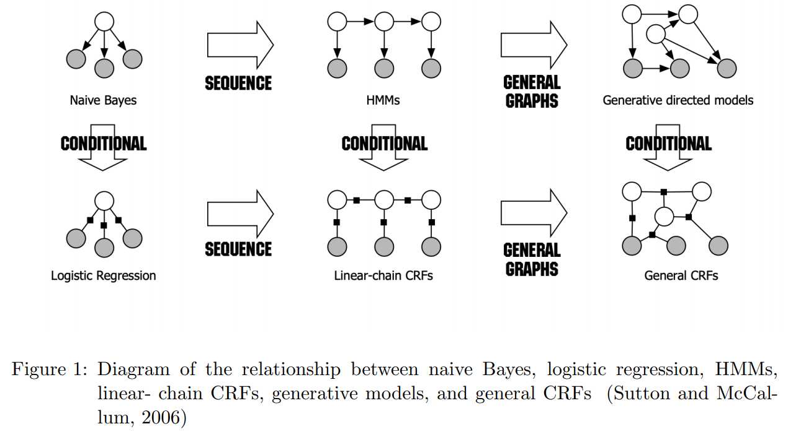

<!-- TOC -->

- [Recent Trends in Named Entity Recognition (NER)](#recent-trends-in-named-entity-recognition-ner)
  - [引言](#引言)
  - [简史](#简史)

<!-- /TOC -->
# Recent Trends in Named Entity Recognition (NER)
- https://arxiv.org/abs/2101.11420

## 引言
- “命名实体识别”是指从文本中识别重要对象(如个人、组织、位置)的自然语言处理任务

## 简史
- 最初的 NER 研究包括手工制作的基于规则的线性模型，这些模型被覆盖到一个非常具体的结构化文本集合，如军事信息集合、海军行动报告、并购新闻(Jacobs and Rau，1993)等。标准化的需求导致了 MUC-6(Grishman 和 Sundheim，1996)、 HUB-4(Chinchor 等人，1998)、 MUC-7和 MET-2(Chinchor 和 Robinson，1997)、 IREX‘(Sekine 和 Isahara，2000)、 CONLL (Sang 和 De Meulder，2003)、 ACE (Doddington 等人，2004)和 HAREM (Santos 等人，2006)
- 著名的监督式学习模型方法包括隐马尔可夫模型(HMM)(Bikel et al. ，1997) ，决策树(Sekine et al. ，1998) ，最大熵模型(ME)(Borthwick et al. ，1998) ，支持向量机(SVM)(Asahara and Matsumoto，2003) ，条件随机场(CRF)(Lafferty et al. ，2001; McCallum and Li，2003)
- 在 NER 中需要使用许多前导和滞后的非局部序列来训练输出标记的概率，这使得像 CRF 这样的判别模型更适合于生成模型，如 HMM 和随机语法
- ME 模型放松了生成模型所做的强烈的独立性假设，但是它们还是有一个弱点，叫做标签偏差问题，在这个问题中，模型偏向于几乎没有向外跃迁的状态,CRF通过联合考虑所有状态中不同特征的权重，而不是在状态层面上对转移概率进行归一化，从而解决了这个问题
- 半 CRF 模型，该模型将标签分配给子序列而不是单个实体，没有任何显著的额外计算复杂度
- 半 crf 模型的扩展，以捕捉 NER 和实体链接之间的相关性。监督式学习的方法遇到了障碍，因为可用于学习鉴别特征的结构化文本是有限的。这就导致了半监督学习的方法，利用了指数增长的非结构化文本

