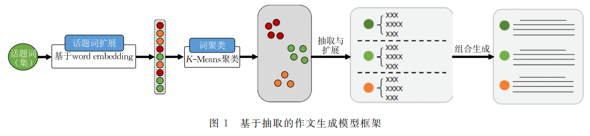

# 基于抽取的高考作文生成

[toc]

## 1 引言
- 高考作文生成更具有挑战性
  - 语句连贯性、语义清晰度，和诗歌中比较朦胧不一样
  - 端到端的生成方法
    - 出现严重的语义漂移问题
    - 出现比较多的重复以及句内不通顺

## 2 问题描述
句子抽取
: 利用给定的主题抽取出合适的作文候选句

段落生成
: 使用句子排序的方法对句子抽取模块得到的结果进行组合

## 3 方法

### 3.1 句子抽取
- 使用语义表示（用skip-gram模型训练词向量）抽取作文候选句是不够的
- 段落内语句具有丰富的语义层次
- 因此先抽取再进行扩展
  - 基于关联规则的扩展
  - 基于ＬＤＡ的句子扩展

#### 3.1.1 

