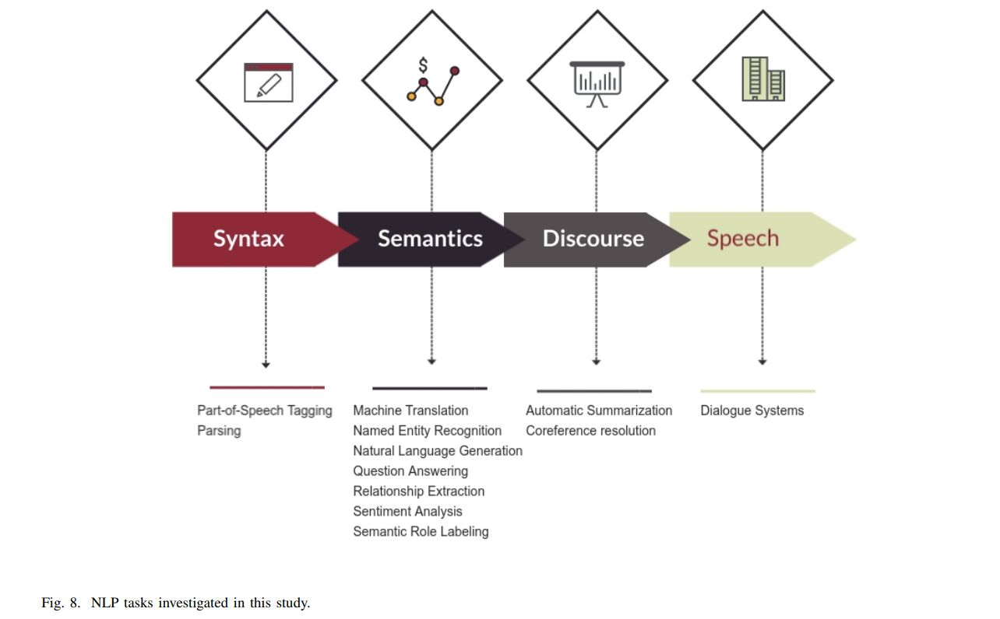
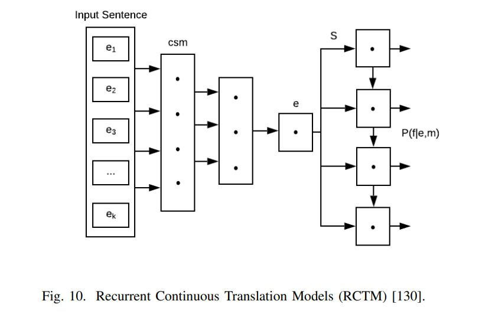
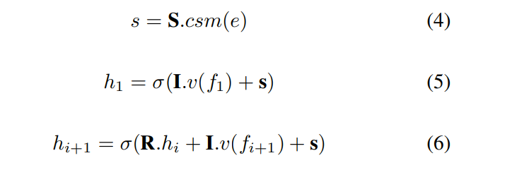
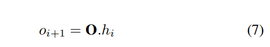
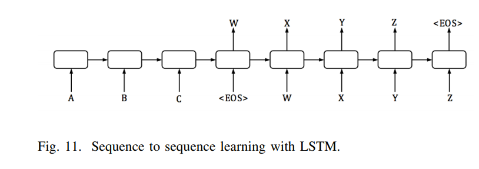
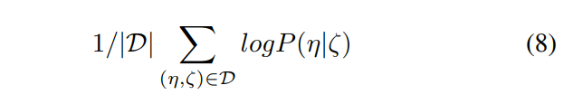
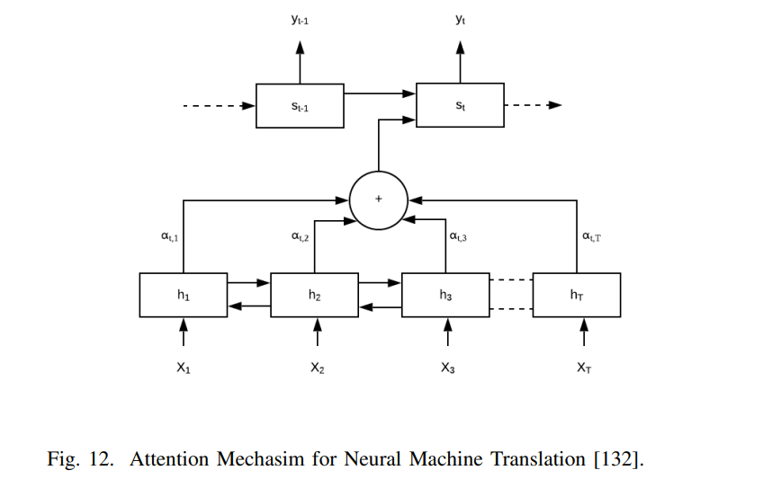
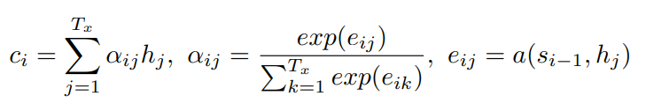

# Natural Language Processing Advancements By Deep Learning: A Survey

[toc]

- https://arxiv.org/abs/2003.01200

## I. INTRODUCTION

## II. BACKGROUND
### II-A ARTIFICIAL INTELLIGENCE AND DEEP LEARNING
- 一个目标是扩展当前信息处理技术到
    - 生成、通信、存储数据
    - 将数据处理成知识
- 当前大量的数据无法被处理
    - 忽略掉
    - 将当前数据转换为决策者和其他人可以理解的基本信息
- 深度学习是海量数据与AI之间的桥梁

定义
: 深度学习是检测和分析数据中的重要结构/特征，旨在为给定问题制定解决方案

__深度学习架构__
- 多层感知器（MLP）
MLP是前馈神经网络  （FNN）最简单的类型。FNN代表神经网络的一般类别，其中节点之间的连接不创建任何循环，即，在FNN中，不存在信息流的循环。
- 卷积神经网络（CNN）
受人类视觉皮层启发，是前馈神经网络的子类
将CNN用于NLP的情况下，输入是表示为矩阵的句子或文档。矩阵的每一行都与语言元素（例如单词或字符）相关联。大多数CNN架构在其训练阶段都学习单词或句子的表示形式
- 归神经网络（RNN）
循环神经网络中的隐藏层可以承载过去的信息，换句话说，就是记忆。此特性使它们特别适用于处理一系列输入的应用程序，例如语言建模
- 自动编码器
在降维中被广泛使用或由序列到序列建模组成的NLP应用.  降维是一种无监督的学习方法，它是通过识别最关键的信息来减少用于表示数据的变量数量的过程
自动编码器是有损的，这意味着输出是输入的近似重建
- 生成对抗网络（GANs）
生成器的目标是以使鉴别器认为由生成器合成的人工（即生成的）样本是真实的方式来欺骗鉴别器
这个迭代过程一直持续到生成器生成由鉴别器无法区分的样本为止

### II-BMOTIVATION FOR DEEP LEARNING IN NLP
- 基于
    - 特征表示
        - 词袋模型：
            - 忽略单词的顺序和交互，并将每个单词视为唯一特征
            - 忽略了语法结构，但为某些认为依赖语法的应用提供了不错的结果。结果表明，简单的表示形式与大量数据结合使用可能比更复杂的表示形式效果更好或更好。这些发现证实了支持深度学习算法和架构重要性的观点
        - 神经网络语言建模突破
            - 学习单词的分布式表示
            - 提供序列的概率函数来克服维数的诅咒
        - 传统方法首先是通过对特定应用程序进行仔细的人工分析来进行费时的特征构造，然后是开发算法以提取和利用这些功能的实例。另一方面，深度监督的特征学习方法是高度数据驱动的，可用于旨在提供可靠数据表示的更一般性的工作中
        - 由于大量未标记的数据，无监督的特征学习被认为是NLP中的关键任务。本质上，无监督特征学习是从未标记的数据中学习特征，以提供高维数据空间的低维表示
    - 深度学习算法以及架构的选择

## III. CORE CONCEPTS IN NLP
### III-A FEATURE REPRESENTATION
- 分布式表示形式是一系列紧凑的，低维的数据表示形式，每个表示形式都具有一些独特的信息属性
    - 对于NLP系统，由于与符号的原子表示有关的问题，必须学习单词表示
- 编码后的输入特征可以是字符，单词，句子或其他语言元素。通常，与稀疏单词相比，更希望提供单词的紧凑表示

- 如何选择文本表示的结构和级别
    - word2vec方法
    - doc2vec作为一种无监督算法，被称为Paragraph Vector（PV）。PV的目标是从可变长度的文本部分（例如句子和文档）中学习定长表示形式
    - skip-thought利用编码器-解码器体系结构

one-hot
: 高维稀疏表示，特征空间中不同单词之间没有有意义的联系

Continuous Bag of Words
: 尝试根据给定的周围上下文来预测一个单词
不依赖于单词的顺序也不依赖于概率特征。因此，它通常不用于语言建模

Word-Level Embedding
: 学习分布式表示都利用上下文中的词使用优势，为语义相关的词提供相似的表示

Character-Level Embedding
: 较低级别的表示形式（例如字符级表示形式）也需要特别注意，因为它们的表示形式简单并且可以纠正不正确的字符组合（例如拼写错误）
已成功利用了CNN生成字符级嵌入 
优点之一是能够使用较小的模型大小并使用较低级别的语言元素表示单词
采用字符级嵌入的另一个动机是词汇外词（OOV）问题
使用子词为OOV实例创建单词嵌入以及在相关单词之间建立语义桥梁

### III-B　SEQ2SEQ FRAMEWORK
- 文本摘要, 语音转文本和文本转语音
- 常见的seq2seq框架由编码器和解码器组成
    - 编码器提取输入数据的序列，并生成一个中间输出，随后由解码器以产生一系列最终输出。编码器和解码器通常通过一系列RNN或LSTM单元来实现
- 最广泛的训练方法之一是 tearcher force

生成时公式

- 可以通过Beam Search来找到合理的输出序列来改善输出
- 使用ROUGE，BLEU 和METEOR 来评估指标 

### III-C REINFORCEMENT LEARNING IN NLP
- seq2seq模型面临两个问题
    - exposure bias
        - 训练的时候是正确的y_t-1预测y_t，而在测试环境下极有可能y_t-1是错误的，其依赖于之前的预测
        - 训练偏差在测试阶段会导致错误的增长
        - remove the ground-truth dependency in training by solely relying on model distribution to minimize the cross-entropy loss
            - Scheduled sampling
                - first pre-train the model using cross-entropy loss and then slowly replace the ground-truth with samples the model generates 先使用交叉熵损失对模型进行预训练，然后用模型生成的样本缓慢替换原始输入
    - inconsistency between training time and test time measurements
        - 使用交叉熵损失完成训练时，通常使用诸如ROUGE或METEOR之类的不可微量度对其进行评估。这将在培训目标和测试评估指标之间形成不一致
    - 证明可以通过利用强化学习的技术来解决这两个问题
        - 策略梯度技术（例如REINFORCE算法）和基于行为者批评的模型（例如基于值的迭代  ）和Q学习
        

## IV. DATASETS
基准数据集通常采用以下三种形式
- 从各种实际实验中获得的实际数据
- 人工模拟模拟现实世界模式的合成数据
- 玩具数据集，用于演示和可视化目的

深度学习利用的基础是数据的可用性，以教会系统有关模式识别的知识。模型的有效性取决于数据的质量

创建数据集
- 询问:  我们要做什么以及需要解决什么问题？ 和 我们需要什么样的数据以及需要多少数据？
- 创建Train和Test部分

<table class="ltx_tabular ltx_guessed_headers ltx_align_middle">
<thead class="ltx_thead">
<tr class="ltx_tr">
<th class="ltx_td ltx_align_center ltx_th ltx_th_column ltx_border_l ltx_border_r ltx_border_t">Task</th>
<th class="ltx_td ltx_align_center ltx_th ltx_th_column ltx_border_r ltx_border_t">Dataset</th>
<th class="ltx_td ltx_align_left ltx_th ltx_th_column ltx_border_r ltx_border_t">Link</th>
</tr>
</thead>
<tbody class="ltx_tbody">
<tr class="ltx_tr">
<td class="ltx_td ltx_align_center ltx_border_l ltx_border_r ltx_border_t">Machine Translation</td>
<td class="ltx_td ltx_align_center ltx_border_r ltx_border_t">
<table class="ltx_tabular ltx_align_middle">
<tbody><tr class="ltx_tr">
<td class="ltx_td ltx_align_center">WMT 2014 EN-DE</td>
</tr>
<tr class="ltx_tr">
<td class="ltx_td ltx_align_center">WMT 2014 EN-FR</td>
</tr>
</tbody></table>
</td>
<td class="ltx_td ltx_align_left ltx_border_r ltx_border_t"><a class="ltx_ref ltx_url ltx_font_typewriter" href="http://www-lium.univ-lemans.fr/~schwenk/cslm_joint_paper/" target="_blank" title="">http://www-lium.univ-lemans.fr/~schwenk/cslm_joint_paper/</a></td>
</tr>
<tr class="ltx_tr">
<td class="ltx_td ltx_align_center ltx_border_l ltx_border_r ltx_border_t">Text Summarization</td>
<td class="ltx_td ltx_align_center ltx_border_r ltx_border_t">
<table class="ltx_tabular ltx_align_middle">
<tbody><tr class="ltx_tr">
<td class="ltx_td ltx_align_center">CNN/DM</td>
</tr>
<tr class="ltx_tr">
<td class="ltx_td ltx_align_center">Newsroom</td>
</tr>
<tr class="ltx_tr">
<td class="ltx_td ltx_align_center">DUC</td>
</tr>
<tr class="ltx_tr">
<td class="ltx_td ltx_align_center">Gigaword</td>
</tr>
</tbody></table>
</td>
<td class="ltx_td ltx_align_left ltx_border_r ltx_border_t">
<table class="ltx_tabular ltx_align_middle">
<tbody><tr class="ltx_tr">
<td class="ltx_td ltx_align_left"><a class="ltx_ref ltx_url ltx_font_typewriter" href="https://cs.nyu.edu/~kcho/DMQA/" target="_blank" title="">https://cs.nyu.edu/~kcho/DMQA/</a></td>
</tr>
<tr class="ltx_tr">
<td class="ltx_td ltx_align_left"><a class="ltx_ref ltx_url ltx_font_typewriter" href="https://summari.es/" target="_blank" title="">https://summari.es/</a></td>
</tr>
<tr class="ltx_tr">
<td class="ltx_td ltx_align_left"><a class="ltx_ref ltx_url ltx_font_typewriter" href="https://www-nlpir.nist.gov/projects/duc/data.html" target="_blank" title="">https://www-nlpir.nist.gov/projects/duc/data.html</a></td>
</tr>
<tr class="ltx_tr">
<td class="ltx_td ltx_align_left"><a class="ltx_ref ltx_url ltx_font_typewriter" href="https://catalog.ldc.upenn.edu/LDC2012T21" target="_blank" title="">https://catalog.ldc.upenn.edu/LDC2012T21</a></td>
</tr>
</tbody></table>
</td>
</tr>
<tr class="ltx_tr">
<td class="ltx_td ltx_align_center ltx_border_l ltx_border_r ltx_border_t">
<table class="ltx_tabular ltx_align_middle">
<tbody><tr class="ltx_tr">
<td class="ltx_td ltx_align_center">Reading Comprehension</td>
</tr>
<tr class="ltx_tr">
<td class="ltx_td ltx_align_center">Question Answering</td>
</tr>
<tr class="ltx_tr">
<td class="ltx_td ltx_align_center">Question Generation</td>
</tr>
</tbody></table>
</td>
<td class="ltx_td ltx_align_center ltx_border_r ltx_border_t">
<table class="ltx_tabular ltx_align_middle">
<tbody><tr class="ltx_tr">
<td class="ltx_td ltx_align_center">ARC</td>
</tr>
<tr class="ltx_tr">
<td class="ltx_td ltx_align_center">CliCR</td>
</tr>
<tr class="ltx_tr">
<td class="ltx_td ltx_align_center">CNN/DM</td>
</tr>
<tr class="ltx_tr">
<td class="ltx_td ltx_align_center">NewsQA</td>
</tr>
<tr class="ltx_tr">
<td class="ltx_td ltx_align_center">RACE</td>
</tr>
<tr class="ltx_tr">
<td class="ltx_td ltx_align_center">SQuAD</td>
</tr>
<tr class="ltx_tr">
<td class="ltx_td ltx_align_center">Story Cloze Test</td>
</tr>
<tr class="ltx_tr">
<td class="ltx_td ltx_align_center">NarativeQA</td>
</tr>
<tr class="ltx_tr">
<td class="ltx_td ltx_align_center">Quasar</td>
</tr>
<tr class="ltx_tr">
<td class="ltx_td ltx_align_center">SearchQA</td>
</tr>
</tbody></table>
</td>
<td class="ltx_td ltx_align_left ltx_border_r ltx_border_t">
<table class="ltx_tabular ltx_align_middle">
<tbody><tr class="ltx_tr">
<td class="ltx_td ltx_align_left"><a class="ltx_ref ltx_url ltx_font_typewriter" href="http://data.allenai.org/arc/" target="_blank" title="">http://data.allenai.org/arc/</a></td>
</tr>
<tr class="ltx_tr">
<td class="ltx_td ltx_align_left"><a class="ltx_ref ltx_url ltx_font_typewriter" href="http://aclweb.org/anthology/N18-1140" target="_blank" title="">http://aclweb.org/anthology/N18-1140</a></td>
</tr>
<tr class="ltx_tr">
<td class="ltx_td ltx_align_left"><a class="ltx_ref ltx_url ltx_font_typewriter" href="https://cs.nyu.edu/~kcho/DMQA/" target="_blank" title="">https://cs.nyu.edu/~kcho/DMQA/</a></td>
</tr>
<tr class="ltx_tr">
<td class="ltx_td ltx_align_left"><a class="ltx_ref ltx_url ltx_font_typewriter" href="https://datasets.maluuba.com/NewsQA" target="_blank" title="">https://datasets.maluuba.com/NewsQA</a></td>
</tr>
<tr class="ltx_tr">
<td class="ltx_td ltx_align_left"><a class="ltx_ref ltx_url ltx_font_typewriter" href="http://www.qizhexie.com/data/RACE_leaderboard" target="_blank" title="">http://www.qizhexie.com/data/RACE_leaderboard</a></td>
</tr>
<tr class="ltx_tr">
<td class="ltx_td ltx_align_left"><a class="ltx_ref ltx_url ltx_font_typewriter" href="https://rajpurkar.github.io/SQuAD-explorer/" target="_blank" title="">https://rajpurkar.github.io/SQuAD-explorer/</a></td>
</tr>
<tr class="ltx_tr">
<td class="ltx_td ltx_align_left"><a class="ltx_ref ltx_url ltx_font_typewriter" href="http://aclweb.org/anthology/W17-0906.pdf" target="_blank" title="">http://aclweb.org/anthology/W17-0906.pdf</a></td>
</tr>
<tr class="ltx_tr">
<td class="ltx_td ltx_align_left"><a class="ltx_ref ltx_url ltx_font_typewriter" href="https://github.com/deepmind/narrativeqa" target="_blank" title="">https://github.com/deepmind/narrativeqa</a></td>
</tr>
<tr class="ltx_tr">
<td class="ltx_td ltx_align_left"><a class="ltx_ref ltx_url ltx_font_typewriter" href="https://github.com/bdhingra/quasar" target="_blank" title="">https://github.com/bdhingra/quasar</a></td>
</tr>
<tr class="ltx_tr">
<td class="ltx_td ltx_align_left"><a class="ltx_ref ltx_url ltx_font_typewriter" href="https://github.com/nyu-dl/SearchQA" target="_blank" title="">https://github.com/nyu-dl/SearchQA</a></td>
</tr>
</tbody></table>
</td>
</tr>
<tr class="ltx_tr">
<td class="ltx_td ltx_align_center ltx_border_l ltx_border_r ltx_border_t">Semantic Parsing</td>
<td class="ltx_td ltx_align_center ltx_border_r ltx_border_t">
<table class="ltx_tabular ltx_align_middle">
<tbody><tr class="ltx_tr">
<td class="ltx_td ltx_align_center">AMR parsing</td>
</tr>
<tr class="ltx_tr">
<td class="ltx_td ltx_align_center">ATIS (SQL Parsing)</td>
</tr>
<tr class="ltx_tr">
<td class="ltx_td ltx_align_center">WikiSQL (SQL Parsing)</td>
</tr>
</tbody></table>
</td>
<td class="ltx_td ltx_align_left ltx_border_r ltx_border_t">
<table class="ltx_tabular ltx_align_middle">
<tbody><tr class="ltx_tr">
<td class="ltx_td ltx_align_left"><a class="ltx_ref ltx_url ltx_font_typewriter" href="https://amr.isi.edu/index.html" target="_blank" title="">https://amr.isi.edu/index.html</a></td>
</tr>
<tr class="ltx_tr">
<td class="ltx_td ltx_align_left"><a class="ltx_ref ltx_url ltx_font_typewriter" href="https://github.com/jkkummerfeld/text2sql-data/tree/master/data" target="_blank" title="">https://github.com/jkkummerfeld/text2sql-data/tree/master/data</a></td>
</tr>
<tr class="ltx_tr">
<td class="ltx_td ltx_align_left"><a class="ltx_ref ltx_url ltx_font_typewriter" href="https://github.com/salesforce/WikiSQL" target="_blank" title="">https://github.com/salesforce/WikiSQL</a></td>
</tr>
</tbody></table>
</td>
</tr>
<tr class="ltx_tr">
<td class="ltx_td ltx_align_center ltx_border_l ltx_border_r ltx_border_t">Sentiment Analysis</td>
<td class="ltx_td ltx_align_center ltx_border_r ltx_border_t">
<table class="ltx_tabular ltx_align_middle">
<tbody><tr class="ltx_tr">
<td class="ltx_td ltx_align_center">IMDB Reviews</td>
</tr>
<tr class="ltx_tr">
<td class="ltx_td ltx_align_center">SST</td>
</tr>
<tr class="ltx_tr">
<td class="ltx_td ltx_align_center">Yelp Reviews</td>
</tr>
<tr class="ltx_tr">
<td class="ltx_td ltx_align_center">Subjectivity Dataset</td>
</tr>
</tbody></table>
</td>
<td class="ltx_td ltx_align_left ltx_border_r ltx_border_t">
<table class="ltx_tabular ltx_align_middle">
<tbody><tr class="ltx_tr">
<td class="ltx_td ltx_align_left"><a class="ltx_ref ltx_url ltx_font_typewriter" href="http://ai.stanford.edu/~amaas/data/sentiment/" target="_blank" title="">http://ai.stanford.edu/~amaas/data/sentiment/</a></td>
</tr>
<tr class="ltx_tr">
<td class="ltx_td ltx_align_left"><a class="ltx_ref ltx_url ltx_font_typewriter" href="https://nlp.stanford.edu/sentiment/index.html" target="_blank" title="">https://nlp.stanford.edu/sentiment/index.html</a></td>
</tr>
<tr class="ltx_tr">
<td class="ltx_td ltx_align_left"><a class="ltx_ref ltx_url ltx_font_typewriter" href="https://www.yelp.com/dataset/challenge" target="_blank" title="">https://www.yelp.com/dataset/challenge</a></td>
</tr>
<tr class="ltx_tr">
<td class="ltx_td ltx_align_left"><a class="ltx_ref ltx_url ltx_font_typewriter" href="http://www.cs.cornell.edu/people/pabo/movie-review-data/" target="_blank" title="">http://www.cs.cornell.edu/people/pabo/movie-review-data/</a></td>
</tr>
</tbody></table>
</td>
</tr>
<tr class="ltx_tr">
<td class="ltx_td ltx_align_center ltx_border_l ltx_border_r ltx_border_t">Text Classification</td>
<td class="ltx_td ltx_align_center ltx_border_r ltx_border_t">
<table class="ltx_tabular ltx_align_middle">
<tbody><tr class="ltx_tr">
<td class="ltx_td ltx_align_center">AG News</td>
</tr>
<tr class="ltx_tr">
<td class="ltx_td ltx_align_center">DBpedia</td>
</tr>
<tr class="ltx_tr">
<td class="ltx_td ltx_align_center">TREC</td>
</tr>
<tr class="ltx_tr">
<td class="ltx_td ltx_align_center">20 NewsGroup</td>
</tr>
</tbody></table>
</td>
<td class="ltx_td ltx_align_left ltx_border_r ltx_border_t">
<table class="ltx_tabular ltx_align_middle">
<tbody><tr class="ltx_tr">
<td class="ltx_td ltx_align_left"><a class="ltx_ref ltx_url ltx_font_typewriter" href="http://www.di.unipi.it/~gulli/AG_corpus_of_news_articles.html" target="_blank" title="">http://www.di.unipi.it/~gulli/AG_corpus_of_news_articles.html</a></td>
</tr>
<tr class="ltx_tr">
<td class="ltx_td ltx_align_left"><a class="ltx_ref ltx_url ltx_font_typewriter" href="https://wiki.dbpedia.org/Datasets" target="_blank" title="">https://wiki.dbpedia.org/Datasets</a></td>
</tr>
<tr class="ltx_tr">
<td class="ltx_td ltx_align_left"><a class="ltx_ref ltx_url ltx_font_typewriter" href="https://trec.nist.gov/data.html" target="_blank" title="">https://trec.nist.gov/data.html</a></td>
</tr>
<tr class="ltx_tr">
<td class="ltx_td ltx_align_left"><a class="ltx_ref ltx_url ltx_font_typewriter" href="http://qwone.com/~jason/20Newsgroups/" target="_blank" title="">http://qwone.com/~jason/20Newsgroups/</a></td>
</tr>
</tbody></table>
</td>
</tr>
<tr class="ltx_tr">
<td class="ltx_td ltx_align_center ltx_border_l ltx_border_r ltx_border_t">Natural Language Inference</td>
<td class="ltx_td ltx_align_center ltx_border_r ltx_border_t">
<table class="ltx_tabular ltx_align_middle">
<tbody><tr class="ltx_tr">
<td class="ltx_td ltx_align_center">SNLI Corpus</td>
</tr>
<tr class="ltx_tr">
<td class="ltx_td ltx_align_center">MultiNLI</td>
</tr>
<tr class="ltx_tr">
<td class="ltx_td ltx_align_center">SciTail</td>
</tr>
</tbody></table>
</td>
<td class="ltx_td ltx_align_left ltx_border_r ltx_border_t">
<table class="ltx_tabular ltx_align_middle">
<tbody><tr class="ltx_tr">
<td class="ltx_td ltx_align_left"><a class="ltx_ref ltx_url ltx_font_typewriter" href="https://nlp.stanford.edu/projects/snli/" target="_blank" title="">https://nlp.stanford.edu/projects/snli/</a></td>
</tr>
<tr class="ltx_tr">
<td class="ltx_td ltx_align_left"><a class="ltx_ref ltx_url ltx_font_typewriter" href="https://www.nyu.edu/projects/bowman/multinli/" target="_blank" title="">https://www.nyu.edu/projects/bowman/multinli/</a></td>
</tr>
<tr class="ltx_tr">
<td class="ltx_td ltx_align_left"><a class="ltx_ref ltx_url ltx_font_typewriter" href="http://data.allenai.org/scitail/" target="_blank" title="">http://data.allenai.org/scitail/</a></td>
</tr>
</tbody></table>
</td>
</tr>
<tr class="ltx_tr">
<td class="ltx_td ltx_align_center ltx_border_b ltx_border_l ltx_border_r ltx_border_t">Semantic Role Labeling</td>
<td class="ltx_td ltx_align_center ltx_border_b ltx_border_r ltx_border_t">
<table class="ltx_tabular ltx_align_middle">
<tbody><tr class="ltx_tr">
<td class="ltx_td ltx_align_center">Proposition Bank</td>
</tr>
<tr class="ltx_tr">
<td class="ltx_td ltx_align_center">OneNotes</td>
</tr>
</tbody></table>
</td>
<td class="ltx_td ltx_align_left ltx_border_b ltx_border_r ltx_border_t">
<table class="ltx_tabular ltx_align_middle">
<tbody><tr class="ltx_tr">
<td class="ltx_td ltx_align_left"><a class="ltx_ref ltx_url ltx_font_typewriter" href="https://propbank.github.io/" target="_blank" title="">http://propbank.github.io/</a></td>
</tr>
<tr class="ltx_tr">
<td class="ltx_td ltx_align_left"><a class="ltx_ref ltx_url ltx_font_typewriter" href="https://catalog.ldc.upenn.edu/LDC2013T19" target="_blank" title="">https://catalog.ldc.upenn.edu/LDC2013T19</a></td>
</tr>
</tbody></table>
</td>
</tr>
</tbody>
</table>

## V. DEEP LEARNING FOR NLP TASKS

### V-A BASIC TASKS

#### 词性标记
<figure class="ltx_table" id="S5.T2">
<table class="ltx_tabular ltx_centering ltx_guessed_headers ltx_align_middle">
<thead class="ltx_thead">
<tr class="ltx_tr">
<th class="ltx_td ltx_align_center ltx_th ltx_th_column ltx_border_tt">Model</th>
<th class="ltx_td ltx_align_center ltx_th ltx_th_column ltx_border_tt">Accuracy</th>
</tr>
</thead>
<tbody class="ltx_tbody">
<tr class="ltx_tr" style="background-color:#FFFFFF;">
<td class="ltx_td ltx_align_center ltx_border_tt">
  Character-aware neural language models <cite class="ltx_cite ltx_citemacro_cite">[liu2018empower]</cite>
</td>
<td class="ltx_td ltx_align_center ltx_border_tt">97.53</td>
</tr>
<tr class="ltx_tr" style="background-color:#F2F2F2;">
<td class="ltx_td ltx_align_center">Transfer Learning + GRU<cite class="ltx_cite ltx_citemacro_cite">[yang2017transfer]</cite></td>
<td class="ltx_td ltx_align_center">97.55</td>
</tr>
<tr class="ltx_tr" style="background-color:#E6E6E6;">
<td class="ltx_td ltx_align_center">Bi-directional LSTM + CNNs + CRF<cite class="ltx_cite ltx_citemacro_cite">[ma2016end]</cite></td>
<td class="ltx_td ltx_align_center">97.55</td>
</tr>
<tr class="ltx_tr" style="background-color:#D9D9D9;">
<td class="ltx_td ltx_align_center">Adversarial Training + Bi-LSTM <cite class="ltx_cite ltx_citemacro_cite">[yasunaga2017robust]</cite></td>
<td class="ltx_td ltx_align_center">97.59</td>
</tr>
<tr class="ltx_tr" style="background-color:#CCCCCC;">
<td class="ltx_td ltx_align_center">Character Composition + Bi-LSTM<cite class="ltx_cite ltx_citemacro_cite">[ling2015finding]</cite></td>
<td class="ltx_td ltx_align_center">97.78</td>
</tr>
<tr class="ltx_tr" style="background-color:#BFBFBF;">
<td class="ltx_td ltx_align_center">String Embedding + LSTM<cite class="ltx_cite ltx_citemacro_cite">[akbik2018contextual]</cite></td>
<td class="ltx_td ltx_align_center">97.85</td>
</tr>
<tr class="ltx_tr" style="background-color:#B3B3B3;">
<td class="ltx_td ltx_align_center">Meta-BiLSTM <cite class="ltx_cite ltx_citemacro_cite">[bohnet2018morphosyntactic]</cite></td>
<td class="ltx_td ltx_align_center">97.96</td>
</tr>
<tr class="ltx_tr">
<td class="ltx_td ltx_align_center ltx_border_tt">
 
</td>
<td class="ltx_td ltx_border_tt"></td>
</tr>
</tbody>
</table>
<figcaption class="ltx_caption">TABLE II: POS tagging state-of-the-art models evaluated on the WSJ-PTB dataset.</figcaption></figure>

#### Parsing
<figure class="ltx_table" id="S5.T3">
<table class="ltx_tabular ltx_centering ltx_guessed_headers ltx_align_middle">
<thead class="ltx_thead">
<tr class="ltx_tr">
<th class="ltx_td ltx_align_center ltx_th ltx_th_column ltx_border_tt">Model</th>
<th class="ltx_td ltx_align_center ltx_th ltx_th_column ltx_border_tt">Accuracy</th>
</tr>
</thead>
<tbody class="ltx_tbody">
<tr class="ltx_tr" style="background-color:#FFFFFF;">
<td class="ltx_td ltx_align_center ltx_border_tt">
  Recurrent neural network grammars (RNNG) <cite class="ltx_cite ltx_citemacro_cite">[kuncoro2016recurrent]</cite>
</td>
<td class="ltx_td ltx_align_center ltx_border_tt">93.6</td>
</tr>
<tr class="ltx_tr" style="background-color:#F2F2F2;">
<td class="ltx_td ltx_align_center">In-order traversal over syntactic trees + LSTM <cite class="ltx_cite ltx_citemacro_cite">[liu2017order]</cite></td>
<td class="ltx_td ltx_align_center">94.2</td>
</tr>
<tr class="ltx_tr" style="background-color:#E6E6E6;">
<td class="ltx_td ltx_align_center">Model Combination and Reranking <cite class="ltx_cite ltx_citemacro_cite">[fried2017improving]</cite></td>
<td class="ltx_td ltx_align_center">94.6</td>
</tr>
<tr class="ltx_tr" style="background-color:#D9D9D9;">
<td class="ltx_td ltx_align_center">Self-Attentive Encoder <cite class="ltx_cite ltx_citemacro_cite">[kitaev2018constituency]</cite></td>
<td class="ltx_td ltx_align_center">95.1</td>
</tr>
<tr class="ltx_tr">
<td class="ltx_td ltx_align_center ltx_border_tt">
 
</td>
<td class="ltx_td ltx_border_tt"></td>
</tr>
</tbody>
</table>
<figcaption class="ltx_caption">TABLE III: Constituency parsing state-of-the-art models evaluated on the WSJ-PTB dataset.</figcaption></figure>

- 另一种类型的解析称为Dependency Parsing。依存关系结构显示了目标句子中单词之间的结构关系。在依存关系分析中，短语元素和短语结构规则对过程没有帮助。而是，仅根据句子中的单词和单词之间的关联关系来表达句子的句法结构

#### 语义角色标签（SRL）
是文本参数的标识和分类过程。它旨在表征元素，以确定“谁”对“谁”做了“什么”以及“如何”，“在哪里”和“何时”。它标识句子的谓词-自变量结构。本质上，谓词指的是“什么”，而自变量则由关联的参与者和文本中的属性组成。SRL的目标是提取谓词和相关参数之间的语义关系。
<figure class="ltx_table" id="S5.T4">
<table class="ltx_tabular ltx_centering ltx_guessed_headers ltx_align_middle">
<thead class="ltx_thead">
<tr class="ltx_tr">
<th class="ltx_td ltx_align_center ltx_th ltx_th_column ltx_border_tt">Model</th>
<th class="ltx_td ltx_align_center ltx_th ltx_th_column ltx_border_tt">Accuracy (F1)</th>
</tr>
</thead>
<tbody class="ltx_tbody">
<tr class="ltx_tr" style="background-color:#FFFFFF;">
<td class="ltx_td ltx_align_center ltx_border_tt">
  Self-Attention + RNN <cite class="ltx_cite ltx_citemacro_cite">[tan2018deep]</cite>
</td>
<td class="ltx_td ltx_align_center ltx_border_tt">83.9</td>
</tr>
<tr class="ltx_tr" style="background-color:#F2F2F2;">
<td class="ltx_td ltx_align_center">Contextualized Word Representations <cite class="ltx_cite ltx_citemacro_cite">[peters2018deep]</cite></td>
<td class="ltx_td ltx_align_center">84.6</td>
</tr>
<tr class="ltx_tr" style="background-color:#E6E6E6;">
<td class="ltx_td ltx_align_center">Argumented Representations + BiLSTM <cite class="ltx_cite ltx_citemacro_cite">[he2018jointly]</cite></td>
<td class="ltx_td ltx_align_center">85.3</td>
</tr>
<tr class="ltx_tr">
<td class="ltx_td ltx_align_center ltx_border_tt">
 
</td>
<td class="ltx_td ltx_border_tt"></td>
</tr>
</tbody>
</table>
<figcaption class="ltx_caption">TABLE IV: Semantic Role Labeling current state-of-the-art models evaluated on the OntoNotes dataset <cite class="ltx_cite ltx_citemacro_cite">[pradhan2013towards]</cite>. The accuracy metric is F1 score.</figcaption></figure>

### V-B TEXT CLASSIFICATION
- CNN进行句子分类，即通过微调在预训练的单词向量之上训练模型
- 动态卷积神经网络（DCNN）架构（本质上是具有动态k-max合并方法的CNN）被用于捕获句子的语义建模
- LSTM-RNN架构用于在定义的网络搜索任务中特别优越的句子嵌入
- 分层注意力网络（HAN）已被用于捕获文本的分层结构，具有单词级别和句子级别的注意机制
- C-LSTM，用于分类中的句子和文档建模
- RNN和CNN的组合进行文本分类

<figure class="ltx_table" id="S5.T5">
<table class="ltx_tabular ltx_centering ltx_guessed_headers ltx_align_middle">
<thead class="ltx_thead">
<tr class="ltx_tr">
<th class="ltx_td ltx_align_center ltx_th ltx_th_column ltx_th_row ltx_border_tt">Model</th>
<th class="ltx_td ltx_align_center ltx_th ltx_th_column ltx_border_tt">Accuracy</th>
</tr>
</thead>
<tbody class="ltx_tbody">
<tr class="ltx_tr" style="background-color:#FFFFFF;">
<th class="ltx_td ltx_align_center ltx_th ltx_th_row ltx_border_tt">
  CNN <cite class="ltx_cite ltx_citemacro_cite">[conneau2017very]</cite>
</th>
<td class="ltx_td ltx_align_center ltx_border_tt">91.33</td>
</tr>
<tr class="ltx_tr" style="background-color:#F2F2F2;">
<th class="ltx_td ltx_align_center ltx_th ltx_th_row">Deep Pyramid CNN <cite class="ltx_cite ltx_citemacro_cite">[johnson2017deep]</cite></th>
<td class="ltx_td ltx_align_center">93.13</td>
</tr>
<tr class="ltx_tr" style="background-color:#E6E6E6;">
<th class="ltx_td ltx_align_center ltx_th ltx_th_row">CNN <cite class="ltx_cite ltx_citemacro_cite">[johnson2016supervised]</cite></th>
<td class="ltx_td ltx_align_center">93.43</td>
</tr>
<tr class="ltx_tr" style="background-color:#D9D9D9;">
<th class="ltx_td ltx_align_center ltx_th ltx_th_row">Universal Language Model Fine-tuning (ULMFiT) <cite class="ltx_cite ltx_citemacro_cite">[howard2018universal]</cite></th>
<td class="ltx_td ltx_align_center">94.99</td>
</tr>
<tr class="ltx_tr">
<th class="ltx_td ltx_align_center ltx_th ltx_th_row ltx_border_tt">
 
</th>
<td class="ltx_td ltx_border_tt"></td>
</tr>
</tbody>
</table>
<figcaption class="ltx_caption">TABLE V: The classification accuracy of state-of-the-art methods, evaluated on the AG News Corpus dataset <cite class="ltx_cite ltx_citemacro_cite">[zhang2015character]</cite>.</figcaption></figure>

### V-C INFORMATION EXTRACTION

#### 命名实体识别
- 采用CNN的研究  [ collobert2011natural ]和RNN架构  [ mesnil2013investigation ]，以及混合双向LSTM和CNN架构  [ chiu2015named ]。NeuroNER  [ 2017neuroner ]是一种命名实体识别工具，它基于人工神经网络运行

<figure class="ltx_table" id="S5.T6">
<table class="ltx_tabular ltx_centering ltx_guessed_headers ltx_align_middle">
<thead class="ltx_thead">
<tr class="ltx_tr">
<th class="ltx_td ltx_align_center ltx_th ltx_th_column ltx_th_row ltx_border_tt">Model</th>
<th class="ltx_td ltx_align_center ltx_th ltx_th_column ltx_border_tt">Accuracy</th>
</tr>
</thead>
<tbody class="ltx_tbody">
<tr class="ltx_tr" style="background-color:#F2F2F2;">
<th class="ltx_td ltx_align_center ltx_th ltx_th_row ltx_border_tt">
  Semi-supervised Sequence Modeling <cite class="ltx_cite ltx_citemacro_cite">[clark2018semi]</cite>
</th>
<td class="ltx_td ltx_align_center ltx_border_tt">92.61</td>
</tr>
<tr class="ltx_tr" style="background-color:#E6E6E6;">
<th class="ltx_td ltx_align_center ltx_th ltx_th_row">Google BERT <cite class="ltx_cite ltx_citemacro_cite">[devlin2018bert]</cite></th>
<td class="ltx_td ltx_align_center">92.8</td>
</tr>
<tr class="ltx_tr" style="background-color:#D9D9D9;">
<th class="ltx_td ltx_align_center ltx_th ltx_th_row">Contextual String Embeddings <cite class="ltx_cite ltx_citemacro_cite">[akbik2018contextual]</cite></th>
<td class="ltx_td ltx_align_center">93.09</td>
</tr>
<tr class="ltx_tr">
<th class="ltx_td ltx_align_center ltx_th ltx_th_row ltx_border_tt">
 
</th>
<td class="ltx_td ltx_border_tt"></td>
</tr>
</tbody>
</table>
<figcaption class="ltx_caption">TABLE VI: State of the art models regarding Name Entity Recognition. Evaluation is performed on the CoNLL-2003 Shared Task dataset <cite class="ltx_cite ltx_citemacro_cite">[tjong2003introduction]</cite>. The evaluation metric is F1 score.</figcaption></figure>

#### 关系提取
- 通过学习组成向量表示，提出了一种递归神经网络（RNN）模型用于语义关系分类  [ socher2012semantic ]。对于关系分类，通过提取词汇和句子级别的特征[ zeng2014relation ]，也已采用CNN体系结构

#### 共指解析
- 在[ clark2016deep ]中，首次将强化学习（RL）应用于共指解析。当前最先进的方法利用注意力机制  [ lee2018higher ]

#### 事件提取
- 涉及识别与事件有关的触发词，并且将标签分配给代表事件触发的实体提及。卷积神经网络已被用于事件检测。他们使用基于特征的方法处理问题，包括详尽的特征工程和用于特征生成的错误传播现象  [ chen2015event ]。在2018年，Nguyen和Grishman应用了图CNN（GCCN），其中将卷积运算应用于句法相关的单词以及连续的单词  [ nguyen2018graph ]；它们的添加实体信息反映了使用CNN模型的最新技术

### V-D SENTIMENT ANALYSIS
情感分析通常分为三个类别/级别：文档级别，句子级别和方面级别

#### 文档级情感分析
- 门控递归神经网络体系结构已被成功地用于有效编码文档[ tang2015document ]的语义结构中的句子关系  。还研究了领域适应性，以将训练后的模型部署在新资源上  [ glorot2011domain ]

#### 句级情感分析
- 通过学习短语的向量空间表示，已将递归自动编码器用于句子级别的情感标签预测  [ socher2011semi ]。长短期记忆（LSTM）递归模型也已用于推特情感预测  [ wang2015predicting ]。情感树库和递归神经张量网络[ socher2013recursive ] 用于预测细粒度情感标签

#### 方面层面的情感分析
- 在假设存在情感及其目标的情况下，方面层面的情感分析直接针对一种观点
- 文档或句子通常可能没有正面或负面的情绪，但可能有多个子部分，目标不同，每个目标都有正面或负面的情绪。这可能使方面级别的分析比其他类型的情感分类更具挑战性
- 方面层面的情感分析通常涉及方面情感分类和方面提取。前者确定对不同方面（正面，中性或负面）的意见，而后者则确定要进行上下文评估的目标方面,　如“This car is old. It must be repaired and sold!”. “This car” 是目标必须提取出来
- 方法
    - 对于方面级别的情感分类，提出了基于注意力的LSTM，用于将方面和句子内容联系起来进行情感分类  [ wang2016attention ]。对于方面提取，深度学习已成功地提出了意见挖掘  [ poria2016aspect ]。最先进的方法依赖于将基于方面的情感分析转换为句子对分类任务  [ sun2019utilizing ]，基于流行语言模型BERT  [ devlin2018bert ]的后训练方法  [ xu2019bert ]以及使用经过预训练的嵌入  [ xu2018double]

### V-E MACHINE TRANSLATION
#### 传统机器翻译
- 基于统计的机器翻译的成功出现  [ jurafsky2008speech ]。在  [ papineni2002bleu ]中引入了BLEU评分作为一种新的评估指标

#### 神经机器翻译
- NMT基于端到端神经网络  [ bahdanau2014neural ]。这意味着不需要大量的预处理和单词对齐。相反，重点转移到了网络结构上
- 一旦到达句子结尾（EOS）令牌，它将开始生成输出序列。以与输入序列相同的循环方式生成输出序列，直到到达句子结束标记

- [ sutskever2014sequence ]提出了一种端到端的序列学习方法，无需对序列的结构进行严格的假设

法的新颖性之一是颠倒了源句的词序。这有助于LSTM学习长期依赖关系。在解码器阶段具有固定长度的向量是编码器-解码器方法的瓶颈之一

在[bahdanau2014neural]中，不要将输入的句子表示为固定大小的向量输入的句子被编码为向量序列，并使用如图12所示的注意力机制方法选择它们的子集

 [ wu2016google ]试图处理稀有单词的问题。他们的LSTM网络由使用残留层的编码器和解码器层以及注意机制组成

 <figure class="ltx_table" id="S5.T7">
<table class="ltx_tabular ltx_centering ltx_guessed_headers ltx_align_middle">
<thead class="ltx_thead">
<tr class="ltx_tr">
<th class="ltx_td ltx_align_center ltx_th ltx_th_column ltx_border_tt">Model</th>
<th class="ltx_td ltx_align_center ltx_th ltx_th_column ltx_border_tt">Accuracy</th>
</tr>
</thead>
<tbody class="ltx_tbody">
<tr class="ltx_tr" style="background-color:#FFFFFF;">
<td class="ltx_td ltx_align_center ltx_border_tt">
 Convolutional Seq-to-Seq  <cite class="ltx_cite ltx_citemacro_cite">[gehring2017convolutional]</cite>
</td>
<td class="ltx_td ltx_align_center ltx_border_tt">25.2</td>
</tr>
<tr class="ltx_tr" style="background-color:#F2F2F2;">
<td class="ltx_td ltx_align_center">Attention Is All You Need <cite class="ltx_cite ltx_citemacro_cite">[vaswani2017attention]</cite></td>
<td class="ltx_td ltx_align_center">28.4</td>
</tr>
<tr class="ltx_tr" style="background-color:#E6E6E6;">
<td class="ltx_td ltx_align_center">Weighted Transformer <cite class="ltx_cite ltx_citemacro_cite">[ahmed2017weighted]</cite></td>
<td class="ltx_td ltx_align_center">28.9</td>
</tr>
<tr class="ltx_tr" style="background-color:#D9D9D9;">
<td class="ltx_td ltx_align_center">Self Attention <cite class="ltx_cite ltx_citemacro_cite">[shaw2018self]</cite></td>
<td class="ltx_td ltx_align_center">29.2</td>
</tr>
<tr class="ltx_tr" style="background-color:#CCCCCC;">
<td class="ltx_td ltx_align_center">DeepL Translation Machine 101010<a href="https://www.deepl.com/press.html" target="_blank">https://www.deepl.com/press.html</a></td>
<td class="ltx_td ltx_align_center">33.3</td>
</tr>
<tr class="ltx_tr" style="background-color:#BFBFBF;">
<td class="ltx_td ltx_align_center">Back-translation <cite class="ltx_cite ltx_citemacro_cite">[edunov2018understanding]</cite></td>
<td class="ltx_td ltx_align_center">35.0</td>
</tr>
<tr class="ltx_tr">
<td class="ltx_td ltx_align_center ltx_border_tt">
 
</td>
<td class="ltx_td ltx_border_tt"></td>
</tr>
</tbody>
</table>
<figcaption class="ltx_caption">TABLE VII: The machine translation state-of-the-art models evaluated on the English-German dataset of ACL 2014 Ninth Workshop on Statistical Machine TRranslation. The evaluation metric is BLEU score.</figcaption></figure>

### V-F QUESTION ANSWERING
#### 基于规则的问答
IBM的   [ ittycheriah2000ibm ]统计问答系统包括四个主要组件：
- 问题/答案类型分类
- 查询扩展/信息检索
- 名称实体
- 答案选择

当语义上等效的关系用不同的措词表达时，某些QA系统将失败
 [cui2005question] 提出基于互信息和期望最大化的模糊关系匹配来解决此问题
 
#### 深度学习时代的问题解答

#### 

### V-G DOCUMENT SUMMARIZATION

### V-H DIALOGUE SYSTEMS

## VI. CONCLUSION