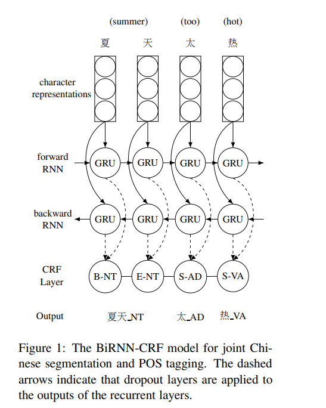
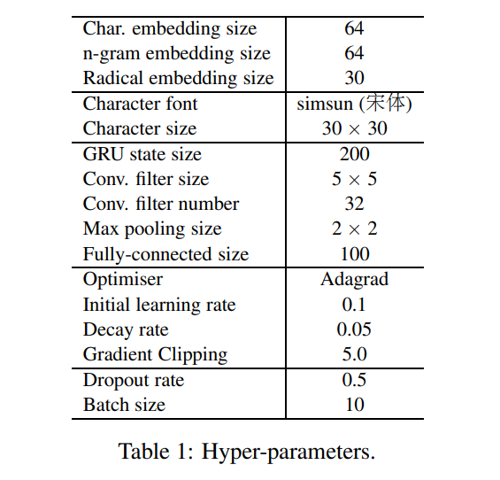
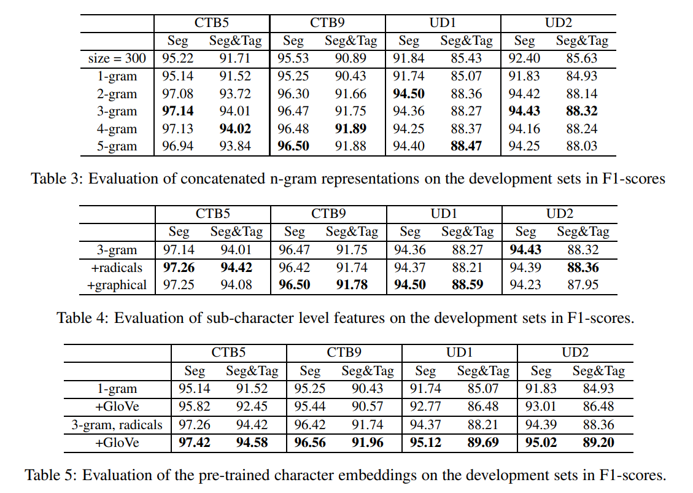

# Character-based Joint Segmentation and POS Tagging for Chinese using Bidirectional RNN-CRF
[toc]

- https://arxiv.org/pdf/1704.01314.pdf

## 1 Introduction
- 中文需要分词，而且中文分词在Pipeline中有重要作用
- 分词和词性标注联合进行结构化预测

## 2 Model
### 2.1 Neural Network Architecture
- 使用GRU
- CRF前使用Dropout

### 2.2 Tagging Scheme
- BIE S模式对结构进行编码
- 使用维特比算法进行解码
- 可以根据不存在的类型进行输出的Reduce，例如 的为S-DEG,不存在B-DEG, I-DEG, E-DEG

### 2.3 Character Representations
#### 2.3.1 Concatenated N-gram
- 除了生成单个字的词向量外，作者还利用包含该字的n-gram词组信息生成该字符的表达方式

$V_{m,n}$的计算公式如下：

#### 2.3.2 Radicals and Orthographical Features
- Radicals Features
不同于英文字符，汉字的信息与其组成结构密切相关。具有相近语意的字符往往具有相同的部首。作者利用康熙字典将汉字按照部首分为214个不同的类别，并构建(U+4E00,U+9FFF)范围内的汉字部首的embedding

- Orthographical Feature
除了部首信息外，作者将汉字视为图片，并利用CNN构建字符的embedding。CNN模型由两层convolutional和max pooling结构组成，并在全连接层之后加入了dropout层防止过拟合

#### 2.3.3 Pre-trained Character Embeddings
利用Wikipedia和SogouCS语料训练字符的GloVe向量

### 2.4 Ensemble Decoding
在decoding阶段，利用相同的模型参数分别训练Pre-trained、n-gram、Radicals和Orthographical，得到四种词向量后取平均，输入到CRF中。

## 3 Implementation

## 4 Experiments
### 4.1 Datasets
Chinese Treebank 5.0 (CTB5) and 9.0 (CTB9) , Universal Dependencies (UD Chinese) 

### 4.2 Experimental Results

