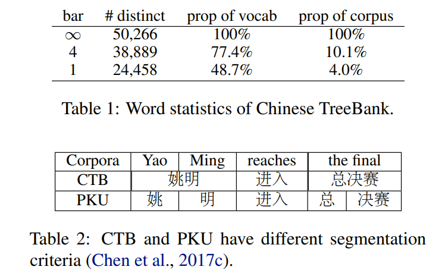
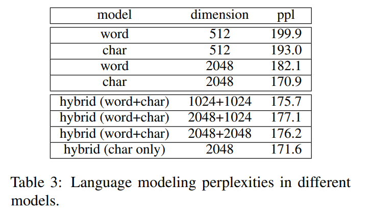
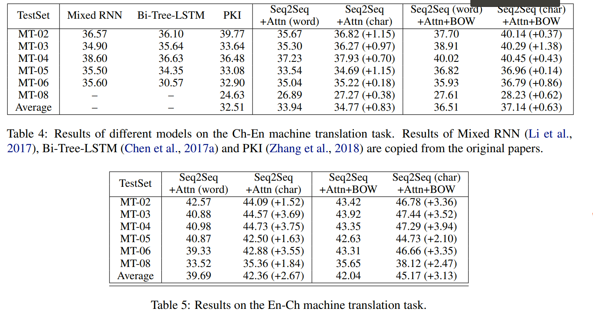
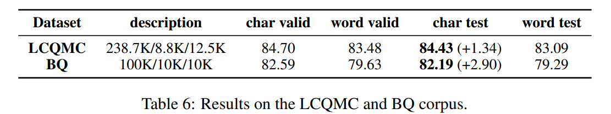
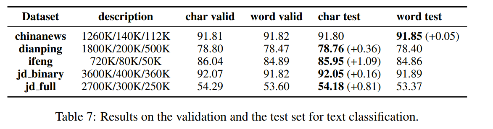
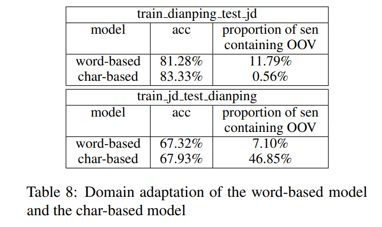
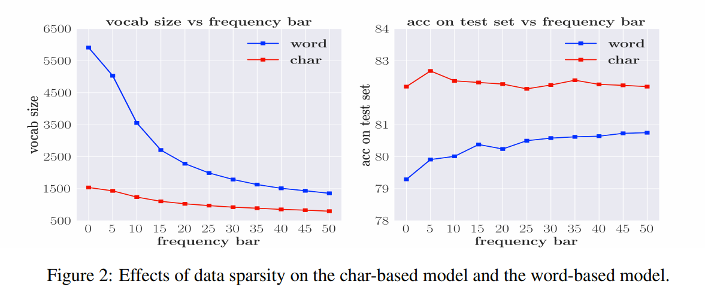
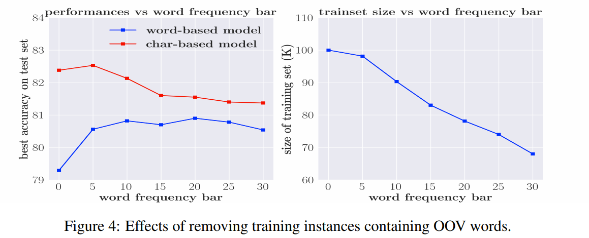
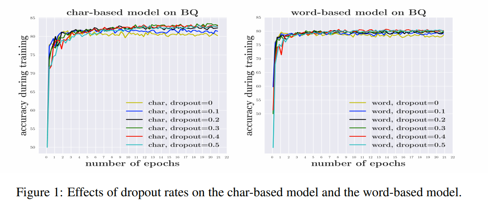

# Is Word Segmentation Necessary for Deep Learning of Chinese Representations?
[toc]

- https://www.aclweb.org/anthology/P19-1314.pdf

## Abstract
- 中文分词是常见特征处理之一
- 基于深度学习的中文处理中分词是否完全有必要？
- 在多个端到端的任务上，基于字的模型性能均好于基于词的模型
- 原因：基于词的模型容易受到稀疏性和OOV的影响，导致更容易过拟合

## 1 Introduction
- 针对中韩日等没有显式分词标志的语言
- 分词
    - 数据稀疏性好导致过拟合以及潜在的OOV限制模型的学习能力
    - Zipf定理导致很多词语的频次很少，比较难学习其语义，以CTB数据为例，其中48.7%的词语只出现一次；77.4%的词语出现4次以下
    - 实际处理时不会维护大词表，因此很多词会变为OOV，限制模型的学习能力
    - 分词错误会传导到下游任务，本身分词的边界标准都是可争议的，不通的语言视觉对分词有不通标准
    - 分词的好处来源于分词数据集中的附加语义信息，而在实际运行中，下游任务语料集合（如翻译）往往比分词语料集合大得多
    - 在神经网络模型之前，在信息检索、机器翻译和文本分类问题上，分词处理带来的效果提升并不是很显著，认知科学的实验中，研究人员发现中文读者的注意力不会更多地落在中文单词的中心。这意味着字符应该成为中文阅读理解的基本单元，而不是分词后的词组。
- 作者进行实验，在语言建模、机器翻译、文本分类、句子匹配等任务上，未分词模型比分词模型好，至少不比混合模型的效果差

    

## 2 Related Work
- 最大匹配模型：基于字典
- BEMS序列标注模型：HMM、MEMM、CRF
- 神经网络模型: RNN、CNN

## 3 Experimental Results

### 3.1 Language Modeling

- Chinese Tree-Bank 6.0 (CTB6)
- hybrid (word+char) : 词向量 + CNN(字向量)
- hybird(char)：只使用字向量 + CNN 来构成词向量
- 字向量已经编码了必要的语义信息，增加词向量并不会带来增益
- 字向量表示，不会有数据稀疏和OOV问题，也减少了过拟合

### 3.2 Machine Translation

- standard Ch-En setting，  1.25M sentence pairs extracted from the LDC corpora
- SEQ2SEQ +attention
- Ch-En translation, the difference between word-based and char-based models is only present in the source encoding stage, whereas in En-Ch translation it is present in both the source encoding and the target decoding stage
- UNK问题，BPE subword model on the Chinese target side, 超越了词向量模型的效果，但还是低于字符向量模型的效果
- 在中文深度学习解码中，生成字符比生成单词具有优势

### 3.3 Sentence Matching/Paraphrase

- BQ and LCQMC
- BQ: 120,000 Chinese sentence pairs,
- LCQMC:  identifying whether two sentences have the same intention, 
    - ”My phone is lost” and ”I need a new phone”意图一样
- bilateral multiperspective matching model (BiMPM)

### 3.4 Text Classification

- bi-directional LSTM models to solve this task
- Domain Adaptation Ability

## 4 Analysis
### 4.1 Data Sparsity

- 使用全部词语或字会导致较差的结果：  it is hard to learn the semantics of infrequent words/characters
- 字模型最佳：5，字典1432，中位频率72
- 词语模型最佳： 50, vocabulary size 1,355，medium word frequency is 83
- vocabulary size 差不多，表明要想学到较好的语义，词语、字符必须要有一定的曝光量

### 4.2 Out-of-Vocabulary Words

- 由于稀疏性，降低词语选择的门限会增加数据集的稀疏问题
- 实验中去掉含有OOV的句子，此时增加词频门限，会增加OOV词语的数量，减少字典的集合，进而减少数据集的数量
- 词、字模型差别收拢，因为门限的增加减少稀疏性数据对词模型的影响，而该问题对字模型影响不那么大
    - 词语模型中，可能会存在多个稀疏词语，字则概率低得多
    - 后续字模型下降是由于数据集的减少导致的欠拟合
- 基于字符的模型在增加词频阈值后，一开始效果有略微地上升，然后缓慢减小。这是因为对于基于字符的模型而言，OOV问题并不严重，因此不会对性能造成太大影响。但是，随着我们删除越来越多的训练样本，不断缩小的训练集会产生很大的问题。
- 对于基于词的模型而言，即使将频率阈值设置为50，性能也会继续提高，这意味着删除一些OOV词的积极影响要大于删除一些训练数据带来的消极影响。总之，基于词的模型存在严重的OOV问题。 可以通过减少数据集中的OOV词的数量来缓解此问题。

### 4.3 Overfitting

- 词模型，更多参数，更已过拟合
- BQ数据，词模型需要更大的Dropoutrate (0.5 / 0.3)
- 词模型中不同dropout的曲线混在一起，意味着dropout 不足以解决它的过拟合问题
- 没有使用droupout的字模型已经超过了词模型的效果

### 4.4 Visualization

BQ数据集，分词问题导致的词语之间匹配错位

## 5 Conclusion
- 基于字符的模型始终优于基于词的模型
- 基于词的模型的劣势归因于词分布的稀疏性，这会导致更多的OOV单词和过拟合的问题

