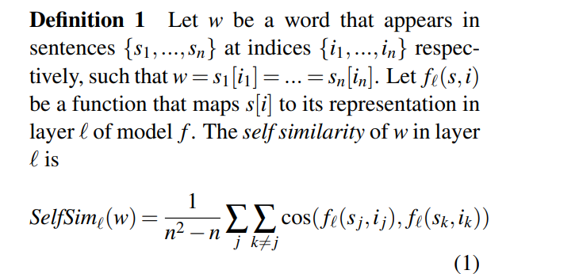
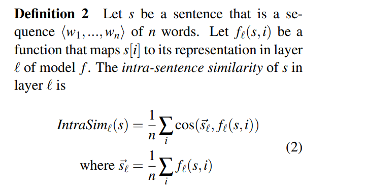
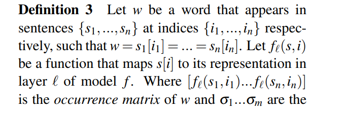
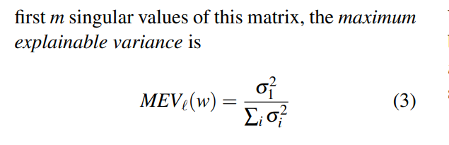
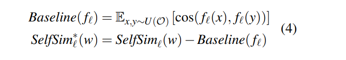
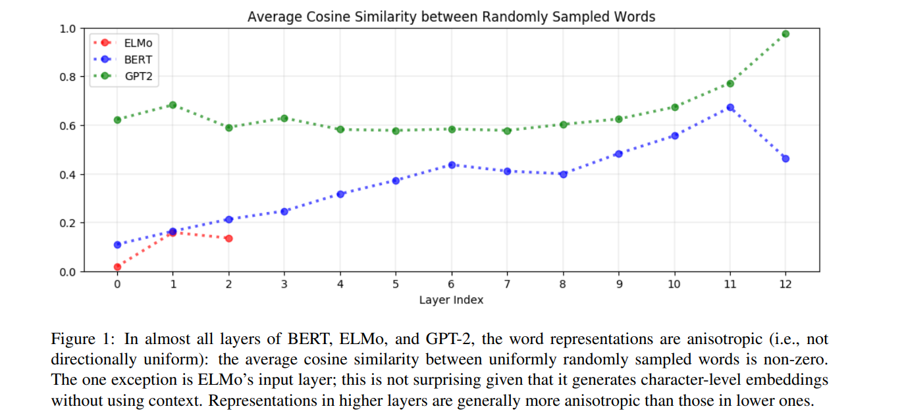
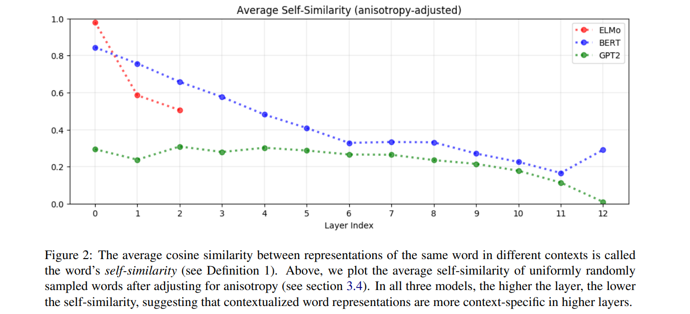
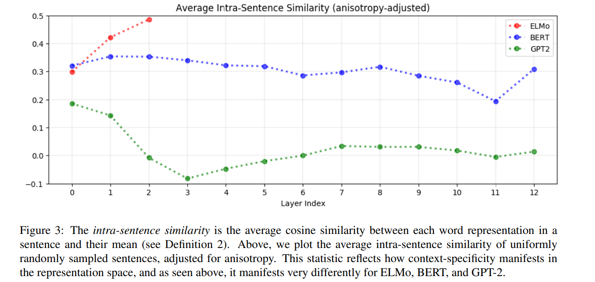
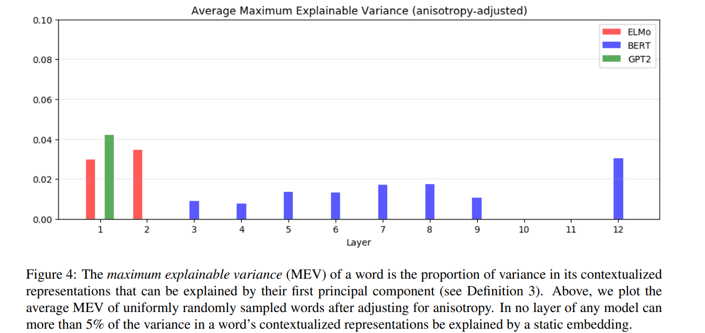
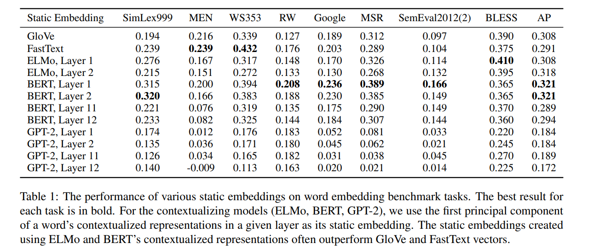

# How Contextual are Contextualized Word Representations? Comparing the Geometry of BERT, ELMo, and GPT-2 Embeddings
[toc]

- https://arxiv.org/abs/1909.00512v1

### Abstract
- 预训练模型得到的表示向量的语境化程度到底有多高，它们只是简单的为每个词在不同的上下文提供一个单独的表示，还是为每个词只分配有限量的表示向量？

### 1 Introduction
- 传统的嵌入是静态的，与上下文无关的
- 基于上下文的嵌入表示（ＥＬＭＯ、ＢＥＲＴ）提升了ＮＬＰ任务的性能
- 到底预训练模型得到的表示向量的语境化程度到底有多高，它们只是简单的为每个词在不同的上下文提供一个单独的表示，还是为每个词只分配有限量的表示向量？
- 结论
  - 在BERT、ELMo和GPT-2的所有层中，所有的词它们在嵌入空间中占据一个狭窄的锥，而不是分布在整个区域
  - 上层比下层产生更多特定于上下文的表示，然而，这些模型对单词的上下文环境非常不同
  - 如果一个单词的上下文化表示根本不是上下文化的，那么我们可以期望100%的差别可以通过静态嵌入来解释。相反，我们发现，平均而言，只有不到5%的差别可以用静态嵌入来解释
  - 我们可以为每个单词创建一种新的静态嵌入类型，方法是将上下文化表示的第一个主成分放在BERT的较低层中。通过这种方式创建的静态嵌入比GloVe和FastText在解决单词类比等基准测试上的表现更好。

### 2 Related Work
- Static Word Embeddings
- Contextualized Word Representations
- Probing Tasks

### 3 Approach
#### 3.1 Contextualizing Models
- ELMo, BERT, and GPT-2

#### 3.2 Data
- SemEval Semantic Textual Similarity tasks from years 2012 - 2016
- same words appear in different contexts
- 不考虑低于５个上下文的词语

#### 3.3 Measures of Contextuality
self-similarity
: 
计算ｌ层中不同句子中相同词语的表示相似度，为１则全一样

intra-sentence similarity
: 
计算一个词语与其上下文之间的相似度，是否简单朴素的与其上下文均值相似

maximum explainable variance
: 

表示给定层中w的上下文表示的方差的比例，而这可以使用它们的第一个主成分解释。当MEV的值越小表示模型语境化能力越强，反之表示模型语境化能力越弱

#### 3.4 Adjusting for Anisotropy
如果一个词语的向量是各向同性（即它们是否在各个方向均匀地分布），则自相似度95%表示其很少的上下文化
而如果其各向异性，且有99%的相似性，则自相似度95%可能表示其具有较好的上下文能力，这是因为Ｗ在不同上下文中的表示可能比随机选择的词语更不相似

为了调整各向异性，我们为每个测量值计算各向异性基线，并从相应的原始测量值中减去每个基线。但是有必要对各向异性进行调整吗？有！如下图所示，BERT和GPT-2的上层是极具各向异性的，这表明高的各向异性是上下文化过程的固有特征，或者至少是其结果

### 4 Findings
#### 4.1 (An)Isotropy
- 模型的各层中词的上下文表示具有各向异性，且模型的层次越高，各向异性越强

平均余弦相似度越接近于1，各向异性越强。从上图可以看出，三个模型的平均余弦相似度皆大于零，而且层次越高对应的值越接近于1。另外可以看出，GPT-2相较于BERT和ELMO，它的各向异性表现更为突出

#### 4.2 Context-Specificity

- 模型的层次越高词的向量表示越关注于所在的上下文
- 停用词的表示向量最特定于所在的上下文
一个词出现在多种上下文中，而不是其固有的一词多义，是其上下文化表示变化的原因。这表明ELMo、BERT和GPT-2并不是简单地为每个词赋予一个表示，否则，就不会这么少的词意表示会有这么多的变化

- 不同的模型中，词向量关于与上下文的程度不同
由自相似度的定义可知，值越接近0表示词向量越关注上下文；反之当值等于1时表示表示向量是上下文无关的。从上图可以看出，三种模型在不同的层次平均自相似度均小于1（ELMO的第0层除外），而且层次越高对应的值越接近0
- EMLO中同一句中的上层单词之间与比上一层的表示更相似，因为同一句中的词共享相同的上下文，因此它们的表示自然更加相似，但平均而言，它们之间的相似性比两个随机单词之间的相似性更大
  - 原理：　LSTM，其吸收了周边词语的表示
- BERT中的情况与上面的相反，但同一句子中不同词之间的相似度仍然大于两个随机选择的词
- GPT-2中同一句子中词并不比随机选取的两个词更为相似
  - 出现在相同上下文中的单词不一定有相同的意思

#### 4.3 Static vs. Contextualized

- 平均来说，上下文表示向量间至多5%的方差可以由对应的静态表示向量（static embedding）解释
如果一个单词的上下文化表示完全与上下文无关，那么我们期望它们的第一个主成分能够解释100%的变化。相反，平均不到5%的变化可以被解释。这个5%的阈值代表了最佳情况，其中静态嵌入是第一个主成分。例如，没有理论保证GloVe向量与最大化可解释变化的静态嵌入相似。这表明，BERT、ELMo和GPT-2并不是简单地为每个词意义分配一个嵌入：否则，可解释的变化比例会高得多

- 如果将模型底层表示向量的主成分用于词的表示，它们的效果仍优于Glove和FastText等向量表示模型
如果我们通过简单地使用上下文化表示的第一个主成分为每个单词创建一种新的静态嵌入类型，结果会怎样？事实证明，这种方法出奇地有效。如果我们使用来自底层BERT的表示，这些主成分嵌入在涉及语义相似、类比求解和概念分类的基准测试任务上胜过GloVe和FastText
从低层创建的主成分嵌入比从高层创建的主成分嵌入更有效。那些使用GPT-2的人的表现明显比来自ELMo和BERT的人差。考虑到上层比下层更特定于上下文，考虑到GPT-2的表示更特定于上下文，这表明不太特定于上下文的表示的主成分对这些任务更有效

### 5 Future Work
略

### 6 Conclusion
略
