# Keyword-Attentive Deep Semantic Matching

[toc]

- https://raw.githubusercontent.com/DataTerminatorX/Keyword-BERT/master/Keyword-Attentive_Deep_Semantic_Matching.pdf

## Abstract
- 使用领域TAG来构建领域词典
- 在BERT层上加深关键词的影响

## 1 Introduction
- 当前FAQ主要采用深度语义匹配
  - 对于如下问题不能进行很好的区分
    - “Which city is the capital of China?”
    - “Could you tell me the capital of America?”
  - 在深度学习中学习关键词之间的相似度或距离是一个挑战，尤其是那些词语是对模型来说是新的
  - 负样本问题
    - 负样本可以看着O(|Q|*|Q|)的空间组合
    - 列出所有的负样本是低效以及会造成正负样本比例失衡

- 本文
  - Keyword-attentive BERT：显式告诉模型哪些Token比较重要
  - 负采样：通过关键词的overlapping分数进行负样本是筛选，另外使用实体替换来获得更多的负样本变体（“China”->“America”）
  - 基于领域信息进行关键词抽取
    - 构建关键词注意力语义匹配模型
    - 提高QA查询的检索质量
    - 用于负样本构建

## 2 Related Work
略

## 3 Proposed Approach
### 3.1 Problem definition
- 计算 sim(q, Qi)
    - 1) How to easily and flexibly obtain good representation of the original query?
    - 2) How to incorporate the query representation into the matching model?

### 3.2 Domain keyword extraction
- 基于BM25等检索方法可能会提取不重要的关键词而导致低质量的查询结果
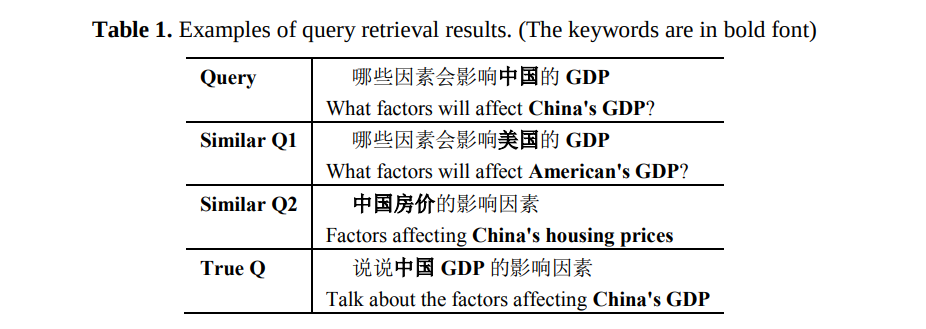

- 开发领域的问题与问题领域强相关，如经济、政治、体育等
- 收集大量的语料并且每天进行新的关键词以及关键词组的更新

- 使用PMI(Point-wise mutual information)来衡量词语之间的粘性
$$PMI(w_1, w_2) = \log \frac{p(w_1, w_2)}{p(w_1)*p(w_2)}$$

- 计算diff-idf来估计一个词在领域中重要程度
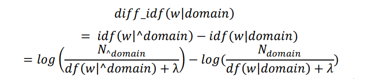
- 使用该分数进行排序并移除噪声词语
- 优点
  - 1) Could leverage domain information of corpora to extract domain keywords
  - 2) No need to manually label keywords. No heavy model structures

### 3.3 Semantic matching
#### Keyword attention mechanism
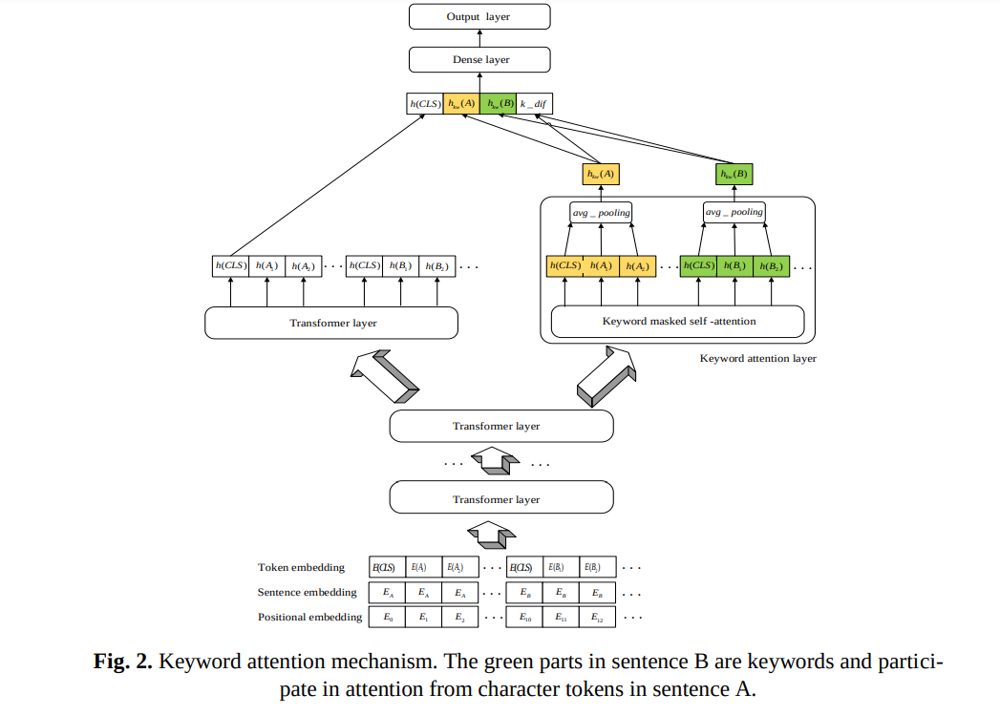
- 原始的BERT进行CLS的生成
- 新的KeyWord Attention层向量生成，注意其中A只MASK B中的关键词，对B也同样（不使用[CLS][SEP]参与平均pooling）
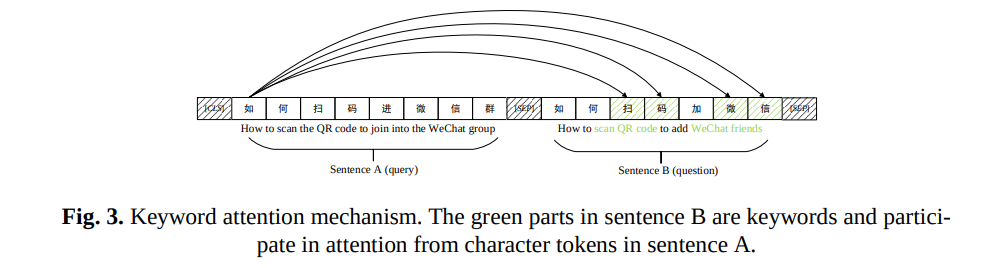
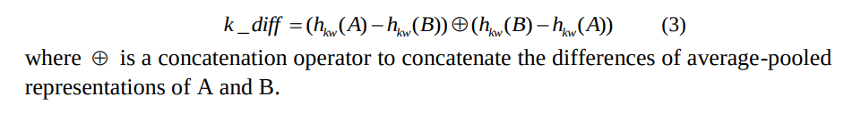
- 最终进行分类的向量
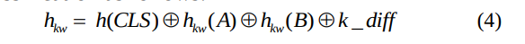

#### Negative sampling approach 
- 使用搜索引擎基于Keyword增强进行查询
  - [token_1, ... token_n, Keyword_1, ... Keyword_m]
- 基于一个相似门限，低于该门限值则认为为负样本
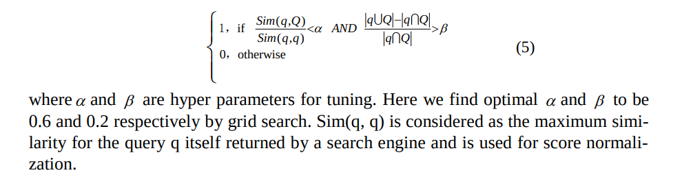
- 使用实体词替换构建负样本
  - What factors will affect China’s GDP?   -->  What factors will affect America’s GDP?

## 4 Experimental Setup
### 4.1 Data preparation
- 从QA社区网站爬取，敏感词过滤，无意义问题去掉，仅符号/词序不一样的去掉，余100K
- 负例采用上面方法进行构建
- 正例则使用top-5查找并进行人工验证
- 手工构建使用一个高质量的Q-Q测试集进行
  - 1000新问题，通过es构建候选问题，然后再通过人工进行候选正例负例的重写，去掉在训练集中出现的问题
    -  818 positive and 946 negative question pairs for testing
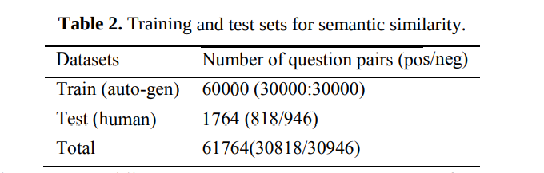

### 4.2 Baseline models
- Fastpair
- BERT

### 4.3 Retrieval results
BM25查询结果
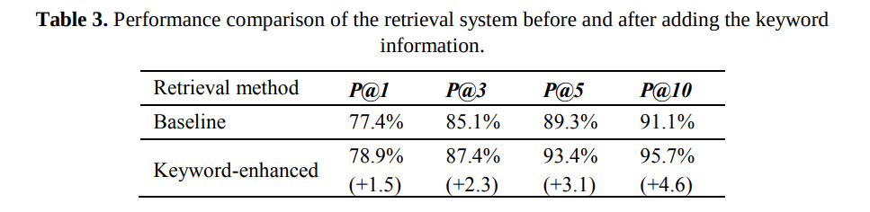

### 4.4 Semantic similarity results
- 不同模型的测试结果
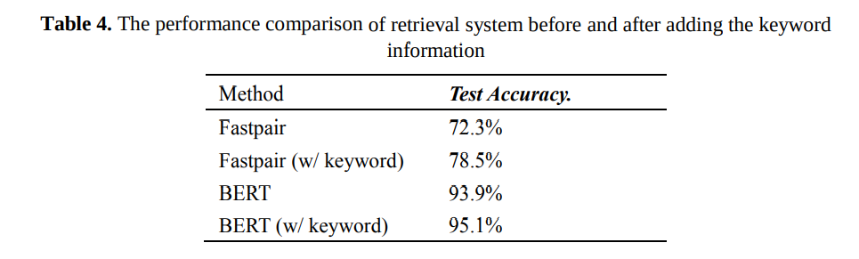

- BERT不同层次的影响
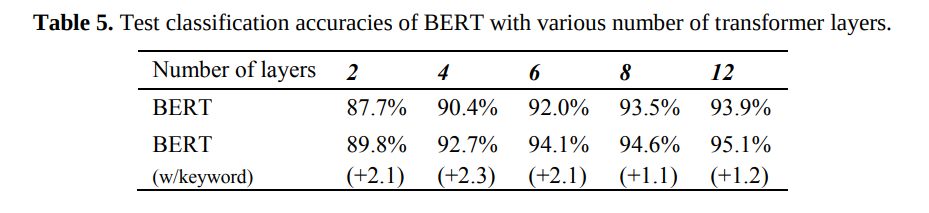

### 4.5 Negative sampling results
- 随机抽样的效果较差，而差别主要在负类数据的影响上
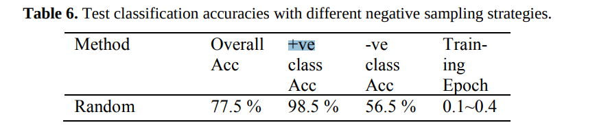
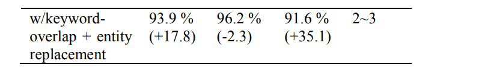

### 4.6 Discussion
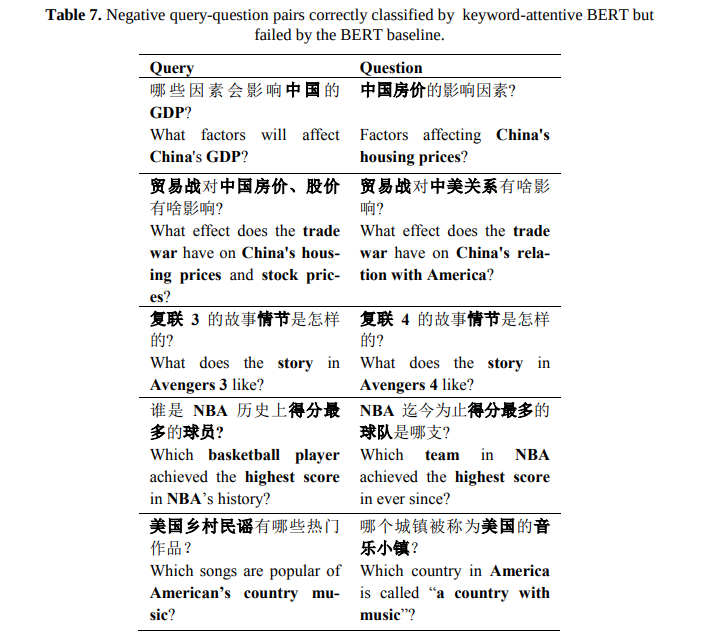

## 5 Conclusions
略
