# Sentence-BERT: Sentence Embeddings using Siamese BERT-Networks
[toc]

- https://arxiv.org/pdf/1908.10084.pdf
- https://github.com/UKPLab/sentence-transformers
- https://github.com/facebookresearch/InferSent
- https://tfhub.dev/google/universal-sentence-encoder-large/3
## Abstract
- BERT和RoBERTa进行匹配需要大量的计算
- BERT的构造使其不适合语义相似性搜索以及诸如聚类之类的无监督任务

## 1 Introduction
- 使用Sentence-Bert基于孪生以及Triplet网络来进行句子意义的推导，以用于某些新任务，包括大规模的语义相似度比较，聚类和通过语义搜索的信息检索
- 解决聚类和语义搜索的常用方法是将每个句子映射到向量空间，以使语义相似的句子接近
- 

## 2 Related Work
- 略

## 3 Model
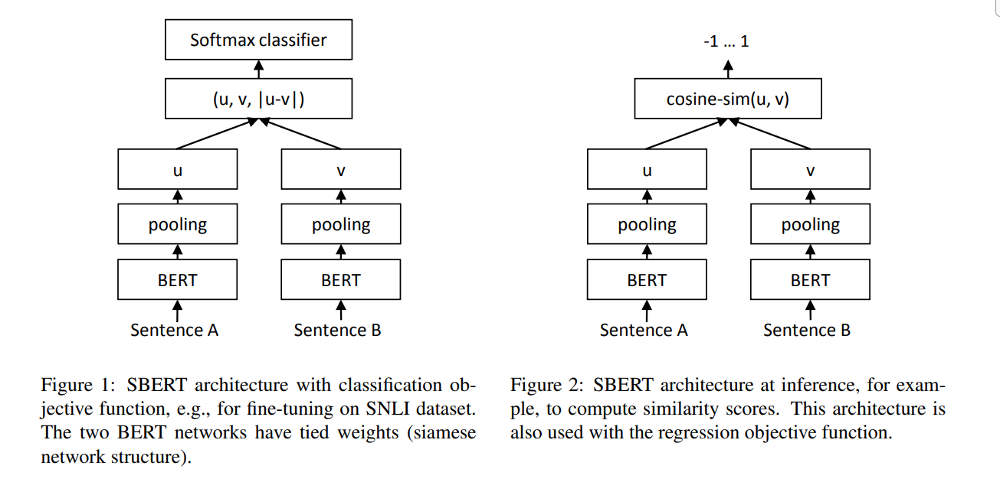
- 尝试了三种池化策略：使用CLS令牌的输出，计算所有输出向量的均值（MEAN -strategy），以及计算输出向量的最大时间（MAX -strategy）。默认配置为MEAN

Classification Objective Function
: 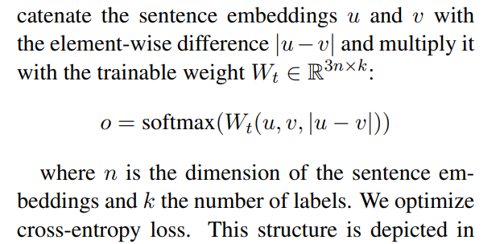
左图

Regression Objective Function
: 计算余弦相似度，目标函数使用  meansquared-error loss

Triplet Objective Function
: 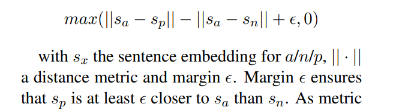
实验中设置参数为 1

### 3.1 Training Details
- SNLI是570,000个句子对的集合，标注了矛盾，蕴含和中立的标签
- MultiNLI包含430,000个句子对，涵盖一系列口语和书面文本
- 3阶softmax-classifier目标函数微调SBERT
- 批量大小为16的Adam优化器，学习率2e-5，线性学习率预热了训练数据的10％。默认池化策略是MEAN

## 4 Evaluation - Semantic Textual Similarity
- 通常学习（复杂）回归函数，该函数将句子嵌入映射到相似性评分。但是，这些回归函数是成对运行的，并且组合爆炸的原因

### 4.1 Unsupervised STS
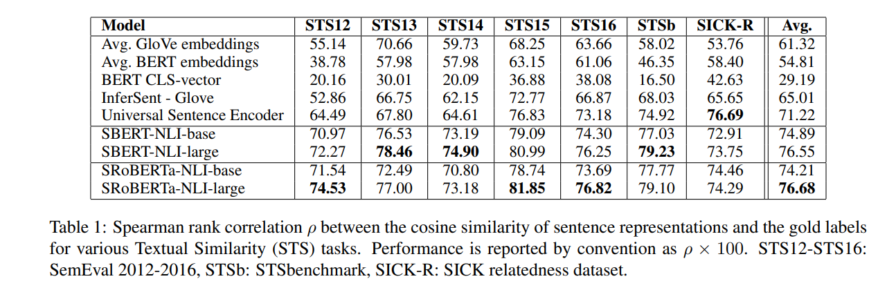
- 直接使用BERT的输出会导致性能下降。平均BERT嵌入的平均相关性仅为54.81，而使用CLS令牌输出的平均相关性仅为29.19

### 4.2 Supervised STS
- STS基准: 包括来自字幕，新闻和论坛三个类别的8,628个句子对
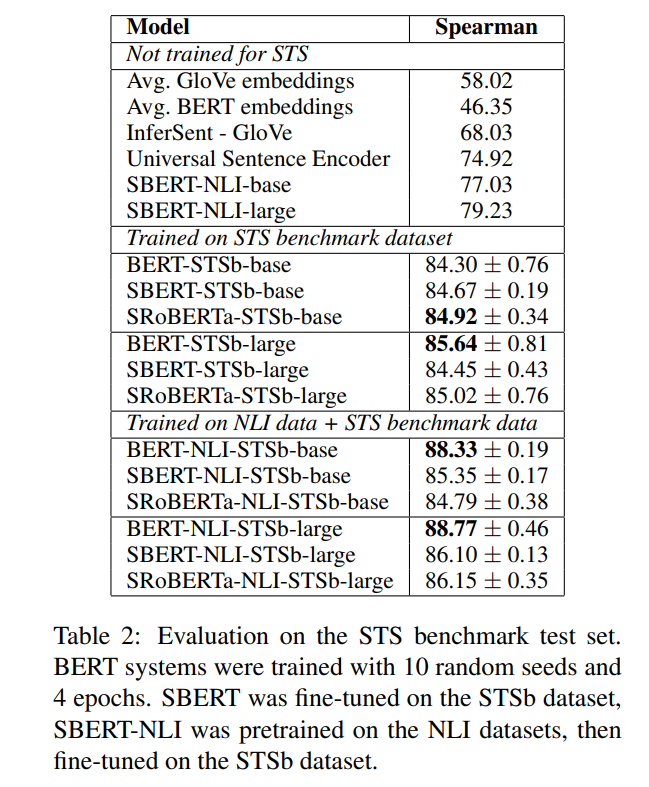

### 4.3 Argument Facet Similarity
- AFS语料库从社交媒体对话中注释了6,000个句子参数对，涉及三个有争议的主题：枪支管制，同性恋婚姻和死刑。数据以从0（“不同主题”）到5（“完全等同”）的比例进行注释
- AFS语料库中的相似性概念与SemEval的STS数据集中的相似性概念完全不同。STS数据通常是描述性的，而AFS数据是对话框中的论据摘录
- 要被视为相似，论点不仅必须提出相似的主张，而且还必须提供相似的推理
- 句子之间的词汇间隔更大
- 两种情况下在此数据集上评估SBERT
  - 使用10倍交叉验证对SBERT进行评估,不清楚方法在多大程度上适用于不同主题
  - 跨主题设置中评估SBERT。有两个主题可供培训，对剩下的主题评估方法

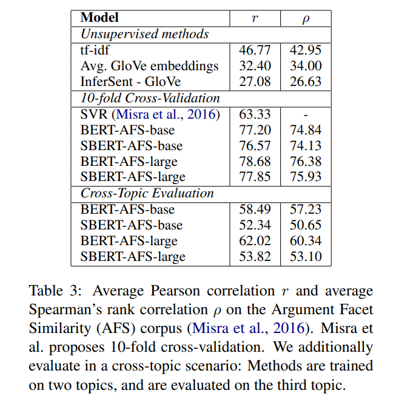

- 在跨主题评估中，我们发现SBERT的性能下降了约7点Spearman相关性
  - 要被认为是相似的，论据应涉及相同的主张并提供相同的理由
  - BERT能够利用注意力直接比较两个句子（例如逐词比较）
  - 而SBERT必须将单个单词从看不见的主题映射到向量空间，以使具有相似主张和理由的论点接近。这是一项更具挑战性的任务

### 4.4 Wikipedia Sections Distinction
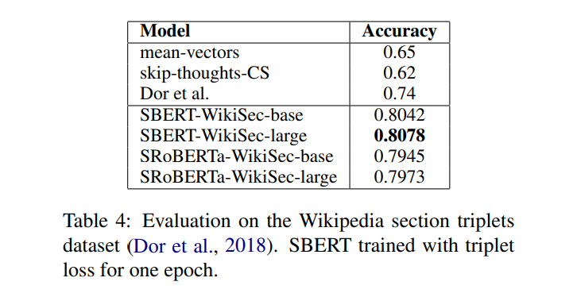
- 使用同段的语句构建正类，不同段的语句构建负类
- SAMPLE
  - Anchor: Arnold joined the BBC Radio Drama Company in 1988.
  - positive: Arnold gained media attention in May 2012.
  - negative: Balding and Arnold are keen amateur golfers

## 5 Evaluation - SentEval
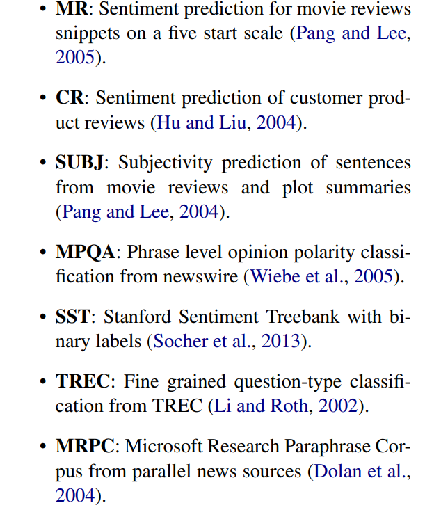
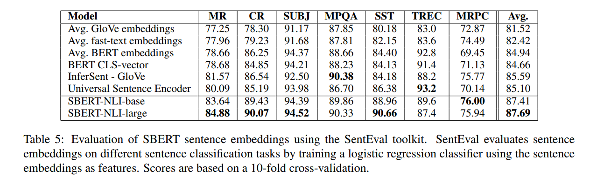

- 平均BERT嵌入和BERT CLS令牌输出达到了不错的结果, 优于平均GloVe嵌入
  - 原因是不同的设置。对于STS任务，使用余弦相似度来估计句子嵌入之间的相似度。余弦相似度平等地对待所有维度。相反，SentEval使逻辑回归分类器适合句子嵌入。这允许某些尺寸可以对分类结果产生较高或较低的影响
- BERT返回语句嵌入的平均BERT嵌入/ CLS令牌输出无法与余弦相似度或与Manhatten / Euclidean距离一起使用

## 6 Ablation Study
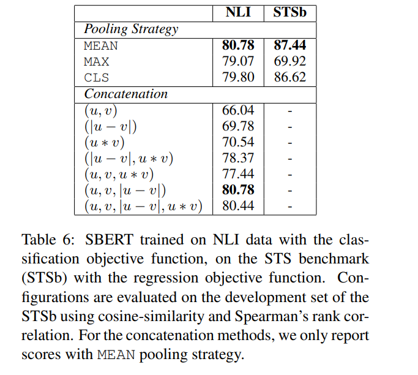

## 7 Computational Efficiency
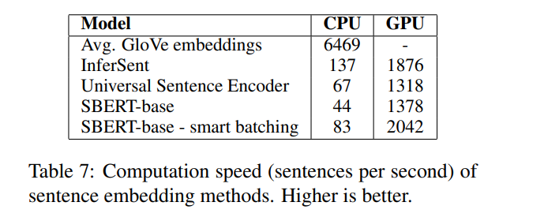
- Intel i7-5820K CPU @ 3.30GHz，Nvidia Tesla V100 GPU，CUDA 9.2和cuDNN

## 8 Conclusion
- 略
