# ProphetNet: Predicting Future N-gram for Sequence-to-Sequence Pre-training
[toc]

- https://arxiv.org/pdf/2001.04063.pdf

## Abstract
- 在Seq2Seq中预测n-step
- 避免了在局部强关联中的过拟合

## 1. Introduction
- 自回归语言模型常用于估计文本语料的分布概率,常用于序列建模以及序列-序列学习
 $$p(x) = \prod_{t=1}^T p(x_t|x_{<t})$$
- 语言模型以及Seq2Seq通常使用teacher-forcing的方式进行训练
- 基于AR的模型往往更聚焦于最近的token而不是捕捉更长距离的依赖
  - 原因
    - 局部关系如bigram,比长距离依赖更强烈
    - tearcher-force,关注下一步预测,没有显式的让模型去学习未来的规划和建模
  - 因此结果就是局部的token组合过拟合,而全局一致性以及长距离依赖欠拟合
- 尤其是使用贪心算法进行解码生成的时候,序列往往倾向于维持局部的一致性而忽略有意义的全局结构

- 两个目标
  - 在训练的时候每步能够同时预测未来ngram
  - 在微调或者推理的时候能够方便地转换为预测下一个token
- 我们将XLET的双流机制扩展到n-stream self-attention

## 2. ProphetNet

### 2.1. Sequence-to-Sequence Learning
$$p(y|x) = \prod_{t=1}^Tp(y_t|y_{<t},x)$$

### 2.2. Future N-gram Prediction

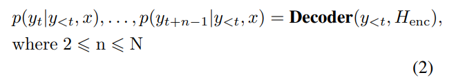
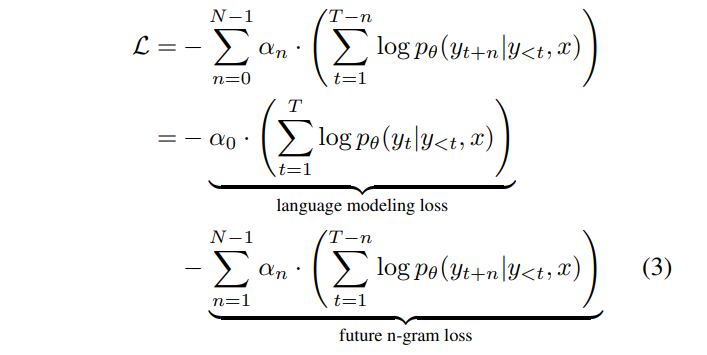
αn可以作为参数进行常规语言模型与N-gram预测模型之间权重的调节

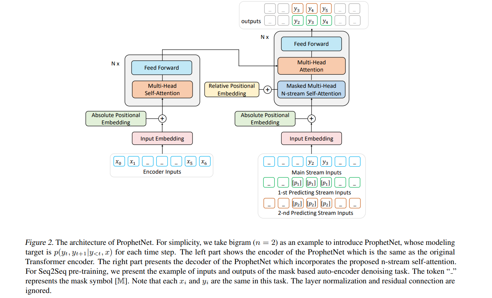

### 2.3. N-Stream Self-Attention
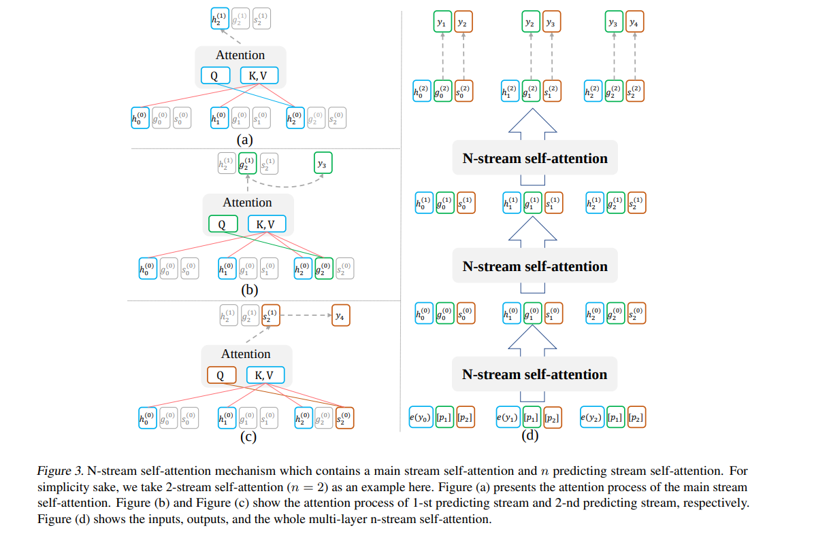

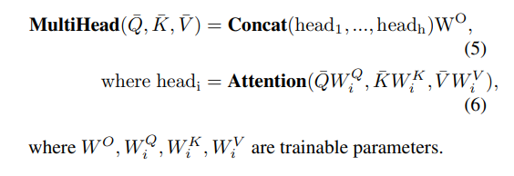

层间的关系
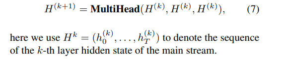

预测$p(y_t, y_{t+1}|y_{<t}, x) $,使用可训练向量pi作为i-流的初始化输入,最后的$g_t^{k+1}$用来预测$y_{t+1}$

1-st predicting stream的隐藏状态计算
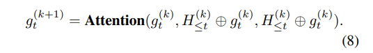

2-nd predicting stream的隐藏状态计算
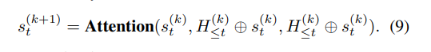

g和s计算法方式相似,但是其初始化token不一样,绝对位置编码不一样,相对位置计算不一样
推理的时候,关掉所有预测流就变为传统的结构
从结构上面看预测两个未来的值的时候是独立的,并没有考虑两者之间的关系

### 2.4. Positional Embedding
- 使用pi对token embedding进行初始化而不是使用上一个token的embedding
- 模型可能不知道哪个是其前一个token,因此需要位置信息
- 除了绝对位置编码外,在解码自注意计算过程中添加了 相对位置logits,和T5一样

### 2.5. Seq2Seq Pre-training on Denoising Task
- 没有大量的成对数据,因此在无标注文本上进行自编码去噪任务
- 多种噪声方法
  - 随机mask
  - token删除
  - token shffling
  - token span mask
- 本文使用mask span,模型学习到恢复mask token

## 3. Experiments and Results
### 3.1. ProphetNet Pre-training
Model Configuration
: 基于原始n Transformer (Vaswani et al., 2017) encoder-decoder
12-layer encoder and 12-layer decoder with 1024 embedding/hidden size and 4096 feed-forward filter size
batch size and training steps are set to 1024 and 500K

Pre-Training Dataset
: BookCorpus (Zhu et al., 2015) and English Wikipedia (16GB in total)

Pre-Training Setting
: 512  input length
starting position u in every 64 tokens, and then mask a continuous span from u
mask方式同BERT

### 3.2. Fine-tuning on Text Summarization
CNN/DailyMail
: - learning rate 1 × 10−4
  - batch size 512
  - warm up step 1000
  - epoch 10

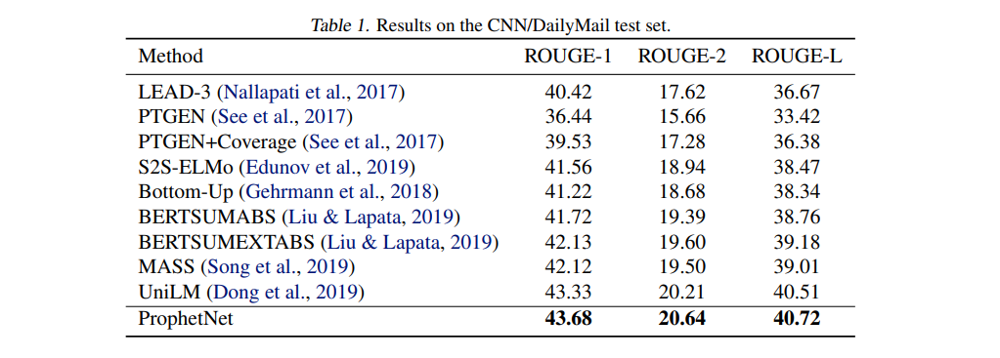
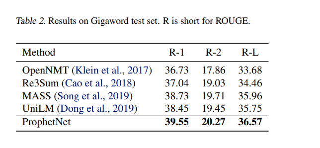

### 3.3. Fine-tuning on Question Generation
输入answer [SEP] input passage, 输出question
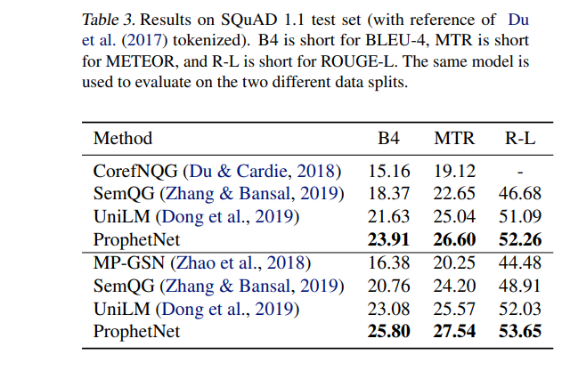

### 3.4. Large-scale Pre-training
- 使用了 160GB 的语料（该语料被 BART、RoBETRa 等模型预训练中所使用）预训练 ProphetNet
- 预训练14个 epoch 后的 ProphetNet 在 CNN/DailyMail 和 Gigaword 两个任务上微调和测试的结果
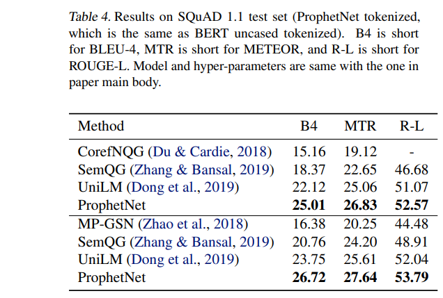
相同大小的训练数据下，我们训练 epoch 仅约为 BART 的三分之一。训练数据使用量仅约为 T5 和 PEGASUSLARGE（C4）的五分之一，约为 PEGASUSLARGE（HugeNews） 的二十分之一
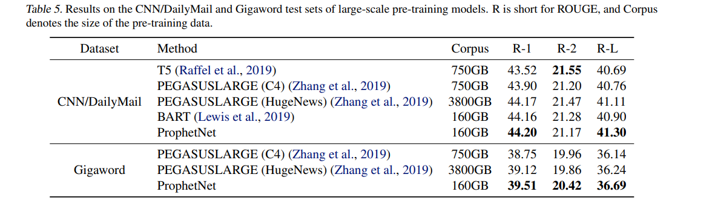

### 3.5. ProphetNet without Pre-training
不预训练的情况下比较了 ProphetNet 和 Transformer 在 CNN/DailyMail 上的性能
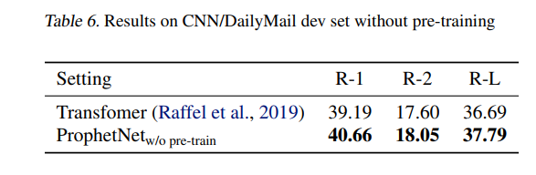

### 3.6. ProphetNet N-gram Comparison
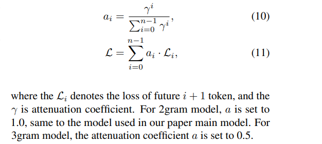

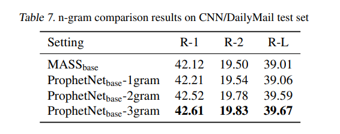

epoch影响
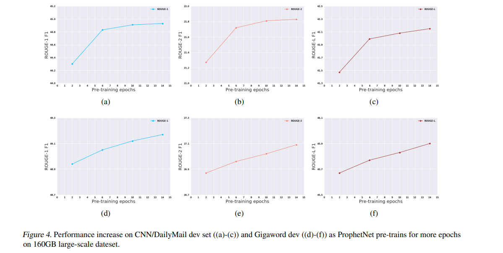

## 4. Related Work
略

## 5. Conclusion
略
