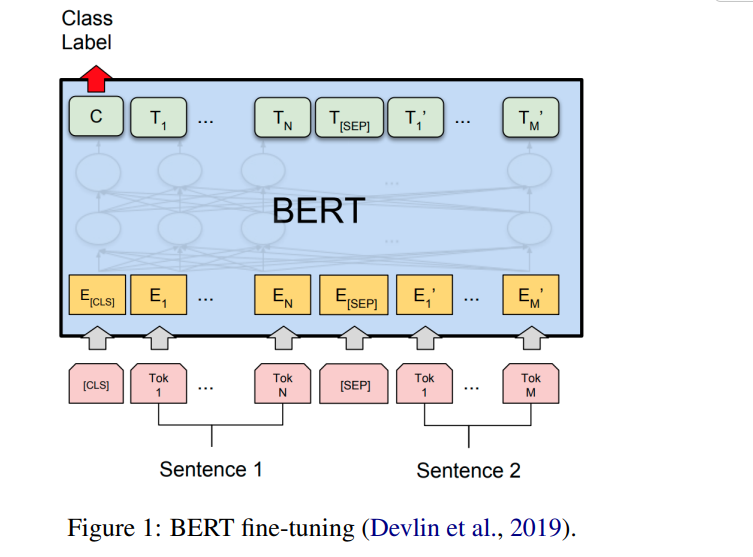
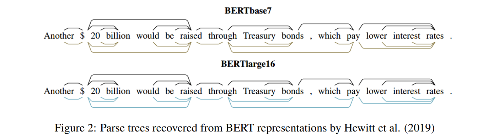

# A Primer in BERTology: What we know about how BERT works

[toc]

## ABSTRACT

## 1 Introduction
- BERT： 并行化、更好的远程关系依赖建模
- 对ＢＥＲＴ的理解很少，出于其规模也不容易进行预训练以及消融研究的能力

## 2 Overview of BERT architecture

- 预训练使用两个半监督任务：掩蔽语言建模（MLM，随机掩蔽的输入标记的预测）和下一句预测（NSP，预测两个输入句子是否彼此相邻）
- 针对下游应用进行微调时，通常会在最终编码器层的顶部添加一个或多个完全连接的层

## 3 BERT embeddings
- BERT的表示是上下文相关的，每个输入令牌都由依赖于特定出现上下文的向量表示
- 目前对BERT表示空间的研究中，术语“嵌入”是指给定（通常是最终）的Transformer层的输出矢量
- 现BERT的上下文嵌入形成了与词义相对应的清晰的聚类，这证实了这些表示的基本分布假设成立
- 同一单词的表述会根据其出现在句子中的位置而变化，这可能是由于NSP的目的所致
- 相同单词的嵌入在每一层中的相似程度，发现后来的BERT层产生了更多特定于上下文的表示形式。他们还发现BERT嵌入在向量空间中占据了一个狭窄的圆锥体，并且这种影响从低层到高层都在增加。也就是说，如果嵌入方向一致（各向同性），则两个随机词的余弦相似度平均将比预期的高得多

## 4 What knowledge does BERT have?
### 4.1 Syntactic knowledge
- BERT表示是分层的而不是线性的，即除了单词顺序信息外，还有类似于句法树的结构
- BERT嵌入对有关词性，句法块和角色的信息进行编码
- 就句法信息的表示方式而言，似乎句法结构不是直接在自我注意权重中编码的，而是可以对其进行转换以反映出来的
- BERT在执行完形填空任务时考虑了主题谓语协议。即使在主语和动词之间有干扰词的句子和无意义的句子也是如此

### 4.2 Semantic knowledge
- BERT对 Ettinger（2019）的语义角色有一定了解
- BERT编码有关实体类型，关系，语义角色和协议角色的信息，因为可以通过探测分类器检测到此信息
- 

### 4.3 World knowledge

## 5 Localizing linguistic knowledge
### 5.1 Self-attention heads

### 5.2 BERT layers

## 6 Training BERT
### 6.1 Pre-training BERT

### 6.2 Model architecture choices

### 6.3 Fine-tuning BERT

## 7 How big should BERT be?
### 7.1 Overparametrization

### 7.2 BERT compression

## 8 Multilingual BERT

## 9 Discussion
### 9.1 Limitations

### 9.2 Directions for further research

## 10 Conclusion
