<!-- TOC -->

- [TinyBERT: Distilling BERT for Natural Language Understanding](#tinybert-distilling-bert-for-natural-language-understanding)
  - [ABSTRACT](#abstract)
  - [1 INTRODUCTION](#1-introduction)
  - [2 PRELIMINARIES](#2-preliminaries)
  - [3 METHOD](#3-method)
    - [3.2 TINYBERT LEARNING](#32-tinybert-learning)
  - [4 EXPERIMENTS](#4-experiments)

<!-- /TOC -->
# TinyBERT: Distilling BERT for Natural Language Understanding
- https://arxiv.org/abs/1909.10351

## ABSTRACT
- 两阶段 TinyBERT 学习框架，它在预训练和特定任务的学习阶段都执行变压器提取。这个框架确保 TinyBERT 能够捕获一般领域以及 BERT 中特定于任务的知识
- 达到了与 BERT 对 GLUE 基准的可比结果，同时7.5 x 更小，9.4 x 更快的推断。TinyBERT 也明显优于最先进的 BERT 精馏基线，只有∼28% 的参数和∼31% 的推断时间

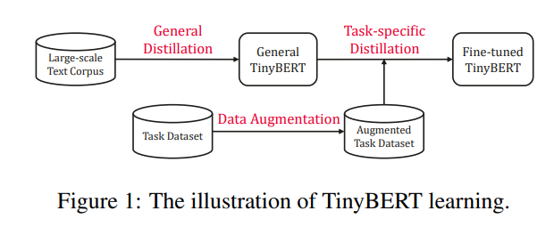

## 1 INTRODUCTION
- 为了构建具有竞争力的 TinyBERT，首先提出了一种新的变压器提取方法来提取教师 BERT 中蕴含的知识。具体来说，我们设计了几个损失函数来适应 BERT 层的不同表示: 1)嵌入层的输出; 2)变压器层的隐状态和注意力矩阵; 3)预测层的 logits 输出

- 在普通蒸馏阶段，未经微调的原始 BERT 作为教师模型。学生 TinyBERT 通过在一般领域的大规模语料库上执行所提出的变压器提取，来学习模仿老师的行为。我们得到一个通用的 TinyBERT，它可以针对各种下游任务进行微调。在任务特定的提取阶段，我们执行数据增强，为师生学习提供更多与任务相关的材料，然后对增强的数据重新执行变压器提取

- TinyBERT 在 GLUE 任务上可以达到与 BERT 老师相当的结果，同时参数较少(∼13.3%) ，推理时间较短(∼10.6%) ，并且在 BERT 蒸馏上明显优于其他最先进的基线

## 2 PRELIMINARIES

## 3 METHOD

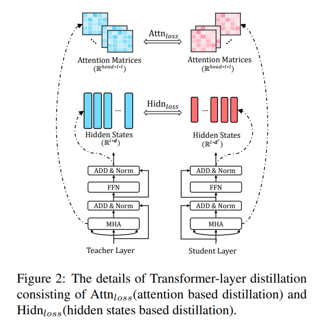

- 假设学生模型有 m 个变压器层，教师模型有 n 个变压器层，从教师模型中选择 m 个变压器层进行变压器层蒸馏。利用函数 n = g (m)作为从学生层到教师层的映射函数，即学生模型的第 m 层从教师模型的第 n 层获取信息
- 同时考虑了嵌入层蒸馏和预测层蒸馏。设0为嵌入层的指标，m + 1为预测层的指标，相应的层映射分别定义为0 = g (0)和 n + 1 = g (m + 1)
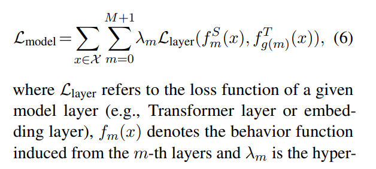
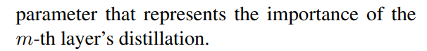

- 变压器层蒸馏包括基于注意力的蒸馏和基于隐状态的蒸馏，如图1(b)所示。基于注意的提取是受到 BERT 所获得的注意权重可以捕获丰富的语言知识这一最新发现的启发(Clark 等，2019)。因此，我们提出基于注意力的提炼，以确保语言知识从老师 BERT 转移到学生 TinyBERT

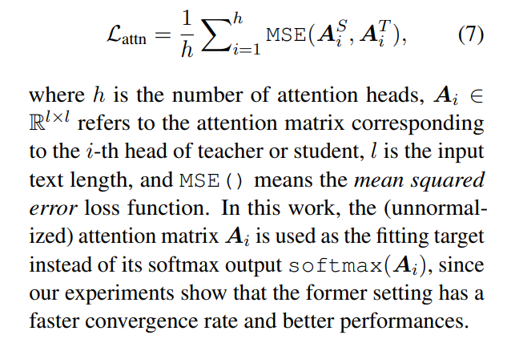

- 变压器层的输出中提取知识(如图1(b)所示) ，目标如下

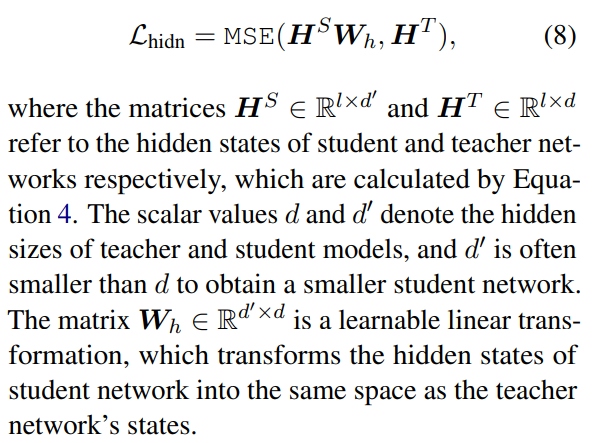

- 嵌入层蒸馏
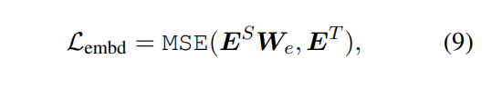
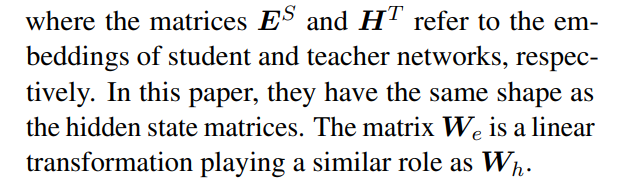

- Prediction-layer Distillation
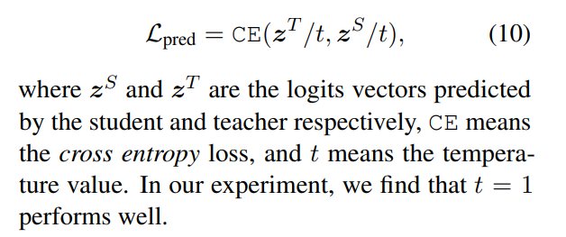

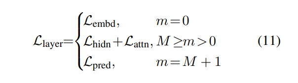

### 3.2 TINYBERT LEARNING
**General Distillation**
- 使用未经微调的原始 BERT 作为教师，使用大规模的文本语料库作为基本的学习材料
- 不按方程式10进行预测层蒸馏
- 一般域的文本上，我们得到了一个可以针对下游任务进行微调的一般 TinyBERT。然而，由于隐藏/嵌入尺寸和层数的大幅度减少，一般 TinyBERT 算法的性能相对较差

**Task-specific Distillation**
- 复杂的模型，微调的 BERTs，在领域特定的任务中遭受过度参数化。因此，小型模型可以达到与大型 bert 相当的性能
- 特定于任务的蒸馏中，我们对增强的特定于任务的数据集重新执行提议的 Transformer 蒸馏
- **结合了一个预先训练的语言模型 BERT 和 GloVe (Pennington 等人，2014)单词嵌入来实现数据增强的单词级替换**
  - 语言模型来预测单片词的替代词，并使用词嵌入来检索最相似的词，以此替代多片词
  - 定义了一些超参数来控制句子的置换率和增强数据集的数量
  -  set pt = 0.4, Na = 20, K = 15 
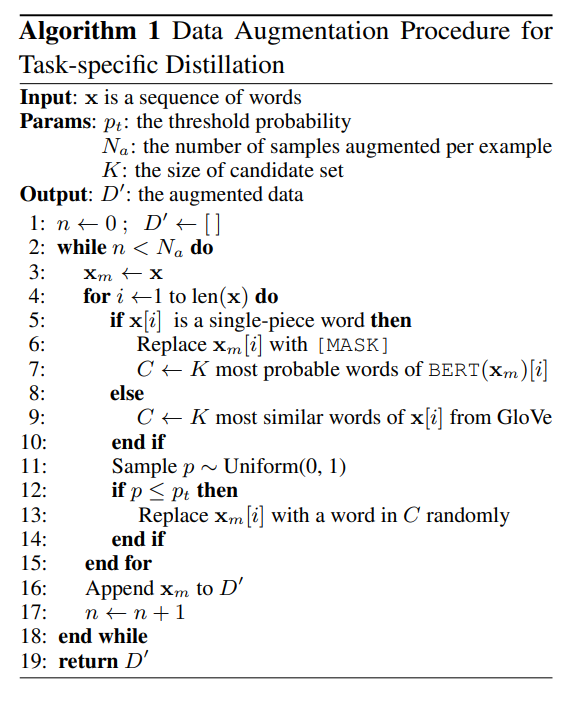

- 一般蒸馏为特定任务的蒸馏提供了良好的初始化，而特定任务的蒸馏通过集中学习特定任务的知识进一步改进了 TinyBERT

## 4 EXPERIMENTS
-  layers M=4, the hidden size d·=312, the feedforward/filter size d·i=1200 and the head number h=12) that has a total of 14.5M parameters
-  g (m) = 3 × m 作为层映射函数

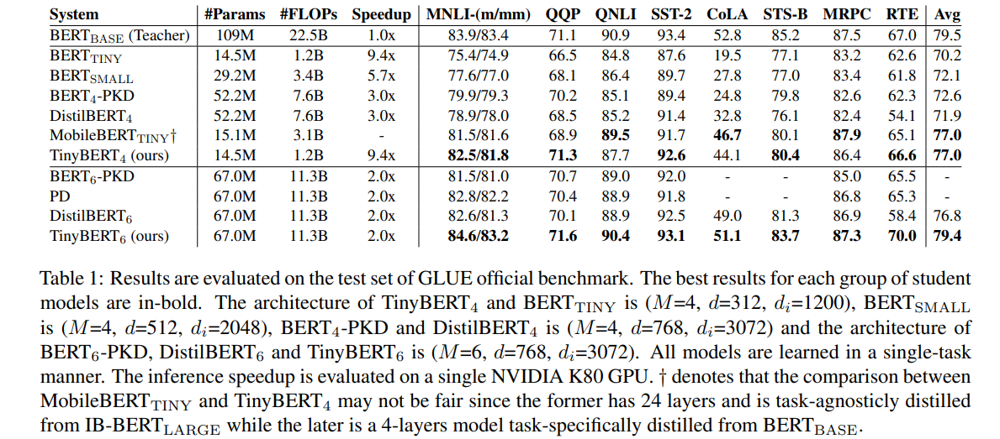
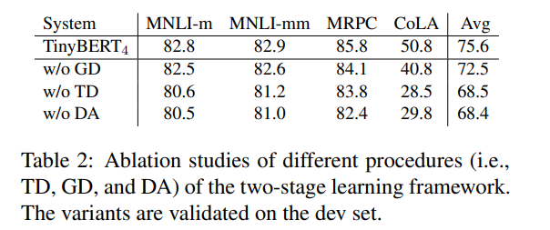
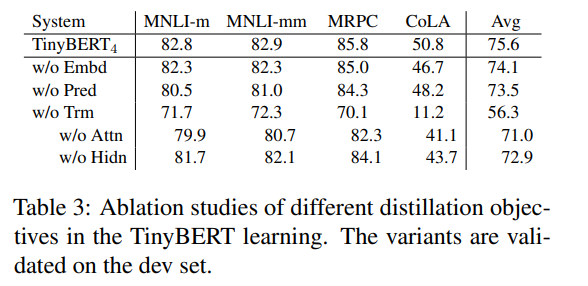

- top-strategy (g(m) = m + N − M; 0 < m ≤ M) 
- bottomstrategy (g(m) = m; 0 < m ≤ M)
- 不同的任务依赖于 BERT 层的不同类型的知识。由于统一策略从底层到顶层获得了 BERT b a s e 的知识，因此在所有四个任务中，统一策略的性能都优于其他两个基线
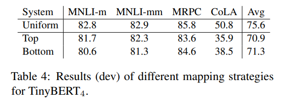

