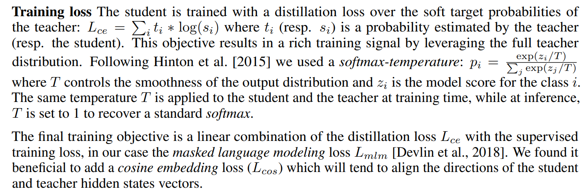
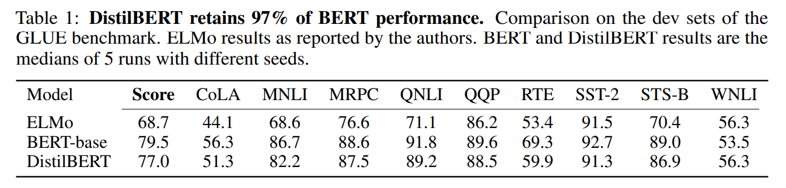
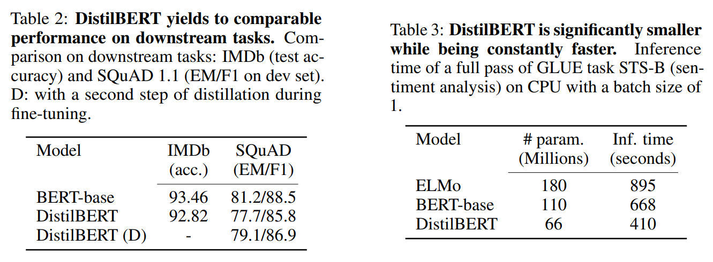
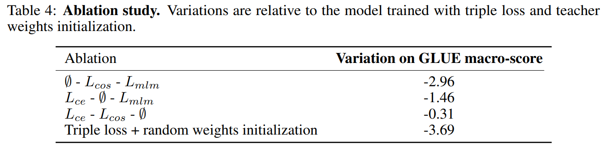

<!-- TOC -->

- [DistilBERT, a distilled version of BERT: smaller, faster, cheaper and lighter](#distilbert-a-distilled-version-of-bert-smaller-faster-cheaper-and-lighter)
  - [ABSTRACT](#abstract)
  - [1 INTRODUCTION](#1-introduction)
  - [2 KNOWLEDGE DISTILLATION](#2-knowledge-distillation)
  - [3 DISTILBERT: A DISTILLED VERSION OF BERT](#3-distilbert-a-distilled-version-of-bert)
  - [4 EXPERIMENTS](#4-experiments)

<!-- /TOC -->
# DistilBERT, a distilled version of BERT: smaller, faster, cheaper and lighter
- https://arxiv.org/abs/1910.01108

## ABSTRACT
- 提出了一种方法来预先训练一个较小的通用语言表示模型，称为 DistilBERT，然后可以对这个模型进行微调，使其能够像较大的模型一样在广泛的任务上具有良好的性能
- 在预训练阶段利用了知识蒸馏技术，结果表明，在保持97% 的语言理解能力的同时，可以将 BERT 模型的规模缩小40% ，速度提高60% 
- 为了利用大型模型在预训练过程中学到的归纳偏差，我们引入了一种结合语言建模、蒸馏和余弦距离损失的三重损失

## 1 INTRODUCTION
- 证明了使用预先经过知识提取训练的更小的语言模型可以在许多下游任务上达到类似的性能，从而使模型在推理时更轻、更快，同时也需要更小的计算训练预算
- 使用 triple loss，我们表明，40% 较小的变压器(Vaswani 等人(2017))通过监督一个较大的变压器语言模型通过蒸馏预训练可以达到类似的性能在各种下游任务，而在推理时间快60% 。进一步的烧蚀研究表明，三重损耗的所有成分对于获得最佳性能至关重要

## 2 KNOWLEDGE DISTILLATION
- 在监督式学习，一个分类模型通常被训练通过最大化标签的概率来预测一个实例类。因此，一个标准的训练目标涉及最小化模型的预测分布和训练标签的one-hot经验分布之间的交叉熵

- **一个在训练集上表现良好的模型将在正确的类上以高概率预测输出分布，在其他类上以接近于零的概率预测输出分布。但是其中一些“接近零”的概率比其他概率更大，部分反映了模型的泛化能力，以及它在测试集中的表现**
  - 我认为这是一个美丽的[ MASK ]的开始 =》 预测包括两个高概率的标记(日期和生命)和一条有效预测的长尾(未来，故事，世界...)

- 损失函数

## 3 DISTILBERT: A DISTILLED VERSION OF BERT
- Student architecture：着重于减少层次的数量
  - 张量的最后一个维度的变化(隐藏大小维度)对计算效率的影响小于其他因素的变化
- Student initialization：初始化
  - 重要元素是为子网络的收敛找到正确的初始化
  - 利用教师和学生网络之间的共同维度，我们从两个层次中取出一个层次来初始化从教师那里得到的学生
- Distillation：
  - distilled on very large batches leveraging gradient accumulation (up to 4K examples per batch) using dynamic masking and without the next sentence prediction objective
  - 大的批次利用梯度积累
  - 动态屏蔽
  - 没有下一个句子预测目标
- Data and compute power
  - 8 16GB V100 GPUs for approximately 90 hours
  - 1024 32GB V100 1 day：RoBERTa

## 4 EXPERIMENTS
- General Language Understanding

- Size and inference speed

- ABLATION STUDY

