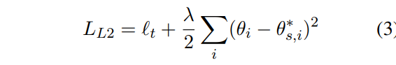
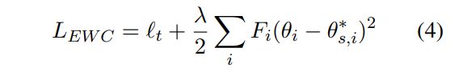
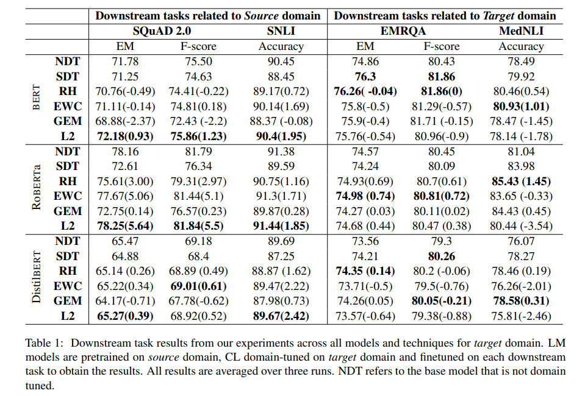
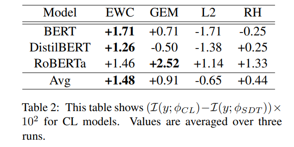

<!-- TOC -->

- [Continual Domain-Tuning for Pretrained Language Models](#continual-domain-tuning-for-pretrained-language-models)
  - [摘要](#摘要)
  - [引言](#引言)
  - [建议方法](#建议方法)
    - [REHEARSAL](#rehearsal)
    - [L2 Regularization](#l2-regularization)
    - [ELASTIC WEIGHT CONSOLIDATION (EWC)](#elastic-weight-consolidation-ewc)
  - [实验](#实验)

<!-- /TOC -->
# Continual Domain-Tuning for Pretrained Language Models
- https://arxiv.org/abs/2004.02288

## 摘要
- 我们研究了在特定领域的语境嵌入模型(如 bert，Distilbert，and Roberta)的预训练中减轻灾难性遗忘的方法。最近提出的领域特定模型，如 Biobert，Scibert 和 Clinicalbert 是通过继续在领域特定的文本语料库上的预训练阶段来构建的
- 这样的预训练容易导致灾难性遗忘，因为模型会忘记在一般领域学到的一些信息。我们建议使用两种持续学习技术(rehearsal and elastic weight consolidation)来改进针对特定领域的训练
- 结果表明，我们提出的方法训练的模型能够更好地保持其在一般领域任务上的性能，同时在下游领域任务上优于特定领域的基线模型。

## 引言
- 自适应作为一种简单的领域转移技术(SDT) ，使用预训练的 CWE 模型权重作为初始化，并在一个大的领域特定的未标记文本语料库上继续进行预训练。然后，这个特定于领域的 CWE 模型被用作监督特定于领域的下游任务的初始化
- 文将一般领域的预训练称为“ GD-pretraining”，特定领域语料库的继续预训练称为“ DS-pretraining”，下游领域特定任务的最终监督训练称为“ finetuning”
- 域转移技术称为 SDT (简单域转移) ，并将其作为一个基线。迫使模型忘记在 gd 预训期间学到的一些信息。当我们评估 SDT 模型在一般领域任务上的性能时，我们在实验中观察到了这种行为。SDT 模型以丢失从一般领域语料库中获得的信息为代价，提高了特定领域任务的性能
- 假设像 BERT 这样的大容量模型，当用减轻灾难性遗忘的方法训练时，可以产生 CWE 模型，它能很好地适应特定领域的任务，同时保留一般领域的信息。此外，我们还假设，减少灾难性遗忘或保留更一般的领域信息可以导致正向前传输(Lopez-Paz and Ranzato，2017) ，因此，可以提高特定领域任务的性能，同时仍然保持一般领域的高性能

- 一个简单的多任务预演方案(Ratcliff，1990)和弹性重量整合(EWC)(Kirkpatrick 等人，2017)
- 使用提取性问题回答和自然语言推理作为我们的下游任务

- 贡献
  - 出并评估针对特定领域的 CWE 模型的改进的连续培训程序。这些方法通常优于标准 DS-pretraining 基线，同时保持一般域性能
  - 发布bert, Roberta, and Distilbert模型生物医学领域
  - 发布预处理的生物医学数据集和 ds 预训练任何的 CWE 模型在 PyTorch 上使用 EWC 和 rehearsal 代码

## 建议方法
### REHEARSAL
- 使用多任务目标来彩排前一个任务，从而避免灾难性的遗忘(Ratcliff，1990)。它包含了前一个任务(或数据集)在 d d 上的 ds 预训练中的一些例子。这训练模型在两个数据集上都做得很好。与新任务的数据相比，包含的 d g 数据通常只占很小的百分比。这可以被解释为一个多任务学习模型与一个较小的权重相关联的 d g
- 需要确保模型学习新领域中单词的良好表示，同时保持其在一般领域中的性能。因此，在每个训练批中，我们从语言模型最初训练的一般语料库中添加一些文本示例。由 log p (θ | d，d g) = log p (d d | θ) + α log p (d g | θ)

### L2 Regularization
- 对参数的变化做L2正则

### ELASTIC WEIGHT CONSOLIDATION (EWC)

## 实验

