<!-- TOC -->

- [ABSTRACT](#abstract)
- [1 INTRODUCTION](#1-introduction)
- [2 METHODOLOGY](#2-methodology)
  - [PRE-TRAINED LANGUAGE MODEL](#pre-trained-language-model)
  - [CRITERIA FOR INSTANCE SELECTION 实例选择的准则](#criteria-for-instance-selection-实例选择的准则)
  - [INSTANCE SELECTION 实例选择](#instance-selection-实例选择)
- [EXPERIMENTS 实验](#experiments-实验)
  - [SETTINGS AND COMPARISONS 设置和比较](#settings-and-comparisons-设置和比较)
  - [RESULTS 结果](#results-结果)

<!-- /TOC -->
# ABSTRACT
动学习能够显著降低数据驱动技术的注释成本。然而，以往自然语言处理的主动学习方法主要依赖于基于熵的不确定性标准，忽视了自然语言的特性。本文提出了一种基于预训练语言模型的句子匹配主动学习方法。不同于以往的主动学习，它可以提供语言标准来衡量实例，并帮助选择更有效的实例进行注释。实验表明，我们的方法可以达到更高的准确性与较少的标记训练实例

# 1 INTRODUCTION
- 句子匹配是自然语言处理中的一项基础技术。在过去的几年中，深度学习作为一种数据驱动技术已经在句子匹配方面取得了最先进的成果。然而，这种数据驱动的技术通常需要大量的手工注释，并带来很大的成本。如果不能获得大量的标记数据，深度学习的优势将大大减弱
- 主动学习不是随机选择实例，而是根据一些标准来度量整个候选实例，然后选择更有效的实例进行注释
- 以往自然语言处理中的主动学习方法主要依赖于基于熵的不确定性准则，忽略了自然语言的特性。具体来说，如果忽略语言相似性，可能会选择多余的实例，浪费大量的注释资源。因此，如何设计语言学标准来衡量候选实例是一个重要的挑战

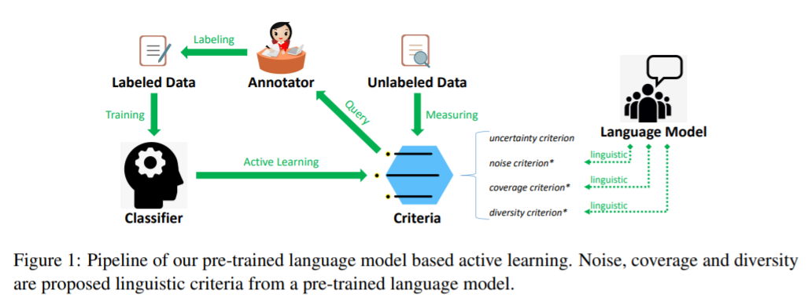

# 2 METHODOLOGY 
- 在一个通用的主动学习场景中，有一小组带标签的训练数据 p 和一大组可用的未带标签的数据 q。主动学习就是根据一定的标准选择 q 中的实例，然后将它们标记并添加到 p 中，从而最大限度地提高分类器 m 的性能，最小化注释代价

## PRE-TRAINED LANGUAGE MODEL

## CRITERIA FOR INSTANCE SELECTION 实例选择的准则
- Uncertainty
  - 不确定性: 不确定性标准表示实例的分类不确定性，是主动学习的标准。具有高不确定性的实例更有利于优化分类器，因而更值得选择。通过计算不确定度作为熵，利用熵可以得到 q 中第 i 实例的不确定度等级
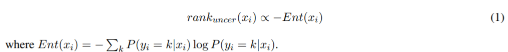

- Noise
  - 噪声: 噪声标准表示在一个实例中存在多少潜在噪声。直观上，带噪声的实例可能会降低标记数据 p 的性能，我们希望选择无噪声的实例。噪声情况通常具有生成概率较低的罕见表达式。因此，噪声令牌可能很难重建与上下文的语言模型预训练。基于这一假设，提出了重构掩码令牌损失的噪声准则
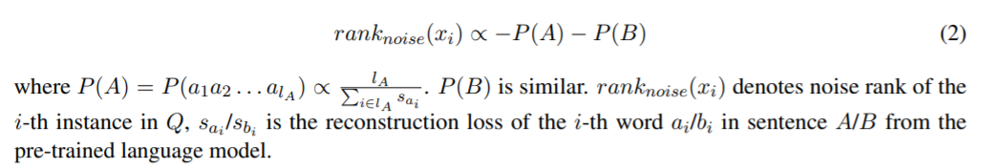

- Coverage
  - 覆盖度: 覆盖度标准表明当前实例的语言表达能否丰富表征学习。一方面，一些诸如停止词之类的标记是没有意义的，并且易于建模(高覆盖率)。另一方面，分类器需要新的实例(低覆盖率)来丰富表示学习。这些新鲜的例子，如相对低频的专业表达，通常产生的概率低于普通的。因此，我们可以利用重建损失来弥补低覆盖率的损失
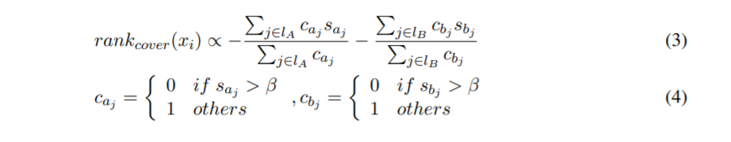
其中 β 表示用于区分噪声的超参数，设置为10.0

- Diversity
  - 多样性: 多样性标准表示实例的多样性。冗余实例效率低下，浪费注释资源。相比之下，多样化的语言可以帮助学习更多不同的语言表达和匹配模式
  - 首先，我们使用向量 v i 来表示句子对 instance x i 的实例。为了模拟两个句子之间的差异，我们使用了删除序列 l d 和插入序列 l i 之间的词嵌入减法(当我们通过删除和插入标记将句子 a 转换为句子 b 时，这些标记分别被添加到 l d 和 l i 中) 此外，减法中的词根嵌入还会受到重构损失的影响。直观上，无意义的标记，如介词应该有较少的权重，他们通常更容易预测与较低的重建损失。
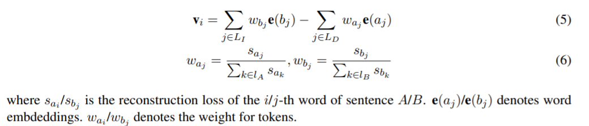
对于实例表示，我们希望选择具有代表性且彼此不同的不同表示。具体来说，我们采用了 K-means 算法多样性排名算法如下:
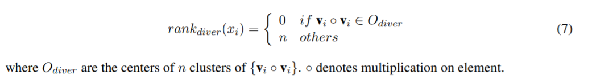

## INSTANCE SELECTION 实例选择
- 我们根据标准的不同有效性，结合标准的等级，在未标记数据 q 中选择 n 个最佳候选实例。
- 依次使用 rank-uncer，rank-diver，rank-cover，rank-noise 选择 top 8n, 4n, 4n, n个实例
- 基于如下序列进行主动学习
  - rank-uncer，熵 8n
  - rank-diver，基于编辑距离，找出删除以及插入队列，队列基于其重建损失占比为权重加和形成一个新的向量，然后基于新的向量使用k-means进行聚类 4n
  - rank-cover，基于重建损失的值进行筛选实例，小于某个门限的重建损失不再进行考虑，最终选择重建损失比较大的 2n
  - rank-noise，选择噪声数据少的，也即是重建损失少的，即是针对每个词在预训练模型上的损失值与长度归一化后选择最小的  n

# EXPERIMENTS 实验
## SETTINGS AND COMPARISONS 设置和比较
- 数据集上进行实验，包括 SNLI [1] ，multili [19] ，Quora [7]， LCQMC [10] ，BQ [2]
- 每轮选择的数量是 n = 100
- 进行了25轮主动学习。在所有回合之后都有一个待定的评估测试集
- 主动学习方法: (1)随机抽样(随机)随机选择实例进行注释和每轮训练。(2)不确定性抽样(熵)是标准熵判据。(3)预期梯度长度(EGL)的目标是选择预期会导致令牌的梯度发生最大变化的实例。(4)预训练语言模型(LM)是我们提出的主动学习方法

## RESULTS 结果
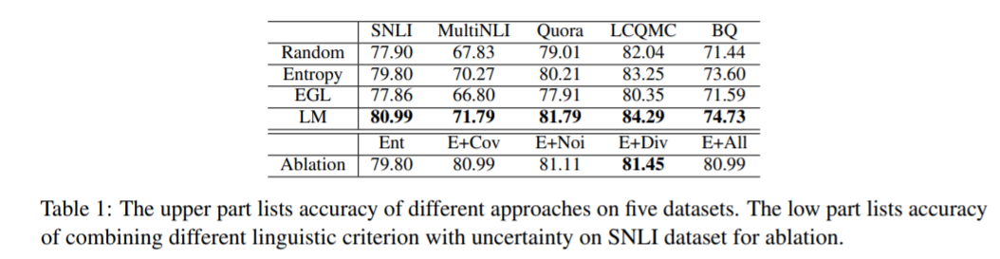
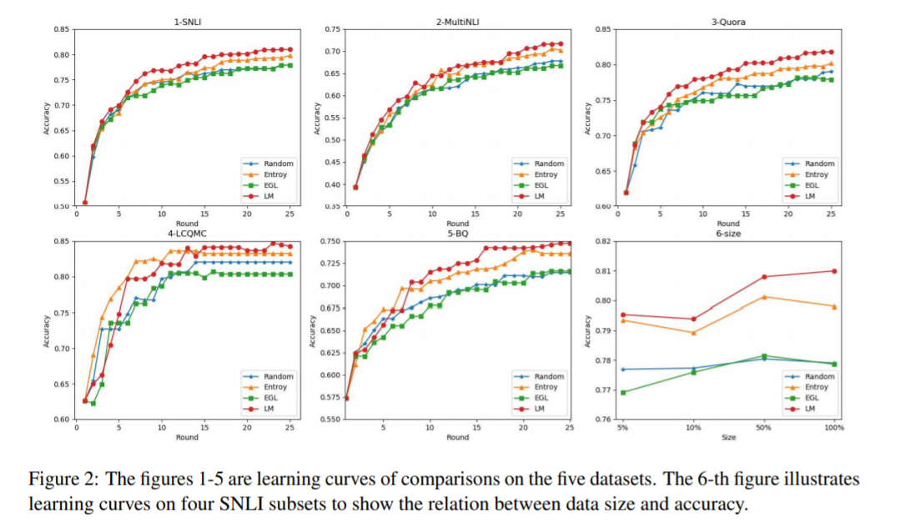

- 表1和图2(1-5)报告了五个数据集上每种方法的准确性和学习曲线。总的来说，我们的方法在英文和中文数据集上都获得了更好的性能。我们可以知道，额外的语言标准是有效的，这表明一个预先训练的语言模型可以充分地捕捉语言特征，并提供更有效的训练实例。此外，主动学习方法往往比随机抽样方法获得更好的性能。实验结果表明，主动学习可以大大减少句子匹配的标记数据量。并且 EGL 比标准的主动学习方法要差，可能基于梯度的主动学习方法不适用于句子匹配。事实上，句子匹配需要捕捉句子之间的差异和单个标记的梯度不能反映关系。此外，我们在图2(6)中展示了未标记数据的大小和准确性之间的关系，我们可以看到基于预训练模型的方法的优越性对于更大的数据量更加重要。

- 删除序列和插入序列的可视化: 为了模拟两个句子之间的差异，我们使用了莱文斯坦距离中“ Delete Sequence”和“ Insert Sequence”之间的词嵌入减法(当我们通过删除和插入标记将句子 a 转换为句子 b 时，这些标记被特别地添加到“ Delete Sequence”和“ Insert Sequence”中)
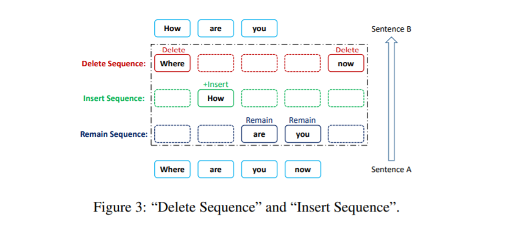
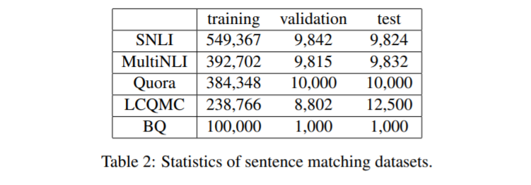
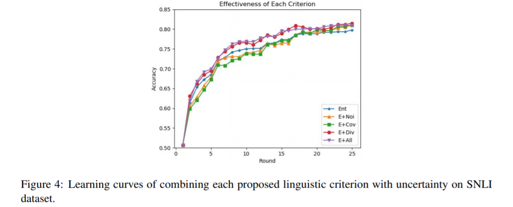