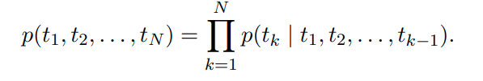
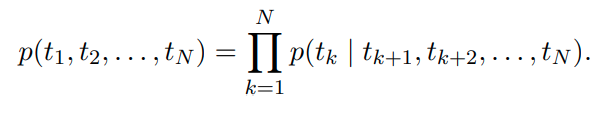
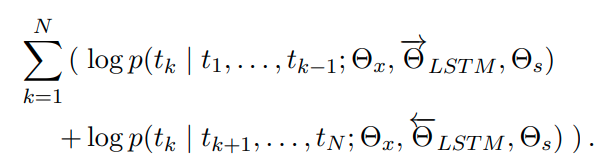
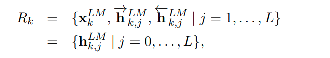
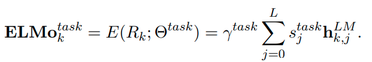

# Deep contextualized word representations
[toc]

PDF: https://arxiv.org/pdf/1802.05365.pdf
Github：https://github.com/allenai/allennlp 

## Abstract
- 一种新的基于深度学习框架的词向量表征模型，能够表征词汇的语法和语义层面的特征，也能够随着上下文语境的变换而改变。简单来说，本文的模型其实本质上就是基于大规模语料训练后的双向语言模型内部隐状态特征的组合
- 对模型的预训练是十分关键的，能够让下游模型去融合不同类型的半监督训练出的特征

## 1 Introduction
高质量的表征是挑战，应当能够学习
: 词语使用的复杂特征（语法和语义的）
基于不同的语言上下文的不同使用方法

ELMo (Embeddings from Language Models) 
: 每个单词的表征是整个输入句子的函数
使用大量语料训练的双向LSTM语言模型产生的向量
该向量表示是深度的，是BiLM所有内部层的函数，更具体，学习一个中间层表示的线性组合，其比只使用上层效果更好
高层状态更容易捕捉上下文相关的语义信息（比如可以直接用于词语的语义消歧任务），下层状态更容易于语法方面（如词性标注）

## 2 Related work
- 之前的工作主要对词语学习一个上下文无关的表示
- 上下文有关
  - 学习子词语信息
  - 针对每个语义学习一个表示
- context2vec：使用LSTM来编码一个词语的周边上下文
- 
##  3 ELMo: Embeddings from Language Models
### 3.1 Bidirectional language models
前向语言模型
: 
底层使用嵌入层或者基于字符的CNN进行embedding的生成
使用L层进行叠加，顶层通过softmax用于预测下一个词语

后向语言模型
: 

BiLM合并前向与后向语言模型，目标函数为最大化前向和后向的方向的对数似然

共享嵌入层参数以及softmax层参数，LSTM层参数前向后向分开表示

### 3.2 ELMo
对于每个单词会计算2L+1层表示

基于不同的任务，计算不同的权重

- $s_j^{task} =softmax(w)$，w是一个独立的可训练的参数shape = (num_layers, )，用来加权各个layer的分布，毕竟layer所表示的东西不同
- γ也是一个可以训练的常量，用在具体任务中去缩放ELMo的大小
- 简单使用顶层输出作为token的表示，效果比baseline还要差

### 3.3 Using biLMs for supervised NLP tasks

