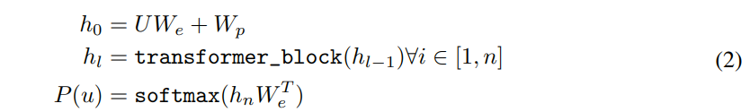
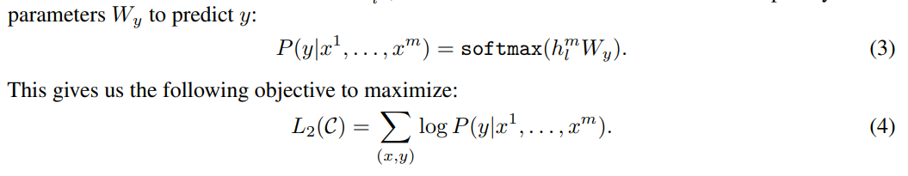
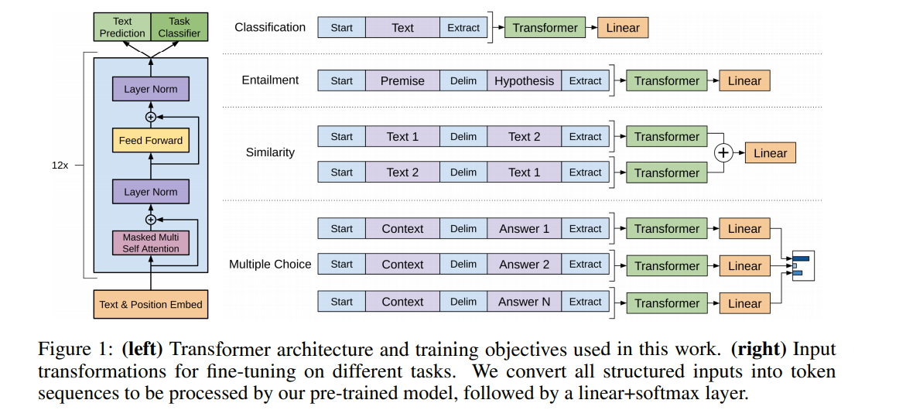
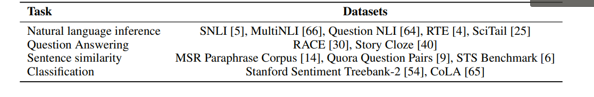
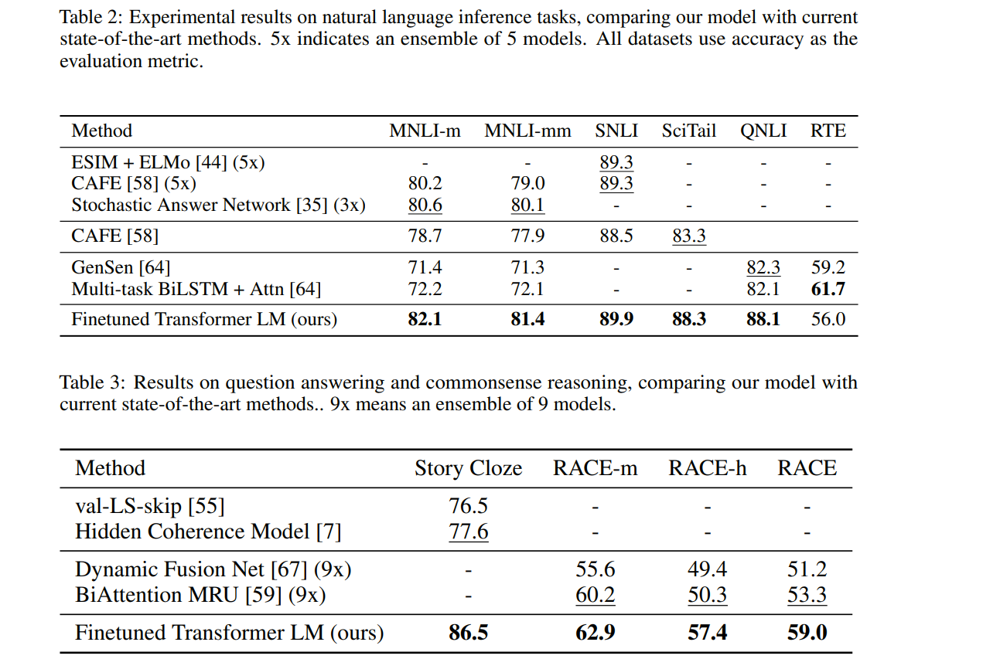
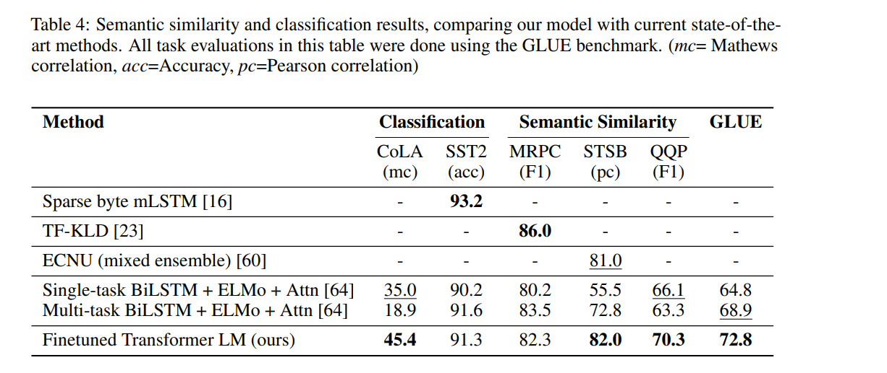
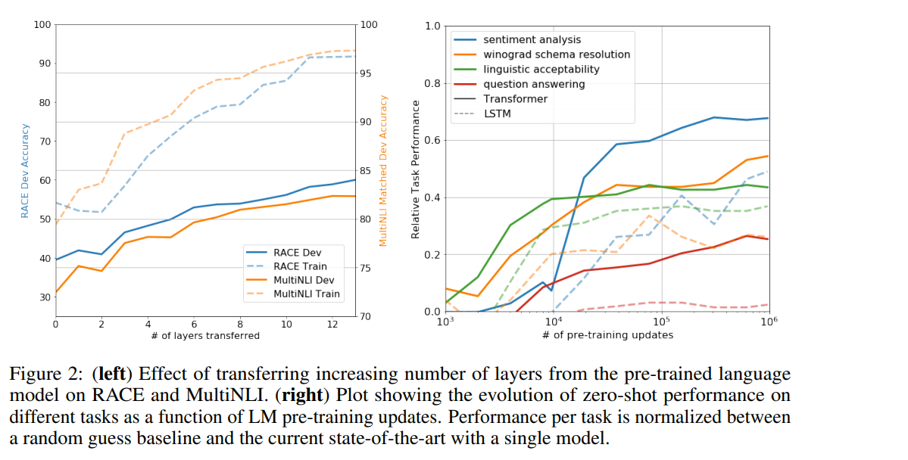

# Improving Language Understanding by Generative Pre-Training
[toc]

https://s3-us-west-2.amazonaws.com/openai-assets/research-covers/language-unsupervised/language_understanding_paper.pdf

## Abstract
- 使用无标注数据进行预训练，最后在任务上进行微调
- 在很多任务上都达到了当前最优

## 1 Introduction
- 在一些标注数据比较困难的领域使用无标注数据是一种补充，即使在数据充足的情况，使用无监督学习更好的表示也是一种增强，如W2V在NLP的应用
- 通过什么学习目标来优化学习更优的表现是不清晰的
    - 如语言模型、翻译、叙述一致性等
- 使用何种方式进行迁移学习也没有共识
    - 如多任务学习、使用复杂结构、针对单独任务进行网络结构更改
- 本文提出一个半监督算法
    - 先使用非监督学习
    - 然后使用监督学习在专门的任务上学习

## 2 Related Work
- Semi-supervised learning for NLP
- Unsupervised pre-training
- Auxiliary training objectives

## 3 Framework
### 3.1 Unsupervised pre-training
语言模型 

We为embedding, Wp为位置embedding

### 3.2 Supervised fine-tuning

发现加入语言模型的目标能够提高监督模型的泛化能力以及加快训练收敛

### 3.3 Task-specific input transformations

- Textual entailment: P + $ + H
- Similarity: 相似度不区分先后，因此产生两条例子
- Question Answering and Commonsense Reasoning：Z文档 + q问题 + $ + a可能答案
## 4 Experiments
### 4.1 Setup
- BooksCorpus

Model specifications
: 12层单解码器模型

## 5 Analysis
Impact of number of layers transferred 
: 预训练的模型层次越多效果越好

Zero-shot Behaviors
: 底层生成模型学习执行我们评估的许多任务，以提高其语言建模的能力，并且Transformer更结构化的注意力记忆与LSTM相比，更有助于迁移
设计了一系列启发式解决方案，使用底层的生成模型来执行任务，而无需进行监督微调。我们将这些启发式解决方案生成预训练过程的效果可视化。我们观察到这些启发式方法的性能是稳定的，并且在训练中稳步增加，这表明生成性预训练支持学习各种各样的任务相关功能。我们还观察到LSTM在其零样本性能上表现出更高的方差,这表明Transformer架构归纳的偏好有助于迁移

Ablation studies
: 消融分析，辅助目标有助于NLI任务和QQP。总的来说，趋势表明较大的数据集受益于辅助目标，而较小的数据集则没有

## 6 Conclusion
略