# XLNet: Generalized Autoregressive Pretraining for Language Understanding
[toc]

- URL: https://arxiv.org/pdf/1906.08237.pdf
- CODE: https://github.com/zihangdai/xlnet

## Abstract
- 以BERT为代表的基于噪声自编码（autoencoding）的预训练模型在各类任务上表现突出，超越了传统的单向训练的自回归（autoregressive）语言模型，由于使用mask进行训练，输入与下游任务的fine-tunning不一致，这种不一致使得BERT在生成类任务上相对较弱
- XLNet
  - 能够学习双向的文本信息，得到最大化期望似然（对所有随机排列，解决mask导致的问题）
  - 使用自回归的方程解决BERT存在的问题，同时将最好的自回归模型transformer-XL的思想应用于pre-train中

## 1 Introduction
- 传统无监督表征学习（Unsupervised representation learning）被成功应用在大量无标注文本的预训练上，其中AR（自回归）与AE（自编码）是最成功的两种预训练语言模型
- AR方法学习文本序列的条件概率，即学习已知上文预测下一个词或一直下文预测上一个词。不是高效的双向模型，与一些不需要“重写”（rewrite）下游任务不匹配，如情感分析，摘要提取等，这些任务往往需要双向的上下文信息
$$p(x) = \prod_{t=1}^T p(x_t | x_{<t})$$
- AE方法则重构数据，mask部分token，用上下文的双向信息来预测被mask的token，由于训练时使用了【MASK】，而在下游任务中input并没有【MASK】，因而存在pretrain-finetune discrepancy，同时BERT同时mask15%的token这个操作实际上做了一个有风险的假设：假设每一个被mask的token之间是相互独立的
- XLNet综合AE与AR的优点，同时在一定程度上避免了两者的缺点
  - 通过打乱文本sequence的token顺序，使得用前n-1的token来预测第n个token时，同时能用到上下文的信息。对所有可能的token排列（all possible permutations of the factorization order）来求期望的对数似然函数
  - XLNet是一种广泛意义上的AR模型，每次只预测一个token，所以避免了mask多个token而难以判断被mask的多个token之间的联系
- XLNet使用了一些小trick，改善了Transformer-XL的一些问题
  - 使用片段复发机制（segment recurrence mechanism），使得它在长文本的任务中表现更好
  - 直接使用Transformer-XL来训练基于排序的语言模型（permutation-based language model）是不行的，会得到不确定的结果，作者重新设置了Transformer-XL的网络与参数，去除了这种随机性

## 2 Proposed Method
### 2.1 Background
AR模型目标函数
: 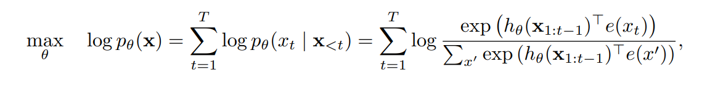

AE模型目标函数
: 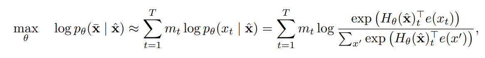
mt表示词语是否被mask，

两者区别在于
- AE对MASK词语的独立性假设（Independence Assumption）
- 输入噪音（Input noise），MASK在预测时不存在，虽然有使用原文进行训练，但是其概率很小
- 文本依赖（Context dependency），AE能看到双向的信息

### 2.2 Objective: Permutation Language Modeli
目标函数
: 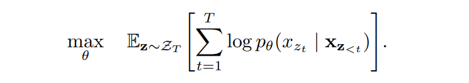

使用NADE，排列语言模型来进行双向信息的依赖

Remark on Permutation
: 只进行因子顺序调整，对于序列顺序并不调整，因为在预测的时候始终只有正常顺序
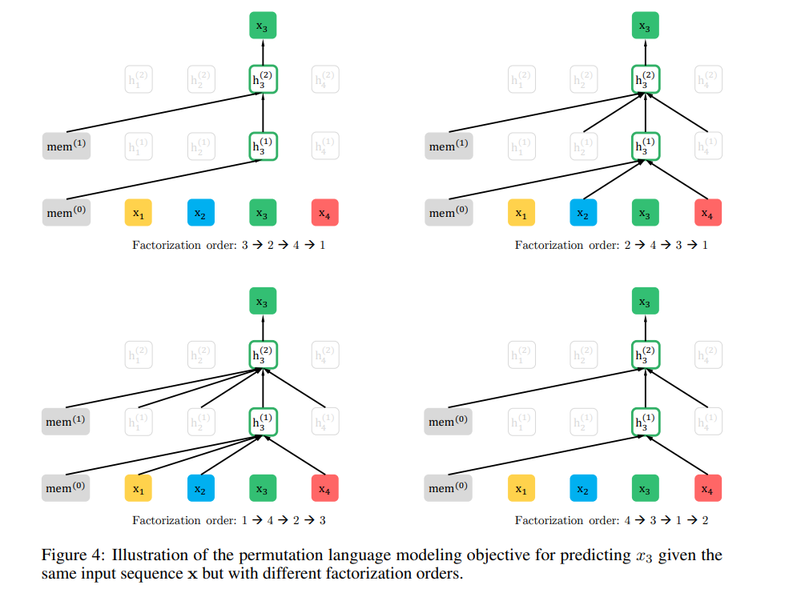

### 2.3 Architecture: Two-Stream Self-Attention for Target-Aware Representations
对于BERT来说，有单词被替换成MASK，因此在进行自注意力计算的时候是使用的MASK来参与计算的，而在本模型中，如果把自己单词添加进去，则相当于已经有了该信息，学习任务就变得非常简单
如果不将待预测的词语添加到自注意力编码中，则对于已经编码的信息外其他所有位置都是一样的，与实际上的下一个因子词无关系，这样的话不能学习到有用的表示，因此修改参数，将下一个位置编码进去
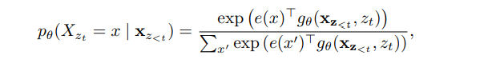
g将zt的位置作为输入

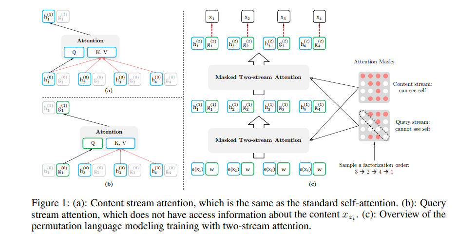
- 当预测x_{z_t}时只使用位置信息z_t和上文信息，不能看到自己本身，即$x_{z_t}$，否则求条件概率$g_{\theta}(x_{z<t},z_t)$的问题将会变成一个简单问题
- 当预测$x_{z_j}$时，其中j>t，则能看到$x_{z_t}$信息
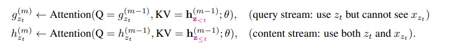
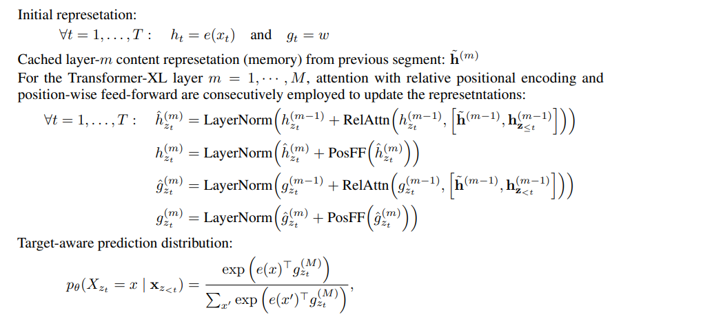

Partial Prediction
: 当t比较小，仅得到t-1个token的信息，这样的预测比较难，很难收敛，所以模型设计了一个超参数K，只对后1/K的tokens进行预测

### 2.4 Incorporating Ideas from Transformer-XL

将上一个块的输出进行concate，相当于只对当前的词语进行自注意力计算，但是其k，v包含前面一个块的输出，原则上可以扩展为更多的kv
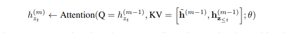

### 2.5 Modeling Multiple Segments

### 2.6 Discussion
Comparison with BERT
: bert和xlnet都执行部分预测，即只预测序列中的token子集。这对BERT来说是个必要的选择，因为如果全部单词被屏蔽，不可能做出任何有意义的预测。另外，在bert和xlnet中，部分降低优化难度。但是，第2.1节中讨论的独立性假设不能让bert对目标之间的依赖关系建模
- 对于挖掉New York这总情况，对于BERT来说只能预测单一，而对于xlnet来说则可以在预测New之后下步预测York

## 3 Experiments
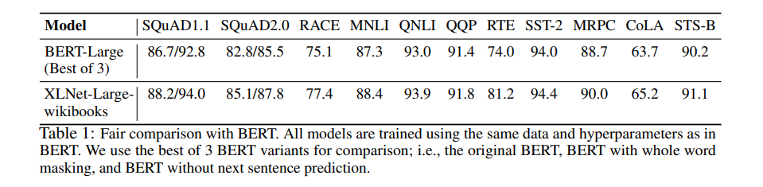
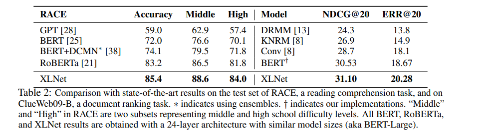

## OTEHER
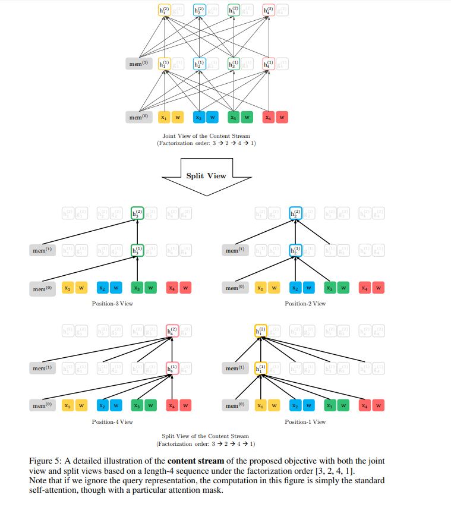
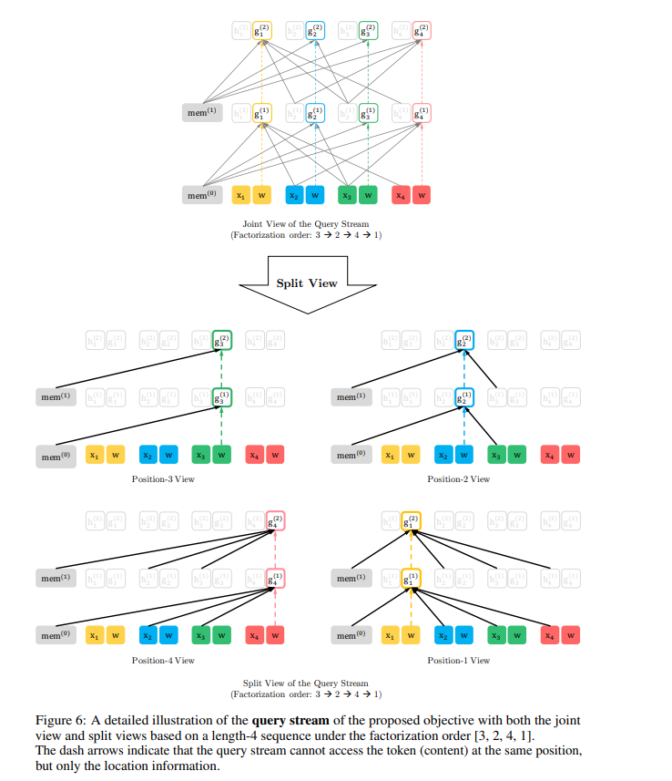
