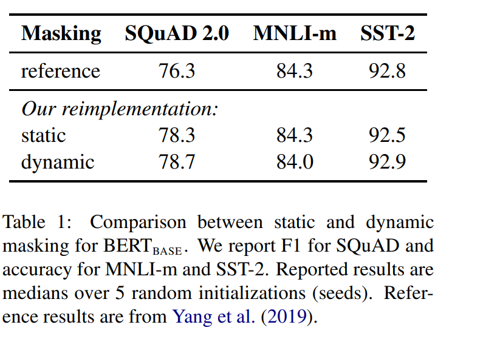
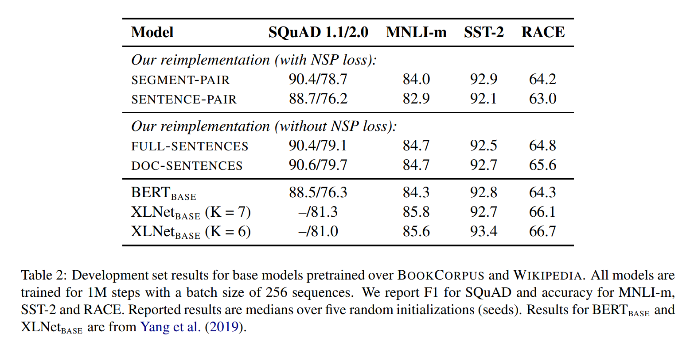
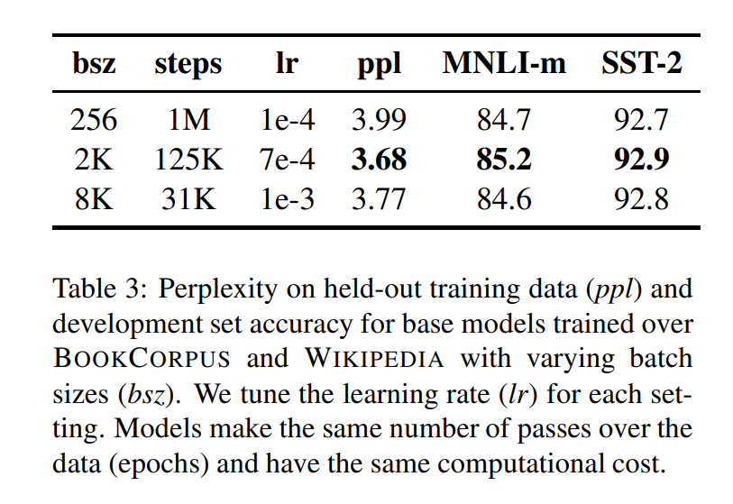

# RoBERTa: A Robustly Optimized BERT Pretraining Approach
[toc]
- URL: https://arxiv.org/abs/1907.11692
- CODE: https://github.com/pytorch/fairseq

## Abstract

## 1 Introduction
- 预训练的语言模型在这俩年取得了巨大的突破，但是如何比较各预训练模型的优劣显然是一个很有挑战的问题。用不同的数据集，用不同的预训练参数，都会对最后的结果产生不同的影响。本文就重点研究了一些预训练参数和训练批大小对BERT模型的影响。研究表面，BERT远远没有被充分训练，如果训练充分且技巧运用得到，其表现完全能超过（或不逊色于）后来的预训练模型

- 文章贡献：
     1. 提出了一套重要的 BERT 设计选择和训练策略，并引入了能够提高下游任务性能的 备选方案; 
     2. 使用一个新的数据集 CCNEWS，并确认使用更多的数据进行预训练可以进一步提高 下游任务的性能; 
     3. 本文的训练改进表明，在正确的设计选择下，预训练的 masked language model 与其 他所有最近发表的方法相比都更具有竞争力。 
同时发布了在 PyTorch 中实现的模型、预训 练和微调代码

## 2 Background
### 2.1 Setup
输入 [CLS], x1, . . . , xN , [SEP], y1, . . . , yM, [EOS].

### 2.2 Architecture
使用transformer

### 2.3 Training Objectives
Masked Language Model (MLM)
: 目标函数是预测MASKED词语的交叉熵，15%的概率选出词语然后替换比例：80% AMSK, 10% 原单词， 10% 随机单词
原始实现中替换是静态的，在初始替换后在整个训练期间都不会变化

Next Sentence Prediction (NSP)
: 是判断句子是否是下一句，设计用来完成对两个句子之间的关系进行推理

### 2.4 Optimization
Adam
:  β1 = 0.9, β2 = 0.999, ǫ = 1e-6 and L2 weight decay of 0.01

warmed up
: 前10,000 steps to a peak value of 1e-4

dropout of 0.1 on all layers and attention weights, and a GELU activation function

S = 1,000,000 ，B = 256，  length T = 512 tokens

### 2.5 Data
## 3 Experimental Setup
### 3.1 Implementation
### 3.2 Data
### 3.3 Evaluation

## 4 Training Procedure Analysis
### 4.1 Static vs. Dynamic Masking
- 原始静态mask：
BERT中是准备训练数据时，每个样本只会进行一次随机mask（因此每个epoch都是重复），后续的每个训练步都采用相同的mask，这是原始静态mask，即单个静态mask，这是原始 BERT 的做法。
- 修改版静态mask：
在预处理的时候将数据集拷贝 10 次，每次拷贝采用不同的 mask（总共40 epochs，所以每一个mask对应的数据被训练4个epoch）。这等价于原始的数据集采用10种静态 mask 来训练 40个 epoch。
- 动态mask：
并没有在预处理的时候执行 mask，而是在每次向模型提供输入时动态生成 mask，所以是时刻变化的。
不同模式的实验效果如下表所示。其中 reference 为BERT 用到的原始静态 mask，static 为修改版的静态mask。

### 4.2 Model Input Format and Next Sentence Prediction
- SEGMENT-PAIR + NSP：
输入包含两部分，每个部分是来自同一文档或者不同文档的 segment （segment 是连续的多个句子），这两个segment 的token总数少于 512 。预训练包含 MLM 任务和 NSP 任务。这是原始 BERT 的做法。
- SENTENCE-PAIR + NSP：
输入也是包含两部分，每个部分是来自同一个文档或者不同文档的单个句子，这两个句子的token 总数少于 512 。由于这些输入明显少于512 个tokens，因此增加batch size的大小，以使 tokens 总数保持与SEGMENT-PAIR + NSP 相似。预训练包含 MLM 任务和 NSP 任务。
- FULL-SENTENCES：
输入只有一部分（而不是两部分），来自同一个文档或者不同文档的连续多个句子，token 总数不超过 512 。输入可能跨越文档边界，如果跨文档，则在上一个文档末尾添加文档边界token 。预训练不包含 NSP 任务。
- DOC-SENTENCES：
输入只有一部分（而不是两部分），输入的构造类似于FULL-SENTENCES，只是不需要跨越文档边界，其输入来自同一个文档的连续句子，token 总数不超过 512 。在文档末尾附近采样的输入可以短于 512个tokens， 因此在这些情况下动态增加batch size大小以达到与 FULL-SENTENCES 相同的tokens总数。预训练不包含 NSP 任务。

BERT采用的是SEGMENT-PAIR（可包含多句话）的输入格式，从实验结果来看，如果在采用NSP loss的情况下，SEGMENT-PAIR 是优于SENTENCE-PAIR(两句话)的。发现单个句子会损害下游任务的性能，可能是如此模型无法学习远程依赖。接下来对比的是，将无NSP损失的训练与来自单个文档(doc-sentence)的文本块的训练进行比较。我们发现，与Devlin等人(2019)相比，该设置的性能优于最初发布的BERT-base结果：消除NSP损失在下游任务的性能上能够与原始BERT持平或略微升高。可能的原因：原始 BERT 实现采用仅仅是去掉NSP的损失项，但是仍然保持 SEGMENT-PARI的输入形式。

最后，实验还发现将序列限制为来自单个文档(doc-sentence)的性能略好于序列来自多个文档(FULL-SENTENCES)。但是 DOC-SENTENCES 策略中，位于文档末尾的样本可能小于 512 个 token。为了保证每个 batch 的 token 总数维持在一个较高水平，需要动态调整 batch-size 。出于处理方便，后面采用DOC-SENTENCES输入格式。

### 4.3 Training with large batches
以往的神经机器翻译研究表明，采用非常大的mini-batches进行训练时候，搭配适当提高学习率既可以提高优化速度，又可以提高最终任务性能。最近的研究表明，BERT也可以接受 large batch训练。Devlin等人(2019)最初训练BERT-base只有100万步，batch size为256个序列。通过梯度累积，训练batch size=2K序列的125K步，或batch size=8K的31K步，这两者在计算成本上大约是是等价的。

BERT-baseE在增大 batch size时的perplexity(困惑度，语言模型的一个指标)和最终任务性能。可以观察到，large batches训练提高了masked language modeling 目标的困惑度，以及最终任务的准确性。large batches也更容易分布式数据并行训练， 在后续实验中，文本使用bacth size=8K进行并行训练。

### 4.4 Text Encoding
字节对编码(BPE)(Sennrich et al.,2016)是字符级和单词级表示的混合，该编码方案可以处理自然语言语料库中常见的大量词汇。BPE不依赖于完整的单词，而是依赖于子词(sub-word)单元，这些子词单元是通过对训练语料库进行统计分析而提取的，其词表大小通常在 1万到 10万之间。当对海量多样语料建模时，unicode characters占据了该词表的大部分。Radford et al.(2019)的工作中介绍了一个简单但高效的BPE， 该BPE使用字节对而非unicode characters作为子词单元。
总结下两种BPE实现方式：
基于 char-level ：原始 BERT 的方式，它通过对输入文本进行启发式的词干化之后处理得到。
基于 bytes-level：与 char-level 的区别在于bytes-level 使用 bytes 而不是 unicode 字符作为 sub-word 的基本单位，因此可以编码任何输入文本而不会引入 UNKOWN 标记。
当采用 bytes-level 的 BPE 之后，词表大小从3万（原始 BERT 的 char-level ）增加到5万。这分别为 BERT-base和 BERT-large增加了1500万和2000万额外的参数。

之前有研究表明，这样的做法在有些下游任务上会导致轻微的性能下降。但是本文作者相信：这种统一编码的优势会超过性能的轻微下降。且作者在未来工作中将进一步对比不同的encoding方案

### 5. RoBERTa
RoBERTa使用dynamic masking，FULL-SENTENCES without NSP loss，larger mini-batches和larger byte-level BPE（这个文本编码方法GPT-2也用过，BERT之前用的是character粒度的）进行训练。除此之外还包括一些细节，包括：更大的预训练数据、更多的训练步数。
