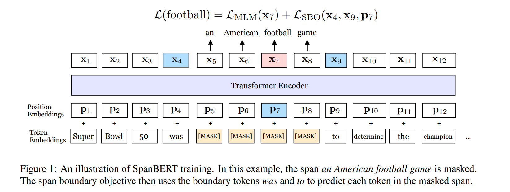
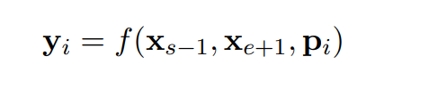
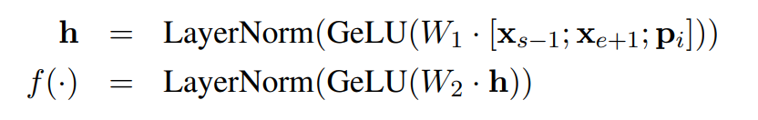

# SpanBERT: Improving Pre-training by Representing and Predicting Spans

[toc]

- https://arxiv.org/pdf/1907.10529.pdf

## Abstract
扩展BERT
- 针对连续的词序列进行MASK，而不是随机的单个词
- 使用范围边界表示来预测整个MASK范围，而不依赖于里面的单个词的表示

其在现有任务中的表现优于 BERT ，并在问答、指代消解等分词选择任务中取得了较大的进展

## 1 Introduction
很多语言任务涉及到2个或者多个词语块（Span）的关系，例如预测大熊猫位于四川，中预测川单个字的难度远小于预测四川这个词，

- 提出了更好的 Span Mask 方案，SpanBERT 不再对随机的单个 token 添加掩膜，而是对随机对邻接分词添加掩膜；
- 通过加入 Span Boundary Objective (SBO) 训练目标，通过使用分词边界的表示来预测被添加掩膜的分词的内容，不再依赖分词内单个 token 的表示，增强了 BERT 的性能，特别在一些与 Span 相关的任务，如抽取式问答；
- 用实验获得了和 XLNet 类似的结果，发现不加入 Next Sentence Prediction (NSP) 任务，直接用连续一长句训练效果更好。

## 2 Background: BERT
略

## 3 Model
 

 ### 3.1 Span Masking
对于每一个单词序列 X = (x1, ..., xn)，作者通过迭代地采样文本的分词选择单词，直到达到掩膜要求的大小（例如 X 的 15%），并形成 X 的子集 Y。在每次迭代中，作者首先从几何分布 l ~ Geo(p) 中采样得到分词的长度，该几何分布是偏态分布，偏向于较短的分词。之后，作者随机（均匀地）选择分词的起点。

根据几何分布，先随机选择一段（span）的长度，之后再根据均匀分布随机选择这一段的起始位置，最后按照长度遮盖。作者设定几何分布取 p=0.2，并裁剪最大长度只能是 10（不应当是长度 10 以上修剪，而应当为丢弃），利用此方案获得平均采样长度分布。因此分词的平均长度为 3.8 。作者还测量了词语（word）中的分词程度，使得添加掩膜的分词更长。图2展示了分词掩膜长度的分布情况。

 ### 3.2 Span Boundary Objective (SBO)
 在很多任务中，会用到利用span的边界作为span本身的表示（比如coreference resolution），作者受此启发，增加了一个利用边界token预测span的任务
 
 

 ### 3.3 Single-Sequence Training
SpanBERT 还有一个和原始 BERT 训练很不同的地方，它没用 Next Sentence Prediction (NSP) 任务，而是直接用 Single-Sequence Training，也就是根本不加入 NSP 任务来判断是否两句是上下句，直接用一句来训练
- 更长的语境对模型更有利，模型可以获得更长上下文（类似 XLNet 的一部分效果）
- 加入另一个文本的语境信息会给MLM 语言模型带来噪音

这里最多采集512个词语进行训练与BERT一致

 ## 4 Experimental Setup
