# ALBERT: A Lite BERT for Self-supervised Learning of Language Representations
[toc]

论文地址：https://arxiv.org/abs/1909.11942?context=cs
代码地址：https://github.com/google-research/ALBERT.

## 1 INTRODUCTION
- 预训练模型在当前使用越来越广，是否越大的模型效果越好？
- 问题：硬件内存，算力，损耗
- 简单扩大模型并不能增加效果：BERT-xlarge虽然有更多的参数量，但在训练时其loss波动更大，Marsked LM的表现比BERT-large稍差，而在阅读理解数据集RACE上的表现更是远低于BERT-large
- 为了解决目前预训练模型参数量过大的问题，本文提出了两种能够大幅减少预训练模型参数量的方法，此外还提出用Sentence-order prediction（SOP）任务代替BERT中的Next-sentence prediction（NSP）任务，基于这些本文提出了ALBERT（A Lite BERT）模型，在多个自然语言理解任务中取得了state-of-the-art的结果
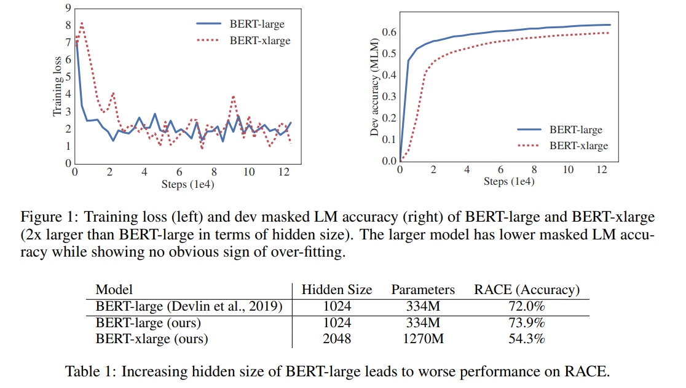

## 2 RELATED WORK
### 2.1 SCALING UP REPRESENTATION LEARNING FOR NATURAL LANGUAGE
- 从预训练词向量到上下文感知的预训练模型

### 2.2 CROSS-LAYER PARAMETER SHARING
以下模型使用跨层参数共享，证明有效
- Deep Equilibrium Model (DQE)
-  (Universal Transformer, UT)

### 2.3 SENTENCE ORDERING OBJECTIVES
- 语句一致性目标使用已有较长的历史
- 我们的目标更像是句子顺序检测，使用的也是文本段而不完全是句子

## 3 THE ELEMENTS OF ALBERT
### 3.1 MODEL ARCHITECTURE CHOICES
相关参数与BERT类似
- Embedding: E, Encoder Layer: L, Hiddle size: H, FF/Filter Size: 4H, Attention Head: H/64 

Factorized embedding parameterization
: 在BERT、XLNet、RoBERTa等模型中，由于模型结构的限制，WordePiece embedding的大小 E 总是与隐层大小H 相同 。从建模的角度考虑，词嵌入学习的是单词与上下文无关的表示，而隐层则是学习与上下文相关的表示。显然后者更加复杂，需要更多的参数，也就是说模型应当增大隐层大小 H ，或者说满足 H >>> E 。但实际上词汇表的大小 V 通常非常大，如果 E == H 的话，增加隐层大小 H 后将会使embedding matrix的维度 V*E 非常巨大。
: 因此本文想要打破 E 与 H 之间的绑定关系，从而减小模型的参数量，同时提升模型表现。具体做法是将embedding matrix分解为两个大小分别为 V*E 和 E*H 矩阵，也就是说先将单词投影到一个低维的embedding空间 E，再将其投影到高维的隐藏空间 H。这使得embedding matrix的维度从 O(V*H) 减小到 O(V*E + E*H) 。当 H>>>E时，参数量减少非常明显。在实现时，随机初始化两个矩阵，计算某个单词的表示需用一个单词的one-hot向量乘以 $V*E$ 维的矩阵（也就是lookup），再用得到的结果乘 $E*H$ 维的矩阵即可。两个矩阵的参数通过模型学习。

Cross-layer parameter sharing.
: 另一个减少参数量的方法就是层之间的参数共享，即多个层使用相同的参数。参数共享有三种方式：只共享feed-forward network的参数、只共享attention的参数、共享全部参数。ALBERT默认是共享全部参数
: 实验表明加入参数共享之后，每一层的输入embedding和输出embedding的L2距离和余弦相似度都比BERT稳定了很多。这证明参数共享能够使模型参数更加稳定。
: 

Inter-sentence coherence loss
: 除了减少模型参数外，本外还对BERT的预训练任务Next-sentence prediction (NSP)进行了改进。在BERT中，NSP任务的正例是文章中连续的两个句子，而负例则是从两篇文档中各选一个句子构造而成。在先前的研究中，已经证明NSP是并不是一个合适的预训练任务。本文推测其原因是模型在判断两个句子的关系时不仅考虑了两个句子之间的连贯性（coherence），还会考虑到两个句子的话题（topic）。而两篇文档的话题通常不同，模型会更多的通过话题去分析两个句子的关系，而不是句子间的连贯性，这使得NSP任务变成了一个相对简单的任务。
: 因此本文提出了Sentence-order prediction (SOP)来取代NSP。具体来说，其正例与NSP相同，但负例是通过选择一篇文档中的两个连续的句子并将它们的顺序交换构造的。这样两个句子就会有相同的话题，模型学习到的就更多是句子间的连贯性。

### 3.2 MODEL SETUP
本文为ALBERT选择了四种参数设置：base, large, xlarge和xxlarge

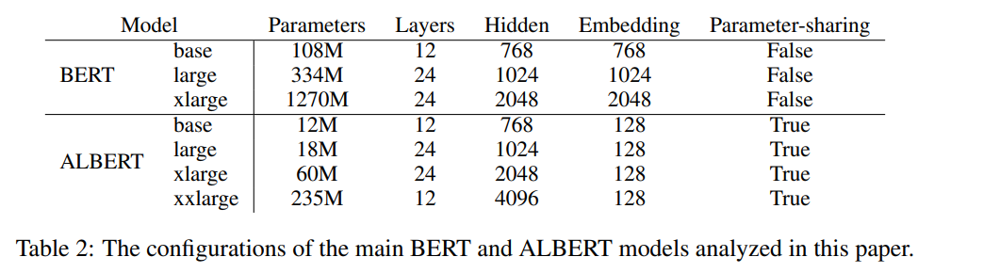

与BERT相比，ALBERT的参数量明显要少很多，ALBERT-xxlarge的参数量也只有BERT-large的70%。注意其中ALBERT-xxlarge只用了12层是因为实验结果证明此时12层与24层结果几乎相同

## 4 EXPERIMENTAL RESULTS
### 4.1 EXPERIMENTAL SETUP
- 格式为 “[CLS] x1 [SEP] x2 [SEP]”
- 长度限制为512
- 词典： 30000， 使用 SentencePiecee
- Mask n gram， 最大为3 
   

### 4.2 EVALUATION BENCHMARKS
#### 4.2.1 INTRINSIC EVALUATION
- SQuAD and RACE

#### 4.2.2 DOWNSTREAM EVALUATION
- The General Language Understanding Evaluation (GLUE) benchmark (Wang et al., 2018)
- Stanford Question Answering Dataset (SQuAD; Rajpurkar et al., 2016; 2018),
- ReAding Comprehension from Examinations (RACE) 

### 4.3 OVERALL COMPARISON BETWEEN BERT AND ALBERT
ALBERT的训练速度明显比BERT快，ALBERT-xxlarge的表现更是全方面超过了BERT
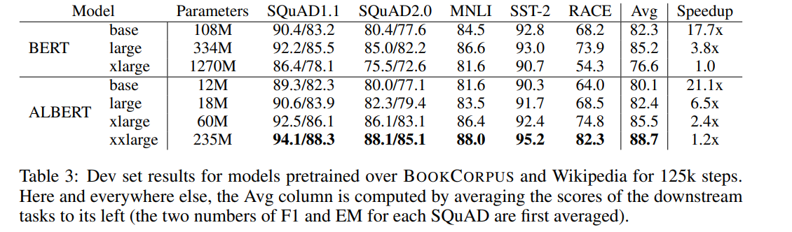

### 4.4 FACTORIZED EMBEDDING PARAMETERIZATION
对于不共享参数的情况， E几乎是越大越好；而共享参数之后，E太大反而会使模型表现变差， E=128 模型表现最好，因此ALBERT的默认参数设置 E = 128 
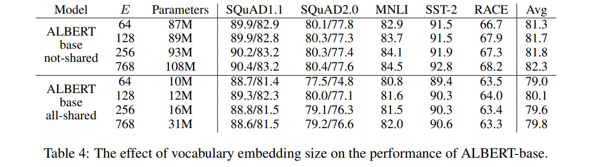

### 4.5 CROSS-LAYER PARAMETER SHARING
参数共享几乎也是对模型结果有负面影响的。但是考虑到其能够大幅削减参数量，并且对结果影响不是特别大，因此权衡之下选择了参数共享
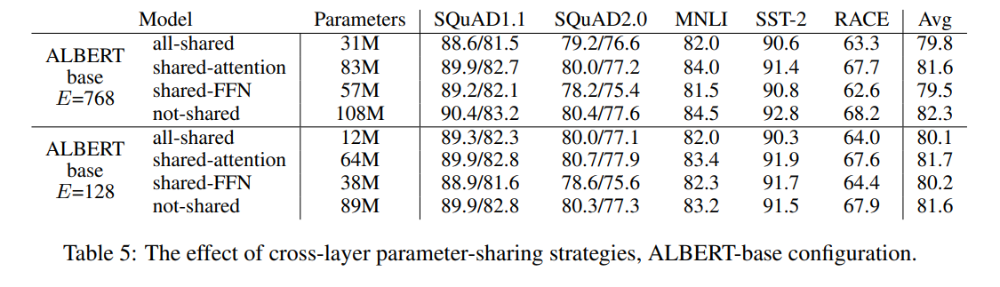

### 4.6 SENTENCE ORDER PREDICTION (SOP)
如果不使用NSP或SOP作为预训练任务的话，模型在NSP和SOP两个任务上表现都很差；如果使用NSP作为预训练任务的话，模型确实能很好的解决NSP问题，但是在SOP问题上表现却很差，几乎相当于随机猜，因此说明NSP任务确实很难学到句子间的连贯性；而如果用SOP作为预训练任务，则模型也可以较好的解决NSP问题，同时模型在下游任务上表现也更好。说明SOP确实是更好的预训练任务
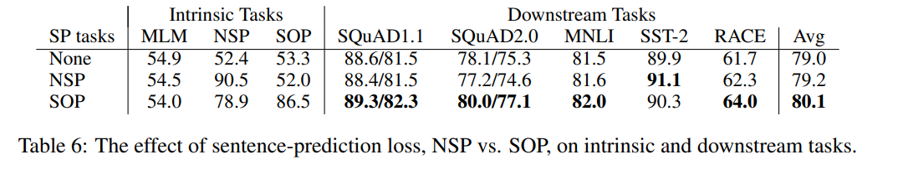

考虑到ALBERT-base的 H = 768 ，那么 E = 768 时，模型应该可以看作没有减少embedding参数量的情况。而不共享参数的实验结果表明此时模型表现更好，那么似乎说明了Factorized embedding在一定程度上降低了模型的表现

### 4.7 EFFECT OF NETWORK DEPTH AND WIDTH
增加模型的层数或隐层大小确实能够在一定程度上提升模型的表现。但当大小增加到一定量时，反而会使模型表现变差
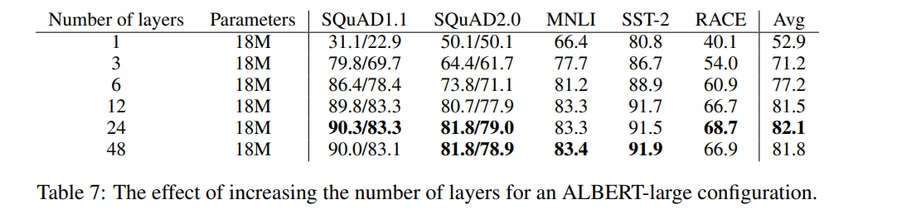

### 4.8 WHAT IF WE TRAIN FOR THE SAME AMOUNT OF TIME?
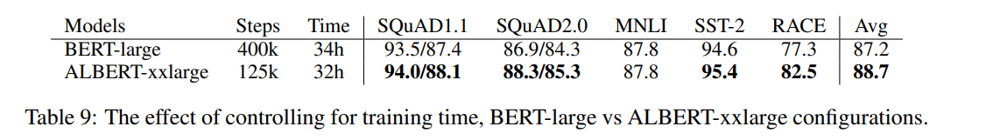

### 4.9 DO VERY WIDE ALBERT MODELS NEED TO BE DEEP(ER) TOO?
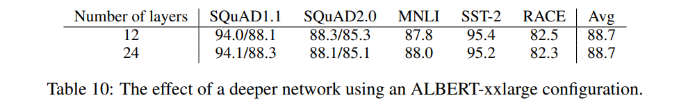

### 4.10 ADDITIONAL TRAINING DATA AND DROPOUT EFFECTS
训练时还加入了XLNet和RoBERTa训练时用的额外数据，实验表明加入额外数据（W additional data）确实会提升模型表现。此外，作者还观察到模型似乎一直没有过拟合数据，因此去除了Dropout，从对比试验可以看出，去除Dropout（W/O Dropout）后模型表现确实更好
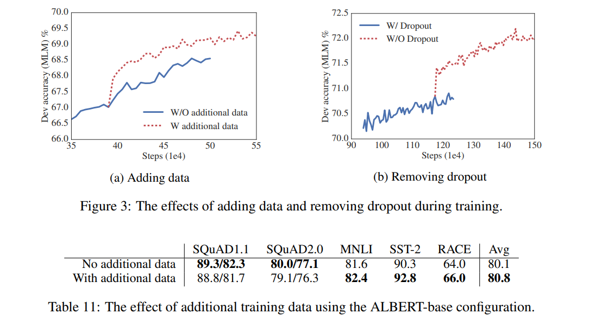
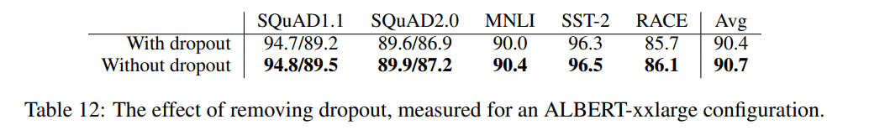

### 4.11 CURRENT STATE-OF-THE-ART ON NLU TASKS
各个NLU任务上的表现，几乎都达到了state-of-the-art的表现
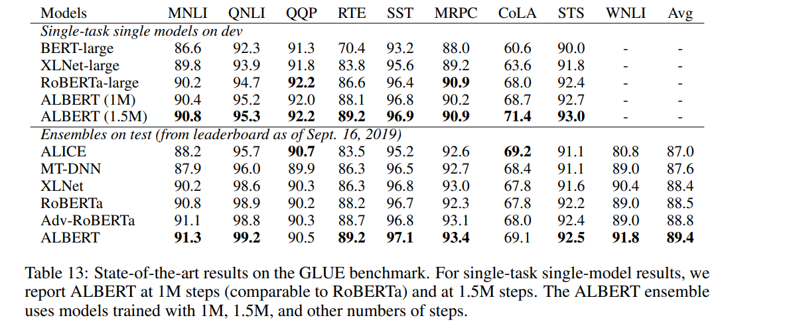

## 5 DISCUSSION
- 本文提出了Factorized embedding和层之间参数共享两种削减参数量的方式，在大家都想着把模型做大的时候给大家指出了另一条可行的路，意义重大。但本文提出的两种方法实际上都带来了模型效果的下降，也就是说本文似乎也还没有找到BERT中真正的冗余参数，减少模型参数量这方面还需要更多的研究。
- 本文提出了SOP，很好地替换了NSP作为预训练任务，给模型表现带来了明显提升。
- 本文的削减参数使模型表现下降，结果更好主要是靠SOP、更大的 H 、更多的数据、去除dropout。那么如果不削减参数的话再使用SOP、加更多的数据、去除dropout呢？
- 本文的削减参数量参数量带来了模型训练速度的提升，但是ALBERT-xxlarge比BERT-xlarge参数量少了约1000M，而训练速度并没有太大的提升（只有1.2倍）。原因应该是更少的参数量的确能带来速度上的提升，但是本文提出的Factorized embedding引入了额外的矩阵运算，并且同时ALBERT-xxlarge大幅增加了 H，实际上增加了模型的计算量。
- 本文还有两个小细节可以学习，一个是在模型不会过拟合的情况下不使用dropout；另一个则是warm-start，即在训练深层网络（例如12层）时，可以先训练浅层网络（例如6层），再在其基础上做fine-tune，这样可以加快深层模型的收敛。