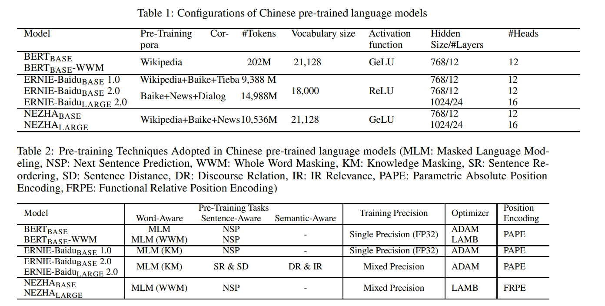
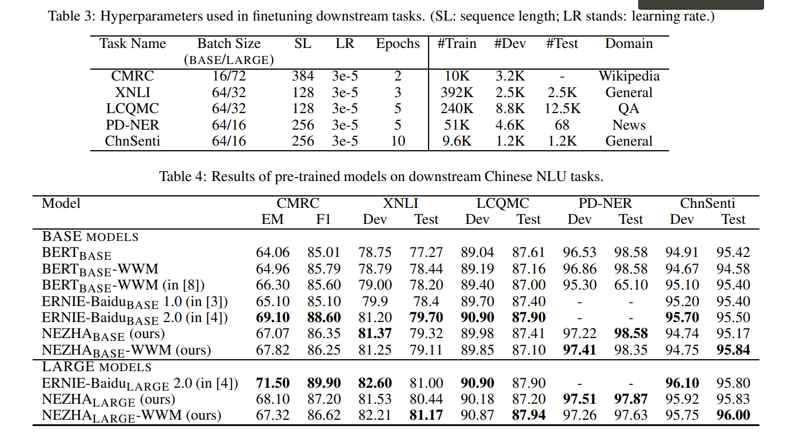
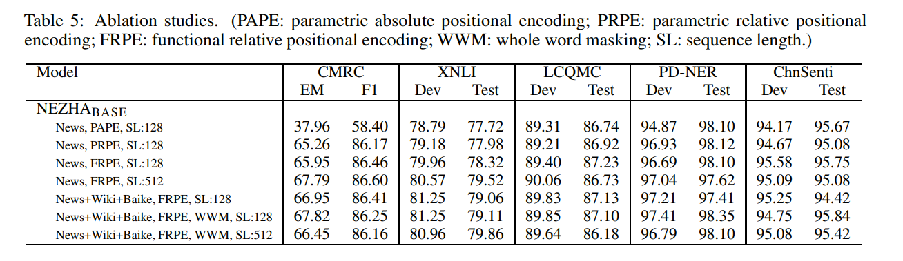

# NEZHA: NEURAL CONTEXTUALIZED REPRESENTATION FOR CHINESE LANGUAGE UNDERSTANDING
[toc]

论文地址：https://arxiv.org/abs/1909.00204
论文代码：https://github.com/huawei-noah/Pretrained-Language-Model/tree/master/NEZHA

## ABSTRACT
- NEZHA(NEural contextualiZed representation for CHinese lAnguage understanding，面向中文理解的神经语境表征模型，哪吒)
- 改进
    - 函数式相对位置编码
    - 全词覆盖
    - 混合精度训练
    - 训练过程中使用 LAMB 优化器
- 在以下数个中文自然处理任务上取得了SOTA
    - 命名实体识别(人民日报NER数据集)
    - 句子相似匹配(LCQMC,口语化描述的语义相似度匹配)
    - 中文情感分类(ChnSenti)
    - 中文自然语言推断(XNLI)

## 1 Introduction
- 中文界的预训练模型目前现有如下几个：Google的中文BERT、ERNIE-Baidu、BERT-WWM。这些模型都是基于Transformer，且在遮蔽语言模型(MLM)和下一句预测(NSP)这两个无监督任务上进行预训练。主要差别在于MLM中使用的词遮蔽策略。Google的中文版BERT独立地遮蔽掉每个汉字或WordPiece token。ERNIE-Baidu在MLM中进一步将实体或者短语视为一个整体，如此一个实体或短语包含多个汉字。BERT-WWM的策略相似，称为全词覆盖(Whole Word Masking，WWM)。WWM强制要求所有属于同一中文词的字都要一起被覆盖掉。ERNIE-Baidu 2.0则又额外引入了其他预训练任务，如Token-Document关系预测和句子重排任务

- NEZHA中使用的是函数式相对位置编码，而在原始的Transformer和BERT中每个词使用的是绝对位置编码。位置编码信息直接加到词嵌入作为Transformer的输入。
    - 位置编码一般有2种方式：
        - 函数式编码。通过预定义函数(如正弦函数)直接给出位置编码。
        - 参数式编码。此时的位置编码作为模型参数的一部分，通过学习得到。参数式位置编码涉及两个概念，一个是距离，表示这个词离“我”有多远，另一个是维度，Word Embedding一般有几百维，比如512维，每一维有一个值，通过位置和维度两个参数来确定一个位置编码的值。比如有学者提出一种参数相对位置编码方法，将相对位置信息加入到Transformer的自注意力层中。再往后发展二者的结合体，比如Transform-XL和XLNet使用正弦编码矩阵(非学习得到)和两个偏置项(训练学习到的)表示相对位置编码。
- NEZHA使用函数式相对位置编码，通过预定义函数的方式在自注意力层编码相对位置。实验结果表明，该方法是一种有效的位置编码方案，并在实验中取得了一致的效果。
- NEZHA在训练过程中使用了三种已被证明是有效的预训练BERT技术，即全词覆盖，混合精度训练和LAMB优化。

贡献：
- 系统性研究了大规模中文语料的预训练模型问题
- 在多个中文NLU任务上评估模型
- 评估训练因素的有效性，包括位置编码、掩蔽策略、训练语料库源、训练序列的长度。
- 发布NEZHA模型和源码

## 2 Pre-training NEZHA Models
### 2.1 Preliminaries: BERT Model & Positional Encoding
- 在Transformer 中，每个词之间互相都要Attending，并不知道每个词离自己的距离有多远，这样把每个词平等的对待，是会有问题的

### 2.2 Functional Relative Positional Encoding
本模型在计算输出和attention得分使用相对位置的正弦函数。该想法源于Transformer中使用的函数式绝对位置编码。在本文的模型中，$a_{ij}^{Value}$和$a^{Key}_{ij}$ 都是正弦函数，且在训练过程固定不变。为了简化起见，直接将两者简写为$a_{ij}$ 。维度为2k和2k+1的aij分别如下

dz为隐藏层的大小，不同维度(即不同dz)的正弦函数会有不同的波长，选择固定正弦函数，可以使该模型具有更强的扩展性；即当它遇到比训练中序列长度更长的序列时，依然可以发挥作用

### 2.3 Whole Word Masking
- NEZHA 预训练模型，则采用了全词覆盖（WWM）策略，当一个汉字被覆盖时，属于同一个汉字的其他汉字都被一起覆盖。该策略被证明比 BERT 中的随机覆盖训练（即每个符号或汉字都被随机屏蔽）更有效
- 使用了一个Jieba进行中文分词
- 在 WWM 训练数据中，每个样本包含多个覆盖汉字，覆盖汉字的总数约占其长度的 12%，随机替换的占 1.5%

### 2.4 Mixed Precision Training
- 技术可以使训练速度提高2-3倍，同时也减少模型的空间占用，从而可以利用较大的batch size
- 重点维持模型中权重的单精度副本（称为主权重），即在每次训练迭代中，将主权重舍入为FP16（即半精度浮点格式），并使用 FP16 格式存储的权重、激活和梯度执行向前和向后传递；最后将梯度转换为FP32格式，并使用FP32梯度更新主权重

### 2.5 LAMB Optimizer
- LAMB 优化器是专为深度神经元网络大batch size同时分布式训练而设计。尽管使用大的batch size训练可以有效地加快 DNN 训练速度，但是如果不仔细调整学习率，当batch size处理的大小超过某个阈值时，模型的性能可能会受到很大影响。LAMB 优化器则不需要手动调整学习率，而是采用了一种通用的自适应策略。优化器通过使用非常大的batch size(实验中高达 30k 以上)来加速BERT的训练，而不会导致性能损失，甚至在许多任务中获得最先进的性能。值得注意的是，BERT的训练时间最终从3天显著缩短到 76 分钟

## 3 Experiments
### 3.1 Experimental Setting
数据
- 中文Wikipedia
- 中文百度百科
- 新闻语料

### 3.2 Experimental Results

### 3.3 Ablation Study

- 从消融研究的实验结果可以看出，上述因素都能够促进下游任务性能的提升。对比函数式相对位置编码、参数式绝对位置编码和参数式相对位置编码，可以看出函数式相对位置编码显著优于其他位置编码方式。在CMRC任务中可以看出，相较于相对位置编码使用绝对位置编码差得多

## 4 Conclusion
